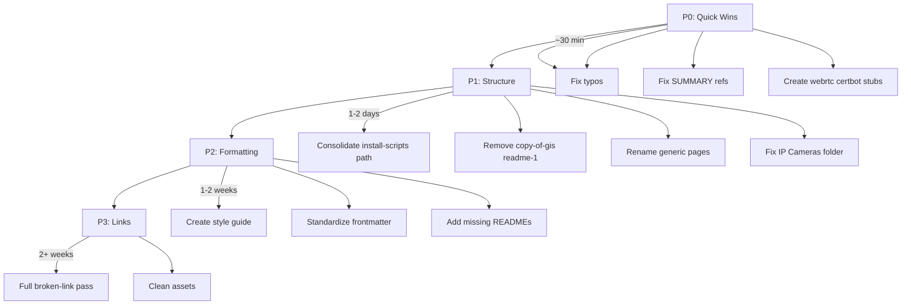

# Documentation Refactoring Plan

## Current State Summary

The repository contains **~493 markdown files** across 18+ top-level sections, using GitBook's `SUMMARY.md` for navigation. An existing audit in [DOCUMENTATION-REFACTORING-REPORT.md](DOCUMENTATION-REFACTORING-REPORT.md) identifies ~35 files with broken links, wrong SUMMARY references, typos, orphaned content, and duplicate files.

This plan extends that audit to cover: **documentation gaps**, **markdown reformatting standards**, and **page structure consistency**.

---

## Phase 1: Documentation Standards and Missing Docs

### 1.1 Create Documentation Standards

**Add a formal style guide** at `.github/DOCUMENTATION-STYLE-GUIDE.md` (or `docs/STYLE-GUIDE.md`):

- **Frontmatter**: Standardize on `title` and optional `description`; section READMEs use `layout: landing` where appropriate
- **Headings**: Single H1 per page (matches filename/title); H2 for major sections; no skipped levels
- **File naming**: kebab-case; avoid generic names (`page-N`, `chuang-jian-*-1`)
- **Links**: Prefer relative paths; avoid GitBook import IDs (`/broken/pages/...`)

### 1.2 Add Missing Root-Level Documentation


| File                   | Purpose                                                                                                                |
| ---------------------- | ---------------------------------------------------------------------------------------------------------------------- |
| [README.md](README.md) | Expand beyond "Snippets & Scripts" to describe the full doc set, how to navigate (SUMMARY.md), and link to style guide |
| `CONTRIBUTING.md`      | How to add/edit pages, SUMMARY structure, frontmatter conventions                                                      |


### 1.3 Add Section READMEs Where Missing

Per the audit, major sections need overview READMEs. Target sections with weak or missing READMEs:

- `software-engineering/webrtc/` (create README; WebRTC currently points to wrong file)
- `software-engineering/install-certbot/` (create README; Certbot points to wrong file)
- `software-engineering/tooling/` (Tooling section points to `README (1).md`; ensure proper README exists)
- `3d-printing/` (has gallery + my-problems but no section overview)
- `random/` (verify README exists and is useful)

---

## Phase 2: Markdown Reformatting

### 2.1 Frontmatter Standardization

**Current state**: Mixed usage—some files have `description`, some `title`, some `layout`, many have none.

**Target format**:

```yaml
---
title: Page Title
description: Optional one-line summary (for tooltips/search)
---
```

- **Section READMEs** (landing pages): Add `layout: landing` where appropriate (e.g. [snippets-and-scripts/scripts/README.md](snippets-and-scripts/scripts/README.md))
- **Content pages**: Add `title` matching H1; add `description` for external links/credits where present
- **Scope**: ~50+ files already have frontmatter; standardize format; add to high-traffic sections first

### 2.2 Heading and Structure Consistency

- **Single H1**: Each page has exactly one H1 (the page title)
- **No skipped levels**: H2 → H3 → H4 (no H2 → H4)
- **Generic titles**: Replace `# Page 2`, `# Page 3` with descriptive titles (e.g. [software-engineering/networking/web-sockets/page-2.md](software-engineering/networking/web-sockets/page-2.md) → infer from content and rename)

### 2.3 GitBook Syntax Migration (Optional / Long-term)

- `**`**: ~25+ files; convert to standard markdown `[filename](path)` or asset links if migrating off GitBook
- `**`, ``, ``**: Document in style guide as GitBook-specific; decide whether to keep or migrate

---

## Phase 3: Structural Consistency

### 3.1 Path Consolidation


| Issue                 | Current                                                                                                               | Target                                                                                             |
| --------------------- | --------------------------------------------------------------------------------------------------------------------- | -------------------------------------------------------------------------------------------------- |
| Install scripts split | `readme/install-scripts/` + `snippets-and-scripts/scripts/install-scripts/` + `snippets-and-scripts/install-scripts/` | Pick one canonical path (e.g. `snippets-and-scripts/install-scripts/`) and migrate; update SUMMARY |
| Frontend paths        | `software-engineering/frontend/javascript/` vs `software-engineering/programming/frontend/`                           | Consolidate under `software-engineering/programming/frontend/`; fix Laravel Vite guide reference   |
| Python libraries path | `readme/install-scripts/python-+-libraries`                                                                           | Rename to `python-libraries` (remove `+` from path)                                                |


### 3.2 Fix SUMMARY References (from existing report)


| SUMMARY Label                  | Current             | Fix                                                       |
| ------------------------------ | ------------------- | --------------------------------------------------------- |
| Tooling                        | `README (1).md`     | `software-engineering/tooling/README.md`                  |
| Install Certbot                | `README (2).md`     | `software-engineering/install-certbot/README.md` (create) |
| WebRTC                         | `README (1) (2).md` | `software-engineering/webrtc/README.md` (create)          |
| Ubuntu: Set Keyboard Backlight | `README (1) (1).md` | `random/ubuntu-keyboard-backlight.md` (create/move)       |


### 3.3 Typos and Renames

- `webassemby` → `webassembly` (folder + SUMMARY, 3 occurrences)
- `interia-guide.md` → `inertia-guide.md` (file + SUMMARY)
- `cloud-init-valitation.md` → `cloud-init-validation.md` (if present)

### 3.4 Orphaned and Duplicate Content

- `**copy-of-gis/`**: Remove or merge into `gis/`; remove from repo if duplicate
- `**software-engineering/readme-1/`**: Rename to `software-engineering/tooling-extras/` or merge into `tooling/`
- **Root `README (1).md`, `README (2).md`, etc.**: Delete after fixing SUMMARY refs
- **DJI duplicates**: Consolidate `*-1.md` and `chuang-jian-*-1.md`; keep canonical, remove or redirect duplicates

### 3.5 Generic Page Renames


| Current                                                 | Rename To                                                   |
| ------------------------------------------------------- | ----------------------------------------------------------- |
| `robotics/page-7.md`                                    | `robotics/ardusub-overview.md` (or merge into `ardusub/`)   |
| `robotics/page-6/`                                      | Merge into `robotics/mavlink/` or rename to `mavlink-guide` |
| `gis/deck.gl/page-3.md`                                 | Descriptive name based on content                           |
| `software-engineering/networking/web-sockets/page-2.md` | Descriptive name based on content                           |
| `random/adhd-and-programming/page-4.md`                 | Descriptive name based on content                           |


### 3.6 Misplaced Content

- **IP Cameras**: `ip-cameras/awesome-web-archiving/` contains RTSP, ONVIF—rename to `ip-cameras/protocols/` or `ip-cameras/rtsp-onvif/`
- **K3s tutorial**: `misc/tutorials/.../install-k3s/` contains unrelated content (AI, GIS, Lando, Mapbox, Arduino). Extract to proper sections or add subfolders with clear names

---

## Phase 4: Broken Links and Assets

### 4.1 Broken Link Hotspots (from report)


| Area                                           | Files                                           | Strategy                                                                          |
| ---------------------------------------------- | ----------------------------------------------- | --------------------------------------------------------------------------------- |
| `obd2/car-hacking/the-car-hackers-handbook.md` | 142 refs to `../../iot/obdii/broken-reference/` | Replace with in-page anchors or remove; consider linking to canonical source      |
| `drones/dji-docs-android/`*                    | 200+ `/broken/pages/...`                        | Map old IDs to new paths where possible; or replace with canonical DJI docs links |
| `robotics/`*                                   | Multiple                                        | Fix ArduSub, MAVLink internal links                                               |
| `pen-testing/kali-linux/kali-linux-blog.md`    | Multiple                                        | Fix or replace with source                                                        |


### 4.2 Image References

- Standardize `` paths
- Replace external `https://1365695328-files.gitbook.io/...` with local assets where possible
- Clean `.gitbook/assets/` of non-image files (HTML, workflows)

---

## Phase 5: Execution Order




**Recommended sequence**:

1. **P0** (immediate): Typos, SUMMARY refs, stub READMEs—per [DOCUMENTATION-REFACTORING-REPORT.md](DOCUMENTATION-REFACTORING-REPORT.md) Section 4
2. **P1** (1–2 days): Path consolidation, orphan removal, generic renames, IP Cameras
3. **P2** (1–2 weeks): Style guide, frontmatter pass, missing READMEs
4. **P3** (ongoing): Broken links by section; asset cleanup

---

## Key Files to Modify

- [SUMMARY.md](SUMMARY.md) – Fix refs, update paths after renames
- [README.md](README.md) – Expand project description
- New: `CONTRIBUTING.md`, `docs/STYLE-GUIDE.md` (or `.github/DOCUMENTATION-STYLE-GUIDE.md`)
- [software-engineering/webrtc/](software-engineering/webrtc/) – Create README
- [software-engineering/install-certbot/](software-engineering/install-certbot/) – Create README
- [software-engineering/tooling/README.md](software-engineering/tooling/README.md) – Ensure exists and is correct target for Tooling
- All files with `webassemby`, `interia-guide` – Rename and update refs

---

## Out of Scope / Deferred

- Migrating off GitBook (keep ``, `` if staying on GitBook)
- Translating or rewriting imported content (DJI, Kali, Car Hacker's Handbook)
- Automated link-checking CI (can add later as follow-up)
