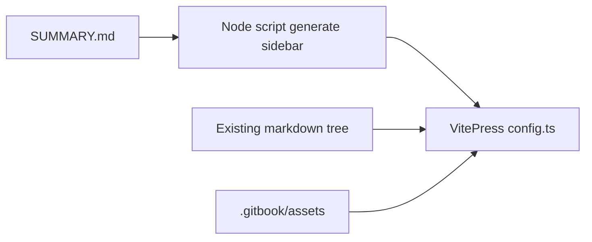

# VitePress on GitHub Pages + full-doc audit

## Recommendation: VitePress instead of VuePress

You preferred **VitePress** over VuePress; that is a good default here: VitePress is actively maintained, Vite-based (fast builds for ~490 markdown files), has a solid default theme for technical docs, and maps cleanly to **static hosting on GitHub Pages** with a [`base`](https://vitepress.dev/guide/deploy#github-pages) such as `/gitbook-personnal-docs/`. **VuePress 2** would work but adds more surface area for a repo that is “mostly markdown + assets,” with little benefit over VitePress for this use case.

## Current baseline (what changes)

- Publishing today is **mdBook** ([`book.toml`](book.toml), [`.github/workflows/mdbook.yml`](.github/workflows/mdbook.yml), [`theme/custom.css`](theme/custom.css)).
- Navigation for mdBook mirrors [SUMMARY.md](SUMMARY.md).
- Prior audits live in [DOCUMENTATION-REFACTORING-REPORT.md](DOCUMENTATION-REFACTORING-REPORT.md) (broken links, misplaced clusters, orphans like `copy-of-gis/`, K3s tutorial folder mixing unrelated topics, `ip-cameras/awesome-web-archiving/`, etc.).

The plan assumes **VitePress replaces mdBook** once validated; keep mdBook on a branch or disable the workflow only after the VitePress deploy is green.

## 1. VitePress layout (preserve GitBook structure)

- **Keep all existing paths** under the repo root (no mass move of `software-engineering/`, `obd2/`, [`.gitbook/assets/`](.gitbook/assets/), etc.).
- Add a **root-level** [`.vitepress/config.ts`](.vitepress/config.ts) (or `.vitepress/config.mts`) so markdown files stay where they are and routes follow folders (e.g. `robotics/overview.md` → `/robotics/overview`).
- Configure:
  - `base: '/gitbook-personnal-docs/'` (or your real repo name).
  - [`srcExclude`](https://vitepress.dev/config/app-configs#srcexclude) (or equivalent ignore list) so non-doc markdown is not published as pages: e.g. `SUMMARY.md`, meta reports, anything under `.cursor/`, optional `CONTRIBUTING.md` if you want it GitHub-only.
  - `ignoreDeadLinks` (or staged tightening) during migration so CI can go green while you fix backlog.
- **Home page**: map the current [README.md](README.md) (Overview) to VitePress `index.md` *or* keep `README.md` as entry via routing—pick one convention so the landing URL is stable and not duplicated with mdBook’s old “Home” naming.

## 2. Sidebar = GitBook `SUMMARY.md` (single source of truth)

- Implement a **small Node script** (e.g. [`scripts/summary-to-vitepress-sidebar.mjs`](scripts/summary-to-vitepress-sidebar.mjs)) that parses the nested list in `SUMMARY.md` (same link patterns mdBook uses) and emits a VitePress [`sidebar`](https://vitepress.dev/reference/default-theme-sidebar) tree.
- Wire `config.ts` to `import` the generated sidebar (or inline `fs.readFileSync` at build time—prefer generated JSON committed or generated in CI before `vitepress build` for reproducibility).
- **Preserve GitBook behavior**: sidebar labels and hierarchy stay defined only in `SUMMARY.md`; no hand-duplicated nav in config beyond the generator.

## 3. Assets and markdown compatibility (formatting)

- **Images**: keep paths pointing at `.gitbook/assets/...` where they already work relative to markdown files. VitePress resolves static assets from markdown relative paths; verify a sample of “spaces in filenames” and `` forms under [`vitepress` markdown](https://vitepress.dev/guide/markdown)—if anything breaks, normalize only broken cases (same rule as the mdBook plan: do not mass-rename asset files).
- **Existing conversions**: keep using / extending [`scripts/convert_gitbook_tags.py`](scripts/convert_gitbook_tags.py) for any remaining GitBook-only syntax on new imports; VitePress does not execute GitBook `` tags.
- Optional later: map callouts to VitePress [custom containers](https://vitepress.dev/guide/markdown#custom-containers) (`::: tip`) for nicer styling—**not required** for first cut if blockquotes are acceptable.

## 4. “Each file” iteration: automated audit + report (human triage)

Manual reading of ~490 files is not reliable; the deliverable is a **repeatable audit** that lists every markdown file (and optionally every `SUMMARY.md` entry) with flags.

| Check | Method |
|--------|--------|
| **Broken local images** | Script: walk markdown, extract `` / `<img`, resolve relative paths from file dir, `fs.existsSync`; flag missing files and extensionless paths that fail on Linux CI. |
| **Broken links** | [`lychee`](https://github.com/lycheeverse/lychee) on `**/*.md` (exclude `.cursor`), plus optional internal-only mode; emit machine-readable report in CI artifact. |
| **Thin / empty content** | Script: strip YAML frontmatter, strip fenced code blocks optional, count words; flag under threshold (e.g. &lt; 40–80 words) and “only headings” pages. |
| **Not in sidebar** | Diff: all `*.md` under content roots vs paths reachable from generated sidebar from `SUMMARY.md` → **orphan** list (may be intentional stubs—flag, don’t delete blindly). |
| **Parent / section sanity** | Rule-based: parse `SUMMARY` tree → each file gets **declared parent section** (nearest H2-level group, e.g. “Software Engineering”). Compare to filesystem prefix heuristics (e.g. `gis/**` should not appear under a “Robotics” parent). Flag known hotspots from [DOCUMENTATION-REFACTORING-REPORT.md](DOCUMENTATION-REFACTORING-REPORT.md) (`misc/tutorials/.../install-k3s/` mixing AI/GIS/Lando, `ip-cameras/awesome-web-archiving/`, `copy-of-gis/`). Full semantic “most logical parent” still needs **human review** using the report queue. |

Output: e.g. `docs-audit-report.json` + short `docs-audit-report.md` committed or CI-only artifact; **exit non-zero** only when you decide thresholds are strict enough.

## 5. GitHub Pages CI

- Add `package.json` scripts: `docs:dev`, `docs:build`, `docs:preview`.
- New workflow (or replace [`.github/workflows/mdbook.yml`](.github/workflows/mdbook.yml)): checkout → Node LTS → `npm ci` → generate sidebar from `SUMMARY.md` → `vitepress build` → upload `dist` (or default VitePress out dir) to **`gh-pages`** or **GitHub Actions Pages** artifact—same pattern as today, with **`.nojekyll`** in the published root.
- Update [README.md](README.md) and [`.github/DOCUMENTATION-STYLE-GUIDE.md`](.github/DOCUMENTATION-STYLE-GUIDE.md) to describe VitePress instead of mdBook once live.

## 6. What stays intentionally GitBook-like

- Folder layout and [SUMMARY.md](SUMMARY.md) hierarchy remain the editorial model.
- No requirement to rename thousands of [`.gitbook/assets/`](.gitbook/assets/) files.
- Incremental fixes: parent moves and thin pages are **editorial PRs** guided by the audit report, not a single big-bang rename unless you choose to.

## 7. Suggested implementation order

1. Minimal VitePress skeleton + `base` + one section sidebar smoke test.
2. `SUMMARY.md` → sidebar generator + `srcExclude` hygiene.
3. Audit scripts + CI job (reports first, then tighten `ignoreDeadLinks` / thresholds).
4. Replace mdBook workflow after a green preview deploy.
5. Triage report: fix high-signal clusters from DOCUMENTATION-REFACTORING-REPORT.md first, then orphans and thin pages.
