# ESP32 / 2.4 GHz RF, Antenna, and PCB Layout References

## Source

- Type: webpage + PDF (multi-source bibliography)
- Origin: user-provided URL list (10 sources)
- Imported: 2026-05-26

### Primary links

| # | Document | URL |
|---|----------|-----|
| 1 | TI SWRA117D — Small Size 2.4 GHz PCB antenna (IFA) | https://www.ti.com/lit/an/swra117d/swra117d.pdf |
| 2 | Espressif — ESP32-C3 hardware design guidelines (PCB layout, RF) | https://docs.espressif.com/projects/esp-hardware-design-guidelines/en/latest/esp32c3/pcb-layout-design.html |
| 3 | FCC — CrossAir CA-C03 SMD antenna (2A7IN-PM016) | https://fcc.report/FCC-ID/2A7IN-PM016/6344297.pdf |
| 4 | Espressif — ESP-WROOM-02 PCB design and module placement | https://www.espressif.com/sites/default/files/documentation/esp-wroom-02_pcb_design_and_module_placement_guide_0.pdf |
| 5 | Johanson Technology — Chip antenna layout (802.11) | https://www.johansontechnology.com/docs/2/jti-antenna-mounting.pdf |
| 6 | Infineon AN91445 — Antenna design and RF layout guidelines | https://www.infineon.com/dgdl/Infineon-AN91445_Antenna_Design_and_RF_Layout_Guidelines-ApplicationNotes-v09_00-EN.pdf |
| 7 | Espressif — ESP32-C3 book, §5.2.5 RF and antenna | https://espressif.github.io/esp32-c3-book-en/chapter_5/5.2/5.2.5.html |
| 8 | FCC — CrossAir CA-C03 (2ASYE-T-ECHO filing) | https://fcc.report/FCC-ID/2ASYE-T-ECHO/6227962.pdf |
| 9 | Antenova / Microwaves & RF — Embedded antenna PCB placement | https://www.mwrf.com/technologies/embedded/systems/article/21128361/antenova-design-tips-for-positioning-an-embedded-antenna-on-a-pcb |
| 10 | NXP UM10992 — BLE antenna design guide | https://www.nxp.com/docs/en/user-guide/UM10992.pdf |

**Figures in this note:** 14 images saved under `microcontrollers-and-socs/esp32/assets/esp32-rf-antenna-pcb-layout-20260526/` (Espressif HW guidelines, ESP32-C3 book, Antenova article). Diagrams inside the PDFs above are not duplicated here—open the linked PDFs for full figures (TI IFA dimensions, WROOM placement options, Infineon Smith chart, Johanson layout drawings, FCC radiation patterns, NXP antenna examples).

---

## Content

### When to use which source

| Goal | Start here |
|------|------------|
| ESP32-C3 module on custom PCB (layers, RF trace, keepout) | Espressif HW guidelines (#2), ESP32-C3 book (#7) |
| ESP-WROOM-02 / classic module at board edge | Espressif WROOM placement guide (#4) |
| On-board IFA / meander 2.4 GHz antenna geometry | TI SWRA117D (#1) |
| Ceramic / SMD chip antenna part + matching | FCC CA-C03 (#3, #8), Johanson (#5) |
| General BLE matching, chip vs PCB antenna tradeoffs | NXP UM10992 (#10), Infineon AN91445 (#6) |
| Mechanical placement, keep-out, transmission line | Antenova article (#9) |

---

### PCB stack and ground

**Espressif ESP32-C3 (four-layer recommended)**

- L1: signals + components; L2: solid GND (no signals); L3: power + limited signals over full GND under RF/crystal; L4: minimal routing, no components.
- Two-layer is possible if L2 provides uninterrupted GND under chip, RF, and crystal.

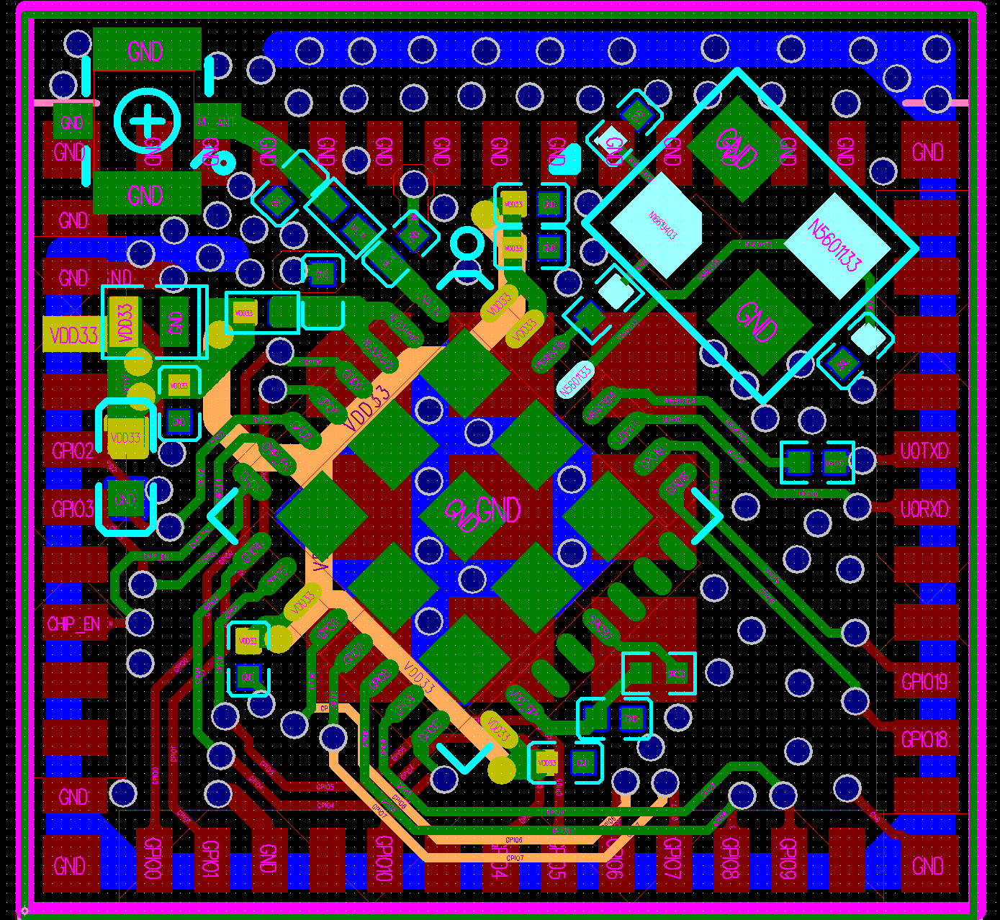

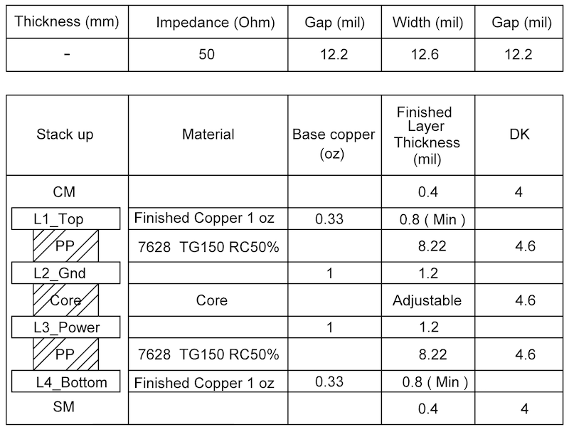

**Infineon AN91445 (general BLE):** four-layer preferred; two-layer acceptable with careful ground. Uninterrupted ground under RF from chip through matching network to antenna; split analog/digital grounds only with a single tie at supply—not overlapping RF.

---

### RF trace (50 Ω) and matching

**Espressif ESP32-C3**

- RF trace: 50 Ω, reference plane on layer adjacent to chip; no layer changes on RF path; 135° bends or arcs; consistent width, no branches; dense GND vias along trace.
- CLC (π) matching at chip: 0201, zigzag (capacitors not same orientation); optional **stub** on ground cap near chip for 2nd harmonic (≈15 mil length, 100 Ω ±10% stub Z, via to inner layer, keep-out on L1/L2). Not required for 0402+ packages.
- Extra CLC at PCB antenna for tuning; place at antenna feed.

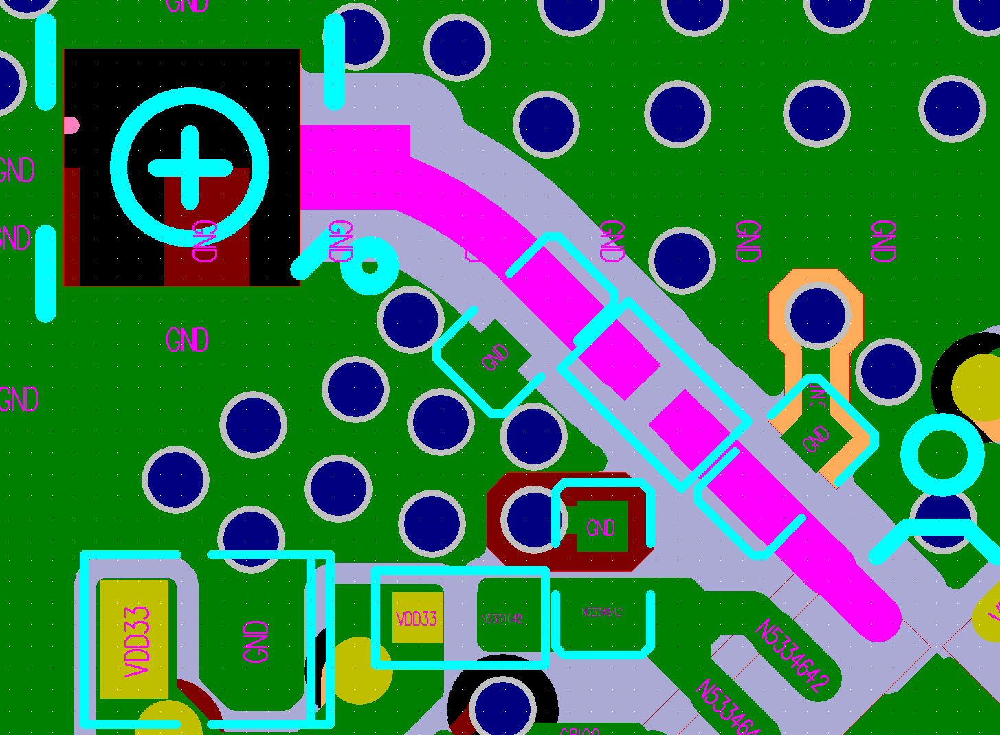

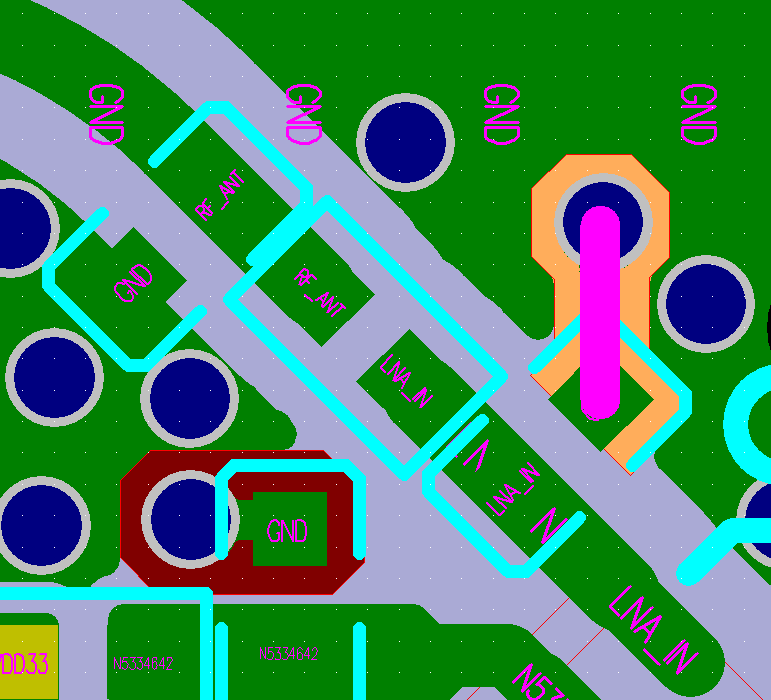

**ESP32-C3 book:** π-matching (CLC preferred) between `LNA_IN` and antenna; values depend on antenna and layout. Antenna types: PCB onboard, rod (I-PEX), FPC, ceramic, 3D metal—with tradeoffs in cost, gain, and structure.

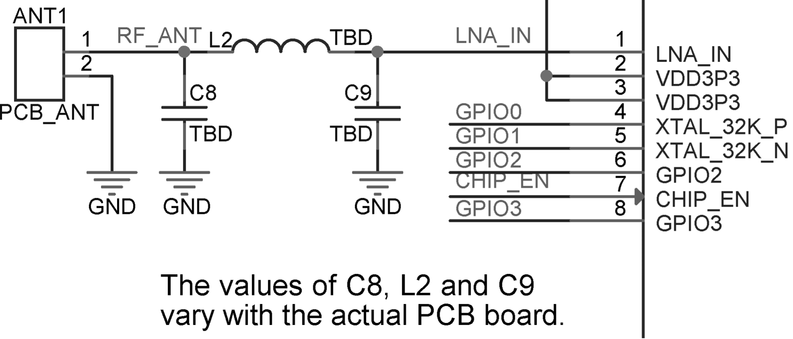

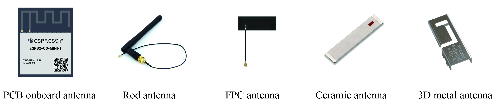

**Antenova / embedded antenna article**

- Transmission line must be **50 Ω**; poor match → VSWR, SNR loss, possible receiver desense.
- Keep trace **straight**; vias along both sides of trace for isolation.
- Shorter trace and correct GCPW dimensions (H, T, A, B) improve performance; free calculator: https://blog.antenova.com/rf-transmission-line-calculator

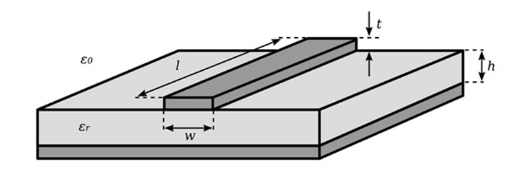

**TI SWRA117D (2.4 GHz IFA):** 50 Ω feed at 2.45 GHz; footprint **15.2 × 5.7 mm**; VSWR &lt; 2 over ISM band when copied exactly from reference gerber/DXF. Small dimension changes strongly affect resonance.

**NXP UM10992:** Standard practice—reserve pads for π, T, or L matching; tune with VNA (return loss / Smith chart). Chip antennas: lowest footprint, lowest efficiency; microstrip: low cost, layout-sensitive; metal plate: high efficiency.

---

### Antenna placement and keep-out

**Espressif module on base board**

- Prefer module **PCB antenna outside** the base board; feed point near board edge. Options marked ✓ in vendor diagrams are strongly recommended.
- If antenna must stay on board: **≥15 mm clearance** (all directions): no copper, traces, or components; feed closest to edge; cut away base board under antenna if possible.
- UART/USB and high-speed traces **far from antenna**; UART surrounded by GND pour + vias.
- Test housing effect on throughput and range.

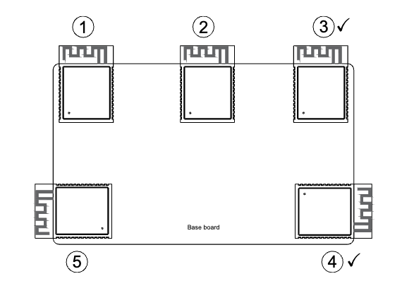

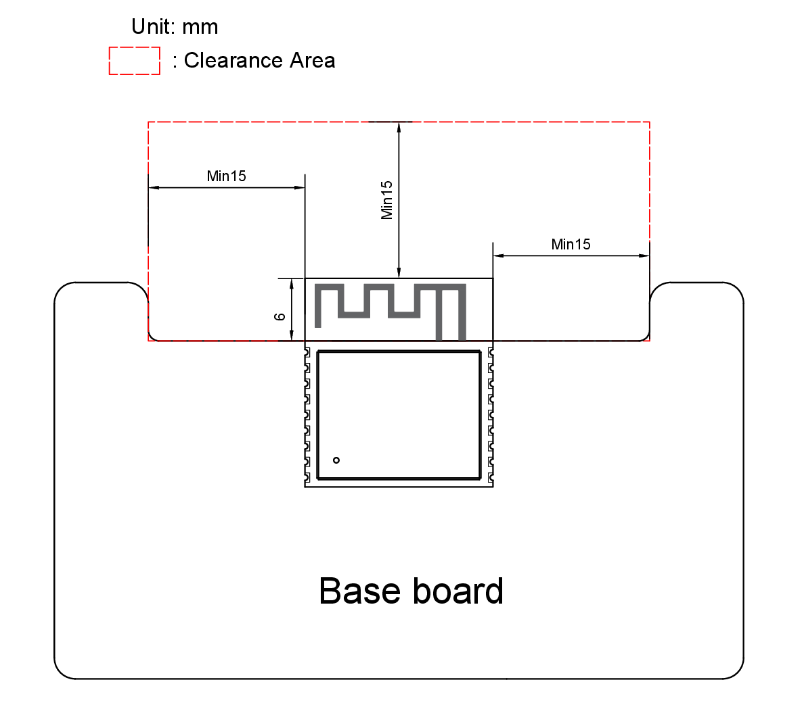

**ESP-WROOM-02 (meandered IFA, ~2 dBi)**

- Best: edge placement with antenna in free space (options 2–3); ≥5 mm clearance around antenna.
- On-board antenna: option 4 (no copper under antenna) acceptable; option 6 (center, no clearance) worst.
- Options 1–3 show similar TX power/EVM when antenna faces open space.

**Antenova article**

- **Corner** of PCB is usually best (clearance in five directions; feed in the sixth).
- MIMO: separate antennas on **different corners**.
- Keep-out: no metal on **any layer** in near field; size per datasheet (often antenna size + 1–3 mm below ground).
- Ground plane size affects resonance; route feed **perpendicular** to microstrip so feed cable is not part of the resonator.
- Keep batteries, LCDs, metal connectors (USB/HDMI/Ethernet), and switching supplies away; use **8° line** from antenna base for safe component height clearance.
- Isolate co-located antennas: ≥10 dB to 1 GHz, ≥20 dB to 20 GHz (distance or 90°/180° orientation).
- Plastic enclosures and lossy plastics (e.g. glass-filled nylon) detune; metal cases block radiation.

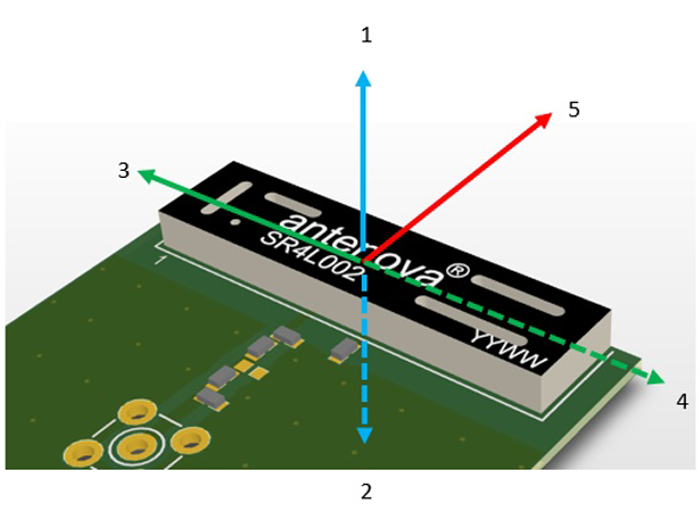

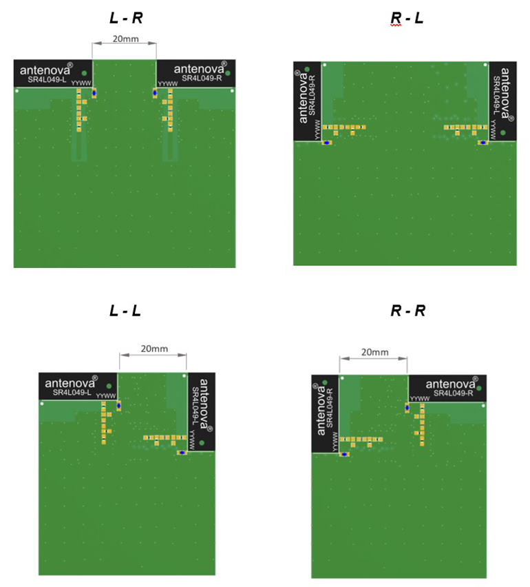

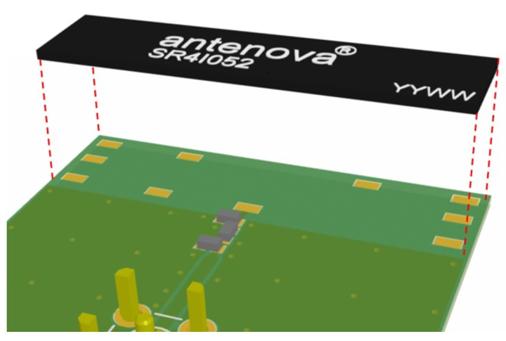

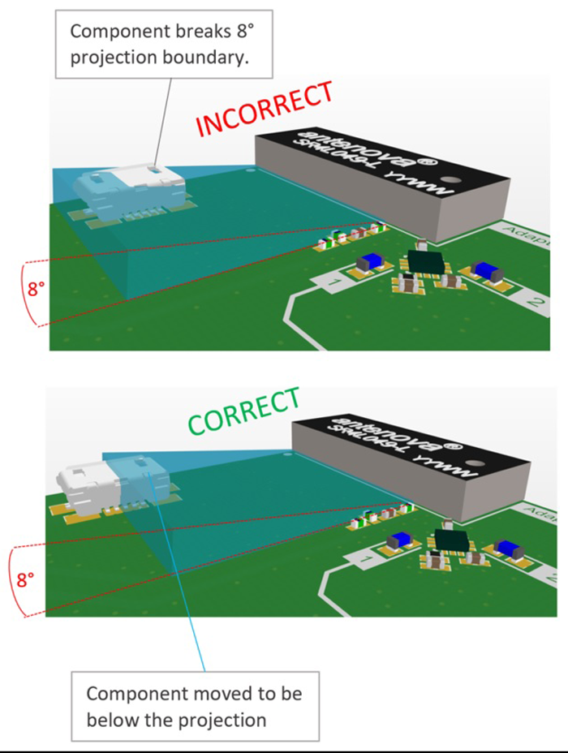

**Johanson chip antennas**

- Specs are on vendor EVB; on-product performance will differ—tune matching from measured S11.
- **Do not** place ground plane in immediate proximity (not a ground-dependent design).
- Clearance (horizontal mount): &gt;2 mm from short edges (&gt;1 mm on ground-adjacent short edge); &gt;4 mm from long edge without ground.
- Feedline perpendicular to microstrip; stitch edge ground to bottom plane with many vias.
- Microstrip length + surrounding ground shape → dipole-like (~3–4 × 1–2 cm ground) vs monopole (large ground).

---

### Chip antenna example: CrossAir CA-C03 (FCC)

- Size: 5.5 × 2.0 × 1.0 mm SMD; 2450 ±50 MHz; 50 Ω; VSWR &lt;2; peak gain ~4.3 dBi; efficiency ~78–82% on vendor test PCB (1.0 mm thick).
- Example match on test board: series 0 Ω, shunt **3 nH**, series 0 Ω (application-specific).
- 2.4 GHz operation requires impedance matching network tuning on your PCB.

---

### Power, crystal, and interference (Espressif)

- RF-related supplies (e.g. VDD3P3 pins 2/3): 10 µF + 0.1/1 µF, CLC/LC filter near pins, 0201, GND isolation from RF/GPIO; ≥9 vias on chip bottom GND pad.
- Crystal: complete GND plane; ≥2 mm from chip; no vias on clock lines; caps at crystal ends; no HF traces under crystal; no magnets nearby.
- Poor TX despite small ripple → often crystal layout, not only PSU; re-layout per crystal section.
- TX power off-target / poor EVM → impedance mismatch; π-match at RF pin.
- Good TX, poor RX → coupling to antenna (crystal harmonics, UART crossing RF, on-board HF noise).

---

### PCB IFA reference (TI)

- Meandered IFA for 2.4 GHz ISM; copy gerber/DXF from CC2511 USB dongle ref design for best results.
- Key dimensions (mm): L1 3.94, L2 2.70, L3 5.00, L4 2.64, L5 2.00, L6 4.90, W1 0.90, W2 0.50, etc. (full table in PDF).
- Ground plane size shifts resonance (e.g. USB plugged into laptop narrows bandwidth but still covers ISM).
- Measured on dongle ref: ~4.5 dBi peak gain (XY), LOS range ~240 m @ 250 kbps 1% PER (platform-specific).

---

### Infineon AN91445 highlights

- Antenna + matching + layout dominate BLE range more than silicon choice.
- Quarter-wave monopole on PCB ground is common; feed is single-ended, return path is critical.
- Cypress-tested low-cost PCB antennas: MIFA and IFA patterns with feed/length rules in app note.
- Enclosure and ground plane detune; professional antenna tuning with VNA recommended for production.
- RF passives: prefer high-Q inductors at RF; capacitor self-resonance above operating band.
- Wi-Fi coexistence: spatial, frequency, and temporal isolation strategies.

---

### Testing and compliance

| Source | Notes |
|--------|--------|
| ESP32-C3 book | Conducted: 50 Ω cable from RF port to tester; radiated: antennas ~10 cm apart in shield box. Key Wi-Fi metrics: TX power, EVM, RX sensitivity, freq error (tables in book). |
| NXP UM10992 | VNA calibration, return loss, bandwidth, Smith chart, matching network design procedure. |
| TI SWRA117D | Reflection, radiation patterns, harmonic/spurious vs ETSI/FCC limits; plastic encapsulation shifts resonance lower. |

---

## Key Takeaways

- Treat **50 Ω RF routing**, **continuous ground under RF**, and **matching (CLC/π)** as one system; tune on your stackup and antenna, not only from reference BOM values.
- **Placement beats BOM**: edge/corner antenna with full keep-out (≥15 mm for Espressif modules, datasheet + 1–3 mm for chip antennas) usually matters more than a better module SKU in a bad layout.
- Keep **UART/USB, crystals, DDR, and power switching** away from the antenna and RF trace; stub and filter practices on Espressif C3 targets harmonic and supply coupling.
- **Chip antennas** (CA-C03, Johanson, etc.) need application-specific matching and vendor EVB is only a starting point; verify S11 and radiation on your PCB.
- Use **FCC grant PDFs** for certified part baseline specs; still re-test on your board for regulatory and link budget.
- For certification-ready products, plan **VNA tuning**, shield-box radiated tests, and enclosure validation early—not after mechanical design is frozen.
