# MQ135 Air Quality Sensor (Bobbo117)

## Source

- Type: webpage
- Origin: https://github.com/Bobbo117/MQ135-Air-Quality-Sensor
- Imported: 2026-05-21
- Figures: eighteen images mirrored under `assets/github-bobbo117-mq135-air-quality-sensor/` from the repository README (`user-images.githubusercontent.com` and `raw.githubusercontent.com`).

## Content

### Project overview

Project connects an MQ135 sensor board to an Arduino-class controller for **outdoor calibration** of that specific board, then **indoor monitoring** biased toward CO₂ (with caveats noted by the author). Reporting options described:

1. Computer over USB via Arduino IDE
2. OLED display
3. ThingSpeak
4. Home Assistant via MQTT (`aqi/mq135`)

Upstream repository: https://github.com/Bobbo117/MQ135-Air-Quality-Sensor

### MQ135 board (carrier)

The breakout has four pins: Vcc (5 V), GND, A0 (analog voltage), and D0 (digital). It includes the MQ135, power LED, alarm LED, potentiometer for alarm threshold on D0, load resistor RL, and circuitry for digital output.

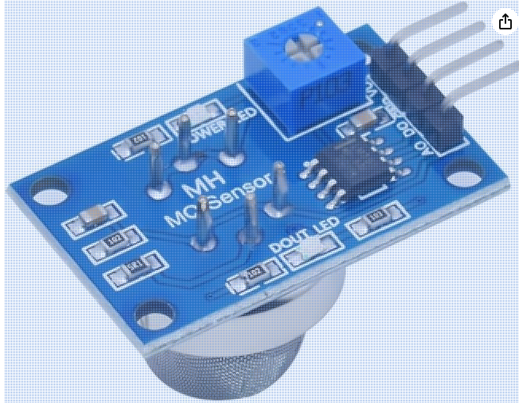

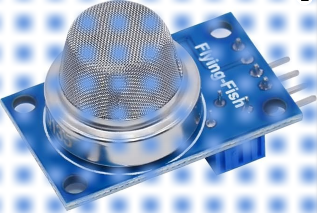

Digital output goes active (low in the README’s wording—verify against your wiring) together with alarm LED once A0-derived voltage crosses the adjusted threshold. The MQ135 capsule has an **explosion shield** around the sensing element.

### MQ135 sensing element

[Olimex datasheet (PDF)](https://www.olimex.com/Products/Components/Sensors/Gas/SNS-MQ135/resources/SNS-MQ135.pdf): gas-sensitive layer changes resistance. Internal structure excerpt (diagram from datasheet as shown in README):

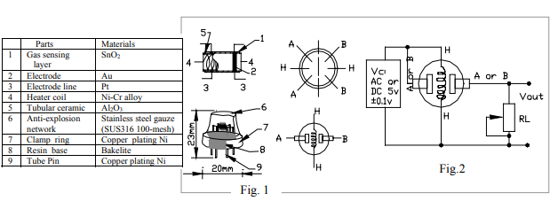

Pins: paired **H** pads for heater (~35 Ω cold per author); **A/A** tied to **B/B** forming Rs. On the author’s carrier, A side to Vcc, B side to A0 pad and RL to GND (midpoint divider at A0). Sensitivity characteristics excerpt:

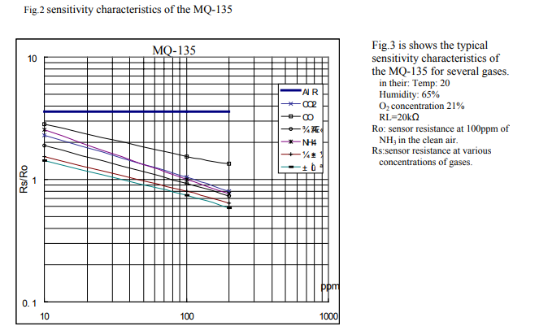

Outdoor CO₂ baseline context from [CO2.Earth](https://www.co2.earth/) (400+ ppm ambient; interiors often >1000 ppm):

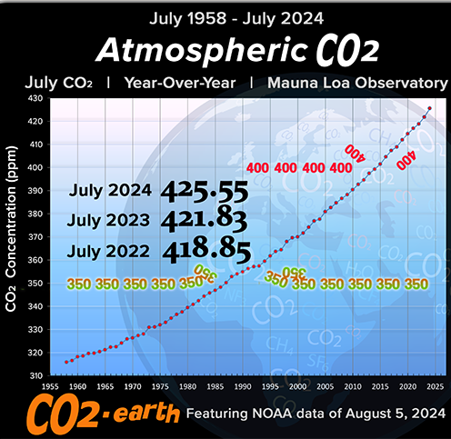

Takeaway stated in README: indoors, other MQ135-cross-sensitive gases often low; probe may still approximate CO₂ alongside “general VOC” interpretations—**confirmed cross-sensitivity caveats appear later.**

### Divider model (Rs vs RL vs A0)

Increasing target gas concentration lowers Rs; Rs and RL form a divider so **A0 voltage rises with ppm** when wired as documented.

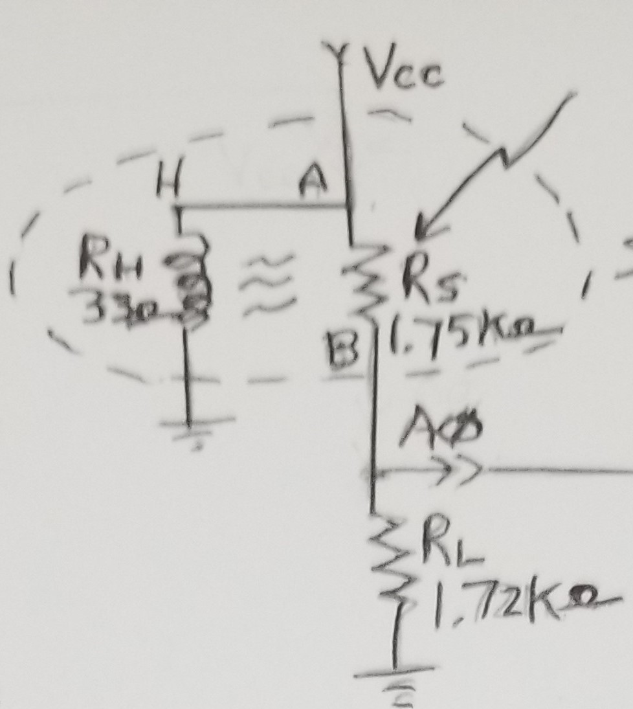

**Board-specific numbers (author):** unpowered, measure **sensor resistance between VCC and A0** (~1750 Ω); measure **RL from A0 to GND** (~1720 Ω). Enter RL in kilohms in `#define RLOAD` inside `MQ135_Air_Quality.ino`.

### Hardware connections

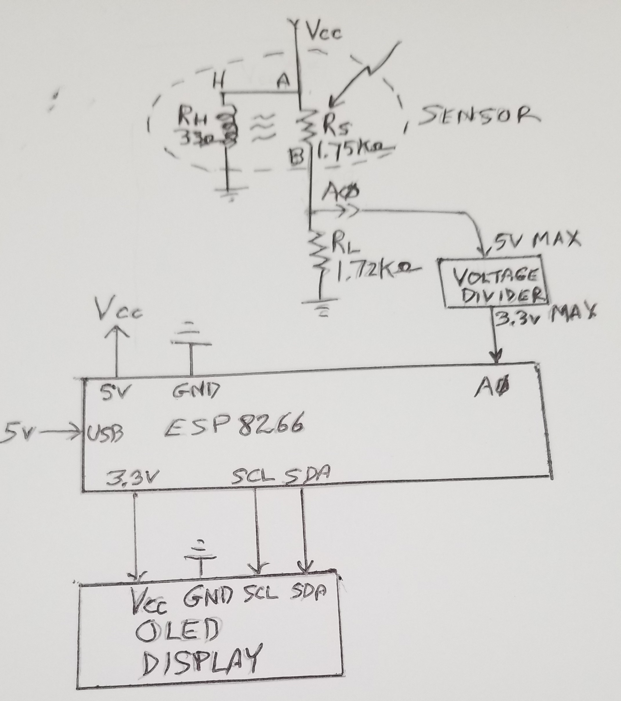

Use ESP8266, ESP32, or 5 V–tolerant Arduino per flags in sketch—author used **Lolin D1 Mini (ESP8266)**.

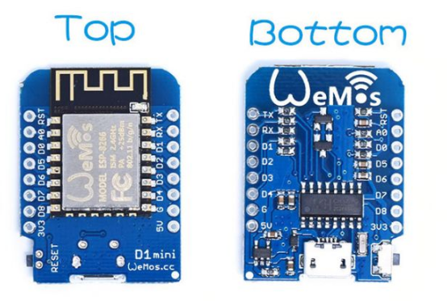

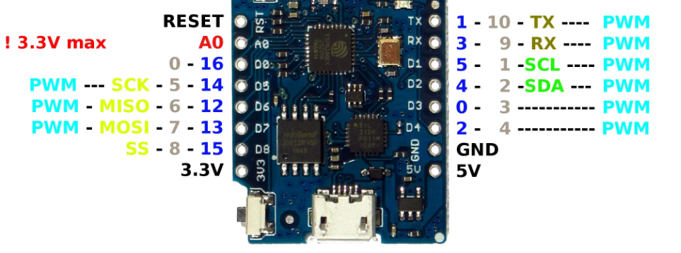

**MQ135:**

1. VCC → ESP8266 5 V
2. GND → ESP8266 GND
3. A0 → ESP8266 ADC **through resistor divider**
4. D0 unused in example

\* **Divider:** roughly **170 kΩ / 330 kΩ** pulls the MQ135 analog maximum down for **3.3 V** ADC-safe input—omit divider on 5 V–tolerant boards.

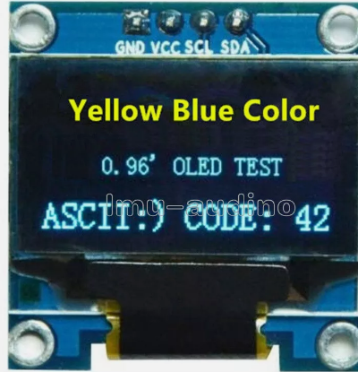

**OLED (I²C assumed per wiring sketch):**

1. VCC → 3.3 V
2. GND → GND
3. SDA → SDA  
4. SCL → SCL

### Calibration approach

Formal datasheet calibration expects controlled chamber plus specific RL (~20 kΩ). Author substitutes **fresh outdoor air calibration** matching indoor T/RH reasonably well; cross-check EPA [AirNow](https://www.airnow.gov/airnow-mobile-app/) when possible.

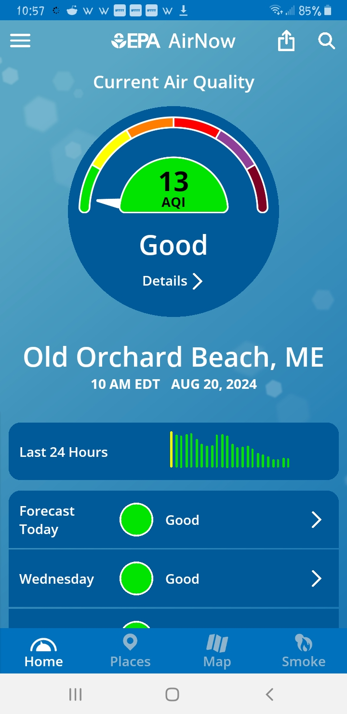

### Software (Arduino MQ135 library)

Install **MQ135** via Arduino IDE Library Manager → use `MQ135_Air_Quality.ino`.

**Calibrate:**

1. Measure RL **A0–GND** ohms → set `#define RLOAD` in kΩ.
2. Uncomment `#define CALIBRATE`.
3. Flash; power **outdoors hours** until `RZERO`/`R0` stabilizes → read from serial/OLED/Home Assistant/etc.
4. Freeze value in `#define RZERO xx.xx`, comment `CALIBRATE` again, reflash.

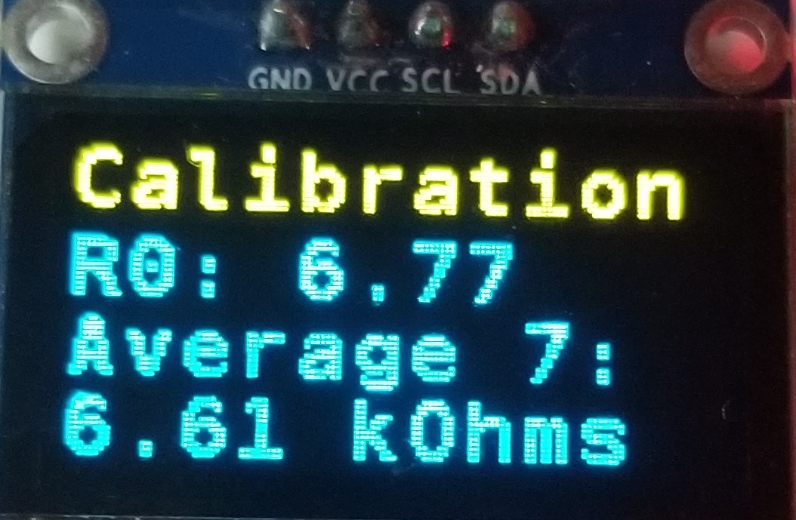

**Monitor:**

Disable `CALIBRATE`, bake in measured `RZERO`, reflash—the OLED tracks latest ppm plus rolling seven-sample average:

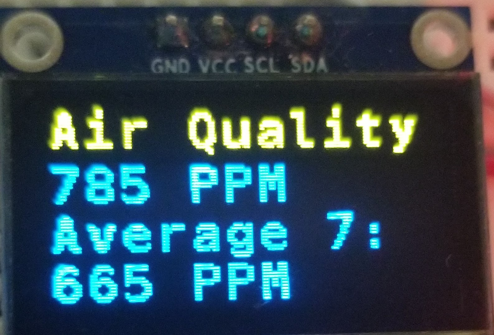

### Representative readings (after outdoor calibration)

| Condition | Rough ppm |
| --- | ---: |
| Outside Maine, 75 °F / 63% RH | 415 |
| Kitchen, windows open | 500 |
| Kitchen, shut | 600 |
| Kitchen, oven on | 900 |
| Basement idle | 600 |
| Basement with humidex | 550 |

(Author references CO₂.Earth for outdoor baseline and notes Shark air-quality device readings alongside.)

### Scenario traces (Home Assistant)

Movement / coffee / humidex interplay over one morning—timelines authored in HA:

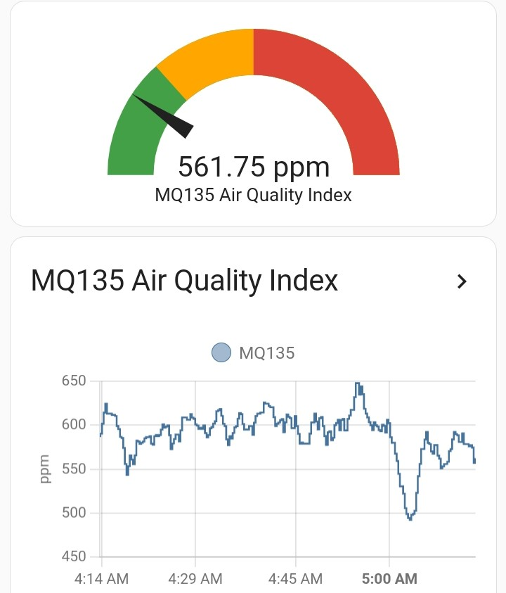

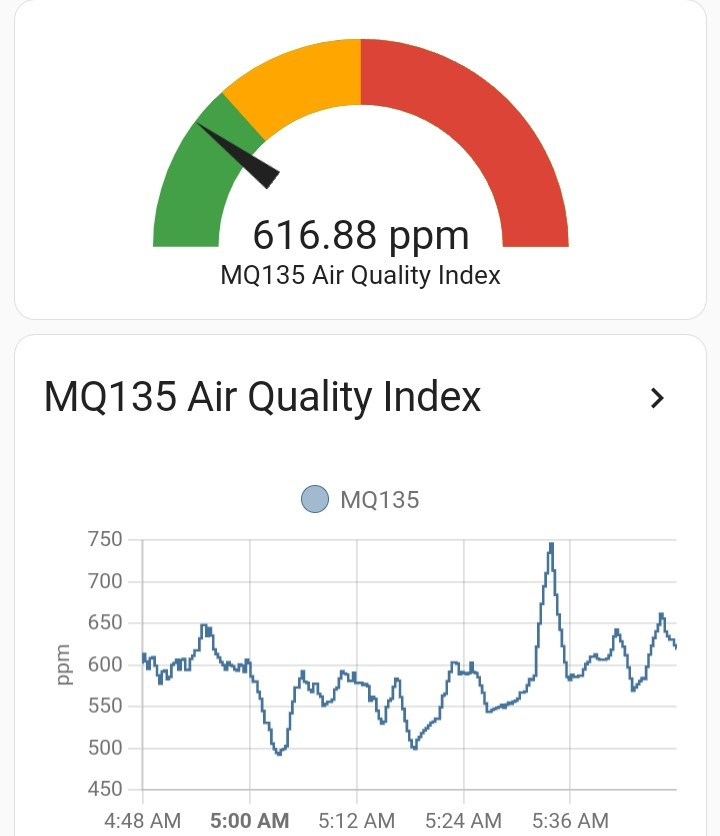

Smoke / PM excursion: MQ135 inflated (~2500) while Shark reported moderate PM fractions; EPA AirNow AQI 60 during wildfires:

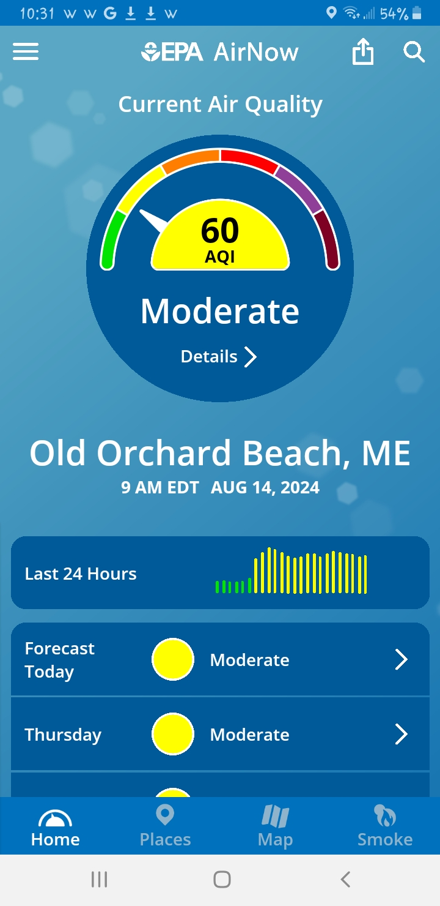

### Home Assistant MQTT sensor

MQTT topic **`aqi/mq135`** (unit ppm). YAML fragment for `mqtt` sensor stanza (adapt to your MQTT integration layout):

```yaml
sensor:
  - unique_id: mq135
    name: "MQ135"
    state_topic: "aqi/mq135"
    qos: 0
    unit_of_measurement: "ppm"
```

Gauge card screenshot from README:

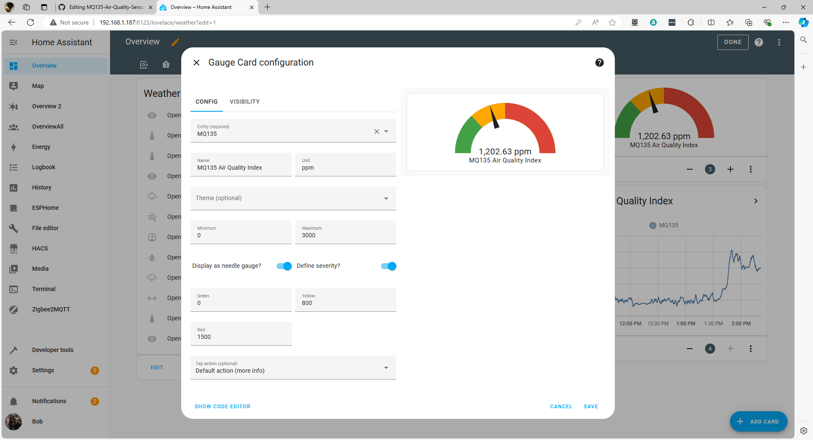

History graph screenshot:

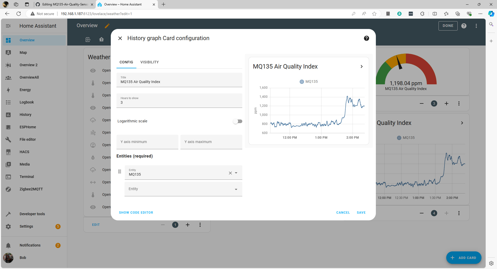

### Operating notes / limitations

- **48-hour** burn-in advised before trusting readings.
- Heater warmup after power cycles—few minutes stabilization.
- D0 alarm threshold trimmed via onboard potentiometer.
- Firmware assumes **10-bit** ADC semantics (counts to 1023 in library math)—match MCU configuration.
- **No humidity/temperature compensation** in author’s sketch.
- **Observations:** clear outdoor days correlate with CO₂-ish trends vs AirNow; **high PM₂.₅ episodes** overwhelm channel so MQ135-derived “ppm” loses CO₂ interpretability—cross-sensitivity wins.

### Conclusions (author tone)

Trend readouts feel useful despite unknown absolute ppm accuracy—pair with calibrated CO₂ monitor if stakes are medical or regulatory.

Possible future extensions: quantify error budget; federate MQ-2…MQ-9 class sensors to discriminate gases upstream claims.

### Attributions and references

- http://davidegironi.blogspot.com/2014/01/cheap-co2-meter-using-mq135-sensor-with.html
- https://hackaday.io/project/3475-sniffing-trinket/log/12363-mq135-arduino-library
- https://gml.noaa.gov/ccgg/trends/gl_data.html

## Key takeaways

- Treat MQ135-derived “ppm” as **semi-quantitative**; calibrate RL and RZERO per board outdoors, then sanity-check versus independent references (AirNow, dedicated CO₂).
- Protect **ESP8266/ESP32** ADC inputs with resistor divider unless analog front end is explicitly 5 V tolerant on that pin.
- **Home Assistant telemetry** hinges on MQTT topic `aqi/mq135`; graphing parallels ThingSpeak workflows.
- **High particulate episodes** materially falsify inferred CO₂ from MQ135—the sensor is chemically promiscuous; interpret traces in ambient context.
