# How nRF24L01+ Wireless Module Works & Interface with Arduino

## Source

- Type: webpage
- Origin: https://lastminuteengineers.com/nrf24l01-arduino-wireless-communication/
- Imported: 2026-05-20
- Figures: stored under `microcontrollers-and-socs/assets/lastminuteengineers-nrf24l01-arduino-wireless/` (local copies).

## Content

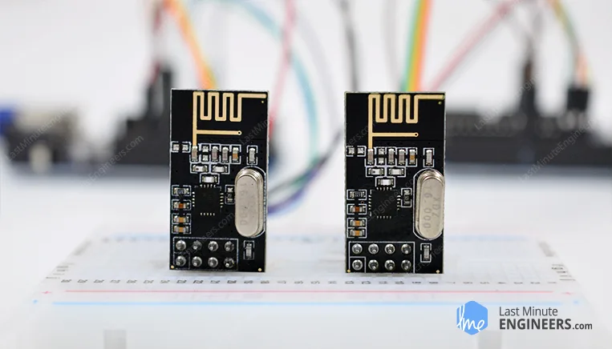

The nRF24L01+ transceiver operates in **2.4–2.5 GHz**, supports **250 kbps, 1 Mbps, or 2 Mbps**, and uses **Enhanced ShockBurst** (buffering, ACKs, automatic retransmit). Typical **supply is 3.3 V only** (**do not feed 5 V on VCC**); logic pins are **5 V tolerant** on many modules. Power varies with mode (transmission currents are modest; standby and power-down are very low). Range depends on PCB vs PA/LNA, obstacles, bitrate, interference, decoupling, and supply noise.

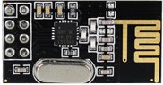

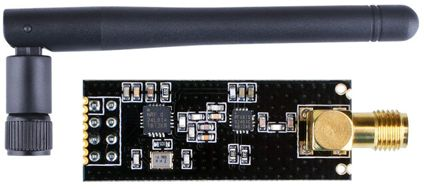

Two common hardware variants ship: **integrated PCB antenna** (shorter range) and **PA/LNA plus external antenna** (often marketed to ~1000 m LOS with caveats); they are broadly **pin/interchange compatible** where wiring supports both.

### Technical specification (tutorial table)

| Item | Typical values |
| --- | --- |
| Frequency Range | 2.4 GHz ISM |
| Maximum Air Data Rate | 2 Mb/s |
| Modulation | GFSK |
| Max Output Power | 0 dBm (configurable negative steps) |
| Operating Supply Voltage | 1.9 V–3.6 V |
| Logic Inputs | 5 V tolerant (module dependent; always verify datasheet) |

For authoritative limits, rely on Nordic / module vendor datasheet.

---

### Channels and multiceiver

Logical channels occupy ~**1 MHz** steps across roughly **2400–2525 MHz** ⇒ about **125** channels. Matching modules must share **channel**, **bitrate**, addressing/pipe conventions, etc.

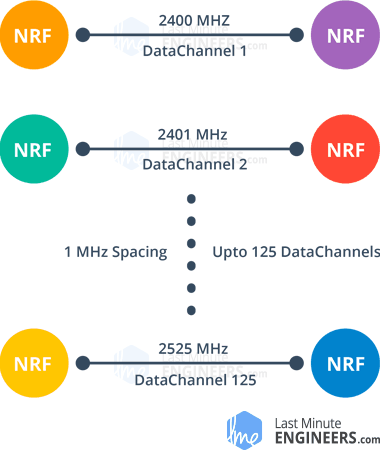

**Multiceiver:** up to **six pipes** per channel (unique addresses); conceptual model is **many TX → one coordinated RX**.

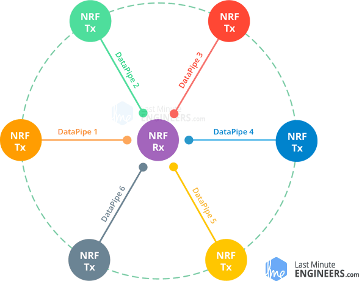

---

### Pinouts

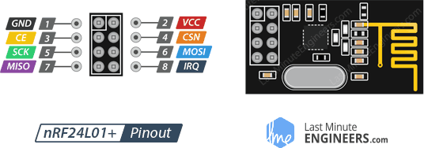

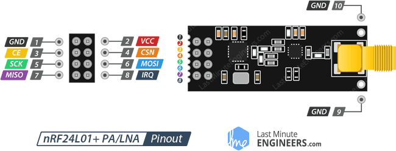

**GND** — ground (**square pad** marking on many breakout boards).

**VCC** — **1.9–3.6 V** (tutorial also mentions up to ~3.9 V wording; defer to datasheet). Use **MCU 3.3 V**.

**CE** — chip enable (active high): controls TX/RX path timing in library usage.

**CSN** — SPI chip select (**active low**, idle high).

**SCK, MOSI, MISO** — SPI.

**IRQ** — active-low interrupt (optional in many sketches).

---

### Wiring (Arduino hardware SPI UNO/Nano baseline)

Tutorial example uses:

| nRF24L01 | Arduino (UNO family) |
| --- | --- |
| GND | GND |
| VCC | 3.3 V |
| CE | pin **9** |
| CSN | pin **8** |
| SCK | pin **13** |
| MOSI | pin **11** |
| MISO | pin **12** |

**CE/CSN** can remap; **prefer hardware SPI pins** for bitrate headroom — follow your board’s SPI pin mapping.

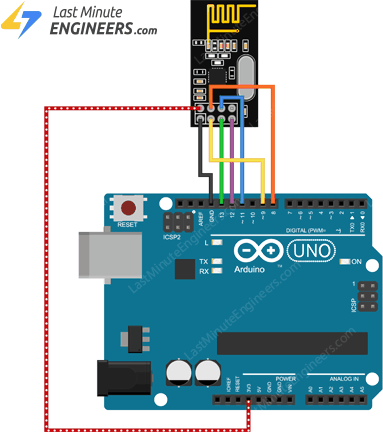

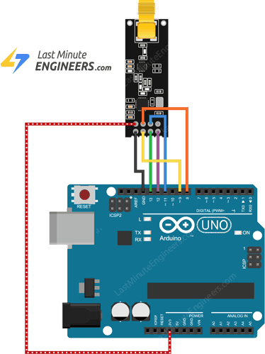

Duplicate the same wiring at both ends for paired TX/RX.

---

### Libraries

Primary library in the tutorial: **[RF24 (TmRh20)](https://tmrh20.github.io/)**.

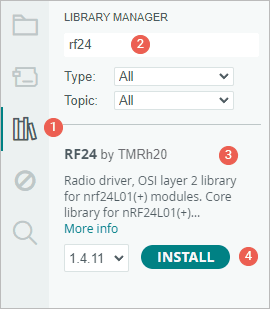

---

### Example 1 — one-way `"Hello World"`

**Transmitter:**

```cpp
#include <SPI.h>
#include <nRF24L01.h>
#include <RF24.h>

#define CE_PIN 9
#define CSN_PIN 8

RF24 radio(CE_PIN, CSN_PIN);

const byte address[6] = "00001";

void setup() {
  while (!Serial)
    ;
  Serial.begin(9600);

  radio.begin();
  radio.openWritingPipe(address);
  radio.stopListening();
}

void loop() {
  const char text[] = "Hello World";
  radio.write(&text, sizeof(text));

  Serial.print("Data sent: ");
  Serial.println(text);

  delay(1000);
}
```

Notes from the tutorial:

- `radio.write()` acknowledges **Enhanced ShockBurst** behavior can **block until ACK timeout / retries**.
- Practical **payload cap 32 bytes** per burst (library defaults must respect hardware FIFO limits).
- `write()` returning `bool` can reflect ACK success depending on ACK/auto-ACK configuration.

**Receiver:**

```cpp
#include <SPI.h>
#include <nRF24L01.h>
#include <RF24.h>

#define CE_PIN 9
#define CSN_PIN 8

RF24 radio(CE_PIN, CSN_PIN);

const byte address[6] = "00001";

void setup() {
  while (!Serial)
    ;

  Serial.begin(9600);

  radio.begin();
  radio.openReadingPipe(0, address);
  radio.startListening();
}

void loop() {
  if (radio.available()) {
    char text[32] = {0};
    radio.read(&text, sizeof(text));
    Serial.print("Data received: ");
    Serial.println(text);
  }
}
```

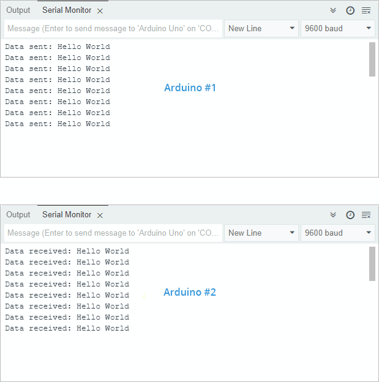

---

### Example 2 — struct payload (temperature + humidity)

Adds **DHT11** / **DHTlib** wiring on the transmitting side (`DHTlib` by Rob Tillaart: https://github.com/RobTillaart/Arduino/tree/master/libraries/DHTlib).

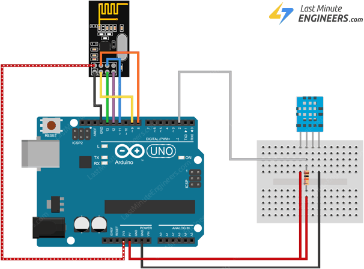

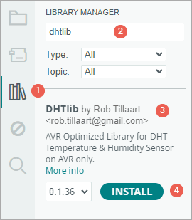

**Transmitter (sensor side):**

```cpp
#include <SPI.h>
#include <nRF24L01.h>
#include <RF24.h>
#include <dht.h>

#define CE_PIN 9
#define CSN_PIN 8
#define DHTPin 2

RF24 radio(CE_PIN, CSN_PIN);

dht DHT;

struct SensorData {
  float temperature;
  float humidity;
};

SensorData data;

const byte address[6] = "00001";

void setup() {
  while (!Serial)
    ;

  Serial.begin(9600);

  radio.begin();
  radio.openWritingPipe(address);
  radio.stopListening();
}

void loop() {
  DHT.read11(DHTPin);

  data.humidity = DHT.humidity;
  data.temperature = DHT.temperature;

  Serial.print("Sending Data - Temperature: ");
  Serial.print(data.temperature);
  Serial.print("°C, Humidity: ");
  Serial.print(data.humidity);
  Serial.println("%");

  radio.write(&data, sizeof(data));

  delay(1000);
}
```

**Receiver:**

```cpp
#include <SPI.h>
#include <nRF24L01.h>
#include <RF24.h>

#define CE_PIN 9
#define CSN_PIN 8

RF24 radio(CE_PIN, CSN_PIN);

struct SensorData {
  float temperature;
  float humidity;
};

const byte address[6] = "00001";

void setup() {
  while (!Serial)
    ;

  Serial.begin(9600);

  radio.begin();
  radio.openReadingPipe(0, address);
  radio.startListening();
}

void loop() {
  if (radio.available()) {
    SensorData receivedData;
    radio.read(&receivedData, sizeof(receivedData));

    Serial.print("Received Data - Temperature: ");
    Serial.print(receivedData.temperature);
    Serial.print("°C, Humidity: ");
    Serial.print(receivedData.humidity);
    Serial.println("%");
  }
}
```

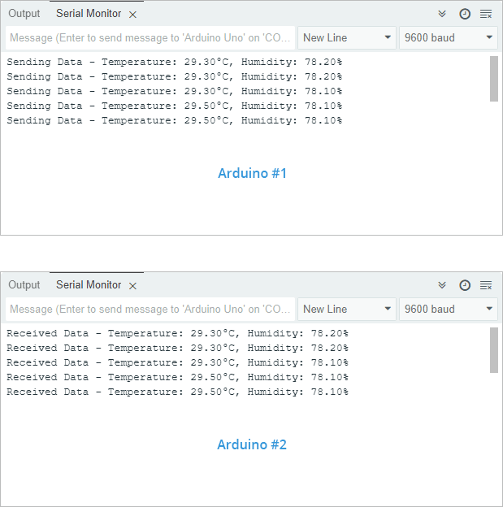

Structs must agree **exact layout** on TX/RX MCU/compiler (padding/endian floats etc.) — same architecture is simplest.

---

### Example 3 — bidirectional toggle (walkie-talkie sketch)

Adds **momentary pushbutton + LED** both sides — **same sketch on both**.

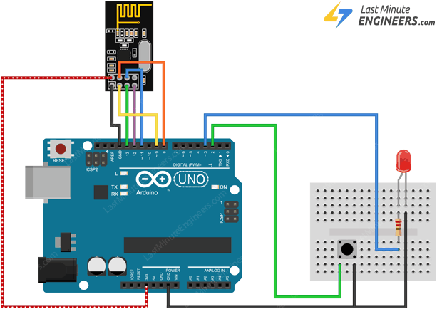


**Sketch (copied verbatim from tutorial; debounced edge):**

```cpp
#include <SPI.h>
#include <nRF24L01.h>
#include <RF24.h>

#define CE_PIN 9
#define CSN_PIN 8
#define SWITCH_PIN 2
#define LED_PIN 3

RF24 radio(CE_PIN, CSN_PIN);

const byte address[6] = "00001";

int ledState = HIGH;
int buttonState;
bool lastButtonState = HIGH;

unsigned long lastDebounceTime = 0;
const unsigned long debounceDelay = 50;

void setup() {
  pinMode(SWITCH_PIN, INPUT_PULLUP);
  pinMode(LED_PIN, OUTPUT);

  Serial.begin(9600);

  radio.begin();

  radio.openWritingPipe(address);
  radio.openReadingPipe(1, address);

  radio.startListening();
}

void loop() {
  bool reading = digitalRead(SWITCH_PIN);
  if (reading != lastButtonState) {
    lastDebounceTime = millis();
  }

  if ((millis() - lastDebounceTime) > debounceDelay) {
    if (reading != buttonState) {
      buttonState = reading;

      if (buttonState == HIGH) {
        ledState = !ledState;

        radio.stopListening();
        radio.write(&ledState, sizeof(ledState));
        radio.startListening();

        Serial.print("Data sent: ");
        Serial.println(ledState);
      }
    }
  }

  lastButtonState = reading;

  if (radio.available()) {
    bool receivedState;
    radio.read(&receivedState, sizeof(receivedState));

    digitalWrite(LED_PIN, receivedState ? HIGH : LOW);

    Serial.print("Data received: ");
    Serial.println(receivedState);
  }
}
```

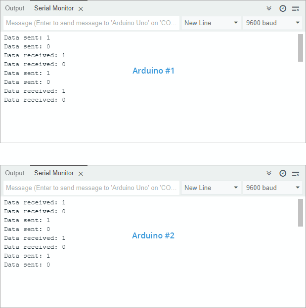

**Conceptual note:** radios cannot **transmit and listen simultaneously** on chip — pattern is **listen → briefly stopListening → transmit → resume listen**.

---

### Improving usable range / link quality

- **Clamp supply noise**: add adequate **bulk / ceramic decoupling** right at module VCC/GND footprint.
- Consider a **regulated 5 V → 3.3 V adapter board** integrating regulation + caps for cleaner supply when USB/bench rails are noisy.

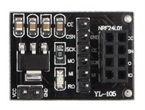

- **Channel choice:** Wi-Fi often crowds lower MHz slots within 2.4 GHz ⇒ experiment with **upper channel indices** locally.
- **Lower air data-rate** ⇒ better sensitivity (tutorial cites −94 dBm @ 250 kbps typical vs −82 dBm @ 2 Mbps style trade — verify on your silicon rev / conditions).
- **Higher TX power**: use legal / thermal / battery budget appropriate setting (0 dBm max if device isn’t amplified module; PA/LNA parts add their own limits).

Cross-links from article: Nordic datasheet; **Rf24 docs** (`https://tmrh20.github.io/`); **[RFX2401C PA/LNA frontend](http://www.skyworksinc.com/Product/3213/RFX2401C)** cited for amplified modules.

---

## Key Takeaways

- **Treat VCC as 3.3 V-critical** regardless of tolerant logic IO — browning-out or spikes collapse range.
- **Common mode stack:** SPI (`SCK/MOSI/MISO/CSN`) + `CE` + optional `IRQ`; pair **bitrate, channel, addresses/pipes**.
- **`RF24` patterns:** TX `stopListening()/write()`; RX `openReadingPipe(...); startListening(); available/read`.
- **`write()` semantics** intersect with ShockBurst/auto-ACK; design loops accordingly.
- **Struct telemetry** MUST match **exact binary layouts** TX↔RX; mind padding & float endian.
- **Range debug checklist:** PSU decoupling, channel vs Wi‑Fi BLE overlap, LOS, bitrate, PA/LNA choice, antennas.
