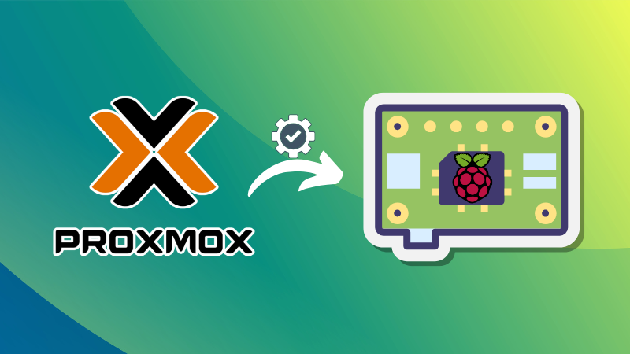
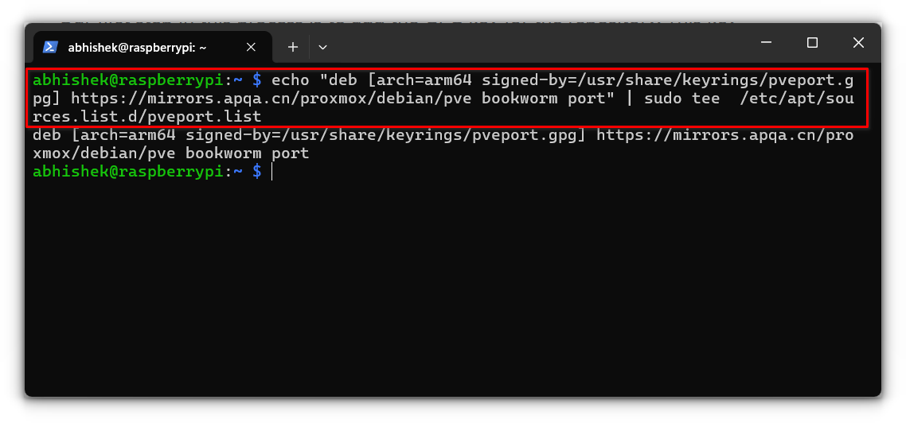
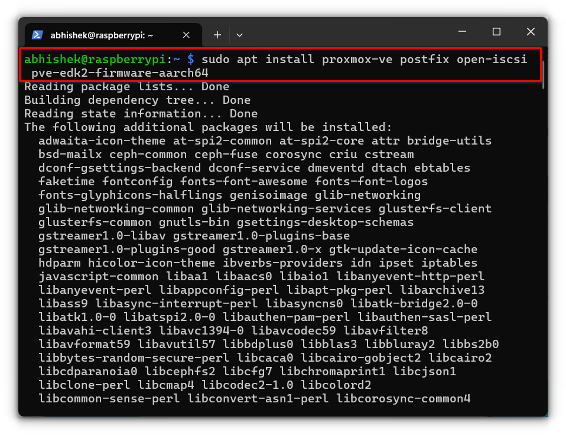
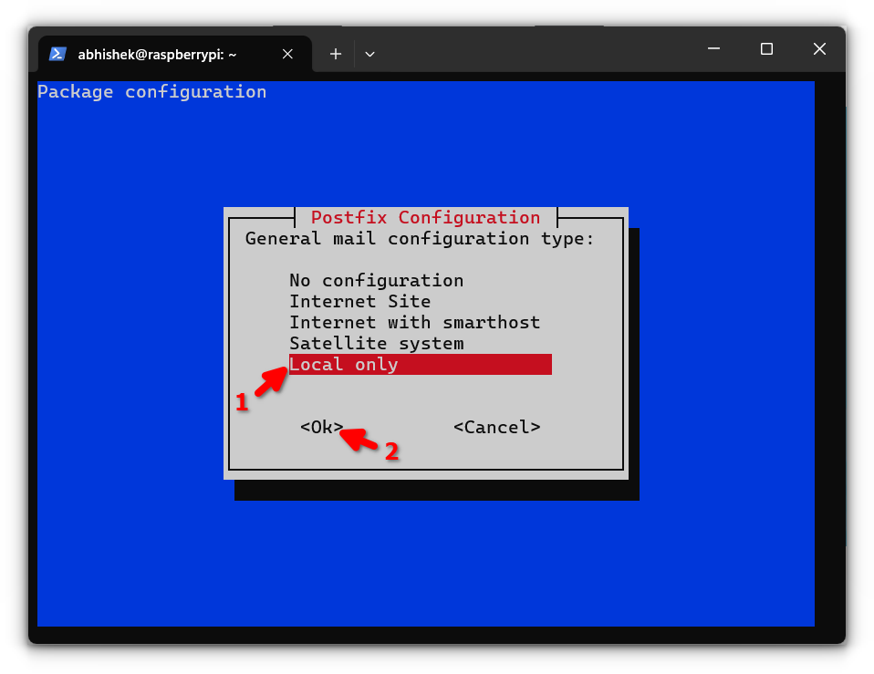
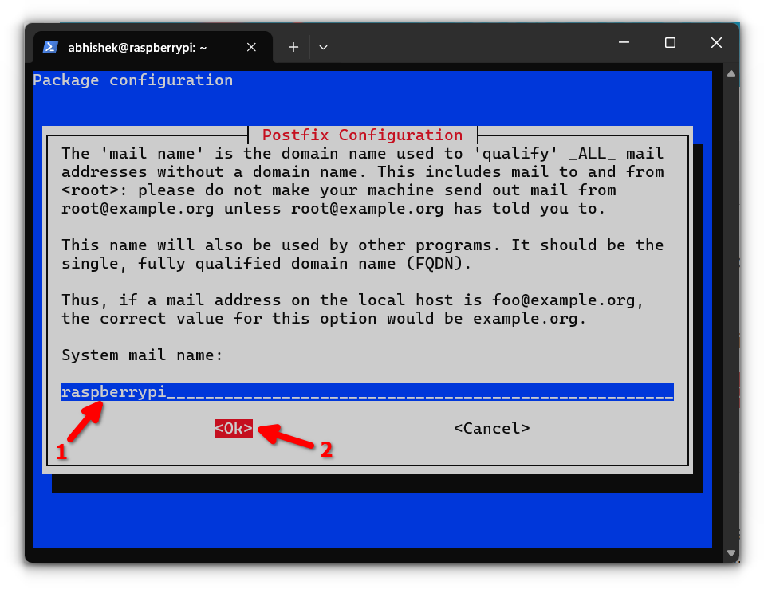
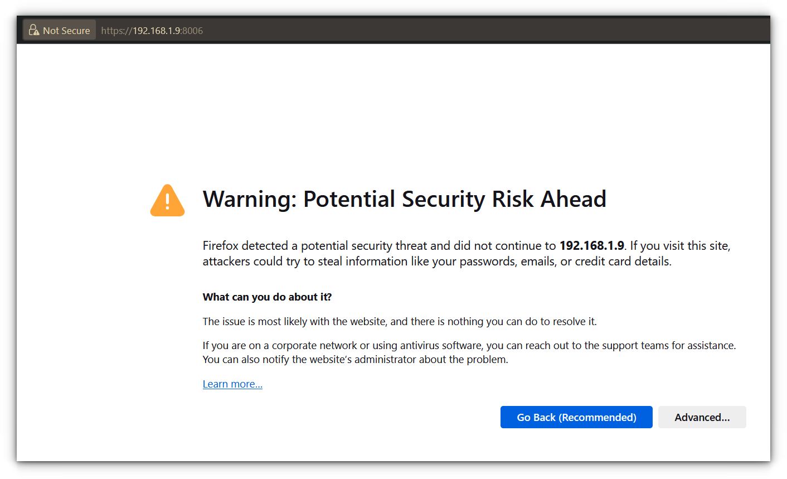
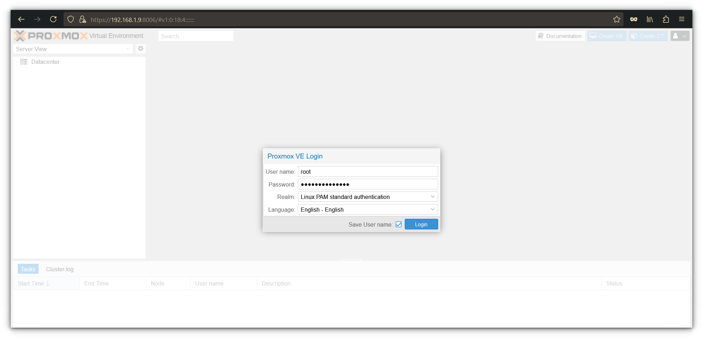
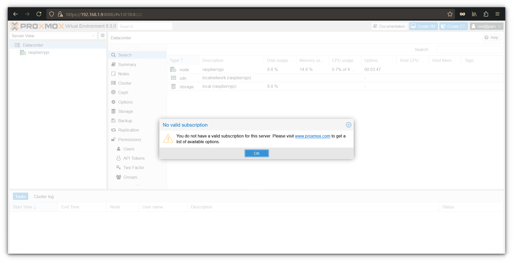
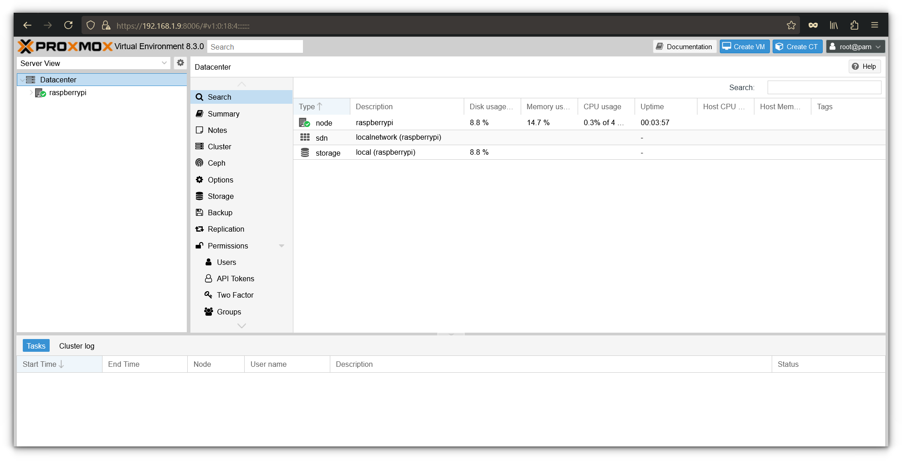

# Installing Proxmox on a Raspberry Pi to run Virtual Machines on it



## Source

- Type: webpage
- Origin: https://itsfoss.com/install-proxmox-raspberry-pi/
- Imported: 2026-06-11
- Images: 9 downloaded to `./assets/itsfoss-install-proxmox-raspberry-pi/` (hero, repo setup, install, Postfix, SSL warning, login, subscription notice, dashboard)

## Content

Proxmox Virtual Environment (VE) is an open-source platform for managing virtual machines and containers through a web interface. Proxmox is **not officially supported on Raspberry Pi**, but third-party ARM repositories make experimental installs possible.

This guide targets lightweight experimentation, not heavy VM workloads. A Raspberry Pi 4 or 5 with ample RAM is recommended.

### Requirements

- Raspberry Pi 4 or 5 (8 GB RAM recommended)
- MicroSD card (Class 10 or better)
- **64-bit Raspberry Pi OS Lite (Bookworm)**
- Power supply and Ethernet cable (wired preferred)

### Step 1: Start with a clean slate

Use a **fresh** Raspberry Pi OS Lite 64-bit (Bookworm) install. Older or cluttered systems can cause package dependency errors during install.

Flash the image with Raspberry Pi Imager.

### Step 2: Update and upgrade

```bash
sudo apt update && sudo apt upgrade -y
```

Install curl if missing:

```bash
sudo apt install curl
```

### Step 3: Set a static IP address

Proxmox needs a stable IP. Prefer a **DHCP reservation** on your router.

Alternatively, edit `/etc/dhcpcd.conf`:

```bash
sudo nano /etc/dhcpcd.conf
```

Add:

```
interface [INTERFACE]
static ip_address=[STATIC IP ADDRESS YOU WANT]/24
static routers=[ROUTER IP]
static domain_name_servers=[DNS IP]
```

Reboot and verify:

```bash
sudo reboot now
hostname -I
```

### Step 4: Modify `/etc/hosts`

Map the hostname to the Pi’s static IP:

```bash
sudo nano /etc/hosts
```

Change:

```
127.0.1.1    raspberrypi
```

To (example):

```
192.168.1.9    raspberrypi
```

### Step 5: Set the root password

Proxmox web login uses `root`:

```bash
sudo passwd root
```

### Step 6: Add the GPG key

Third-party ARM packages are served from the apqa.cn mirror:

```bash
curl -L https://mirrors.apqa.cn/proxmox/debian/pveport.gpg | sudo tee /usr/share/keyrings/pveport.gpg >/dev/null
```

### Step 7: Add the repository

```bash
echo "deb [arch=arm64 signed-by=/usr/share/keyrings/pveport.gpg] https://mirrors.apqa.cn/proxmox/debian/pve bookworm port" | sudo tee /etc/apt/sources.list.d/pveport.list
```



### Step 8: Update the package list

```bash
sudo apt update
```

### Step 9: Install Proxmox

```bash
sudo apt install proxmox-ve postfix open-iscsi ifupdown2 pve-edk2-firmware-aarch64
```

Package roles:

- **proxmox-ve** — core Proxmox server and web UI
- **postfix** — local mail for alerts (choose **Local only** if unsure)
- **open-iscsi** — network storage support
- **ifupdown2** — network interface management for bridges
- **pve-edk2-firmware-aarch64** — ARM64 VM firmware



During Postfix setup:



Use the default system mail name if unsure:



### Step 10: Access the Proxmox web interface

Open:

```
https://<IPADDRESS>:8006
```

Expect a self-signed certificate warning:



Log in as **`root`** with the password set in Step 5:



Dismiss the invalid subscription notice (free/community use):



The dashboard shows CPU, memory, and storage stats. Use **Create VM** to start a new virtual machine:



## Key Takeaways

- Proxmox on Pi is **experimental** — use a clean **64-bit Bookworm Lite** image.
- Set a **static IP** and align `/etc/hosts` with that address before install.
- This guide uses the **apqa.cn** `pveport` repository and GPG key (`pveport.gpg`).
- Web UI: `https://<pi-ip>:8006` as user **`root`**; ignore the subscription warning on first login.
- Keep VM workloads light; Pi 4/5 with 8 GB RAM is the practical hardware target.
