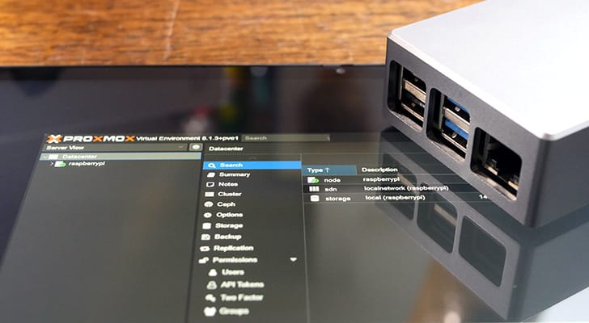
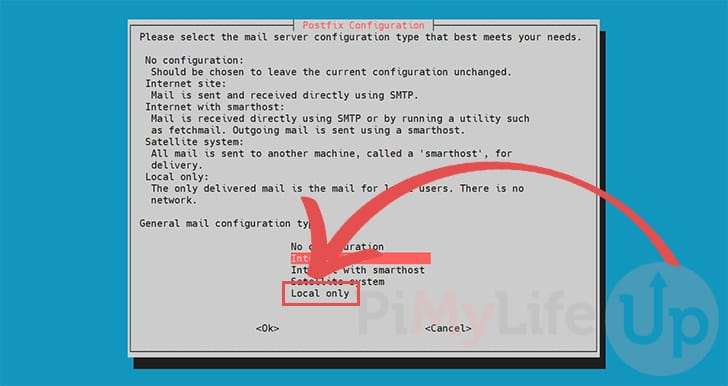
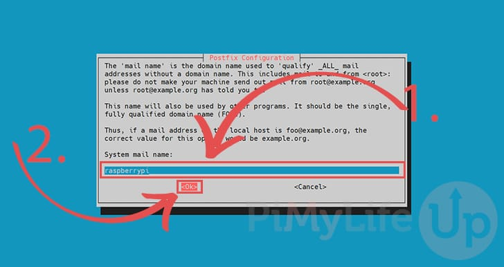
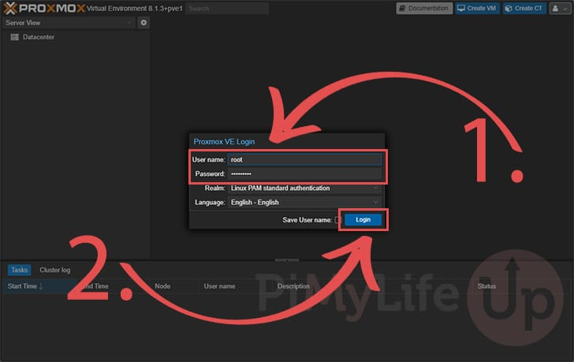
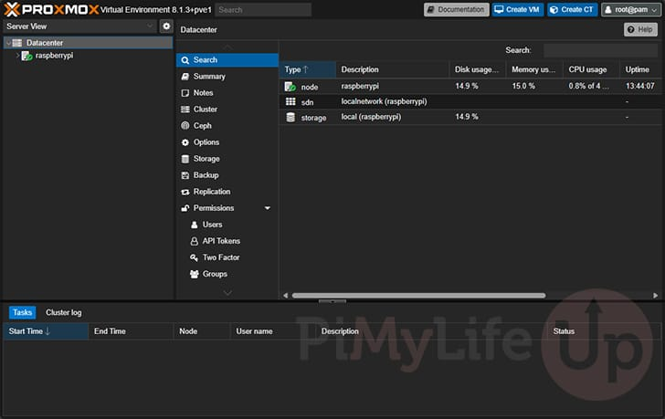

# How to Install Proxmox on the Raspberry Pi



## Source

- Type: webpage
- Origin: https://pimylifeup.com/raspberry-pi-proxmox/
- Imported: 2026-06-11
- Images: 5 downloaded to `./assets/pimylifeup-raspberry-pi-proxmox/` (thumbnail, Postfix prompts, login, web interface)

## Content

Proxmox Virtual Environment is an open-source virtualization platform with a powerful web interface for managing virtual machines and containers on a Raspberry Pi. Recent Proxmox VE releases support ARM systems, but the upstream project does not ship ARM64 builds. This guide uses **PXVirt**, a third-party fork that maintains feature parity with Proxmox VE and adds ARM optimizations.

- **Bookworm** → Proxmox 8
- **Trixie** → Proxmox 9

Use a **clean 64-bit Raspberry Pi OS Lite** install (Bookworm or Trixie). Avoid heavy VMs; newer Pis (especially Pi 5) work best.

### Requirements

- Raspberry Pi OS Lite **64-bit** (Bookworm or Trixie)
- Static IP address (DHCP reservation recommended)
- Clean OS install recommended

### Preparing the Raspberry Pi

1. Update packages:

```bash
sudo apt update
sudo apt upgrade
```

2. Install curl (needed for the PXVirt GPG key):

```bash
sudo apt install curl
```

3. Configure a **static IP** (router DHCP reservation or Pi-side config).

### Modify `/etc/hosts`

Proxmox expects the hostname to resolve to the Pi’s LAN IP, not `127.0.0.1`.

```bash
sudo nano /etc/hosts
```

Change:

```
127.0.0.1            raspberrypi
```

To (replace with your Pi’s IP):

```
192.168.0.32            raspberrypi
```

Verify:

```bash
hostname --ip-address
```

### Disable Cloud-Init hosts management

Cloud-init can overwrite `/etc/hosts` on reboot. Comment out `update_etc_hosts`:

```bash
sudo nano /etc/cloud/cloud.cfg
```

Under `cloud_init_modules`, change:

```
  - update_etc_hosts
```

To:

```
#  - update_etc_hosts
```

### Set root password

Required for Proxmox web login:

```bash
sudo passwd root
```

### Add the PXVirt repository

1. Import GPG key:

```bash
curl -L https://mirrors.lierfang.com/pxcloud/lierfang.gpg | sudo tee /usr/share/keyrings/lierfang.gpg >/dev/null
```

2. Load OS codename:

```bash
source /etc/os-release
```

3. Add repository:

```bash
echo "deb [arch=arm64 signed-by=/usr/share/keyrings/lierfang.gpg] https://mirrors.lierfang.com/pxcloud/pxvirt $VERSION_CODENAME main" | sudo tee /etc/apt/sources.list.d/pveport.list
```

4. Refresh package lists:

```bash
sudo apt update
```

### Prepare networking for Proxmox

#### Disable NetworkManager

```bash
sudo systemctl disable NetworkManager
sudo systemctl stop NetworkManager
sudo systemctl mask NetworkManager
```

#### Install ifupdown2

```bash
sudo apt install ifupdown2
```

If you see `error: Another instance of this program is already running.`:

```bash
sudo rm /tmp/.ifupdown2-first-install
sudo apt install ifupdown2
```

#### Configure `/etc/network/interfaces`

```bash
sudo nano /etc/network/interfaces
```

Add (replace placeholders):

```
auto lo
  iface lo inet loopback

auto eth0
  iface eth0 inet manual

auto vmbr0
iface vmbr0 inet manual
        address <IPADDRESS>
        gateway <GATEWAY>
        dns-nameservers <DNS>
        netmask 255.255.255.0
        bridge-ports eth0
        bridge-stp off
        bridge-fd 0
```

Example:

```
auto lo
  iface lo inet loopback

auto eth0
  iface eth0 inet manual

auto vmbr0
iface vmbr0 inet manual
        address 192.168.0.200
        gateway 192.168.0.1
        dns-nameservers 1.1.1.1 1.0.0.1
        netmask 255.255.255.0
        bridge-ports eth0
        bridge-stp off
        bridge-fd 0
```

Reboot to apply:

```bash
sudo reboot
```

### Install Proxmox VE

```bash
sudo apt install proxmox-ve postfix open-iscsi pve-edk2-firmware-aarch64
```

During Postfix setup, choose **Local only** if unsure:



Leave the default system mail name unless you know otherwise:



If installation fails with `Errors were encountered while processing: pxvirt-spdk`, re-run the install command.

### Access the web interface

Get the Pi IP:

```bash
hostname -I
```

Open in a browser:

```
https://<IPADDRESS>:8006
```

Log in as `root` with the password set earlier:



After login, use the web UI to create VMs and configure the host:



## Key Takeaways

- Official Proxmox VE has no ARM64 builds; **PXVirt** is the third-party fork used for Raspberry Pi.
- Requires **64-bit Raspberry Pi OS Lite** (Bookworm or Trixie), a **static IP**, and hostname/IP alignment in `/etc/hosts`.
- Disable **NetworkManager** and configure **`vmbr0`** bridging before install to avoid losing network access.
- Web UI: `https://<pi-ip>:8006` as user **`root`**.
- Keep VM workloads light; Pi 5 is the recommended hardware class for this experiment.
