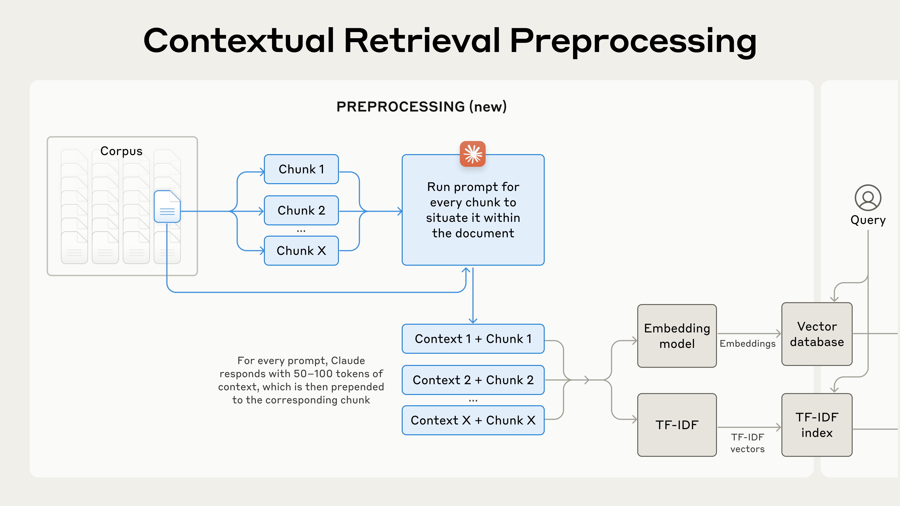
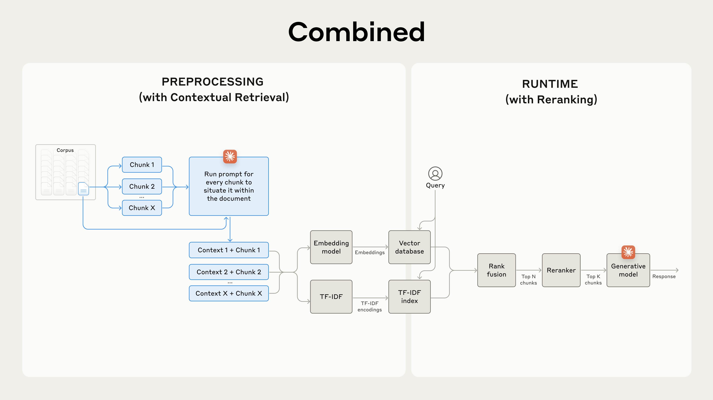
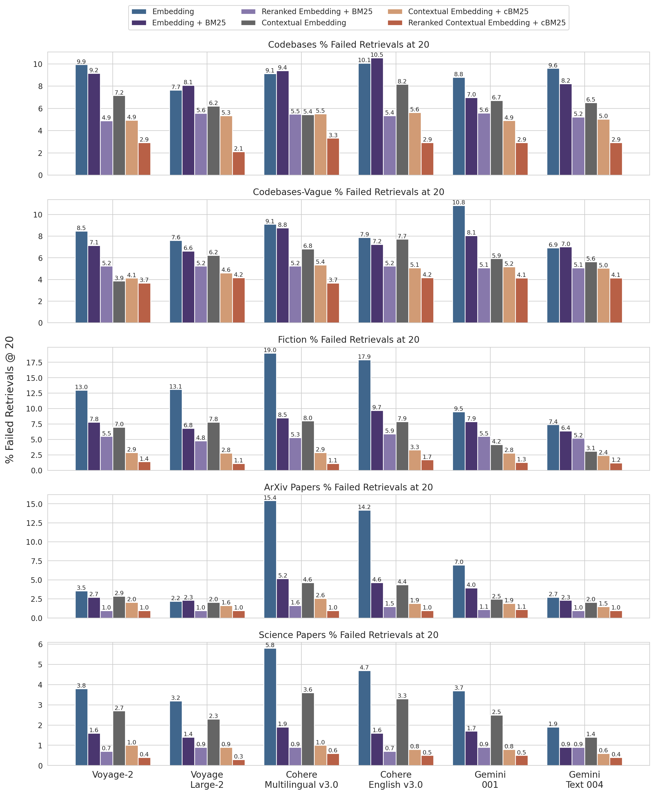

# Introducing Contextual Retrieval

## Source

- Type: webpage
- Origin: https://www.anthropic.com/engineering/contextual-retrieval
- Imported: 2025-08-30
- Published: September 19, 2024
- Cookbook: [Claude Cookbook — contextual embeddings](https://platform.claude.com/cookbook/capabilities-contextual-embeddings-guide)
- Images: 7 diagrams/charts saved under `./assets/anthropic-contextual-retrieval/`


## Content

For an AI model to be useful in specific contexts, it often needs access to background knowledge — customer support chatbots need business-specific information, legal analyst bots need past cases, and so on.

Developers typically enhance model knowledge with **Retrieval-Augmented Generation (RAG)**. RAG retrieves relevant information from a knowledge base and appends it to the user's prompt. The problem: traditional RAG solutions remove context when encoding information, often causing the system to fail to retrieve the relevant chunks.

**Contextual Retrieval** dramatically improves the retrieval step using two sub-techniques:

- **Contextual Embeddings** — prepend chunk-specific explanatory context before embedding
- **Contextual BM25** — index both raw chunk content and generated context for keyword search

Results: **49% reduction** in failed retrievals (Contextual Embeddings + Contextual BM25), and **67% reduction** when combined with reranking.

### A note on simply using a longer prompt

If your knowledge base is smaller than 200,000 tokens (~500 pages), you can include the entire knowledge base in the prompt with no RAG. [Prompt caching](https://platform.claude.com/cookbook/misc-prompt-caching) makes this faster and cheaper — reducing latency by >2x and costs by up to 90%.

As your knowledge base grows, you need a more scalable solution. That's where Contextual Retrieval comes in.

### A primer on RAG

For knowledge bases that don't fit in the context window, RAG preprocesses documents:

1. Break the corpus into smaller chunks (usually a few hundred tokens)
2. Convert chunks to vector embeddings encoding meaning
3. Store embeddings in a vector database for semantic similarity search

At runtime, the vector database finds the most relevant chunks, which are added to the generative model's prompt.

#### BM25 and hybrid search

Embedding models excel at semantic relationships but can miss exact matches. **BM25 (Best Matching 25)** uses lexical matching to find precise word or phrase matches — effective for unique identifiers or technical terms.

BM25 builds on TF-IDF, refining it by considering document length and applying a saturation function to term frequency.

**Example:** A query for "Error code TS-999" — embeddings might find general error code content but miss the exact match; BM25 looks for that specific string.

Hybrid RAG combines embeddings and BM25:

1. Break corpus into chunks
2. Create TF-IDF encodings and semantic embeddings
3. Use BM25 for top chunks by exact match
4. Use embeddings for top chunks by semantic similarity
5. Combine and deduplicate via rank fusion
6. Add top-K chunks to the prompt


This scales to enormous knowledge bases but has a significant limitation: **it often destroys context**.

### The context conundrum in traditional RAG

When documents are split into smaller chunks, individual chunks can lack sufficient context.

**Example:** A collection of U.S. SEC filings, query: "What was the revenue growth for ACME Corp in Q2 2023?"

A relevant chunk might say: *"The company's revenue grew by 3% over the previous quarter."* Without knowing which company or time period, this chunk is hard to retrieve or use effectively.

### Introducing Contextual Retrieval

Contextual Retrieval prepends chunk-specific explanatory context to each chunk before embedding (**Contextual Embeddings**) and before creating the BM25 index (**Contextual BM25**).

**SEC filing example:**

```
original_chunk = "The company's revenue grew by 3% over the previous quarter."

contextualized_chunk = "This chunk is from an SEC filing on ACME corp's performance in Q2 2023; the previous quarter's revenue was $314 million. The company's revenue grew by 3% over the previous quarter."
```

Other context-based approaches were evaluated with limited gains: generic document summaries, hypothetical document embedding, and summary-based indexing.

### Implementing Contextual Retrieval

Manual annotation of thousands of chunks is impractical. Anthropic uses Claude to generate concise, chunk-specific context explaining each chunk within its document:

```
<document>
{{WHOLE_DOCUMENT}}
</document>
Here is the chunk we want to situate within the whole document
<chunk>
{{CHUNK_CONTENT}}
</chunk>
Please give a short succinct context to situate this chunk within the overall document
for the purposes of improving search retrieval of the chunk.
Answer only with the succinct context and nothing else.
```

The resulting contextual text (typically 50–100 tokens) is prepended to the chunk before embedding and before creating the BM25 index.



### Using prompt caching to reduce costs

Contextual Retrieval is uniquely practical at low cost with Claude thanks to prompt caching. Load the reference document into cache once, then reference cached content for each chunk.

**Cost example** (800-token chunks, 8k-token documents, 50-token context instructions, 100 tokens of context per chunk): **$1.02 per million document tokens** one-time.

#### Methodology

Experiments across knowledge domains (codebases, fiction, ArXiv papers, science papers), embedding models, retrieval strategies, and evaluation metrics. Evaluation metric: **1 minus recall@20** — percentage of relevant documents failing to be retrieved in the top 20 chunks. Top-performing embedding: Gemini Text 004; retrieving top-20 chunks.

#### Performance improvements

- **Contextual Embeddings** reduced top-20-chunk retrieval failure rate by **35%** (5.7% → 3.7%)
- **Contextual Embeddings + Contextual BM25** reduced failure rate by **49%** (5.7% → 2.9%)


#### Implementation considerations

1. **Chunk boundaries** — chunk size, boundary, and overlap affect retrieval performance
2. **Embedding model** — contextual retrieval improves all tested models; Gemini and Voyage embeddings were particularly effective
3. **Custom contextualizer prompts** — domain-specific prompts (e.g. including a glossary) may outperform the generic prompt
4. **Number of chunks** — more chunks increase recall but can distract the model; top-20 outperformed top-5 and top-10 in experiments

Always run evals. Response generation may improve by passing the contextualized chunk and distinguishing context from chunk content.

### Further boosting performance with reranking

With large knowledge bases, initial retrieval can return hundreds of chunks of varying relevance. **Reranking** filters to only the most relevant chunks:

1. Initial retrieval for top potentially relevant chunks (top 150)
2. Pass top-N chunks and user query through reranking model
3. Score each chunk by relevance; select top-K (top 20)
4. Pass top-K chunks to the model as context



Tests used the Cohere reranker (Voyage also offers one, untested).

**Reranked Contextual Embedding + Contextual BM25** reduced top-20-chunk retrieval failure rate by **67%** (5.7% → 1.9%).


**Cost and latency:** Reranking adds runtime latency (reranker scores chunks in parallel). Trade-off between reranking more chunks for better performance vs. fewer for lower latency and cost.

### Conclusion — what stacks

1. Embeddings + BM25 is better than embeddings alone
2. Voyage and Gemini had the best embeddings tested
3. Passing top-20 chunks is more effective than top-10 or top-5
4. Adding context to chunks improves retrieval accuracy significantly
5. Reranking is better than no reranking
6. Benefits stack: contextual embeddings (Voyage or Gemini) + contextual BM25 + reranking + top-20 chunks

### Appendix I

Breakdown of results across datasets, embedding providers, BM25, contextual retrieval, and reranking for Retrievals @ 20.



## Key Takeaways

- Traditional RAG loses context when chunking documents — isolated chunks fail retrieval even when semantically related to the query.
- Contextual Retrieval uses Claude to generate 50–100 token situating context per chunk, prepended before embedding and BM25 indexing.
- Prompt caching makes contextualization affordable at scale (~$1.02 per million document tokens one-time).
- Contextual Embeddings alone cut retrieval failures by 35%; adding Contextual BM25 reaches 49%; adding reranking reaches 67%.
- For small knowledge bases (<200k tokens), full prompt inclusion with caching may be simpler than RAG.
- Gemini and Voyage embeddings performed best in Anthropic's tests; top-20 chunks outperformed smaller K values.
- See the [Claude Cookbook](https://platform.claude.com/cookbook/capabilities-contextual-embeddings-guide) for a hands-on implementation.
