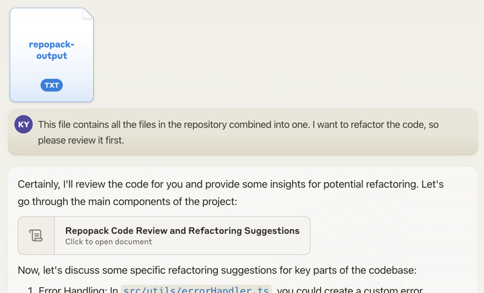
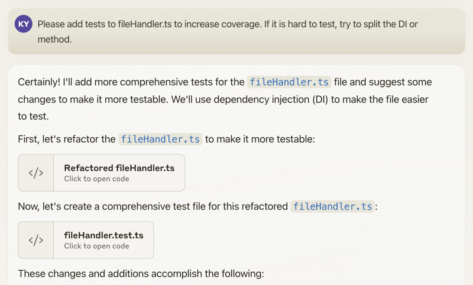
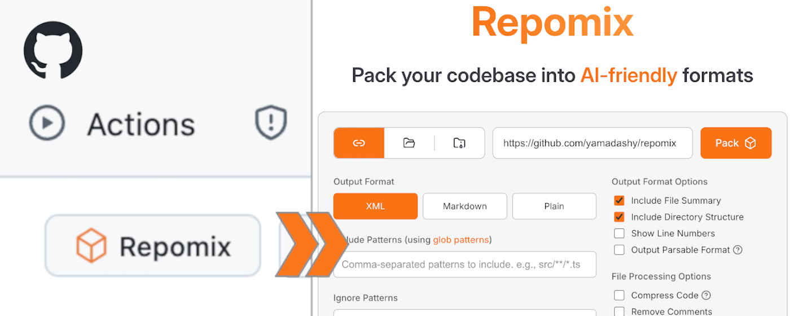

# Repomix — Pack repositories for AI context

## Source
- Type: webpage
- Origin: https://github.com/yamadashy/repomix
- Imported: 2025-06-23
- Images: 3 documentation screenshots saved under `./assets/github-yamadashy-repomix/` (usage workflow and browser extension)

## Content

[](https://www.npmjs.com/package/repomix)
[](https://www.npmjs.com/package/repomix)
[](https://github.com/yamadashy/repomix/actions?query=workflow%3A"ci")
[](https://codecov.io/github/yamadashy/repomix)
[](https://coderabbit.ai)
[](https://github.com/sponsors/yamadashy)
[](https://discord.gg/wNYzTwZFku)

[![DeepWiki](https://img.shields.io/badge/DeepWiki-yamadashy%2Frepomix-blue.svg?logo=data:image/png;base64,iVBORw0KGgoAAAANSUhEUgAAACwAAAAyCAYAAAAnWDnqAAAAAXNSR0IArs4c6QAAA05JREFUaEPtmUtyEzEQhtWTQyQLHNak2AB7ZnyXZMEjXMGeK/AIi+QuHrMnbChYY7MIh8g01fJoopFb0uhhEqqcbWTp06/uv1saEDv4O3n3dV60RfP947Mm9/SQc0ICFQgzfc4CYZoTPAswgSJCCUJUnAAoRHOAUOcATwbmVLWdGoH//PB8mnKqScAhsD0kYP3j/Yt5LPQe2KvcXmGvRHcDnpxfL2zOYJ1mFwrryWTz0advv1Ut4CJgf5uhDuDj5eUcAUoahrdY/56ebRWeraTjMt/00Sh3UDtjgHtQNHwcRGOC98BJEAEymycmYcWwOprTgcB6VZ5JK5TAJ+fXGLBm3FDAmn6oPPjR4rKCAoJCal2eAiQp2x0vxTPB3ALO2CRkwmDy5WohzBDwSEFKRwPbknEggCPB/imwrycgxX2NzoMCHhPkDwqYMr9tRcP5qNrMZHkVnOjRMWwLCcr8ohBVb1OMjxLwGCvjTikrsBOiA6fNyCrm8V1rP93iVPpwaE+gO0SsWmPiXB+jikdf6SizrT5qKasx5j8ABbHpFTx+vFXp9EnYQmLx02h1QTTrl6eDqxLnGjporxl3NL3agEvXdT0WmEost648sQOYAeJS9Q7bfUVoMGnjo4AZdUMQku50McDcMWcBPvr0SzbTAFDfvJqwLzgxwATnCgnp4wDl6Aa+Ax283gghmj+vj7feE2KBBRMW3FzOpLOADl0Isb5587h/U4gGvkt5v60Z1VLG8BhYjbzRwyQZemwAd6cCR5/XFWLYZRIMpX39AR0tjaGGiGzLVyhse5C9RKC6ai42ppWPKiBagOvaYk8lO7DajerabOZP46Lby5wKjw1HCRx7p9sVMOWGzb/vA1hwiWc6jm3MvQDTogQkiqIhJV0nBQBTU+3okKCFDy9WwferkHjtxib7t3xIUQtHxnIwtx4mpg26/HfwVNVDb4oI9RHmx5WGelRVlrtiw43zboCLaxv46AZeB3IlTkwouebTr1y2NjSpHz68WNFjHvupy3q8TFn3Hos2IAk4Ju5dCo8B3wP7VPr/FGaKiG+T+v+TQqIrOqMTL1VdWV1DdmcbO8KXBz6esmYWYKPwDL5b5FA1a0hwapHiom0r/cKaoqr+27/XcrS5UwSMbQAAAABJRU5ErkJggg==)](https://deepwiki.com/yamadashy/repomix)
 

📦 Repomix is a powerful tool that packs your entire repository into a single, AI-friendly file. 
It is perfect for when you need to feed your codebase to Large Language Models (LLMs) or other AI tools like Claude,
ChatGPT, DeepSeek, Perplexity, Gemini, Gemma, Llama, Grok, and more.

Please consider sponsoring me.

[](https://github.com/sponsors/yamadashy)

[](https://github.com/sponsors/yamadashy)

## 🏆 Open Source Awards Nomination

We're honored! Repomix has been nominated for the **Powered by AI** category at the [JSNation Open Source Awards 2025](https://osawards.com/javascript/).

This wouldn't have been possible without all of you using and supporting Repomix. Thank you!

## 🎉 New: Repomix Website & Discord Community!

- Try Repomix in your browser at [repomix.com](https://repomix.com/)
- Join our [Discord Server](https://discord.gg/wNYzTwZFku) for support and discussion

**We look forward to seeing you there!**

## 🌟 Features

- **AI-Optimized**: Formats your codebase in a way that's easy for AI to understand and process.
- **Token Counting**: Provides token counts for each file and the entire repository, useful for LLM context limits.
- **Simple to Use**: You need just one command to pack your entire repository.
- **Customizable**: Easily configure what to include or exclude.
- **Git-Aware**: Automatically respects your `.gitignore`, `.ignore`, and `.repomixignore` files.
- **Security-Focused**: Incorporates [Secretlint](https://github.com/secretlint/secretlint) for robust security checks to detect and prevent inclusion of sensitive information.
- **Code Compression**: The `--compress` option uses [Tree-sitter](https://github.com/tree-sitter/tree-sitter) to extract key code elements, reducing token count while preserving structure.

## 🚀 Quick Start

### Using the CLI Tool `>_`

You can try Repomix instantly in your project directory without installation:

```bash
npx repomix@latest
```

Or install globally for repeated use:

```bash
# Install using npm
npm install -g repomix

# Alternatively using yarn
yarn global add repomix

# Alternatively using bun
bun add -g repomix

# Alternatively using Homebrew (macOS/Linux)
brew install repomix

# Then run in any project directory
repomix
```

That's it! Repomix will generate a `repomix-output.xml` file in your current directory, containing your entire
repository in an AI-friendly format.

You can then send this file to an AI assistant with a prompt like:

```
This file contains all the files in the repository combined into one.
I want to refactor the code, so please review it first.
```



When you propose specific changes, the AI might be able to generate code accordingly. With features like Claude's
Artifacts, you could potentially output multiple files, allowing for the generation of multiple interdependent pieces of
code.



Happy coding! 🚀

### Using The Website 🌐

Want to try it quickly? Visit the official website at [repomix.com](https://repomix.com). Simply enter your repository
name, fill in any optional details, and click the **Pack** button to see your generated output.

#### Available Options

The website offers several convenient features:

- Customizable output format (XML, Markdown, or Plain Text)
- Instant token count estimation
- Much more!

### Using The Browser Extension 🧩

Get instant access to Repomix directly from any GitHub repository! Our Chrome extension adds a convenient "Repomix" button to GitHub repository pages.



#### Install
- Chrome Extension: [Repomix - Chrome Web Store](https://chromewebstore.google.com/detail/repomix/fimfamikepjgchehkohedilpdigcpkoa)
- Firefox Add-on: [Repomix - Firefox Add-ons](https://addons.mozilla.org/firefox/addon/repomix/)

#### Features
- One-click access to Repomix for any GitHub repository
- More exciting features coming soon!

### Using The VSCode Extension ⚡️

A community-maintained VSCode extension called [Repomix Runner](https://marketplace.visualstudio.com/items?itemName=DorianMassoulier.repomix-runner) (created by [massdo](https://github.com/massdo)) lets you run Repomix right inside your editor with just a few clicks. Run it on any folder, manage outputs seamlessly, and control everything through VSCode's intuitive interface. 

Want your output as a file or just the content? Need automatic cleanup? This extension has you covered. Plus, it works smoothly with your existing repomix.config.json.

Try it now on the [VSCode Marketplace](https://marketplace.visualstudio.com/items?itemName=DorianMassoulier.repomix-runner)!
Source code is available on [GitHub](https://github.com/massdo/repomix-runner).

### Alternative Tools 🛠️

If you're using Python, you might want to check out `Gitingest`, which is better suited for Python ecosystem and data
science workflows:
https://github.com/cyclotruc/gitingest

## 📊 Usage

To pack your entire repository:

```bash
repomix
```

To pack a specific directory:

```bash
repomix path/to/directory
```

To pack specific files or directories
using [glob patterns](https://github.com/mrmlnc/fast-glob?tab=readme-ov-file#pattern-syntax):

```bash
repomix --include "src/**/*.ts,**/*.md"
```

To exclude specific files or directories:

```bash
repomix --ignore "**/*.log,tmp/"
```

To pack a remote repository:

```bash
repomix --remote https://github.com/yamadashy/repomix

# You can also use GitHub shorthand:
repomix --remote yamadashy/repomix

# You can specify the branch name, tag, or commit hash:
repomix --remote https://github.com/yamadashy/repomix --remote-branch main

# Or use a specific commit hash:
repomix --remote https://github.com/yamadashy/repomix --remote-branch 935b695

# Another convenient way is specifying the branch's URL
repomix --remote https://github.com/yamadashy/repomix/tree/main

# Commit's URL is also supported
repomix --remote https://github.com/yamadashy/repomix/commit/836abcd7335137228ad77feb28655d85712680f1

```

To pack files from a file list (pipe via stdin):

```bash
# Using find command
find src -name "*.ts" -type f | repomix --stdin

# Using git to get tracked files
git ls-files "*.ts" | repomix --stdin

# Using grep to find files containing specific content
grep -l "TODO" **/*.ts | repomix --stdin

# Using ripgrep to find files with specific content
rg -l "TODO|FIXME" --type ts | repomix --stdin

# Using ripgrep (rg) to find files
rg --files --type ts | repomix --stdin

# Using sharkdp/fd to find files
fd -e ts | repomix --stdin

# Using fzf to select from all files
fzf -m | repomix --stdin

# Interactive file selection with fzf
find . -name "*.ts" -type f | fzf -m | repomix --stdin

# Using ls with glob patterns
ls src/**/*.ts | repomix --stdin

# From a file containing file paths
cat file-list.txt | repomix --stdin

# Direct input with echo
echo -e "src/index.ts\nsrc/utils.ts" | repomix --stdin
```

The `--stdin` option allows you to pipe a list of file paths to Repomix, giving you ultimate flexibility in selecting which files to pack.

When using `--stdin`, the specified files are effectively added to the include patterns. This means that the normal include and ignore behavior still applies - files specified via stdin will still be excluded if they match ignore patterns.

> [!NOTE]
> When using `--stdin`, file paths can be relative or absolute, and Repomix will automatically handle path resolution and deduplication.

To include git logs in the output:

```bash
# Include git logs with default count (50 commits)
repomix --include-logs

# Include git logs with specific commit count
repomix --include-logs --include-logs-count 10

# Combine with diffs for comprehensive git context
repomix --include-logs --include-diffs
```

The git logs include commit dates, messages, and file paths for each commit, providing valuable context for AI analysis of code evolution and development patterns.

To compress the output:

```bash
repomix --compress

# You can also use it with remote repositories:
repomix --remote yamadashy/repomix --compress
```

To initialize a new configuration file (`repomix.config.json`):

```bash
repomix --init
```

Once you have generated the packed file, you can use it with Generative AI tools like ChatGPT, DeepSeek, Perplexity, Gemini, Gemma, Llama, Grok, and more.

### Docker Usage 🐳

You can also run Repomix using Docker. 
This is useful if you want to run Repomix in an isolated environment or prefer using containers.

Basic usage (current directory):

```bash
docker run -v .:/app -it --rm ghcr.io/yamadashy/repomix
```

To pack a specific directory:

```bash
docker run -v .:/app -it --rm ghcr.io/yamadashy/repomix path/to/directory
```

Process a remote repository and output to a `output` directory:

```bash
docker run -v ./output:/app -it --rm ghcr.io/yamadashy/repomix --remote https://github.com/yamadashy/repomix
```

### Prompt Examples

Once you have generated the packed file with Repomix, you can use it with AI tools like ChatGPT, DeepSeek, Perplexity, Gemini, Gemma, Llama, Grok, and more.
Here are some example prompts to get you started:

#### Code Review and Refactoring

For a comprehensive code review and refactoring suggestions:

```
This file contains my entire codebase. Please review the overall structure and suggest any improvements or refactoring opportunities, focusing on maintainability and scalability.
```

#### Documentation Generation

To generate project documentation:

```
Based on the codebase in this file, please generate a detailed README.md that includes an overview of the project, its main features, setup instructions, and usage examples.
```

#### Test Case Generation

For generating test cases:

```
Analyze the code in this file and suggest a comprehensive set of unit tests for the main functions and classes. Include edge cases and potential error scenarios.
```

#### Code Quality Assessment

Evaluate code quality and adherence to best practices:

```
Review the codebase for adherence to coding best practices and industry standards. Identify areas where the code could be improved in terms of readability, maintainability, and efficiency. Suggest specific changes to align the code with best practices.
```

#### Library Overview

Get a high-level understanding of the library

```
This file contains the entire codebase of library. Please provide a comprehensive overview of the library, including its main purpose, key features, and overall architecture.
```

Feel free to modify these prompts based on your specific needs and the capabilities of the AI tool you're using.

### Community Discussion

Check out our [community discussion](https://github.com/yamadashy/repomix/discussions/154) where users share:

- Which AI tools they're using with Repomix
- Effective prompts they've discovered
- How Repomix has helped them
- Tips and tricks for getting the most out of AI code analysis

Feel free to join the discussion and share your own experiences! Your insights could help others make better use of
Repomix.

### Output File Format

Repomix generates a single file with clear separators between different parts of your codebase. 
To enhance AI comprehension, the output file begins with an AI-oriented explanation, making it easier for AI models to
understand the context and structure of the packed repository.

#### XML Format (default)

The XML format structures the content in a hierarchical manner:

```xml
This file is a merged representation of the entire codebase, combining all repository files into a single document.

<file_summary>
  (Metadata and usage AI instructions)
</file_summary>

<directory_structure>
src/
cli/
cliOutput.ts
index.ts

(...remaining directories)
</directory_structure>

<files>
<file path="src/index.js">
  // File contents here
</file>

(...remaining files)
</files>

<instruction>
(Custom instructions from `output.instructionFilePath`)
</instruction>
```

For those interested in the potential of XML tags in AI contexts: 
https://docs.anthropic.com/en/docs/build-with-claude/prompt-engineering/use-xml-tags

> When your prompts involve multiple components like context, instructions, and examples, XML tags can be a
> game-changer. They help Claude parse your prompts more accurately, leading to higher-quality outputs.

This means that the XML output from Repomix is not just a different format, but potentially a more effective way to feed
your codebase into AI systems for analysis, code review, or other tasks.

#### Markdown Format

To generate output in Markdown format, use the `--style markdown` option:

```bash
repomix --style markdown
```

The Markdown format structures the content in a hierarchical manner:

````markdown
This file is a merged representation of the entire codebase, combining all repository files into a single document.

# File Summary

(Metadata and usage AI instructions)

# Repository Structure

```
src/
  cli/
    cliOutput.ts
    index.ts
```

(...remaining directories)

# Repository Files

## File: src/index.js

```
// File contents here
```

(...remaining files)

# Instruction

(Custom instructions from `output.instructionFilePath`)
````

This format provides a clean, readable structure that is both human-friendly and easily parseable by AI systems.

#### JSON Format

To generate output in JSON format, use the `--style json` option:

```bash
repomix --style json
```

The JSON format structures the content as a hierarchical JSON object with camelCase property names:

```json
{
  "fileSummary": {
    "generationHeader": "This file is a merged representation of the entire codebase, combined into a single document by Repomix.",
    "purpose": "This file contains a packed representation of the entire repository's contents...",
    "fileFormat": "The content is organized as follows...",
    "usageGuidelines": "- This file should be treated as read-only...",
    "notes": "- Some files may have been excluded based on .gitignore, .ignore, and .repomixignore rules..."
  },
  "userProvidedHeader": "Custom header text if specified",
  "directoryStructure": "src/\n  cli/\n    cliOutput.ts\n    index.ts\n  config/\n    configLoader.ts",
  "files": {
    "src/index.js": "// File contents here",
    "src/utils.js": "// File contents here"
  },
  "instruction": "Custom instructions from instructionFilePath"
}
```

This format is ideal for:
- **Programmatic processing**: Easy to parse and manipulate with JSON libraries
- **API integration**: Direct consumption by web services and applications 
- **AI tool compatibility**: Structured format for machine learning and AI systems
- **Data analysis**: Straightforward extraction of specific information using tools like `jq`

##### Working with JSON Output Using `jq`

The JSON format makes it easy to extract specific information programmatically:

```bash
# List all file paths
cat repomix-output.json | jq -r '.files | keys[]'

# Count total number of files
cat repomix-output.json | jq '.files | keys | length'

# Extract specific file content
cat repomix-output.json | jq -r '.files["README.md"]'
cat repomix-output.json | jq -r '.files["src/index.js"]'

# Find files by extension
cat repomix-output.json | jq -r '.files | keys[] | select(endswith(".ts"))'

# Get files containing specific text
cat repomix-output.json | jq -r '.files | to_entries[] | select(.value | contains("function")) | .key'

# Extract directory structure
cat repomix-output.json | jq -r '.directoryStructure'

# Get file summary information
cat repomix-output.json | jq '.fileSummary.purpose'
cat repomix-output.json | jq -r '.fileSummary.generationHeader'

# Extract user-provided header (if exists)
cat repomix-output.json | jq -r '.userProvidedHeader // "No header provided"'

# Create a file list with sizes
cat repomix-output.json | jq -r '.files | to_entries[] | "\(.key): \(.value | length) characters"'
```

#### Plain Text Format

To generate output in plain text format, use the `--style plain` option:

```bash
repomix --style plain
```

```text
This file is a merged representation of the entire codebase, combining all repository files into a single document.

================================================================
File Summary
================================================================
(Metadata and usage AI instructions)

================================================================
Directory Structure
================================================================
src/
  cli/
    cliOutput.ts
    index.ts
  config/
    configLoader.ts

(...remaining directories)

================================================================
Files
================================================================

================
File: src/index.js
================
// File contents here

================
File: src/utils.js
================
// File contents here

(...remaining files)

================================================================
Instruction
================================================================
(Custom instructions from `output.instructionFilePath`)
```

### Command Line Options

#### Basic Options
- `-v, --version`: Show version information and exit

#### CLI Input/Output Options

| Option | Description |
|--------|-------------|
| `--verbose` | Enable detailed debug logging (shows file processing, token counts, and configuration details) |
| `--quiet` | Suppress all console output except errors (useful for scripting) |
| `--stdout` | Write packed output directly to stdout instead of a file (suppresses all logging) |
| `--stdin` | Read file paths from stdin, one per line (specified files are processed directly) |
| `--copy` | Copy the generated output to system clipboard after processing |
| `--token-count-tree [threshold]` | Show file tree with token counts; optional threshold to show only files with ≥N tokens (e.g., `--token-count-tree 100`) |
| `--top-files-len ` | Number of largest files to show in summary (default: `5`) |

#### Repomix Output Options

| Option | Description |
|--------|-------------|
| `-o, --output ` | Output file path (default: `repomix-output.xml`, use `"-"` for stdout) |
| `--style ` | Output format: `xml`, `markdown`, `json`, or `plain` (default: `xml`) |
| `--output-file-path-style ` | How file paths are shown in output: `target-relative` or `cwd-relative` (default: `target-relative`) |
| `--parsable-style` | Escape special characters to ensure valid XML/Markdown (needed when output contains code that breaks formatting) |
| `--compress` | Extract essential code structure (classes, functions, interfaces) using Tree-sitter parsing |
| `--output-show-line-numbers` | Prefix each line with its line number in the output |
| `--no-file-summary` | Omit the file summary section from output |
| `--no-directory-structure` | Omit the directory tree visualization from output |
| `--no-files` | Generate metadata only without file contents (useful for repository analysis) |
| `--remove-comments` | Strip all code comments before packing |
| `--remove-empty-lines` | Remove blank lines from all files |
| `--truncate-base64` | Truncate long base64 data strings to reduce output size |
| `--header-text ` | Custom text to include at the beginning of the output |
| `--instruction-file-path ` | Path to file containing custom instructions to include in output |
| `--split-output ` | Split output into multiple numbered files (e.g., `repomix-output.1.xml`); size like `500kb`, `2mb`, or `1.5mb` |
| `--include-empty-directories` | Include folders with no files in directory structure |
| `--include-full-directory-structure` | Show complete directory tree in output, including files not matched by `--include` patterns |
| `--no-git-sort-by-changes` | Don't sort files by git change frequency (default: most changed files first) |
| `--include-diffs` | Add git diff section showing working tree and staged changes |
| `--include-logs` | Add git commit history with messages and changed files |
| `--include-logs-count ` | Number of recent commits to include with `--include-logs` (default: `50`) |

#### File Selection Options

| Option | Description |
|--------|-------------|
| `--include ` | Include only files matching these glob patterns (comma-separated, e.g., `"src/**/*.js,*.md"`) |
| `-i, --ignore ` | Additional patterns to exclude (comma-separated, e.g., `"*.test.js,docs/**"`) |
| `--no-gitignore` | Don't use `.gitignore` rules for filtering files |
| `--no-dot-ignore` | Don't use `.ignore` rules for filtering files |
| `--no-default-patterns` | Don't apply built-in ignore patterns (`node_modules`, `.git`, build dirs, etc.) |

#### Remote Repository Options

| Option | Description |
|--------|-------------|
| `--remote ` | Clone and pack a remote repository (GitHub URL or `user/repo` format) |
| `--remote-branch ` | Specific branch, tag, or commit to use (default: repository's default branch) |
| `--remote-trust-config` | Trust and load config files from remote repositories (disabled by default for security) |

#### Configuration Options

| Option | Description |
|--------|-------------|
| `-c, --config ` | Use custom config file instead of `repomix.config.json` |
| `--init` | Create a new `repomix.config.json` file with defaults |
| `--global` | With `--init`, create config in home directory instead of current directory |

#### Security Options
- `--no-security-check`: Skip scanning for sensitive data like API keys and passwords

#### Token Count Options
- `--token-count-encoding `: Tokenizer model for counting: o200k_base (GPT-4o), cl100k_base (GPT-3.5/4), etc. (default: o200k_base)
- `--token-budget `: Fail with a non-zero exit code when the packed output exceeds N tokens. Useful as a guard in CI pipelines and agent workflows to keep output within a target model's context window. The output is still generated; only the exit code signals the overflow.

#### MCP
- `--mcp`: Run as Model Context Protocol server for AI tool integration

#### Agent Skills Generation

| Option | Description |
|--------|-------------|
| `--skill-generate [name]` | Generate Claude Agent Skills format output to `.claude/skills/ /` directory (name auto-generated if omitted) |
| `--skill-project-name ` | Override the project name used in generated Skills descriptions |
| `--skill-output ` | Specify skill output directory path directly (skips location prompt) |
| `-f, --force` | Skip all confirmation prompts (e.g., skill directory overwrite) |

#### Watch Mode
- `-w, --watch`: Watch for file changes and automatically re-pack. Debounces rapid changes (300ms) and logs a timestamp on each rebuild. Stop with `Ctrl+C`.

 Watch mode only works with local directories, so it cannot be combined with `--remote`, a positional remote repository URL, `--stdout`, `--stdin`, `--split-output`, `--skill-generate`, or `--copy` (whether set on the command line or in your config file).

#### Examples

```bash
# Basic usage
repomix

# Custom output
repomix -o output.xml --style xml

# Output to stdout
repomix --stdout > custom-output.txt

# Send output to stdout, then pipe into another command (for example, simonw/llm)
repomix --stdout | llm "Please explain what this code does."

# Custom output with compression
repomix --compress

# Process specific files
repomix --include "src/**/*.ts" --ignore "**/*.test.ts"

# Split output into multiple files (max size per part)
repomix --split-output 20mb

# Remote repository with branch
repomix --remote https://github.com/user/repo/tree/main

# Remote repository with commit
repomix --remote https://github.com/user/repo/commit/836abcd7335137228ad77feb28655d85712680f1

# Remote repository with shorthand
repomix --remote user/repo

# Watch mode — automatically re-pack on file changes
repomix --watch
repomix -w --include "src/**/*.ts"
```

### Updating Repomix

To update a globally installed Repomix:

```bash
# Using npm
npm update -g repomix

# Using yarn
yarn global upgrade repomix

# Using bun
bun update -g repomix
```

Using `npx repomix` is generally more convenient as it always uses the latest version.

### Remote Repository Processing

Repomix supports processing remote Git repositories without the need for manual cloning. This feature allows you to
quickly analyze any public Git repository with a single command.

To process a remote repository, use the `--remote` option followed by the repository URL:

```bash
repomix --remote https://github.com/yamadashy/repomix
```

You can also use GitHub's shorthand format:

```bash
repomix --remote yamadashy/repomix
```

You can specify the branch name, tag, or commit hash:

```bash
# Using --remote-branch option
repomix --remote https://github.com/yamadashy/repomix --remote-branch main

# Using branch's URL
repomix --remote https://github.com/yamadashy/repomix/tree/main
```

Or use a specific commit hash:

```bash
# Using --remote-branch option
repomix --remote https://github.com/yamadashy/repomix --remote-branch 935b695

# Using commit's URL
repomix --remote https://github.com/yamadashy/repomix/commit/836abcd7335137228ad77feb28655d85712680f1
```

> [!NOTE]
> For security, config files (`repomix.config.*`) in remote repositories are not loaded by default. This prevents untrusted repositories from executing code via config files. Your global config and CLI options are still applied. To trust a remote repository's config, use `--remote-trust-config` or set `REPOMIX_REMOTE_TRUST_CONFIG=true`.
>
> When using `--config` with `--remote`, an absolute path is required (e.g., `--config /home/user/repomix.config.json`).

### Code Compression

The `--compress` option utilizes [Tree-sitter](https://github.com/tree-sitter/tree-sitter) to perform intelligent code extraction, focusing on essential function and class signatures while removing implementation details. This can help reduce token count while retaining important structural information.

```bash
repomix --compress
```

For example, this code:

```typescript
import { ShoppingItem } from './shopping-item';

/**
 * Calculate the total price of shopping items
 */
const calculateTotal = (
  items: ShoppingItem[]
) => {
  let total = 0;
  for (const item of items) {
    total += item.price * item.quantity;
  }
  return total;
}

// Shopping item interface
interface Item {
  name: string;
  price: number;
  quantity: number;
}
```

Will be compressed to:

```typescript
import { ShoppingItem } from './shopping-item';
⋮----
/**
 * Calculate the total price of shopping items
 */
const calculateTotal = (
  items: ShoppingItem[]
) => {
⋮----
// Shopping item interface
interface Item {
  name: string;
  price: number;
  quantity: number;
}
```

> [!NOTE]
> This is an experimental feature that we'll be actively improving based on user feedback and real-world usage

### Token Count Optimization

Understanding your codebase's token distribution is crucial for optimizing AI interactions. Use the `--token-count-tree` option to visualize token usage across your project:

```bash
repomix --token-count-tree
```

This displays a hierarchical view of your codebase with token counts:

```
🔢 Token Count Tree:
────────────────────
└── src/ (70,925 tokens)
    ├── cli/ (12,714 tokens)
    │   ├── actions/ (7,546 tokens)
    │   └── reporters/ (990 tokens)
    └── core/ (41,600 tokens)
        ├── file/ (10,098 tokens)
        └── output/ (5,808 tokens)
```

You can also set a minimum token threshold to focus on larger files:

```bash
repomix --token-count-tree 1000  # Only show files/directories with 1000+ tokens
```

This helps you:
- **Identify token-heavy files** that might exceed AI context limits
- **Optimize file selection** using `--include` and `--ignore` patterns 
- **Plan compression strategies** by targeting the largest contributors
- **Balance content vs. context** when preparing code for AI analysis

### Splitting Output for Large Codebases

When working with large codebases, the packed output may exceed file size limits imposed by some AI tools (e.g., Google AI Studio's 1MB limit). Use `--split-output` to automatically split the output into multiple files:

```bash
repomix --split-output 1mb
```

This generates numbered files like:
- `repomix-output.1.xml`
- `repomix-output.2.xml`
- `repomix-output.3.xml`

Size can be specified with units: `500kb`, `1mb`, `2mb`, `1.5mb`, etc. Decimal values are supported.

> [!NOTE]
> Files are grouped by top-level directory to maintain context. A single file or directory will never be split across multiple output files.

### MCP Server Integration

Repomix supports the [Model Context Protocol (MCP)](https://modelcontextprotocol.io), allowing AI assistants to directly interact with your codebase. When run as an MCP server, Repomix provides tools that enable AI assistants to package local or remote repositories for analysis without requiring manual file preparation.

```bash
repomix --mcp
```

#### Configuring MCP Servers

To use Repomix as an MCP server with AI assistants like Claude, you need to configure the MCP settings:

**For VS Code:**

You can install the Repomix MCP server in VS Code using one of these methods:

1. **Using the Install Badge:**

 [](https://insiders.vscode.dev/redirect/mcp/install?name=repomix&config=%7B%22command%22%3A%22npx%22%2C%22args%22%3A%5B%22-y%22%2C%22repomix%22%2C%22--mcp%22%5D%7D)
 [](https://insiders.vscode.dev/redirect/mcp/install?name=repomix&config=%7B%22command%22%3A%22npx%22%2C%22args%22%3A%5B%22-y%22%2C%22repomix%22%2C%22--mcp%22%5D%7D&quality=insiders)

2. **Using the Command Line:**

  ```bash
  code --add-mcp '{"name":"repomix","command":"npx","args":["-y","repomix","--mcp"]}'
  ```

 For VS Code Insiders:
  ```bash
  code-insiders --add-mcp '{"name":"repomix","command":"npx","args":["-y","repomix","--mcp"]}'
  ```

**For Cline (VS Code extension):**

Edit the `cline_mcp_settings.json` file:
```json
{
  "mcpServers": {
    "repomix": {
      "command": "npx",
      "args": [
        "-y",
        "repomix",
        "--mcp"
      ]
    }
  }
}
```

**For Cursor:**

In Cursor, add a new MCP server from `Cursor Settings` > `MCP` > `+ Add new global MCP server` with a configuration similar to Cline.

**For Claude Desktop:**

Edit the `claude_desktop_config.json` file with similar configuration to Cline's config.

**For Claude Code:**

To configure Repomix as an MCP server in [Claude Code](https://docs.anthropic.com/en/docs/claude-code/overview), use the following command:

```bash
claude mcp add repomix -- npx -y repomix --mcp
```

Alternatively, you can use the official Repomix plugins (see [Claude Code Plugins](#claude-code-plugins) section below).

**Using Docker instead of npx:**

You can use Docker as an alternative to npx for running Repomix as an MCP server:

```json
{
  "mcpServers": {
    "repomix-docker": {
      "command": "docker",
      "args": [
        "run",
        "-i",
        "--rm",
        "ghcr.io/yamadashy/repomix",
        "--mcp"
      ]
    }
  }
}
```

Once configured, your AI assistant can directly use Repomix's capabilities to analyze codebases without manual file preparation, making code analysis workflows more efficient.

#### Available MCP Tools

When running as an MCP server, Repomix provides the following tools:

1. **pack_codebase**: Package a local code directory into a consolidated XML file for AI analysis
 - Parameters:
 - `directory`: Absolute path to the directory to pack
 - `compress`: (Optional, default: false) Enable Tree-sitter compression to extract essential code signatures and structure while removing implementation details. Reduces token usage by ~70% while preserving semantic meaning. Generally not needed since grep_repomix_output allows incremental content retrieval. Use only when you specifically need the entire codebase content for large repositories.
 - `includePatterns`: (Optional) Specify files to include using fast-glob patterns. Multiple patterns can be comma-separated (e.g., "**/*.{js,ts}", "src/**,docs/**"). Only matching files will be processed.
 - `ignorePatterns`: (Optional) Specify additional files to exclude using fast-glob patterns. Multiple patterns can be comma-separated (e.g., "test/**,*.spec.js", "node_modules/**,dist/**"). These patterns supplement .gitignore, .ignore, and built-in exclusions.
 - `topFilesLength`: (Optional, default: 10) Number of largest files by size to display in the metrics summary for codebase analysis.

2. **attach_packed_output**: Attach an existing Repomix packed output file for AI analysis
 - Parameters:
 - `path`: Path to a directory containing repomix-output.xml or direct path to a packed repository XML file
 - `topFilesLength`: (Optional, default: 10) Number of largest files by size to display in the metrics summary
 - Features:
 - Accepts either a directory containing a repomix-output.xml file or a direct path to an XML file
 - Registers the file with the MCP server and returns the same structure as the pack_codebase tool
 - Provides secure access to existing packed outputs without requiring re-processing
 - Useful for working with previously generated packed repositories

3. **pack_remote_repository**: Fetch, clone, and package a GitHub repository into a consolidated XML file for AI analysis
 - Parameters:
 - `remote`: GitHub repository URL or user/repo format (e.g., "yamadashy/repomix", "https://github.com/user/repo", or "https://github.com/user/repo/tree/branch")
 - `compress`: (Optional, default: false) Enable Tree-sitter compression to extract essential code signatures and structure while removing implementation details. Reduces token usage by ~70% while preserving semantic meaning. Generally not needed since grep_repomix_output allows incremental content retrieval. Use only when you specifically need the entire codebase content for large repositories.
 - `includePatterns`: (Optional) Specify files to include using fast-glob patterns. Multiple patterns can be comma-separated (e.g., "**/*.{js,ts}", "src/**,docs/**"). Only matching files will be processed.
 - `ignorePatterns`: (Optional) Specify additional files to exclude using fast-glob patterns. Multiple patterns can be comma-separated (e.g., "test/**,*.spec.js", "node_modules/**,dist/**"). These patterns supplement .gitignore, .ignore, and built-in exclusions.
 - `topFilesLength`: (Optional, default: 10) Number of largest files by size to display in the metrics summary for codebase analysis.

4. **read_repomix_output**: Read the contents of a Repomix-generated output file. Supports partial reading with line range specification for large files.
 - Parameters:
 - `outputId`: ID of the Repomix output file to read
 - `startLine`: (Optional) Starting line number (1-based, inclusive). If not specified, reads from beginning.
 - `endLine`: (Optional) Ending line number (1-based, inclusive). If not specified, reads to end.
 - Features:
 - Specifically designed for web-based environments or sandboxed applications
 - Retrieves the content of previously generated outputs using their ID
 - Provides secure access to packed codebase without requiring file system access
 - Supports partial reading for large files

5. **grep_repomix_output**: Search for patterns in a Repomix output file using grep-like functionality with JavaScript RegExp syntax
 - Parameters:
 - `outputId`: ID of the Repomix output file to search
 - `pattern`: Search pattern (JavaScript RegExp regular expression syntax)
 - `contextLines`: (Optional, default: 0) Number of context lines to show before and after each match. Overridden by beforeLines/afterLines if specified.
 - `beforeLines`: (Optional) Number of context lines to show before each match (like grep -B). Takes precedence over contextLines.
 - `afterLines`: (Optional) Number of context lines to show after each match (like grep -A). Takes precedence over contextLines.
 - `ignoreCase`: (Optional, default: false) Perform case-insensitive matching
 - Features:
 - Uses JavaScript RegExp syntax for powerful pattern matching
 - Supports context lines for better understanding of matches
 - Allows separate control of before/after context lines
 - Case-sensitive and case-insensitive search options

6. **file_system_read_file**: Read a file from the local file system using an absolute path. Includes built-in security validation to detect and prevent access to files containing sensitive information.
 - Parameters:
 - `path`: Absolute path to the file to read
 - Security features:
 - Implements security validation using [Secretlint](https://github.com/secretlint/secretlint)
 - Prevents access to files containing sensitive information (API keys, passwords, secrets)
 - Validates absolute paths to prevent directory traversal attacks

7. **file_system_read_directory**: List the contents of a directory using an absolute path. Returns a formatted list showing files and subdirectories with clear indicators.
 - Parameters:
 - `path`: Absolute path to the directory to list
 - Features:
 - Shows files and directories with clear indicators (`[FILE]` or `[DIR]`)
 - Provides safe directory traversal with proper error handling
 - Validates paths and ensures they are absolute
 - Useful for exploring project structure and understanding codebase organization

### Claude Code Plugins

Repomix provides official plugins for [Claude Code](https://docs.anthropic.com/en/docs/claude-code/overview) that integrate seamlessly with the AI-powered development environment.

#### Installation

**1. Add the Repomix plugin marketplace:**

```text
/plugin marketplace add yamadashy/repomix
```

**2. Install plugins:**

```text
# Install MCP server plugin (recommended foundation)
/plugin install repomix-mcp@repomix

# Install commands plugin (extends functionality)
/plugin install repomix-commands@repomix

# Install repository explorer plugin (AI-powered analysis)
/plugin install repomix-explorer@repomix
```

**Note**: The `repomix-mcp` plugin is recommended as a foundation. The `repomix-commands` plugin provides convenient slash commands, while `repomix-explorer` adds AI-powered analysis capabilities. While you can install them independently, using all three provides the most comprehensive experience.

**Alternatively, use the interactive plugin installer:**

```text
/plugin
```

This will open an interactive interface where you can browse and install available plugins.

#### Available Plugins

**1. repomix-mcp** (MCP Server Plugin)

Foundation plugin that provides AI-powered codebase analysis through MCP server integration.

**Features:**
- Pack local and remote repositories
- Search through packed outputs
- Read files with built-in security scanning (Secretlint)
- Automatic Tree-sitter compression (~70% token reduction)

**2. repomix-commands** (Slash Commands Plugin)

Provides convenient slash commands for quick operations with natural language support.

**Available Commands:**
- `/repomix-commands:pack-local` - Pack local codebase with various options
- `/repomix-commands:pack-remote` - Pack and analyze remote GitHub repositories

**Example usage:**
```text
/repomix-commands:pack-local
Pack this project as markdown with compression

/repomix-commands:pack-remote yamadashy/repomix
Pack only TypeScript files from the yamadashy/repomix repository
```

**3. repomix-explorer** (AI Analysis Agent Plugin)

AI-powered repository analysis agent that intelligently explores codebases using Repomix CLI.

**Features:**
- Natural language codebase exploration and analysis
- Intelligent pattern discovery and code structure understanding
- Incremental analysis using grep and targeted file reading
- Automatic context management for large repositories

**Available Commands:**
- `/repomix-explorer:explore-local` - Analyze local codebase with AI assistance
- `/repomix-explorer:explore-remote` - Analyze remote GitHub repositories with AI assistance

**Example usage:**
```text
/repomix-explorer:explore-local ./src
Find all authentication-related code

/repomix-explorer:explore-remote facebook/react
Show me the main component architecture
```

The agent automatically:
1. Runs `npx repomix@latest` to pack the repository
2. Uses Grep and Read tools to efficiently search the output
3. Provides comprehensive analysis without consuming excessive context

#### Benefits

- **Seamless Integration**: Claude can directly analyze codebases without manual preparation
- **Natural Language**: Use conversational commands instead of remembering CLI syntax
- **Always Latest**: Automatically uses `npx repomix@latest` for up-to-date features
- **Security Built-in**: Automatic Secretlint scanning prevents sensitive data exposure
- **Token Optimization**: Tree-sitter compression for large codebases

For more details, see the plugin documentation in the `.claude/plugins/` directory.

### Agent Skills Generation

Repomix can generate [Claude Agent Skills](https://docs.anthropic.com/en/docs/claude-code/skills) format output, creating a structured Skills directory that can be used as a reusable codebase reference for AI assistants. This feature is particularly powerful when you want to reference implementations from remote repositories.

#### Basic Usage

```bash
# Generate Skills from local directory
repomix --skill-generate

# Generate with custom Skills name
repomix --skill-generate my-project-reference

# Generate with a custom project name in Skills descriptions
repomix --skill-generate --skill-project-name "My Project"

# Generate from remote repository
repomix --remote https://github.com/user/repo --skill-generate
```

When you run the command, Repomix prompts you to choose where to save the Skills:

1. **Personal Skills** (`~/.claude/skills/`) - Available across all projects on your machine
2. **Project Skills** (`.claude/skills/`) - Shared with your team via git

#### Non-Interactive Usage

For CI pipelines and automation scripts, you can skip all interactive prompts using `--skill-output` and `--force`:

```bash
# Specify output directory directly
repomix --skill-generate --skill-output ./my-skills

# Skip overwrite confirmation with --force
repomix --skill-generate --skill-output ./my-skills --force

# Full non-interactive example
repomix --remote user/repo --skill-generate my-skill --skill-output ./output --force
```

#### Generated Structure

The Skills are generated with the following structure:

```text
.claude/skills/<skill-name>/
├── SKILL.md                 # Main Skills metadata & documentation
└── references/
    ├── summary.md           # Purpose, format, and statistics
    ├── project-structure.md # Directory tree with line counts
    ├── files.md             # All file contents (grep-friendly)
    └── tech-stacks.md       # Languages, frameworks, dependencies
```

#### What's Included

- **SKILL.md**: Contains Skills metadata, file/line/token counts, overview, and usage instructions
- **summary.md**: Explains the Skills' purpose, usage guidelines, and provides statistics breakdown by file type and language
- **project-structure.md**: Directory tree with line counts per file for easy file discovery
- **files.md**: All file contents with syntax highlighting headers, optimized for grep-friendly searching
- **tech-stacks.md**: Auto-detected tech stack per package from dependency files (`package.json`, `requirements.txt`, `Cargo.toml`, etc.)

#### Auto-Generated Skills Names

If no name is provided, Repomix auto-generates one:

```bash
repomix src/ --skill-generate                # → repomix-reference-src
repomix --remote user/repo --skill-generate  # → repomix-reference-repo
repomix --skill-generate CustomName          # → custom-name (normalized to kebab-case)
```

#### Integration with Repomix Features

Skills generation respects all standard Repomix options:

```bash
# Generate Skills with file filtering
repomix --skill-generate --include "src/**/*.ts" --ignore "**/*.test.ts"

# Generate Skills with compression
repomix --skill-generate --compress

# Generate Skills from remote repository
repomix --remote yamadashy/repomix --skill-generate
```

### Repomix Explorer Skill (Agent Skills)

Repomix provides a ready-to-use **Repomix Explorer** skill that enables AI coding assistants to analyze and explore codebases using Repomix CLI. This skill is designed to work with various AI tools including Claude Code, Cursor, Codex, GitHub Copilot, and more.

#### Quick Install

For Claude Code, install the official Repomix Explorer plugin:

```text
/plugin marketplace add yamadashy/repomix
/plugin install repomix-explorer@repomix
```

For Codex, Cursor, OpenClaw, and other Agent Skills-compatible assistants, install the standalone skill with the Skills CLI:

```bash
npx skills add yamadashy/repomix --skill repomix-explorer
```

To target a specific assistant, pass `--agent`:

```bash
npx skills add yamadashy/repomix --skill repomix-explorer --agent codex
npx skills add yamadashy/repomix --skill repomix-explorer --agent openclaw
```

For Hermes Agent, install the single-file skill with Hermes Agent's native skills command:

```bash
hermes skills install https://raw.githubusercontent.com/yamadashy/repomix/main/skills/repomix-explorer/SKILL.md
```

#### What It Does

Once installed, you can analyze codebases with natural language instructions.

Analyze remote repositories:

```text
"What's the structure of this repo?
https://github.com/facebook/react"
```

Explore local codebases:

```text
"What's in this project?
~/projects/my-app"
```

This is useful not only for understanding codebases, but also when you want to implement features by referencing your other repositories.

## ⚙️ Configuration

Repomix supports multiple configuration file formats for flexibility and ease of use.

### Configuration File Formats

Repomix will automatically search for configuration files in the following priority order:

1. **TypeScript** (`repomix.config.ts`, `repomix.config.mts`, `repomix.config.cts`)
2. **JavaScript/ES Module** (`repomix.config.js`, `repomix.config.mjs`, `repomix.config.cjs`)
3. **JSON** (`repomix.config.json5`, `repomix.config.jsonc`, `repomix.config.json`)

#### JSON Configuration

Create a `repomix.config.json` file in your project root:

```bash
repomix --init
```

This will create a `repomix.config.json` file with default settings.

#### TypeScript Configuration

TypeScript configuration files provide the best developer experience with full type checking and IDE support.

**Installation:**

To use TypeScript or JavaScript configuration with `defineConfig`, you need to install Repomix as a dev dependency:

```bash
npm install -D repomix
```

**Example:**

```typescript
// repomix.config.ts
import { defineConfig } from 'repomix';

export default defineConfig({
  output: {
    filePath: 'output.xml',
    style: 'xml',
    removeComments: true,
  },
  ignore: {
    customPatterns: ['**/node_modules/**', '**/dist/**'],
  },
});
```

**Benefits:**
- ✅ Full TypeScript type checking in your IDE
- ✅ Excellent IDE autocomplete and IntelliSense
- ✅ Use dynamic values (timestamps, environment variables, etc.)

**Dynamic Values Example:**

```typescript
// repomix.config.ts
import { defineConfig } from 'repomix';

// Generate timestamp-based filename
const timestamp = new Date().toISOString().slice(0, 19).replace(/[:.]/g, '-');

export default defineConfig({
  output: {
    filePath: `output-${timestamp}.xml`,
    style: 'xml',
  },
});
```

#### JavaScript Configuration

JavaScript configuration files work the same as TypeScript, supporting `defineConfig` and dynamic values.

### Configuration Options

Here's an explanation of the configuration options:

| Option | Description | Default |
|----------------------------------|------------------------------------------------------------------------------------------------------------------------------|------------------------|
| `input.maxFileSize` | Maximum file size in bytes to process. Files larger than this will be skipped | `50000000` |
| `output.filePath` | The name of the output file | `"repomix-output.xml"` |
| `output.style` | The style of the output (`xml`, `markdown`, `json`, `plain`) | `"xml"` |
| `output.filePathStyle` | How file paths are shown in output (`target-relative` keeps paths relative to each target root, `cwd-relative` keeps paths relative to the current working directory) | `"target-relative"` |
| `output.parsableStyle` | Whether to escape the output based on the chosen style schema. Note that this can increase token count. | `false` |
| `output.compress` | Whether to perform intelligent code extraction to reduce token count | `false` |
| `output.headerText` | Custom text to include in the file header | `null` |
| `output.instructionFilePath` | Path to a file containing detailed custom instructions | `null` |
| `output.fileSummary` | Whether to include a summary section at the beginning of the output | `true` |
| `output.directoryStructure` | Whether to include the directory structure in the output | `true` |
| `output.files` | Whether to include file contents in the output | `true` |
| `output.removeComments` | Whether to remove comments from supported file types | `false` |
| `output.removeEmptyLines` | Whether to remove empty lines from the output | `false` |
| `output.showLineNumbers` | Whether to add line numbers to each line in the output | `false` |
| `output.truncateBase64` | Whether to truncate long base64 data strings (e.g., images) to reduce token count | `false` |
| `output.copyToClipboard` | Whether to copy the output to system clipboard in addition to saving the file | `false` |
| `output.splitOutput` | Split output into multiple numbered files by maximum size per part (e.g., `1000000` for ~1MB). Keeps each file under the limit and avoids splitting files across parts | Not set |
| `output.topFilesLength` | Number of top files to display in the summary. If set to 0, no summary will be displayed | `5` |
| `output.tokenCountTree` | Whether to display file tree with token count summaries. Can be boolean or number (minimum token count threshold) | `false` |
| `output.tokenBudget` | Fail with a non-zero exit code when the packed output exceeds this many tokens. Acts as a guard for CI/agent context limits; the output is still generated | Not set |
| `output.includeEmptyDirectories` | Whether to include empty directories in the repository structure | `false` |
| `output.includeFullDirectoryStructure` | When using `include` patterns, whether to display the complete directory tree (respecting ignore patterns) while still processing only the included files. Provides full repository context for AI analysis | `false` |
| `output.git.sortByChanges` | Whether to sort files by git change count (files with more changes appear at the bottom) | `true` |
| `output.git.sortByChangesMaxCommits` | Maximum number of commits to analyze for git changes | `100` |
| `output.git.includeDiffs` | Whether to include git diffs in the output (includes both work tree and staged changes separately) | `false` |
| `output.git.includeLogs` | Whether to include git logs in the output (includes commit history with dates, messages, and file paths) | `false` |
| `output.git.includeLogsCount` | Number of git log commits to include | `50` |
| `include` | Patterns of files to include (using [glob patterns](https://github.com/mrmlnc/fast-glob?tab=readme-ov-file#pattern-syntax)) | `[]` |
| `ignore.useGitignore` | Whether to use patterns from the project's `.gitignore` file | `true` |
| `ignore.useDotIgnore` | Whether to use patterns from the project's `.ignore` file | `true` |
| `ignore.useDefaultPatterns` | Whether to use default ignore patterns | `true` |
| `ignore.customPatterns` | Additional patterns to ignore (using [glob patterns](https://github.com/mrmlnc/fast-glob?tab=readme-ov-file#pattern-syntax)) | `[]` |
| `security.enableSecurityCheck` | Whether to perform security checks on files | `true` |
| `tokenCount.encoding` | Token count encoding for OpenAI-compatible tokenization (e.g., `o200k_base` for GPT-4o, `cl100k_base` for GPT-4/3.5). Powered by [gpt-tokenizer](https://github.com/nicolo-ribaudo/gpt-tokenizer). | `"o200k_base"` |

The configuration file supports [JSON5](https://json5.org/) syntax, which allows:
- Comments (both single-line and multi-line)
- Trailing commas in objects and arrays
- Unquoted property names
- More relaxed string syntax

### Schema Validation

You can enable schema validation for your configuration file by adding the `$schema` property:

```json
{
  "$schema": "https://repomix.com/schemas/latest/schema.json",
  "output": {
    "filePath": "repomix-output.xml",
    "style": "xml"
  }
}
```

This provides auto-completion and validation in editors that support JSON schema.

### Example Configuration

Example configuration:

```json5
{
  "$schema": "https://repomix.com/schemas/latest/schema.json",
  "input": {
    "maxFileSize": 50000000
  },
  "output": {
    "filePath": "repomix-output.xml",
    "style": "xml",
    "filePathStyle": "target-relative",
    "parsableStyle": false,
    "compress": false,
    "headerText": "Custom header information for the packed file.",
    "fileSummary": true,
    "directoryStructure": true,
    "files": true,
    "removeComments": false,
    "removeEmptyLines": false,
    "topFilesLength": 5,
    "tokenCountTree": false, // or true, or a number like 10 for minimum token threshold
    // "tokenBudget": 180000, // optional: fail when the packed output exceeds this many tokens
    "showLineNumbers": false,
    "truncateBase64": false,
    "copyToClipboard": false,
    // "splitOutput": 1000000, // optional: split output into multiple ~1MB files
    "includeEmptyDirectories": false,
    "git": {
      "sortByChanges": true,
      "sortByChangesMaxCommits": 100,
      "includeDiffs": false,
      "includeLogs": false,
      "includeLogsCount": 50
    }
  },
  "include": ["**/*"],
  "ignore": {
    "useGitignore": true,
    "useDefaultPatterns": true,
    // Patterns can also be specified in .repomixignore
    "customPatterns": [
      "additional-folder",
      "**/*.log"
    ],
  },
  "security": {
    "enableSecurityCheck": true
  },
  "tokenCount": {
    "encoding": "o200k_base"
  }
}
```

### Global Configuration

To create a global configuration file:

```bash
repomix --init --global
```

The global configuration file will be created in:

- Windows: `%LOCALAPPDATA%\Repomix\repomix.config.json`
- macOS/Linux: `$XDG_CONFIG_HOME/repomix/repomix.config.json` or `~/.config/repomix/repomix.config.json`

Note: Local configuration (if present) takes precedence over global configuration.

### Include and Ignore

#### Include Patterns

Repomix now supports specifying files to include
using [glob patterns](https://github.com/mrmlnc/fast-glob?tab=readme-ov-file#pattern-syntax). This allows for more
flexible and powerful file selection:

- Use `**/*.js` to include all JavaScript files in any directory
- Use `src/**/*` to include all files within the `src` directory and its subdirectories
- Combine multiple patterns like `["src/**/*.js", "**/*.md"]` to include JavaScript files in `src` and all Markdown
 files

#### Ignore Patterns

Repomix offers multiple methods to set ignore patterns for excluding specific files or directories during the packing
process:

- **.gitignore**: By default, patterns listed in your project's `.gitignore` files and `.git/info/exclude` are used. This behavior can be controlled with the `ignore.useGitignore` setting or the `--no-gitignore` cli option.
- **.ignore**: You can use a `.ignore` file in your project root, following the same format as `.gitignore`. This file is respected by tools like ripgrep and the silver searcher, reducing the need to maintain multiple ignore files. This behavior can be controlled with the `ignore.useDotIgnore` setting or the `--no-dot-ignore` cli option.
- **Default patterns**: Repomix includes a default list of commonly excluded files and directories (e.g., node_modules,
 .git, binary files). This feature can be controlled with the `ignore.useDefaultPatterns` setting or the `--no-default-patterns` cli option. Please
 see [defaultIgnore.ts](src/config/defaultIgnore.ts) for more details.
- **.repomixignore**: You can create a `.repomixignore` file in your project root to define Repomix-specific ignore
 patterns. This file follows the same format as `.gitignore`.
- **Custom patterns**: Additional ignore patterns can be specified using the `ignore.customPatterns` option in the
 configuration file. You can overwrite this setting with the `-i, --ignore` command line option.

Priority Order (from highest to lowest):

1. Custom patterns (`ignore.customPatterns`)
2. Ignore files (`.repomixignore`, `.ignore`, `.gitignore`, and `.git/info/exclude`):
 - When in nested directories, files in deeper directories have higher priority
 - When in the same directory, these files are merged in no particular order
3. Default patterns (if `ignore.useDefaultPatterns` is true and `--no-default-patterns` is not used)

This approach allows for flexible file exclusion configuration based on your project's needs. It helps optimize the size
of the generated pack file by ensuring the exclusion of security-sensitive files and large binary files, while
preventing the leakage of confidential information.

Note: Binary files are not included in the packed output by default, but their paths are listed in the "Repository
Structure" section of the output file. This provides a complete overview of the repository structure while keeping the
packed file efficient and text-based.

### Custom Instruction

The `output.instructionFilePath` option allows you to specify a separate file containing detailed instructions or
context about your project. This allows AI systems to understand the specific context and requirements of your project,
potentially leading to more relevant and tailored analysis or suggestions.

Here's an example of how you might use this feature:

1. Create a file named `repomix-instruction.md` in your project root:

```markdown
# Coding Guidelines

- Follow the Airbnb JavaScript Style Guide
- Suggest splitting files into smaller, focused units when appropriate
- Add comments for non-obvious logic. Keep all text in English
- All new features should have corresponding unit tests

# Generate Comprehensive Output

- Include all content without abbreviation, unless specified otherwise
- Optimize for handling large codebases while maintaining output quality
```

2. In your `repomix.config.json`, add the `instructionFilePath` option:

```json5
{
  "output": {
    "instructionFilePath": "repomix-instruction.md",
    // other options...
  }
}
```

When Repomix generates the output, it will include the contents of `repomix-instruction.md` in a dedicated section.

Note: The instruction content is appended at the end of the output file. This placement can be particularly effective
for AI systems. For those interested in understanding why this might be beneficial, Anthropic provides some insights in
their documentation: 
https://docs.anthropic.com/en/docs/build-with-claude/prompt-engineering/long-context-tips

> Put long-form data at the top: Place your long documents and inputs (~20K+ tokens) near the top of your prompt, above
> your query, instructions, and examples. This can significantly improve Claude's performance across all models.
> Queries at the end can improve response quality by up to 30% in tests, especially with complex, multi-document inputs.

### Comment Removal

When `output.removeComments` is set to `true`, Repomix will attempt to remove comments from supported file types. This
feature can help reduce the size of the output file and focus on the essential code content.

Supported languages include: 
HTML, CSS, JavaScript, TypeScript, Vue, Svelte, Python, PHP, Ruby, C, C#, Java, Go, Rust, Swift, Kotlin, Dart, Shell,
and YAML.

Note: The comment removal process is conservative to avoid accidentally removing code. In complex cases, some comments
might be retained.

## 🔍 Security Check

Repomix includes a security check feature that uses [Secretlint](https://github.com/secretlint/secretlint) to detect
potentially sensitive information in your files. This feature helps you identify possible security risks before sharing
your packed repository.

The security check results will be displayed in the CLI output after the packing process is complete. If any suspicious
files are detected, you'll see a list of these files along with a warning message.

Example output:

```
🔍 Security Check:
──────────────────
2 suspicious file(s) detected:
1. src/utils/test.txt
2. tests/utils/secretLintUtils.test.ts

Please review these files for potentially sensitive information.
```

By default, Repomix's security check feature is enabled. You can disable it by setting `security.enableSecurityCheck` to
`false` in your configuration file:

```json
{
  "security": {
    "enableSecurityCheck": false
  }
}
```

Or using the `--no-security-check` command line option:

```bash
repomix --no-security-check
```

> [!NOTE]
> Disabling security checks may expose sensitive information. Use this option with caution and only when necessary, such
> as when working with test files or documentation that contains example credentials.

## 🤖 Using Repomix with GitHub Actions

You can also use Repomix in your GitHub Actions workflows. This is useful for automating the process of packing your codebase for AI analysis.

Basic usage:

```yaml
- name: Pack repository with Repomix
  uses: yamadashy/repomix/.github/actions/repomix@main
  with:
    output: repomix-output.xml
    style: xml
```

Use `--style` to generate output in different formats:

```yaml
- name: Pack repository with Repomix
  uses: yamadashy/repomix/.github/actions/repomix@main
  with:
    output: repomix-output.md
    style: markdown
```

```yaml
- name: Pack repository with Repomix (JSON format)
  uses: yamadashy/repomix/.github/actions/repomix@main
  with:
    output: repomix-output.json
    style: json
```

Pack specific directories with compression:

```yaml
- name: Pack repository with Repomix
  uses: yamadashy/repomix/.github/actions/repomix@main
  with:
    directories: src tests
    include: "**/*.ts,**/*.md"
    ignore: "**/*.test.ts"
    output: repomix-output.txt
    compress: true
```

Upload the output file as an artifact:

```yaml
- name: Pack repository with Repomix
  uses: yamadashy/repomix/.github/actions/repomix@main
  with:
    directories: src
    output: repomix-output.txt
    compress: true

- name: Upload Repomix output
  uses: actions/upload-artifact@v4
  with:
    name: repomix-output
    path: repomix-output.txt
```

Complete workflow example:

```yaml
name: Pack repository with Repomix

on:
  workflow_dispatch:
  push:
    branches: [ main ]
  pull_request:
    branches: [ main ]

jobs:
  pack-repo:
    runs-on: ubuntu-latest
    steps:
      - name: Checkout code
        uses: actions/checkout@v4

      - name: Pack repository with Repomix
        uses: yamadashy/repomix/.github/actions/repomix@main
        with:
          output: repomix-output.xml

      - name: Upload Repomix output
        uses: actions/upload-artifact@v4
        with:
          name: repomix-output.xml
          path: repomix-output.xml
          retention-days: 30
```

See the complete workflow example [here](https://github.com/yamadashy/repomix/blob/main/.github/workflows/pack-repository.yml).

### Action Inputs

| Name | Description | Default |
|------|-------------|---------|
| `directories` | Space-separated list of directories to process (e.g., `src tests docs`) | `.` |
| `include` | Comma-separated glob patterns to include files (e.g., `**/*.ts,**/*.md`) | `""` |
| `ignore` | Comma-separated glob patterns to ignore files (e.g., `**/*.test.ts,**/node_modules/**`) | `""` |
| `output` | Relative path for the packed file (extension determines format: `.txt`, `.md`, `.xml`) | `repomix-output.xml` |
| `compress` | Enable smart compression to reduce output size by pruning implementation details | `true` |
| `style` | Output style (`xml`, `markdown`, `json`, `plain`) | `xml` |
| `additional-args` | Extra raw arguments for the repomix CLI (e.g., `--no-file-summary --no-security-check`) | `""` |
| `repomix-version` | Version of the npm package to install (supports semver ranges, tags, or specific versions like `0.2.25`) | `latest` |

### Action Outputs

| Name | Description |
|------|-------------|
| `output_file` | Path to the generated output file. Can be used in subsequent steps for artifact upload, LLM processing, or other operations. The file contains a formatted representation of your codebase based on the specified options. |

## 📚 Using Repomix as a Library

In addition to using Repomix as a CLI tool, you can also use it as a library in your Node.js applications.

### Installation

```bash
npm install repomix
```

### Basic Usage

```javascript
import { runCli, type CliOptions } from 'repomix';

// Process current directory with custom options
async function packProject() {
  const options = {
    output: 'output.xml',
    style: 'xml',
    compress: true,
    quiet: true
  } as CliOptions;
  
  const result = await runCli(['.'], process.cwd(), options);
  return result.packResult;
}
```

### Process Remote Repository

```javascript
import { runCli, type CliOptions } from 'repomix';

// Clone and process a GitHub repo
async function processRemoteRepo(repoUrl) {
  const options = {
    remote: repoUrl,
    output: 'output.xml',
    compress: true
  } as CliOptions;
  
  return await runCli(['.'], process.cwd(), options);
}
```

### Using Core Components

If you need more control, you can use the low-level APIs:

```javascript
import { searchFiles, collectFiles, processFiles, TokenCounter } from 'repomix';

async function analyzeFiles(directory) {
  // Find and collect files
  const { filePaths } = await searchFiles(directory, { /* config */ });
  const rawFiles = await collectFiles(filePaths, directory);
  const processedFiles = await processFiles(rawFiles, { /* config */ });
  
  // Count tokens
  const tokenCounter = new TokenCounter('o200k_base');
  
  // Return analysis results
  return processedFiles.map(file => ({
    path: file.path,
    tokens: tokenCounter.countTokens(file.content)
  }));
}
```

For more examples, check the source code at [website/server/src/remoteRepo.ts](https://github.com/yamadashy/repomix/blob/main/website/server/src/remoteRepo.ts) which demonstrates how repomix.com uses the library.

### Bundling

When bundling repomix with tools like Rolldown or esbuild, some dependencies must remain external and WASM files need to be copied:

**External dependencies (cannot be bundled):**
- `tinypool` - Spawns worker threads using file paths

**WASM files to copy:**
- `web-tree-sitter.wasm` → Same directory as bundled JS (required for code compression feature)
- Tree-sitter language files → Directory specified by `REPOMIX_WASM_DIR` environment variable

For a working example, see [website/server/scripts/bundle.mjs](https://github.com/yamadashy/repomix/blob/main/website/server/scripts/bundle.mjs).

## 🌍 Community Projects

Discover amazing projects built by the Repomix community!

- [Repomix Runner](https://github.com/massdo/repomix-runner) - VSCode extension for bundling files into a single output for AI processing
- [Repomix Desktop](https://github.com/KevanMacGee/Repomix-Desktop) - GUI desktop application for Repomix built with Python and CustomTkinter
- [Python Repomix](https://github.com/AndersonBY/python-repomix) - Python implementation with AST-based compression
- [Rulefy](https://github.com/niklub/rulefy) - Transform GitHub repos into custom Cursor AI rules using Claude AI
- [Codebase MCP](https://github.com/DeDeveloper23/codebase-mcp) - MCP server that uses Repomix for AI-powered codebase analysis
- [vibe-tools](https://github.com/eastlondoner/vibe-tools) - CLI toolset for AI agents with web search, repo analysis, and browser automation

For more details, visit our [Community Projects page](https://repomix.com/guide/community-projects).

## 🤝 Contribution

We welcome contributions from the community! To get started, please refer to our [Contributing Guide](CONTRIBUTING.md).

### Contributors

 
 
 

## 🔒 Privacy Policy

See our [Privacy Policy](https://repomix.com/guide/privacy).

## 📜 License

This project is licensed under the [MIT License](LICENSE).

## Key Takeaways
- **Repomix** packs an entire repo into one AI-friendly file (XML default, also Markdown/JSON/plain text) with per-file and total token counts.
- Quick start: `npx repomix@latest` in a project directory → `repomix-output.xml`; respects `.gitignore`, supports `--include`/`--ignore`, `--remote`, and `--compress`.
- Built for LLM workflows: optional git logs/diffs, Secretlint security checks, MCP server mode, and prompt examples for review, docs, and tests.
- Also available via [repomix.com](https://repomix.com/), browser extension, VS Code extension (Repomix Runner), and Docker (`ghcr.io/yamadashy/repomix`).
