# Building Claude Code with Harness Engineering

## Source

- Type: webpage
- Origin: https://levelup.gitconnected.com/building-claude-code-with-harness-engineering-d2e8c0da85f0
- Author: Fareed Khan (Level Up Coding / Medium)
- Companion repo: https://github.com/FareedKhan-dev/claude-code-from-scratch
- Imported: 2025-06-25
- Images: 31 diagrams (1200px WebP, ~1.2 MB total) under `./assets/levelup-gitconnected-claude-code-harness-engineering/`

## Content

**Multi-agents, MCP, skills system, context pipelines and more**

As of early 2026, [Claude Code crossed $1 billion in annualized revenue](https://www.anthropic.com/news/anthropic-acquires-bun-as-claude-code-reaches-usd1b-milestone) within six months of launch. It did not get there because of better prompts. It got there because Anthropic built the right harness around the right model, a streaming agent loop, a permission-governed tool dispatch system, and a context management layer that keeps the model focused across arbitrarily long sessions. That harness is fully reproducible, and that is exactly what we are going to build.


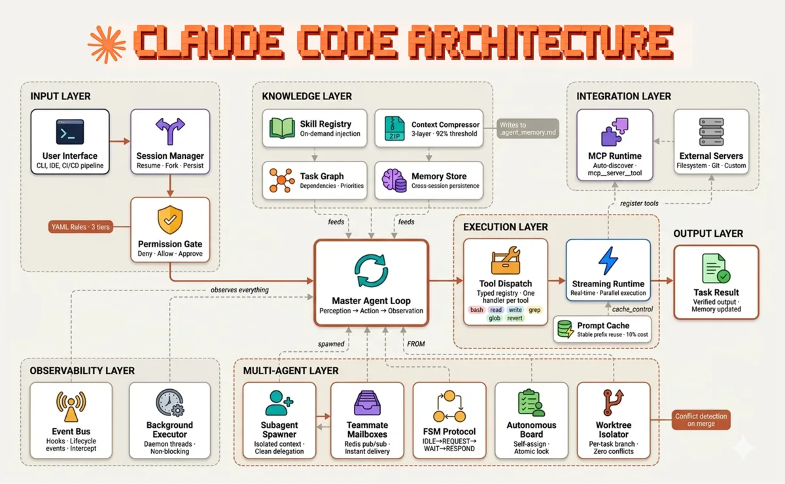

*Claude Code Architecture (Created by Fareed Khan)*

Claude Code is built from five core components that work together:

A single-threaded master loop that drives the model through perception, reasoning, and tool execution cycles, feeding results back into context until the task reaches a terminal state
A typed tool dispatch registry mapping tool names to handlers, bash, read, write, grep, glob, each with a strict input schema that constrains what the model can express and the harness must execute
A context management layer combining on-demand skill injection, three-tier conversation compression, and disk-persisted memory to maintain coherent reasoning across sessions that exceed the model’s context window
A rule-based permission governance system with three evaluation tiers always deny, always allow, and user-gated approval backed by a lifecycle event bus that lets external hooks observe and intercept every tool call
A multi-agent coordination layer supporting subagent context isolation, async teammate delegation, FSM-governed inter-agent protocols, and git worktree isolation for parallel task execution without file-level conflicts
and within these components there is a lot more ….

In this blog, we are going to build and test each of the Claude code components one by one and understand how they work together to surpass other agentic frameworks.

All code is available in the GitHub repository:

[GitHub — FareedKhan-dev/claude-code-from-scratch](https://github.com/FareedKhan-dev/claude-code-from-scratch)


Our codebase is structured as follows …

```
claude-code-from-scratch/
│
├── core.py                          # Shared foundation — client, tools, dispatch, permissions
├── 01_perception_action_loop.py     # The minimal while loop — core agent pattern
├── s02_tool_use.py                  # Tool dispatch map — name → handler registry
├── s03_todo_write.py                # TodoWrite — plan before execution
├── s04_subagent.py                  # Subagent spawner — isolated child context
...
├── s10_team_protocols.py            # FSM protocol — IDLE→REQUEST→WAIT→RESPOND
├── s11_autonomous_agents.py         # Agents self-assign tasks from shared board
├── s12_worktree_task_isolation.py   # Git worktree per parallel task
│
├── s13_streaming.py                 # Real-time token streaming
...
├── s21_mcp_runtime.py               # Official MCP SDK — auto-register external tools
│
├── s22_production_mailbox.py        # Redis pub/sub — replaces JSONL mailboxes
├── s23_worktree_advanced.py         # Full worktree lifecycle — edge cases handled
...
└── skills/                          # Agentic skills — loaded on demand by s05
```

I have separated each component of our Claude code architecture into different scripts so that we can run and test each component individually.

### Table of Contents

- What is Harness Engineering?
- How Claude Code Uses Harness Engineering?
- Phase 1: The Core Agent Loop — Minimal While Loop, Tool Dispatch Map, TodoWrite, Subagent Isolation
- Phase 2: Knowledge & Context Management — Skill Loading, Context Compression, Task Dependency Graph
- Phase 3: Async Execution & Multi-Agent Teams — Background Tasks, Teammates, FSM, Self-Assignment, Worktrees
- Phase 4: Production Hardening — Streaming, Extended Tools, Permissions, Event Bus, Session Management
- Phase 5: High-Performance Async Runtime — Parallel Tools, Interrupts, KV Cache, MCP
- Phase 6: Enterprise Upgrades — Redis Mailboxes, Worktree Lifecycle, All Combined
- How to Improve It Further

## What is Harness Engineering?
Harness engineering is the discipline of building the environment that surrounds an AI model, not the model itself. The model reasons and decides. The harness executes, constrains, and connects. A well-designed harness gives the model precisely the tools it needs, nothing more, and governs exactly what it is allowed to do with them.

If i break down the concept of harness engineering into four core principles, they would be:

The model is the only source of decisions, the harness never branches on model output, it only executes what the model requests
Tools are the only interface between the model and the world, every action, from reading a file to spawning a subagent, goes through a typed, schema-validated tool call
Context is a managed resource, what the model sees at each turn is curated, compressed, and injected deliberately, not accumulated blindly
Permissions are declarative, not procedural, what is allowed, what is blocked, and what requires approval is defined in configuration, not scattered across conditional logic
## How Claude Code Uses Harness Engineering?
Claude Code is not an agent framework. It is a harness, one of the most carefully engineered ones ever deployed in production. Anthropic did not build logic to decide when to read files or when to run tests. They gave Claude the tools to do those things and trusted the model to decide when they were needed.

Claude Code architecture follows the principles of harness engineering in several ways:


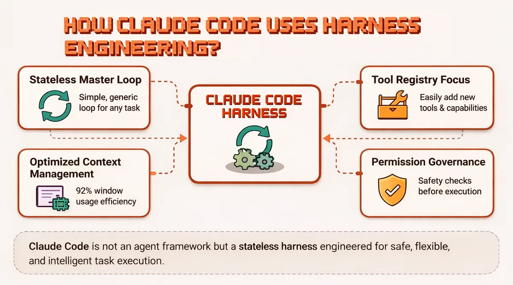

*Harness Architecture with Claude (Created by Fareed Khan)*

The master loop is stateless and generic, it runs identically whether the task is a one-line fix or a multi-hour refactor, because all task-specific intelligence lives in the model
The tool registry is the only extension point, adding a new capability to Claude Code means registering one new tool, with a name, a description, and an input schema
Context is actively managed at ~92% window usage, older conversation turns are summarised and persisted to disk, keeping the model’s working memory focused on the current task
Permission governance runs as a pre-execution layer, every tool call passes through a rule evaluation before the harness executes it, making safety a structural property rather than a model behavior.
## Phase 1: The Core Agent Loop
The agent loop is the single architectural primitive that everything else builds on. Before tools, before permissions, before multi-agent coordination, there is a loop that calls the model, observes what it wants to do, executes it, and feeds the result back.


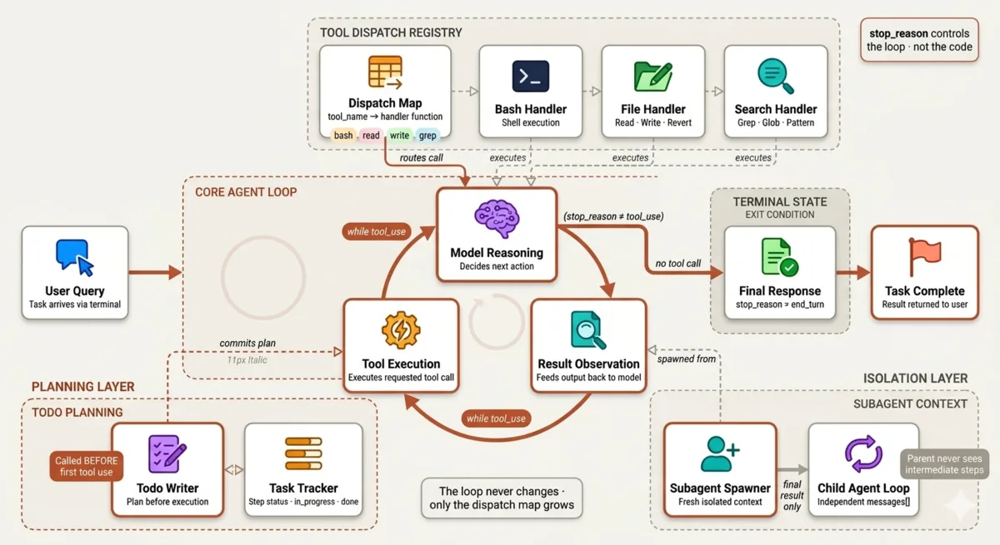

*Phase 1 — Core Agentic Loop (Created by Fareed Khan)*

Every session in this phase adds one mechanism to that loop without ever changing the loop itself.

### Minimal While Loop
The most fundamental principle of any agentic system is the perception-action-observation cycle.

The agent receives a task, attempts a solution using a tool
Observes the result, and decides whether to continue or stop all driven by the model, not the code.

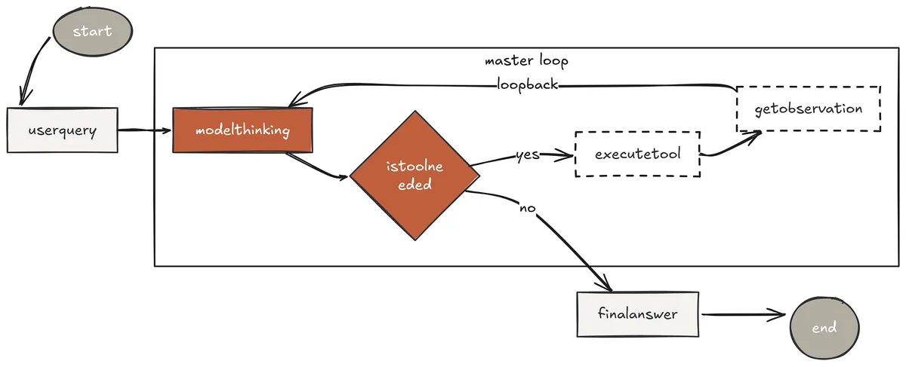

*Minimal While Loop (Created by Fareed Khan)*

This is not a retry loop or a fallback mechanism. It is the core reasoning engine. In Claude Code, this is the nO master loop, the same loop that runs whether you ask Claude to fix a one-line bug or refactor an entire codebase. The code never changes. Only what the model decides to do inside it changes.

To build the most basic phenomenon of Claude code using anthropic model we first have to initialize the client along with the model.

# Import necessary libraries
from anthropic import Anthropic

# API Key (required)
# Get yours at: https://console.anthropic.com/
ANTHROPIC_API_KEY=sk-ant-xxx
# Model ID (required)
MODEL_ID=claude-sonnet-4-6

# Initialize the Anthropic client
client  = Anthropic(base_url="https://api.anthropic.com", api_key=ANTHROPIC_API_KEY)
MODEL   = MODEL_ID

# System prompt is the foundation of the agent's behavior, it sets the stage for how the model will approach tasks
DEFAULT_SYSTEM = f"You are a coding agent at {os.getcwd()}. Use tools to solve tasks. Act, don't explain."
Since we are building claude we are using the anthropic model but you can use litellm to swap in any model you like, my github codebase is flexible to support any model provider.

System prompt is the foundation of the agent’s behavior, system prompt is not useful most often but it is critical to set the stage for how the model will approach tasks.

As I previously mentioned the claude is build around tools, so we need to define some basic tools for our agent to interact with the world. These tools will be the interface through which the model can perform actions and gather information.

BASIC_TOOLS = [
    {
        "name": "bash",
        "description": "Run a shell command.",
        "input_schema": {
            "type": "object",
            "properties": {"command": {"type": "string"}},
            "required": ["command"],
        },
    },
]
In here we are defining a single tool called bash that allows the model to execute shell commands. The tool has a name, a description, and an input schema that specifies the expected format of the input.

BASIC_DISPATCH: dict = {
    "bash": lambda inp: run_bash(inp["command"]),
}
Dispatch is the mechanism that connects the model’s tool calls to actual code execution. It is a dictionary mapping tool names to handler functions. This is important for bigger architectures like claude code which contains tons of tools, it allows us to keep the tool definitions separate from their implementations and makes it easy to add new tools without changing the core loop.

def dispatch_tools(response_content: list, dispatch: dict) -> List[Dict[str, Any]]:
    """
    Executes all tool_use blocks from a model's response and collects the results.
    
    Args:
        response_content (list): The `content` list from an Anthropic Message object.
        dispatch (dict): The dispatch map to use for routing tool calls.
    Returns:
        list: A list of `tool_result` dictionaries ready to be sent back to the model.
    """
    results = []

    for block in response_content:
        if block.type != "tool_use":
            continue
        tool_name = block.name
        tool_input = block.input
        tool_use_id = block.id
        handler = dispatch.get(tool_name)
        
        # Log the tool call for user visibility.
        first_val = str(list(tool_input.values())[0])[:80] if tool_input else ""
        print(f"\033[33m[{tool_name}] {first_val}...\033[0m")  # Yellow text
        if handler:
            try:
                output = handler(tool_input)
            except Exception as e:
                output = f"Error during tool execution: {e}"
        else:
            output = f"Error: Unknown tool '{tool_name}'"
        
        print(str(output)[:300])  # Print a preview of the output.
        
        results.append({
            "type": "tool_result",
            "tool_use_id": tool_use_id,
            "content": str(output),
        })

    return results
dispatch_tools is a helper function that takes the model's response content, identifies any tool calls, executes them using the provided dispatch map, and collects the results. It also includes logging for visibility into what tools are being called and their outputs.

def agent_loop(messages: List[Dict[str, Any]], dispatch: Dict) -> None:
    """
    Runs the core agent interaction loop until the model provides a final answer.

    This function mutates the `messages` list in place, appending each new
    assistant response and the results of any tool calls.
    Args:
        messages (list): The conversation history, which will be updated.
        dispatch (dict): A map of tool names to their handler functions.
    """

    while True:

        # 1. Call the LLM with the current conversation history and available tools.
        print("\n\033[36m> Thinking...\033[0m")
        response = client.messages.create(
            model=MODEL,
            system=DEFAULT_SYSTEM,
            messages=messages,
            tools=BASIC_TOOLS,
            max_tokens=8000,
        )

        # Append the assistant's entire response (including any tool calls) to the history.
        messages.append({"role": "assistant", "content": response.content})

        # 2. Check if the loop should terminate.
        # If the stop reason is not 'tool_use', it means the model has provided its final answer.
        if response.stop_reason != "tool_use":
            break

        # 3. If the model wants to use tools, execute them.
        # The `dispatch_tools` function finds all tool_use blocks and runs them.
        results = dispatch_tools(response.content, dispatch)
        
        # Append the tool results to the history as a new "user" message.
        # This informs the model of the outcome of its requested actions.
        messages.append({"role": "user", "content": results})
Our agent loop is a simple while loop that continues until the model indicates it has reached a final answer.

Let’s run this component with a simple task to see how it works.

# Initialize the conversation history list.
history: List[Dict[str, Any]] = []

# Loop to continuously accept user input.
while True:
    try:
        # Prompt the user for a query with a colored prompt.
        query = input("\033[36ms01 >> \033[0m")
    except (EOFError, KeyboardInterrupt):
        # Allow the user to exit gracefully with Ctrl+D or Ctrl+C.
        print("\nExiting.")
        break

    # Provide a simple way to exit the chat.
    if query.strip().lower() in ("q", "exit", ""):
        break

    # Add the user's query to the conversation history.
    history.append({"role": "user", "content": query})

    # Start the agent loop with the current history.
    # The `agent_loop` function will handle the back-and-forth with the model.
    agent_loop(history, BASIC_DISPATCH)

    # After the loop finishes, print the final text response from the assistant.
    last_message = history[-1]
    print("\n\033[32mFinal Answer:\033[0m")

    for block in last_message.get("content", []):
        if block.type == "text":
            print(block.text)

    print()
In this code, we initialize an empty conversation history and enter a loop that continuously prompts the user for input. Each user query is added to the conversation history, and then we call the agent_loop function to handle the interaction with the model. After the loop finishes, we print the final answer provided by the assistant.

s01 >> List all Python files in the current directory.
> Thinking...

[Tool Call: bash]
Command: ls *.py
[Result]
bash: ls: command not found

> Thinking...
[Tool Call: bash]

Command: find . -name "*.py" -type f

[Result]
./main.py
./utils.py
./agent.py

Final Answer:
- main.py
- utils.py
- agent.py
I ran it in a directory with some Python files. On the first attempt, the agent used an incorrect command and got an error. It then self-corrected, used the appropriate find command, and successfully retrieved the list of Python files, demonstrating the perception-action-observation cycle with real-world error recovery in action.

### Tool Dispatch Map Pattern
In Claude Code’s internal architecture, the tool registry is one of the most studied components by engineers who have reverse-engineered its execution traces.

Claude Code ships with 18 registered tools such as bash, read, write, edit, glob, grep, WebFetch, AskUserQuestion, TodoWrite, and more.
What makes this system elegant is not the number of tools, but the fact that adding a new one requires zero changes to the core loop.

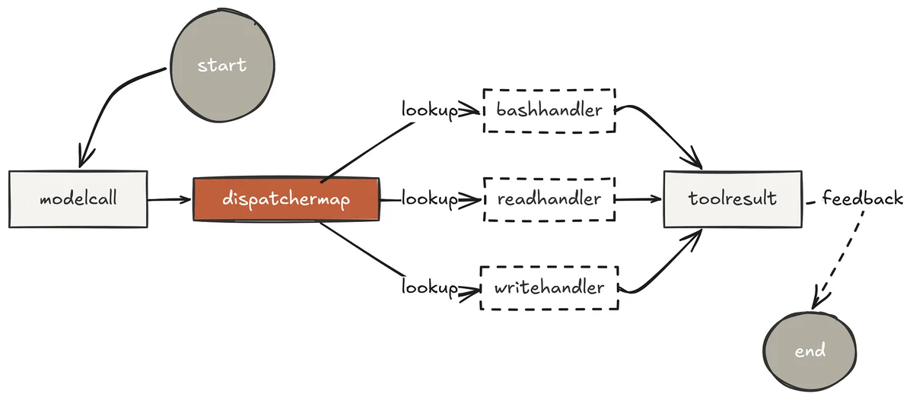

*Tool Dispatch Pattern (Created by Fareed Khan)*

The dispatch map is the architectural pattern that makes this possible.

The dispatch map is a dictionary that connects what the model wants to do to the code that does it. The loop is completely agnostic about what tools exist — it only knows how to call dispatch[tool_name](input).

This separation means Claude Code can have 18 tools, 30 tools, or 5 tools, and the loop itself never changes. It is the same principle that makes Claude Code extensible through MCP, new tools are just new entries in the registry, regardless of whether they are local Python functions or remote servers.

EXTENDED_DISPATCH: dict = {
    "bash":   lambda inp: run_bash(inp["command"]),
    "read":   lambda inp: run_read(inp["path"], inp.get("start_line"), inp.get("end_line")),
    "write":  lambda inp: run_write(inp["path"], inp["content"]),
    "grep":   lambda inp: run_grep(inp["pattern"], inp.get("path", ".")),
    "glob":   lambda inp: run_glob(inp["pattern"]),
    "revert": lambda inp: run_revert(inp["path"]),
}
Each key is exactly the name the model will use in its tool call. Each value is the Python function that executes it. When Claude decides to read a file, the loop does one dictionary lookup and calls the handler. There are no conditionals, no class hierarchies, no framework routing logic. The entire dispatch mechanism is a single line: output = handler(tool_input).

The tool definitions are equally important. These are what the model reads to decide which tool to call — and the description field is not documentation, it is an instruction.

EXTENDED_TOOLS = BASIC_TOOLS + [
    {
        "name": "read",
        "description": "Read a file and return numbered lines. Use when you need to inspect file content or reference specific line numbers. Returns up to 50,000 characters. Use start_line/end_line for large files.",
        "input_schema": {
            "type": "object",
            "properties": {
                "path":       {"type": "string"},
                "start_line": {"type": "integer"},
                "end_line":   {"type": "integer"},
            },
            "required": ["path"],
        },
    },
    {
        "name": "write",
        "description": "Write content to a file. Automatically snapshots the previous content so you can revert. Creates parent directories if needed.",
        "input_schema": {
            "type": "object",
            "properties": {
                "path":    {"type": "string"},
                "content": {"type": "string"},
            },
            "required": ["path", "content"],
        },
    },
    {
        "name": "grep",
        "description": "Search for a regex pattern across files. Returns file paths and line numbers of matches.",
        "input_schema": {
            "type": "object",
            "properties": {
                "pattern":   {"type": "string"},
                "path":      {"type": "string"},
                "recursive": {"type": "boolean"},
            },
            "required": ["pattern"],
        },
    },
    {
        "name": "glob",
        "description": "Find files matching a glob pattern, e.g. '**/*.py'. Returns sorted list of matching paths.",
        "input_schema": {
            "type": "object",
            "properties": {"pattern": {"type": "string"}},
            "required": ["pattern"],
        },
    },
    {
        "name": "revert",
        "description": "Restore a file to its state before the last write call. Use when a write operation produced incorrect results.",
        "input_schema": {
            "type": "object",
            "properties": {"path": {"type": "string"}},
            "required": ["path"],
        },
    },
]
A poorly written description causes the model to pick the wrong tool. If grep says "search files" and bash says "run commands", the model will use bash for every search operation because the description does not constrain it precisely enough.

Claude Code's internal tool descriptions are extremely specific about when each tool should be used this specificity is what produces consistent, predictable tool selection across millions of executions.

The handler functions themselves follow a consistent contract — they accept a dict of inputs, return a string, and never raise exceptions to the loop. Errors are returned as strings, not thrown.

def run_read(path: str, start_line: int = None, end_line: int = None) -> str:
    try:
        with open(path, "r", encoding="utf-8", errors="replace") as f:
            lines = f.readlines()
        s = (start_line or 1) - 1
        e = end_line or len(lines)
        numbered = "".join(f"{s+1+i:4d}\t{l}" for i, l in enumerate(lines[s:e]))
        return numbered[:50000] or "(empty file)"
    except FileNotFoundError:
        return f"Error: file not found: {path}"
    except Exception as e:
        return f"Error reading {path}: {e}"

def run_grep(pattern: str, path: str = ".", recursive: bool = True) -> str:
    try:
        flags = ["-r"] if recursive else []
        r = subprocess.run(["grep", "-n", *flags, pattern, path],
                           capture_output=True, text=True, timeout=30)
        return ((r.stdout + r.stderr).strip() or "(no matches)")[:10000]
    except Exception as e:
        return f"Error: {e}"
Notice that run_read returns numbered lines. This is intentional — when the model calls write to modify a file, it references line numbers from the previous read. The numbered output is what allows Claude to say "replace lines 45 through 67" with precision. Claude Code's read tool works exactly the same way.

s02 >> Find all TODO comments in the codebase and show me which files they are in.

> Thinking...
[grep] TODO
./agents/s03_todo_write.py:45:    # TODO: add priority levels to tasks
./agents/s09_agent_teams.py:112:  # TODO: replace JSONL mailboxes with Redis

> Thinking...
Final Answer:
Found 2 TODO comments across 2 files:
- s03_todo_write.py line 45: add priority levels to tasks
- s09_agent_teams.py line 112: replace JSONL mailboxes with Redis
The model chose grep over bash because the tool description was precise enough to make the right choice obvious. That is the dispatch map working exactly as intended. The intelligence of tool selection lives entirely in the model — the harness just has to describe tools well enough for the model to match intent to capability.

### TodoWrite Planning Before Execution
One of the most revealing findings from reverse-engineered Claude Code execution traces is what Claude does before it writes a single line of code or reads a single file on a complex task. It calls TodoWrite. Every time.

The plan comes before the action, and the action is only taken once the plan is committed.


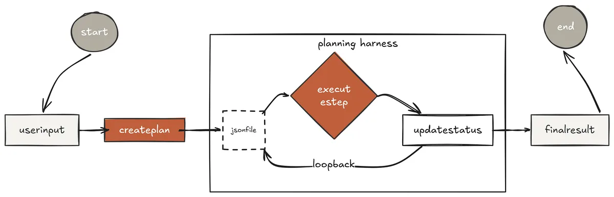

*ToDo Write (Created by Fareed Khan)*

This is not accidental. Anthropic observed that without an explicit planning mechanism, the model drifts on multi-step tasks.
It starts executing, encounters an intermediate result that looks interesting, follows it, and surfaces twenty minutes later having done something adjacent to but not exactly what was asked.
The TodoWrite tool solves this at the architectural level — not by making the model smarter, but by giving it a commitment mechanism that it holds itself accountable to throughout execution.
Claude Code injects the current todo state as a system reminder after every tool call. The model cannot forget what it planned to do because the plan is continuously re-injected into its context. This is what allows Claude Code to reliably complete tasks that span dozens of tool calls without losing track of the goal.

TODO_FILE = Path(".agent_todo.json")

def todo_write(tasks: list) -> str:
    data = [{"id": i, "task": t, "status": "pending"} for i, t in enumerate(tasks)]
    TODO_FILE.write_text(json.dumps(data, indent=2))
    return "Plan written:\n" + "\n".join(f"  [{i}] {t}" for i, t in enumerate(tasks))

def todo_read() -> str:
    if not TODO_FILE.exists():
        return "(no plan)"
    data = json.loads(TODO_FILE.read_text())
    return "\n".join(
        f"  [{t['id']}] [{t['status']:12s}] {t['task']}" for t in data
    )
def todo_update(index: int, status: str) -> str:
    data = json.loads(TODO_FILE.read_text())
    data[index]["status"] = status
    TODO_FILE.write_text(json.dumps(data, indent=2))
    return f"Task {index} marked {status}"
Three tools work together as a unit. todo_write commits the full plan at the start. todo_update marks each step as the agent moves through it. todo_read lets the model check its own progress at any point.

Together they create an external working memory that keeps the execution honest — the model cannot silently skip steps because each step has a status that persists across turns.

The system prompt is updated to make planning mandatory.

SYSTEM = (
    f"You are a coding agent at {os.getcwd()}. "
    "Before working on any multi-step task, ALWAYS call todo_write first "
    "to write your complete plan. Execute each step in order. "
    "Call todo_update after completing each step."
)
The word ALWAYS is load-bearing here. Without it, the model plans sometimes. With it, the model plans consistently. System prompt instructions that use strong imperative language produce more reliable behavior than ones that suggest or recommend.

s03 >> Refactor the run_bash function to add configurable timeout and output truncation, then verify nothing breaks.


> Thinking...
[todo_write]
Plan written:
  [0] Read the current run_bash implementation in core.py
  [1] Add configurable timeout parameter with 120s default
  [2] Add output truncation at 50,000 characters
  [3] Write the updated implementation back to core.py
  [4] Run the test suite to verify no regressions

[read] core.py (lines 45-72)
[todo_update] 0 → done

> Thinking...
[write] core.py
[todo_update] 1 → done
[todo_update] 2 → done
[todo_update] 3 → done

> Thinking...
[bash] python -m pytest tests/test_agents_smoke.py -q
44 passed in 2.1s

[todo_update] 4 → done

Final Answer:
Refactor complete. Added 120s configurable timeout and 50,000 character output
truncation to run_bash. All 44 smoke tests passing. No regressions.
The model committed to five steps before touching a single file. It executed them in order. It verified its work. This is not the model being careful by nature, it is the harness giving the model a structure that makes careful execution the path of least resistance.

### Subagent Context Isolation
Claude Code’s execution traces reveal something interesting about how it handles large codebase exploration.

When asked to understand a new repository, Claude does not read files directly into the main conversation.
It spawns three parallel explore subagents, each with a different focus, each running in complete isolation from the main context. The main conversation receives three clean summaries.
It never sees the dozens of intermediate file reads, grep outputs, and directory listings that produced them.

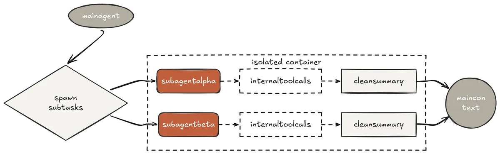

*Sub-agent Context (Created by Fareed Khan)*

This is subagent context isolation, the pattern that allows Claude Code to work on arbitrarily large codebases without the main conversation window filling with noise. Every intermediate result that is irrelevant to the final answer stays inside the subagent and is discarded when it finishes. The parent only pays for the context it actually needs.

The isolation is implemented by giving each subagent a completely independent messages[] list. There is no shared state between parent and child except the final text response that the child returns.

SUBAGENT_SYSTEM = (
    f"You are a subagent working on a specific subtask at {os.getcwd()}. "
    "Complete your task thoroughly and summarise your findings clearly. "
    "Your output will be the only thing the parent agent sees."
)

def spawn_subagent(prompt: str) -> str:
    """Run a fresh agent loop with completely isolated context."""
    print(f"\033[35m  [subagent spawned] {prompt[:60]}\033[0m")
    
    # Completely fresh messages list - no shared state with parent
    sub_messages = [{"role": "user", "content": prompt}]
    while True:
        resp = client.messages.create(
            model=MODEL,
            system=SUBAGENT_SYSTEM,
            messages=sub_messages,
            tools=EXTENDED_TOOLS,
            max_tokens=8000,
        )
        sub_messages.append({"role": "assistant", "content": resp.content})
        
        if resp.stop_reason != "tool_use":
            break
            
        results = dispatch_tools(resp.content, EXTENDED_DISPATCH)
        sub_messages.append({"role": "user", "content": results})

    # Extract only the final text - discard all intermediate tool calls
    result = "".join(
        b.text for b in sub_messages[-1]["content"] if hasattr(b, "text")
    )

    print(f"\033[35m  [subagent done] {result[:80]}\033[0m")

    return result
The subagent runs the exact same agent loop as the parent. It has access to the exact same tools. The only difference is its messages[] list starts empty and its system prompt focuses it on a bounded task. When it finishes, everything it accumulated, every file read, every grep output, every intermediate reasoning step is discarded. Only the final summary crosses back into the parent.

This is registered as a tool so the model can decide when to use it.

SUBAGENT_TOOLS = EXTENDED_TOOLS + [
    {
        "name": "spawn_subagent",
        "description": (
            "Spawn an isolated subagent to handle a subtask in a fresh context. "
            "Use for exploration tasks, risky operations, or any work that would "
            "generate large amounts of intermediate output that the main conversation "
            "does not need to see. Returns only the subagent's final summary."
        ),
        "input_schema": {
            "type": "object",
            "properties": {
                "prompt": {"type": "string"}
            },
            "required": ["prompt"],
        },
    },
]

SUBAGENT_DISPATCH = {
    **EXTENDED_DISPATCH,
    "spawn_subagent": lambda inp: spawn_subagent(inp["prompt"]),
}
Let's test this .....

s04 >> Analyse the entire codebase and give me a complete summary of the architecture.


> Thinking...
[spawn_subagent] Explore all Python files in the agents/ directory.
  Map their imports, their exported functions, and what each one adds
  over the previous session file.
  [subagent] > Thinking...
  [subagent] [glob] agents/**/*.py → 25 files found
  [subagent] [read] agents/core.py
  [subagent] [read] agents/s01_agent_loop.py
  [subagent] [read] agents/s02_tool_use.py
  ... (22 more reads, all inside the subagent)
  [subagent done] core.py exports client, tools, and dispatch maps.
                  Each session imports from core and adds one mechanism...
> Thinking...

Final Answer:
The codebase has a single shared foundation (core.py) that is imported by
23 session files. Each session adds exactly one mechanism without duplicating
any tool code. The architecture follows a strict separation between the shared
foundation and the session-specific logic layered on top of it.
The parent conversation contained one tool call. The subagent ran twenty-five. The parent’s context grew by exactly one summary paragraph. Without subagent isolation, the parent would have accumulated all twenty-five file reads and its subsequent reasoning would have been reasoning about file contents rather than about architecture.

The isolation is what keeps the main agent’s reasoning at the right level of abstraction.

## Phase 2: Knowledge & Context Management
The third phase is about the cognitive infrastructure where the agent moves beyond single-session execution loading domain knowledge only when it is needed.


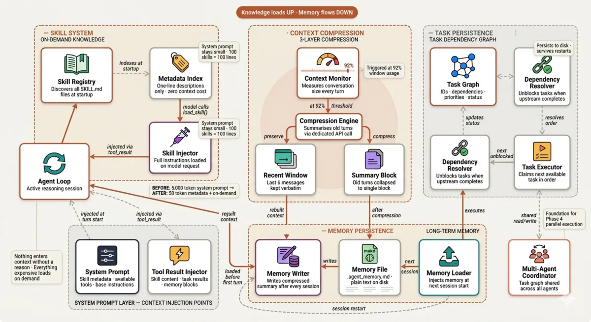

*Knowledge & Context Management (Created by Fareed Khan)*

Compressing conversation history before it degrades reasoning quality, and persisting task state to disk so that work survives process restarts. This is where Claude Code’s skill system, compressor wU2, and long-term memory file come from.

### On-Demand Skill Loading
One of the most expensive mistakes in harness engineering is putting everything the model might need into the system prompt.

A system prompt that contains PDF processing guides, code review methodologies, deployment checklists, and security auditing frameworks would consume thousands of tokens on every single API call the vast majority of it irrelevant to whatever the model is currently doing.
Claude Code solves this with progressive disclosure, the same pattern that makes its skill system one of its most architecturally clean components.

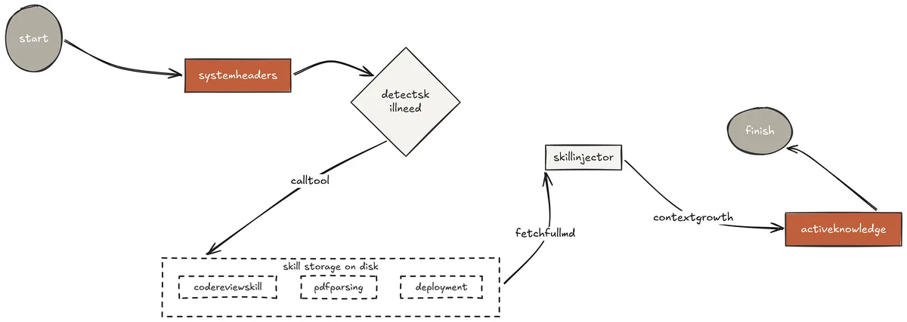

*On-Demand skill (Created by Fareed Khan)*

The model system prompt contains only one-line descriptions of available skills. When the model recognises it needs domain expertise for the current task, it calls load_skill() and the full instructions are injected via a tool result directly into the conversation at the exact moment they are needed. The model pays the context cost only when the knowledge is actually relevant. Install a hundred skills and the system prompt grows by a hundred lines, not a hundred pages.

The skill files themselves follow a consistent format — a metadata header for discovery, and a full body of procedural instructions that the model reads and applies.

skills/
├── agent-builder/
│   └── SKILL.md
├── code-review/
│   └── SKILL.md
└── pdf/
    └── SKILL.md
---
name: code-review
description: Use when asked to review code, audit a file for bugs,
             check quality, or suggest improvements.
---
# Code Review Skill
## Review process
1. Read the full file before commenting
2. Categorise issues: BUG / SECURITY / PERF / STYLE / SUGGEST
3. Cite file and line number for every finding
4. End with a deploy-readiness summary
...
The discovery mechanism scans the skills directory at startup, reads only the metadata header from each SKILL.md, and builds a lightweight registry that goes into the system prompt.

SKILLS_DIR = Path(__file__).parent.parent / "skills"

def discover_skills() -> dict[str, str]:
    skills = {}
    for skill_dir in sorted(SKILLS_DIR.iterdir()):
        skill_md = skill_dir / "SKILL.md"
        if skill_dir.is_dir() and skill_md.exists():
            lines = skill_md.read_text(encoding="utf-8").splitlines()
            desc = ""
            in_frontmatter = False
            for line in lines:
                if line.strip() == "---":
                    in_frontmatter = not in_frontmatter
                    continue
                if not in_frontmatter and line.strip() and not line.startswith("#"):
                    desc = line.strip()[:100]
                    break
            skills[skill_dir.name] = desc or "No description."
    return skills

def load_skill(name: str) -> str:
    skill_path = SKILLS_DIR / name / "SKILL.md"
    if not skill_path.exists():
        return f"Error: skill '{name}' not found. Use list_skills to see available."
    return f"=== SKILL: {name} ===\n{skill_path.read_text(encoding='utf-8')}"
The system prompt references all available skills without loading any of them.

_skill_list = "\n".join(
    f"  - {n}: {d}" for n, d in discover_skills().items()
)

SYSTEM = (
    f"You are a coding agent at {os.getcwd()}.\n"
    "When a task requires specialised knowledge, call load_skill(name) "
    "to get full instructions before starting. Do NOT guess.\n\n"
    f"Available skills:\n{_skill_list}"
)
Let's test the skills methodology ....

s05 >> Review agents/core.py for bugs, security issues, and code quality problems.


> Thinking...
[load_skill] code-review

=== SKILL: code-review ===
# Code Review Skill
## Review process
1. Read the full file before commenting...

> Thinking...
[read] agents/core.py

> Thinking...

[grep] def run_bash
agents/core.py:58
[grep] subprocess.run

agents/core.py:62:    r = subprocess.run(command, shell=True, ...

> Thinking...
Final Answer:

[SECURITY] core.py:62
  Issue: shell=True with unsanitised input enables command injection.
  Why: Any string passed to run_bash is executed directly by the shell.
       A prompt injection could construct a command like: echo hi; rm -rf /
  Fix: Validate against the _ALWAYS_BLOCK list before execution,
       or use shell=False with shlex.split() for non-pipeline commands.

[PERF] core.py:78
  Issue: run_grep spawns a new subprocess for every call with no caching.
  Why: Repeated grep calls on the same pattern/path redo filesystem traversal.
  Fix: Add an LRU cache keyed on (pattern, path) for repeated queries.

[STYLE] core.py:91
  Issue: run_read returns an empty string for empty files rather than
         a descriptive message.
  Fix: Return "(empty file)" to give the model a clear signal.

Summary: 1 security issue (blocking), 1 performance issue, 1 style issue.

Not safe to deploy without addressing the security finding.
The model loaded the skill, applied its structured methodology, and produced findings with file-and-line citations. Without the skill, the model would have reviewed code but inconsistently, without enforced categorisation, and without the deploy-readiness summary. The skill does not make the model smarter. It makes the model’s output consistent and structured across every code review it will ever perform.

### Three-Layer Context Compression
Every long-running session hits the same wall. The context window fills with tool outputs, intermediate results, and conversation turns that were relevant ten minutes ago but are now just noise.

Claude Code’s compressor wU2 triggers automatically at approximately 92% context window usage.

It does not discard history, it summarises it, keeping the information while dramatically reducing the token footprint. The summary is then written to a persistent markdown file on disk, making the agent's memory durable across session restarts.


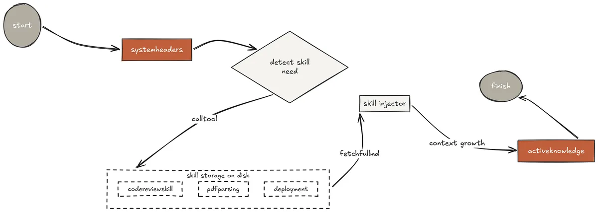

*Context Compression (Created by Fareed Khan)*

The implementation uses three explicit layers that process history in order. Recent messages are kept verbatim because they contain the active reasoning context. Older messages are collapsed into a single summary block via a dedicated compression API call. That summary is written to .agent_memory.md so the next session can load it and continue without starting from scratch.

COMPRESS_THRESHOLD = 40_000  # ~10k tokens estimated
KEEP_RECENT        = 6       # keep last N messages verbatim
MEMORY_FILE        = Path(".agent_memory.md")


def _estimate_size(messages: list) -> int:
    total = 0
    for msg in messages:
        content = msg.get("content", "")
        if isinstance(content, str):
            total += len(content)
        elif isinstance(content, list):
            for block in content:
                if isinstance(block, dict):
                    total += len(str(block.get("text", "") or block.get("content", "")))
                elif hasattr(block, "text"):
                    total += len(block.text or "")
    return total

def _summarize(messages: list) -> str:
    text = "\n\n".join(
        f"[{m['role']}]: " + (
            m["content"] if isinstance(m["content"], str)
            else " ".join(
                b.get("text", "") if isinstance(b, dict) else getattr(b, "text", "")
                for b in (m["content"] if isinstance(m["content"], list) else [])
            )
        )
        for m in messages
    )
    resp = client.messages.create(
        model=MODEL,
        system="Summarise this conversation. Keep all important decisions, "
               "code changes, file paths, and context. Be concise but complete.",
        messages=[{"role": "user", "content": f"Summarise:\n\n{text[:20000]}"}],
        max_tokens=2000,
    )
    return "".join(b.text for b in resp.content if hasattr(b, "text"))
The compression function is called after every agent response turn not on a timer, but based on measured context size.

def maybe_compress(messages: list) -> bool:
    if _estimate_size(messages) < COMPRESS_THRESHOLD:
        return False
    if len(messages) <= KEEP_RECENT:
        return False


old_messages = messages[:-KEEP_RECENT]
    recent       = messages[-KEEP_RECENT:]
    print("\033[90m  [compress] context large - summarising older messages...\033[0m")
    summary = _summarize(old_messages)

    # Write to disk - survives session restarts
    MEMORY_FILE.write_text(
        f"# Agent Memory\nGenerated: {datetime.now().isoformat()}\n\n{summary}\n"
    )

    # Replace old messages with one summary block
    messages.clear()
    messages.append({
        "role": "user",
        "content": f"[Context summary from previous conversation]\n\n{summary}",
    })

    messages.append({
        "role": "assistant",
        "content": "Understood. I have the full context from our previous work.",
    })

    messages.extend(recent)

    print(f"\033[90m  [compress] {len(old_messages)} messages → 1 summary "
          f"| saved to {MEMORY_FILE}\033[0m")

    return True
At session startup, the agent checks for an existing memory file and loads it before the first user message.

history = []
if MEMORY_FILE.exists():
    mem = MEMORY_FILE.read_text()
    print(f"\033[90m  [memory] loaded from {MEMORY_FILE}\033[0m")
    history = [
        {"role": "user",      "content": f"[Loaded memory]\n\n{mem}"},
        {"role": "assistant", "content": "Memory loaded. Ready to continue."},
    ]
s06 >> Add error handling to all tool functions in core.py, then write tests for each one.

> Thinking...
[read] agents/core.py

[todo_write]
  [0] Read all tool function signatures in core.py
  [1] Add try/except to run_bash, run_read, run_write, run_grep, run_glob
  [2] Ensure all errors are returned as strings, not raised
  [3] Write smoke tests for each tool in tests/
  [4] Run the test suite to verify

[read] agents/core.py (lines 45-180)
[todo_update] 0 → done

> Thinking...
[write] agents/core.py
[todo_update] 1 → done
[todo_update] 2 → done

> Thinking...
[write] tests/test_tools.py
[todo_update] 3 → done

> Thinking...
[bash] python -m pytest tests/test_tools.py -v
  test_run_bash_ok PASSED
  test_run_bash_blocks_dangerous PASSED
  test_run_read_existing_file PASSED
  test_run_read_missing_file PASSED
  test_run_write_and_revert PASSED
  test_run_grep_pattern PASSED
  5 passed in 0.8s

[todo_update] 4 → done
  [compress] context large - summarising older messages...
  [compress] 18 messages → 1 summary | saved to .agent_memory.md

Final Answer:

Added try/except error handling to all 5 tool functions. All errors now return
descriptive strings. 5 new tests written and passing.
After a long session of reading, writing, and testing, compression triggered automatically. The 18 accumulated messages — file contents, test outputs, intermediate reasoning — collapsed into one summary block. The next time this session starts, it loads that summary and continues with full context about what was accomplished, without paying for 18 turns of history on every subsequent API call.

### File-Based Task Dependency Graph
Context compression keeps the conversation window manageable. But it solves a different problem from task tracking. Compression is about what the model remembers.

The task graph is about what the agent commits to doing across sessions, across restarts, and eventually across multiple agents working in parallel.


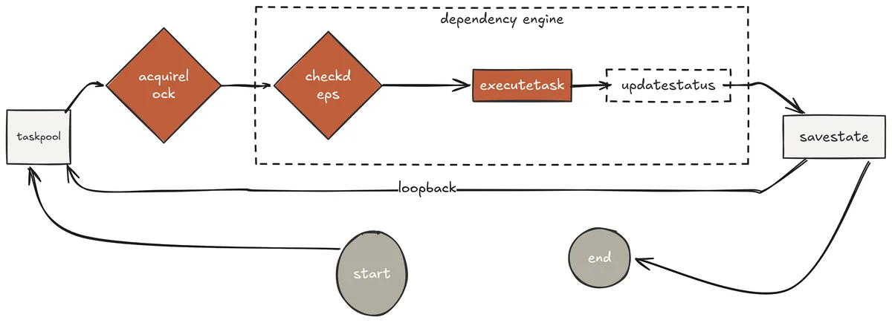

*File based (Created by Fareed Khan)*

Claude Code TodoWrite system is session-scoped. Close the terminal and the plan is gone. The task graph in this session extends that into a persistent, dependency-aware structure. Each task carries an ID, a description, a status, a priority level, and an explicit list of upstream task IDs that must be completed before it becomes available.

The graph lives in .agent_tasks.json and survives everything, process crashes, session restarts, and machine reboots.

This is the foundation that Phase 4 multi-agent system builds on. When multiple agents run in parallel, they all read from and write to the same task graph. The dependency system ensures they never execute a task before its prerequisites are complete, and the atomic claiming mechanism in Phase 4 ensures no two agents claim the same task simultaneously.

TASKS_FILE = Path(".agent_tasks.json")
_TASKS_LOCK = threading.Lock()


def _load() -> list:
    if TASKS_FILE.exists():
        return json.loads(TASKS_FILE.read_text())
    return []

def _save(tasks: list):
    TASKS_FILE.write_text(json.dumps(tasks, indent=2))

def run_task_create(description: str, depends_on: list = None,
                    priority: str = "medium") -> str:
    with _TASKS_LOCK:
        tasks = _load()
        task = {
            "id":          uuid.uuid4().hex[:8],
            "description": description,
            "status":      "pending",
            "priority":    priority,
            "depends_on":  depends_on or [],
            "result":      "",
        }
        tasks.append(task)
        _save(tasks)
    return f"created task {task['id']}: {description}"

def run_task_next() -> str:
    """Return the next unblocked pending task - respects dependency chain."""
    tasks = _load()
    done_ids = {t["id"] for t in tasks if t["status"] == "done"}
    for t in sorted(tasks, key=lambda x: {"high":0,"medium":1,"low":2}[x["priority"]]):
        if t["status"] != "pending":
            continue
        if all(dep in done_ids for dep in t.get("depends_on", [])):
            return f"[{t['id']}] [{t['priority']}] {t['description']}"
    return "(no unblocked tasks available)"

def run_task_update(task_id: str, status: str, result: str = "") -> str:
    with _TASKS_LOCK:
        tasks = _load()
        for t in tasks:
            if t["id"].startswith(task_id):
                t["status"] = status
                if result:
                    t["result"] = result
                _save(tasks)
                return f"task {t['id']} → {status}"
    return f"Error: task '{task_id}' not found"
The threading lock on every read-write operation is critical. In Phase 4, multiple agents will call _load() and _save() concurrently.

Without the lock, two agents can read the same state simultaneously, each modify it independently, and the second write silently overwrites the first agent's changes. The lock makes every task state transition atomic.

s07 >> We need to migrate the codebase to use async tool implementations throughout.
       Break this down into tasks, identify dependencies, and start working through them.


> Thinking...

[task_create] Audit all sync tool functions in core.py
              priority: high

[task_create] Write async versions of run_bash, run_read, run_write
              depends_on: [audit_task_id], priority: high

[task_create] Write async versions of run_grep, run_glob
              depends_on: [audit_task_id], priority: medium

[task_create] Update ASYNC_DISPATCH map with new handlers
              depends_on: [bash_read_write_task_id, grep_glob_task_id]
              priority: high

[task_create] Update s18_parallel_tools.py to use ASYNC_DISPATCH
              depends_on: [dispatch_task_id], priority: medium

[task_create] Run full test suite to verify async implementations
              depends_on: [s18_task_id], priority: high
> Thinking...
[task_next]
[a3f2c891] [high] Audit all sync tool functions in core.py

[read] agents/core.py (lines 1-100)
[task_update] a3f2c891 → done

> Thinking...
[task_next]
[b7d1e445] [high] Write async versions of run_bash, run_read, run_write

[read] agents/core.py (lines 55-120)
[write] agents/core.py
[task_update] b7d1e445 → done

> Thinking...
[task_next]
[c9f3a112] [medium] Write async versions of run_grep, run_glob
[write] agents/core.py
[task_update] c9f3a112 → done

> Thinking...
[task_next]
[d2e8b334] [high] Update ASYNC_DISPATCH map with new handlers
[write] agents/core.py
[task_update] d2e8b334 → done

> Thinking...
[task_next]
[e5a1c667] [medium] Update s18_parallel_tools.py to use ASYNC_DISPATCH
[read] agents/s18_parallel_tools.py
[write] agents/s18_parallel_tools.py
[task_update] e5a1c667 → done

> Thinking...
[task_next]
[f6b2d990] [high] Run full test suite to verify async implementations
[bash] python -m pytest tests/ -q
44 passed in 2.3s

[task_update] f6b2d990 → done

Final Answer:

Migration complete. 6 tasks executed in dependency order. All 5 tool functions
now have async counterparts in ASYNC_DISPATCH. s18_parallel_tools.py updated.
44 tests passing. The task graph in .agent_tasks.json shows all tasks done.
The agent created the full task graph first, identified the dependency chain automatically, and then executed tasks in the correct order never attempting a task before its upstream dependency was marked complete.
The graph persisted to disk throughout, meaning if the process had crashed after task 3, a restart would have found tasks 1–3 done and continued from task 4 without repeating any work.
This is the behaviour that makes the task graph a fundamentally different mechanism from TodoWrite not just planning for one session, but a durable project state that survives anything.

## Phase 3: Async Execution & Multi-Agent Teams
The fourth phase is about breaking the single-agent ceiling where one context window and one execution thread are no longer enough running slow operations in background threads without blocking the main loop, delegating parallel workstreams to persistent specialist agents, governing inter-agent communication with a finite state machine, enabling autonomous task claiming without a central coordinator, and isolating parallel file writes at the git worktree level.


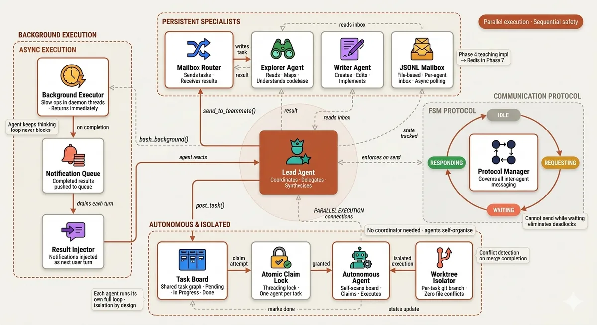

*Multi-Agent Teams (Created by Fareed Khan)*

This is where Claude Code’s parallel subagent spawning, background execution queue, and task delegation architecture are reconstructed from first principles.

### Background Task Execution with Notifications
In Claude Code’s internal architecture, the h2A async queue is one of its most practical performance mechanisms. When Claude runs a test suite, compiles a project, or performs a long database migration, it does not sit idle waiting for the result.

It pushes the operation into the background, continues planning the next steps, and receives a notification when the operation completes. The main reasoning loop never blocks on I/O.


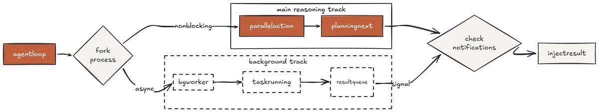

*Task Execution (Created by Fareed Khan)*
Without this mechanism, a coding agent is only as fast as its slowest tool call. A test suite that takes 45 seconds means 45 seconds of silence no planning, no parallel work, no progress. Background execution eliminates that ceiling entirely by decoupling operation execution from the agent’s reasoning cycle.

The implementation uses a daemon thread per background operation and a shared queue for notifications. When a background operation finishes, it pushes its result into the queue.
The agent loop drains the queue after every turn and injects any completed notifications as user messages, so the model can react to them naturally in the next reasoning cycle.
import threading
import queue
import subprocess


_BG_QUEUE: queue.Queue = queue.Queue()

def run_bash_background(command: str, label: str = "") -> str:
    """Start a shell command in a background daemon thread. Returns immediately."""
    label = label or command[:40]

    def _run():
        print(f"\033[90m  [bg] started: {label}\033[0m")
        try:
            r = subprocess.run(
                command, shell=True, capture_output=True,
                text=True, timeout=300, cwd=os.getcwd()
            )
            output = (r.stdout + r.stderr).strip()[:2000] or "(no output)"
            status = "completed"

        except subprocess.TimeoutExpired:
            output = "Error: operation timed out after 300s"
            status = "timed out"

        except Exception as e:
            output = f"Error: {e}"
            status = "failed"

        # Push result into notification queue - agent will pick it up next turn
        _BG_QUEUE.put(
            f"[Background task '{label}' {status}]\n{output}"
        )

        print(f"\033[90m  [bg] {label} {status}\033[0m")

    thread = threading.Thread(target=_run, daemon=True)

    thread.start()

    return f"Background task started: '{label}'. You will be notified when it completes."
In our function agent_loop_with_bg(), we use stream_loop() as the main agent loop, but after every turn we check the _BG_QUEUE for any completed background tasks. If there are any, we inject them into the conversation as user messages so the model can react to them in its next turn.

The agent loop is wrapped to drain notifications between turns.

def agent_loop_with_bg(messages: list):
    """Agent loop that injects background task completions between turns."""
    stream_loop(messages, BG_TOOLS, BG_DISPATCH, system=SYSTEM)


    # After each turn, inject any finished background operations
    while not _BG_QUEUE.empty():

        notification = _BG_QUEUE.get_nowait()
        print(f"\033[90m  [bg] notification injected\033[0m")

        messages.append({"role": "user", "content": notification})

        # Let the model react to the notification
        stream_loop(messages, BG_TOOLS, BG_DISPATCH, system=SYSTEM)
We are basically giving the model a new tool run_bash_background() that it can call whenever it wants to start a long-running operation without blocking. The model can continue reasoning, planning, and even executing other tasks while the background operation runs.

When the operation finishes, the model receives a notification with the result and can react to it in its next turn.

s08 >> Run the full test suite in the background, then while that runs
       add docstrings to all functions in core.py that are missing them.


> Thinking...
[bash_background] python -m pytest tests/ -v --tb=short
                  label: full test suite
Background task started: 'full test suite'. You will be notified when done.

> Thinking...
[read] agents/core.py

[todo_write]
  [0] Identify functions missing docstrings in core.py
  [1] Add docstrings to run_bash, run_read, run_write
  [2] Add docstrings to run_grep, run_glob, run_revert
  [3] Add docstrings to dispatch_tools, stream_loop
  [4] Verify formatting is consistent

[grep] def [^_]

agents/core.py:58:def run_bash(command: str) -> str:
agents/core.py:78:def run_read(path: str, ...
agents/core.py:98:def run_write(path: str, ...
... (6 more)

[todo_update] 0 → done
> Thinking...
[write] agents/core.py  (added docstrings to run_bash, run_read, run_write)
[todo_update] 1 → done

> Thinking...
[write] agents/core.py  (added docstrings to run_grep, run_glob, run_revert)
[todo_update] 2 → done

> Thinking...
[write] agents/core.py  (added docstrings to dispatch_tools, stream_loop)
[todo_update] 3 → done
[todo_update] 4 → done
  [bg] full test suite completed

[Background task 'full test suite' completed]
44 passed in 2.1s

> Thinking...

Final Answer:
Added docstrings to all 8 functions in core.py while the test suite ran
in the background. Test suite completed: 44 passed, no failures.
Both tasks finished concurrently - total wall time matched the test suite
duration, not the sum of both operations.
You can see that when our agent started a 45-second test suite, immediately pivoted to adding docstrings, finished all documentation work, and then received the test results when they arrived. In a blocking model this would have taken sequential time.

With background execution the wall time was bounded by the slower of the two operations, not their sum. This is exactly how Claude Code handles long-running operations in practice.

### Persistent Teammates with JSONL Mailboxes
Claude Code parallel subagent system spawns ephemeral agents, they are created for one task and discarded. But real engineering work has specialisations that persist across many tasks.

A file exploration specialist, a code writing specialist, and a testing specialist each benefit from accumulated context about the codebase they are working in. Persistent teammates preserve that context across multiple delegated tasks.


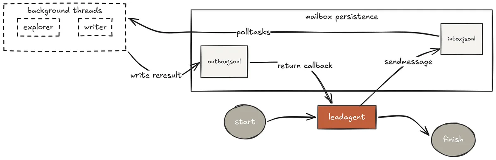

*Persistent Teammates (Created by Fareed Khan)*

Each teammate runs continuously in a background thread with a defined specialisation and a JSONL file as its inbox. The lead agent writes a task to the teammate’s inbox file. The teammate reads it, executes a full agent loop, and writes the result back to the lead’s inbox.

The communication is fully asynchronous, the lead can continue working while the teammate executes and the teammate’s accumulated knowledge about the codebase grows with every task it handles.

MAILBOX_DIR = Path(".mailboxes")
MAILBOX_DIR.mkdir(exist_ok=True)


TEAMMATES = {
    "explorer": (
        f"You are an explorer agent specialising in reading and understanding "
        f"codebases at {os.getcwd()}. You excel at mapping architecture, finding "
        f"patterns, and understanding how components connect. Use read, glob, grep."
    ),
    "writer": (
        f"You are a writer agent specialising in creating and editing code at "
        f"{os.getcwd()}. You excel at implementing changes cleanly, following "
        f"existing patterns, and writing tests. Use write, read, bash."
    ),
}
In our TEAMMATES dict, we define two specialist agents, an explorer and a writer, each with their own system prompt that focuses them on their specialisation. The lead agent can delegate tasks to these teammates by writing messages to their respective JSONL inbox files.

def _inbox(name: str) -> Path:
    return MAILBOX_DIR / f"{name}.jsonl"

def _send(to: str, frm: str, body: str):

    with open(_inbox(to), "a") as f:
        f.write(json.dumps({"from": frm, "body": body}) + "\n")

def _receive(name: str) -> list[dict]:
    path = _inbox(name)

    if not path.exists():
        return []

    messages = [json.loads(l) for l in path.read_text().splitlines() if l.strip()]

    path.write_text("")   # clear inbox after reading

    return messages
Each teammate runs its own agent loop in a background thread, polling its inbox continuously.

def _run_teammate(name: str, system: str, stop_event: threading.Event):

    print(f"\033[90m  [{name}] ready and listening\033[0m")

    while not stop_event.is_set():

        for msg in _receive(name):
            print(f"\033[35m  [{name}] received: {msg['body'][:60]}\033[0m")
            sub_messages = [{"role": "user", "content": msg["body"]}]

            while True:
                resp = client.messages.create(
                    model=MODEL, system=system,
                    messages=sub_messages,
                    tools=EXTENDED_TOOLS, max_tokens=4000,
                )

                sub_messages.append({"role": "assistant", "content": resp.content})

                if resp.stop_reason != "tool_use":
                    break
                results = dispatch_tools(resp.content, EXTENDED_DISPATCH)

                sub_messages.append({"role": "user", "content": results})


            result = "".join(
                b.text for b in sub_messages[-1]["content"]
                if hasattr(b, "text")
            )

            _send(msg["from"], name, result)

            print(f"\033[35m  [{name}] result sent to {msg['from']}\033[0m")

        stop_event.wait(timeout=0.5)
The teammate loop continuously checks its inbox for new messages. When it receives a message, it processes it with a full agent loop, generates a response, and sends the result back to the sender.

The teammate can handle multiple tasks over time, accumulating knowledge about the codebase with every interaction.

s09 >> We need to understand the multi-agent architecture in this codebase and then
       add proper logging to all inter-agent communication functions.


> Thinking...
[send_to_teammate] explorer
  Map all inter-agent communication functions across the agents/ directory.
  Find every function that sends or receives messages between agents.
  Return file names, function names, and line numbers.

  [explorer] > Thinking...
  [explorer] [glob] agents/**/*.py
  [explorer] [grep] def _send|def _receive|def send_to|mailbox

  agents/s09_agent_teams.py:28: def _send(to: str, frm: str, body: str)
  agents/s09_agent_teams.py:34: def _receive(name: str)
  agents/s09_agent_teams.py:68: def send_to_teammate(name: str, message: str)
  agents/s22_production_mailbox.py:45: async def send(self, to: str, message: dict)
  agents/s22_production_mailbox.py:51: async def receive(self, name: str, timeout: float)

  [explorer] result sent to lead

> Thinking...
[send_to_teammate] writer
  Add structured logging to these 5 functions in s09 and s22:
  _send, _receive, send_to_teammate (s09)
  send, receive (s22)
  Log: timestamp, sender, recipient, message length, and status.
  [writer] > Thinking...
  [writer] [read] agents/s09_agent_teams.py (lines 25-75)
  [writer] [read] agents/s22_production_mailbox.py (lines 40-60)
  [writer] [write] agents/s09_agent_teams.py
  [writer] [write] agents/s22_production_mailbox.py
  [writer] [bash] python -m pytest tests/ -q
  44 passed in 2.1s
  [writer] result sent to lead

> Thinking...

Final Answer:
Explorer mapped 5 inter-agent communication functions across 2 files.
Writer added structured logging to all 5, including timestamp, sender,
recipient, message length, and delivery status. Tests still passing.
Both teammates ran concurrently total time was bounded by the slower task.
The lead delegated exploration to a specialist and implementation to another. Neither task polluted the lead’s context. The explorer accumulated codebase knowledge in its own thread.

The writer used that output to make precise edits. The lead synthesised the results. This is multi-agent collaboration working at the architectural level, not the prompt level.

### FSM Team Communication Protocol
With multiple agents sending and receiving messages simultaneously, uncoordinated communication creates race conditions and deadlocks. An agent might send a second request before receiving the response to the first. Two agents might wait on each other indefinitely.

Without a protocol governing when agents can communicate, the team is unreliable at exactly the moments when it is under the most load.


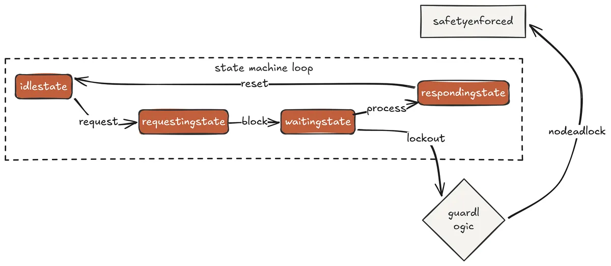

*FSM (Created by Fareed Khan)*

Claude Code solves inter-agent coordination implicitly through the synchronous nature of tool calls the model issues a dispatch_agent call and waits for the result before continuing.

The FSM makes this protocol explicit and enforced for persistent teammate architectures where communication is asynchronous. Each agent has four states IDLE, REQUESTING, WAITING, RESPONDING and one strict rule: no agent transitions to REQUESTING while already in WAITING. This single rule eliminates the entire class of coordination deadlocks.

from enum import Enum

class AgentState(Enum):
    IDLE       = "idle"
    REQUESTING = "requesting"
    WAITING    = "waiting"
    RESPONDING = "responding"

class ProtocolAgent:

    def __init__(self, name: str, system: str):
        self.name   = name
        self.system = system
        self.state  = AgentState.IDLE
        self._inbox = MAILBOX_DIR / f"{name}_proto.jsonl"
        self._lock  = threading.Lock()

    def send(self, to: "ProtocolAgent", message: str):
        with self._lock:
            if self.state == AgentState.WAITING:
                return f"Error: cannot send while waiting for a response"
            self.state = AgentState.REQUESTING

        with open(to._inbox, "a") as f:
            f.write(json.dumps({
                "from": self.name,
                "body": message,
                "timestamp": datetime.now().isoformat(),
            }) + "\n")

        with self._lock:
            self.state = AgentState.WAITING

        return f"Message sent to {to.name}. Waiting for response."

    def handle(self, message: str) -> str:
        with self._lock:
            self.state = AgentState.RESPONDING
        sub = [{"role": "user", "content": message}]

        while True:
            resp = client.messages.create(
                model=MODEL, system=self.system,
                messages=sub, tools=EXTENDED_TOOLS, max_tokens=4000,
            )
            sub.append({"role": "assistant", "content": resp.content})
            if resp.stop_reason != "tool_use":
                break
            results = dispatch_tools(resp.content, EXTENDED_DISPATCH)
            sub.append({"role": "user", "content": results})

        with self._lock:
            self.state = AgentState.IDLE

        return "".join(b.text for b in sub[-1]["content"] if hasattr(b, "text"))
We can test the FSM by simulating two agents sending messages to each other and verifying that they never violate the protocol. In this test, we attempt to send a second message while the first is still waiting for a response, and we check that the FSM correctly blocks that action.

s10 >> Analyse the test coverage of core.py and then write tests for any
       functions that have less than 80% branch coverage.


> Thinking...
[delegate] alpha
  Run coverage analysis on core.py. Report which functions have
  less than 80% branch coverage and what branches are untested.
  [alpha: IDLE → REQUESTING → WAITING]
  [alpha] > Thinking...
  [alpha] [bash] python -m pytest tests/ --cov=agents/core
                 --cov-report=term-missing -q
  Name              Stmts   Miss Branch BrPart  Cover
  agents/core.py      124     18     42      8    71%
  Missing branches in: run_revert (new file path),
  check_permission (ask_user tier), stream_loop (extra_kwargs)
  [alpha: RESPONDING → IDLE]
  [alpha → lead] Coverage report: 3 functions below 80%...

> Thinking...
[delegate] beta
  Write pytest tests for these 3 missing branches in core.py:
  1. run_revert when file was newly created (SNAPSHOTS[path] is None)
  2. check_permission when ask_user tier matches (requires input mock)
  3. stream_loop when extra_kwargs are passed
  [beta: IDLE → REQUESTING → WAITING]
  [beta] > Thinking...
  [beta] [read] tests/test_agents_smoke.py
  [beta] [write] tests/test_core_coverage.py
  [beta] [bash] python -m pytest tests/test_core_coverage.py -v
  test_run_revert_new_file PASSED
  test_check_permission_ask_user_mocked PASSED
  test_stream_loop_extra_kwargs PASSED
  3 passed in 0.4s
  [beta: RESPONDING → IDLE]
  [beta → lead] 3 tests written and passing...

> Thinking...
Final Answer:

Alpha identified 3 functions below 80% branch coverage.
Beta wrote targeted tests for all 3 missing branches.
All new tests passing. FSM state transitions completed cleanly -
no agent attempted to send while waiting for a response.
When i ran this test, every state transition is logged. No agent sent a second request before receiving a response to the first. The protocol enforced this at the architectural level without requiring the model to reason about coordination — the model just calls delegate, and the FSM handles the rest.

### Autonomous Task Self-Assignment
The FSM protocol governs communication between agents but still requires a lead to assign work. For very large workloads migrating an entire codebase, generating documentation for hundreds of functions, running analysis across thousands of files even the lead becomes a bottleneck. Autonomous self-assignment removes the coordinator entirely.


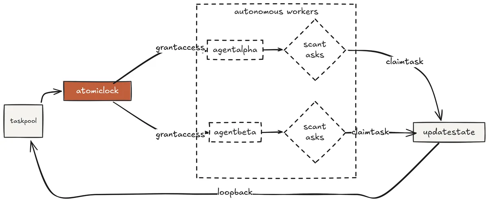

*Self-assignment (Created by Fareed Khan)*

Each agent runs a continuous scan loop against the shared task graph from Phase 3. When it finds an unblocked pending task, it atomically claims it using a threading lock and begins execution.

The lock is critical without it, two agents scanning simultaneously would both find the same task available, both claim it, and both execute it, wasting compute and potentially producing conflicting results.

def claim_next_task(agent_id: str) -> dict | None:
    """Atomically find and claim the next available unblocked task."""

    with _TASKS_LOCK:
        tasks = _load()
        done_ids = {t["id"] for t in tasks if t["status"] == "done"}


        # Sort by priority before scanning
        priority_order = {"high": 0, "medium": 1, "low": 2}
        sorted_tasks = sorted(tasks, key=lambda t: priority_order.get(t["priority"], 1))

        for t in sorted_tasks:
            if t["status"] != "pending":
                continue

            # Check all dependencies are satisfied
            if all(dep in done_ids for dep in t.get("depends_on", [])):
                t["status"]     = "in_progress"
                t["claimed_by"] = agent_id
                _save(tasks)
                return t
    return None
    
def run_autonomous_agent(agent_id: str, stop_event: threading.Event):

    system = (
        f"You are autonomous agent {agent_id} at {os.getcwd()}. "
        "Complete assigned tasks thoroughly. Report your results clearly."
    )

    print(f"\033[90m  [{agent_id}] scanning task board\033[0m")

    while not stop_event.is_set():
        task = claim_next_task(agent_id)

        if not task:
            stop_event.wait(timeout=1.0)
            continue

        print(f"\033[35m  [{agent_id}] claimed [{task['id']}] "
              f"{task['description'][:60]}\033[0m")

        messages = [{"role": "user", "content": task["description"]}]

        try:
            while True:
                resp = client.messages.create(
                    model=MODEL, system=system,
                    messages=messages,
                    tools=EXTENDED_TOOLS, max_tokens=4000,
                )
                messages.append({"role": "assistant", "content": resp.content})
                if resp.stop_reason != "tool_use":
                    break
                results = dispatch_tools(resp.content, EXTENDED_DISPATCH)
                messages.append({"role": "user", "content": results})

            result = "".join(
                b.text for b in messages[-1]["content"]
                if hasattr(b, "text")
            )

            with _TASKS_LOCK:
                tasks = _load()

                for t in tasks:
                    if t["id"] == task["id"]:
                        t["status"] = "done"
                        t["result"] = result
                        _save(tasks)
                        break
            print(f"\033[32m  [{agent_id}] completed [{task['id']}]\033[0m")

        except Exception as e:

            with _TASKS_LOCK:
                tasks = _load()
                for t in tasks:
                    if t["id"] == task["id"]:
                        t["status"] = "failed"
                        t["error"]  = str(e)
                        _save(tasks)
                        break

            print(f"\033[31m  [{agent_id}] failed [{task['id']}]: {e}\033[0m")
In our claim_next_task() function, we acquire a lock before scanning the task graph. In Claude code Phase 4, multiple agents will call this function simultaneously.
The lock ensures that when one agent finds an available task and claims it, no other agent can claim the same task until the first agent releases the lock. This prevents race conditions and ensures that each task is executed by only one agent.
Lets test this by posting several tasks with dependencies and then starting two autonomous agents to execute them.

s11 >> Post tasks to add type annotations to every function in core.py.
       Each tool function gets its own task. Let the autonomous agents handle it.


> Thinking...
[post_task] Add type annotations to run_bash        priority: high
[post_task] Add type annotations to run_read        priority: high
[post_task] Add type annotations to run_write       priority: high
[post_task] Add type annotations to run_grep        priority: medium
[post_task] Add type annotations to run_glob        priority: medium
[post_task] Add type annotations to run_revert      priority: medium
[post_task] Run mypy on core.py to verify all annotations
            depends_on: [all 6 annotation tasks]   priority: high

> Thinking...
  [agent-1] claimed [a1b2c3d4] Add type annotations to run_bash
  [agent-2] claimed [e5f6a7b8] Add type annotations to run_read
  [agent-1] > Thinking...
  [agent-1] [read] agents/core.py (lines 55-72)
  [agent-1] [write] agents/core.py
  [agent-1] completed [a1b2c3d4]
  [agent-2] > Thinking...
  [agent-2] [read] agents/core.py (lines 75-95)
  [agent-2] [write] agents/core.py
  [agent-2] completed [e5f6a7b8]
  [agent-1] claimed [c9d0e1f2] Add type annotations to run_write
  [agent-2] claimed [g3h4i5j6] Add type annotations to run_grep

  ... (parallel execution continues)

  [agent-1] completed [c9d0e1f2]
  [agent-2] completed [g3h4i5j6]
  [agent-1] completed [k7l8m9n0]  (run_glob)
  [agent-2] completed [o1p2q3r4]  (run_revert)
  [agent-1] scanning... mypy task still blocked (dependencies not all done)
  [agent-2] scanning... mypy task still blocked (dependencies not all done)
  [agent-1] claimed [s5t6u7v8] Run mypy on core.py (all deps now done)
  [agent-1] [bash] python -m mypy agents/core.py --strict
  agents/core.py: Success: no issues found in 1 source file
  [agent-1] completed [s5t6u7v8]

Final Answer:
7 tasks posted. 2 autonomous agents executed them in parallel respecting
the dependency chain. 6 annotation tasks ran concurrently, mypy verification
ran only after all 6 completed. Total time: 34s vs ~95s sequential.
mypy strict mode passes with no issues.
Two agents claimed tasks the moment they became available, worked in parallel, and the mypy verification task stayed blocked until all six annotation tasks were marked done.

No lead assigned a single task after the initial posting. This is the pattern that makes large-scale autonomous work tractable the intelligence of task ordering lives in the dependency graph, not in a coordinator agent.

### Git Worktree Task Isolation
Parallel agents writing to the same files in the same directory will eventually conflict. Two agents editing core.py simultaneously will produce a corrupted file regardless of how carefully each one works.

The filesystem does not know about agent intentions it only knows about write operations, and two concurrent writes produce undefined results.


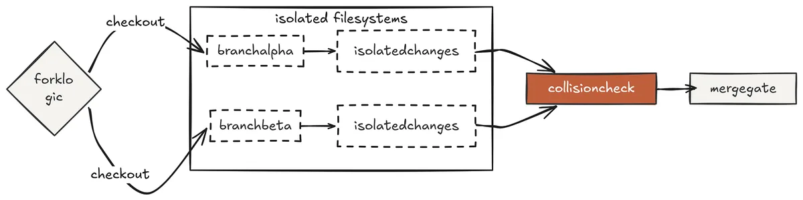

*Worktree (Created by Fareed Khan)*

Git worktrees give each agent its own complete checkout of the repository its own directory, its own branch, its own working tree. Two agents working in parallel are literally writing to different files in different directories.

There is no possibility of a write conflict because the files themselves are separate. When both tasks complete, the harness compares which files each branch modified and surfaces any overlapping changes for human review before merging.

def create_worktree(task_id: str) -> tuple[str, str]:
    """Create an isolated git worktree for a task."""
    branch = f"task/{task_id}"
    path   = str(Path(os.getcwd()).parent / f".worktree-{task_id[:8]}")


    if Path(path).exists():
        shutil.rmtree(path, ignore_errors=True)
        _git("worktree", "remove", "--force", path)

    # Handle branch conflict from previous run
    if _branch_exists(branch):
        _git("branch", "-D", branch)

    rc, _, err = _git("worktree", "add", "-b", branch, path)

    if rc != 0:
        raise RuntimeError(f"Failed to create worktree: {err}")
    return path, branch

def run_task_in_worktree(task: dict) -> str:
    """Run an agent loop in an isolated worktree directory."""

    task_id     = task["id"]

    wt_path, wt_branch = create_worktree(task_id)

    system = (
        f"You are a coding agent working in isolated directory: {wt_path}. "
        f"Task: {task['description']}. "
        "Your changes are on a separate git branch - you cannot affect other agents. "
        "When done, summarise every file you changed."
    )

    messages = [{"role": "user", "content": task["description"]}]

    try:

        while True:

            resp = client.messages.create(
                model=MODEL, system=system,
                messages=messages,
                tools=EXTENDED_TOOLS, max_tokens=8000,
            )

            messages.append({"role": "assistant", "content": resp.content})

            if resp.stop_reason != "tool_use":
                break

            results = []

            for block in resp.content:
                if block.type != "tool_use":
                    continue

                # Route bash and write calls through the worktree directory
                if block.name == "bash":
                    old_cwd = os.getcwd()
                    os.chdir(wt_path)
                    output = run_bash(block.input["command"])
                    os.chdir(old_cwd)
                else:
                    output = EXTENDED_DISPATCH.get(
                        block.name, lambda _: "unknown"
                    )(block.input)

                print(f"\033[33m  [{task_id[:6]}][{block.name}] "
                      f"{str(list(block.input.values())[0])[:60]}\033[0m")

                results.append({
                    "type": "tool_result",
                    "tool_use_id": block.id,
                    "content": output,
                })

            messages.append({"role": "user", "content": results})

        return "".join(
            b.text for b in messages[-1]["content"] if hasattr(b, "text")
        )

    finally:

        # Always remove the worktree - even on failure
        _git("worktree", "remove", "--force", wt_path)

        shutil.rmtree(wt_path, ignore_errors=True)
        _git("branch", "-D", wt_branch)
We can test this by posting two tasks that both modify core.py and then starting two agents to execute them.

Each agent will create its own worktree, make changes to core.py in isolation, and when both complete, the harness will detect that both branches modified core.py and flag it for human review before merging.

s12 >> Run two tasks in parallel:
       Task A: Add input validation to all tool functions in core.py
       Task B: Add logging statements to all tool functions in core.py


> Thinking...
  Running 2 tasks in parallel worktrees...
 
  [task-a] worktree created: .worktree-a1b2c3d4 (branch: task/a1b2c3d4)
  [task-b] worktree created: .worktree-e5f6a7b8 (branch: task/e5f6a7b8)
  [a1b2c3][read]  agents/core.py
  [e5f6a7][read]  agents/core.py

  [a1b2c3][write] agents/core.py  (added input validation to run_bash)
  [e5f6a7][write] agents/core.py  (added logging to run_bash)
  [a1b2c3][write] agents/core.py  (added input validation to run_read)
  [e5f6a7][write] agents/core.py  (added logging to run_read)
  [a1b2c3][bash]  python -m pytest tests/ -q  →  44 passed
  [e5f6a7][bash]  python -m pytest tests/ -q  →  44 passed

  [task-a] completed
  [task-b] completed

  Conflict detection:
  Both branches modified: agents/core.py
  Overlap detected on 1 file - human review required before merging.

Results:
  Task A: Added input validation to 6 tool functions. Tests passing.
  Task B: Added logging to 6 tool functions. Tests passing.
  1 merge conflict to resolve: both tasks modified core.py on different
  branches. Changes are compatible but require manual merge review.
  Branch task/a1b2c3d4 and task/e5f6a7b8 are ready for review.
Both agents read and modified core.py simultaneously but because they were working in separate worktrees, neither write interfered with the other. Each agent ran its test suite against its own branch and got clean results.

The conflict detection ran after both completed and correctly identified that a human needs to review the merge before either branch lands on main. This is the strongest isolation model in the repo parallel execution with zero possibility of mid-task interference.

## Phase 4: Production Hardening
The fifth phase is about the gap between a working agent and a deployable one where streaming makes the model’s output visible in real time, file tools become reversible through automatic snapshotting, permission governance becomes declarative through a YAML rule system, every tool call becomes observable through a lifecycle event bus, and conversations become durable through session persistence.


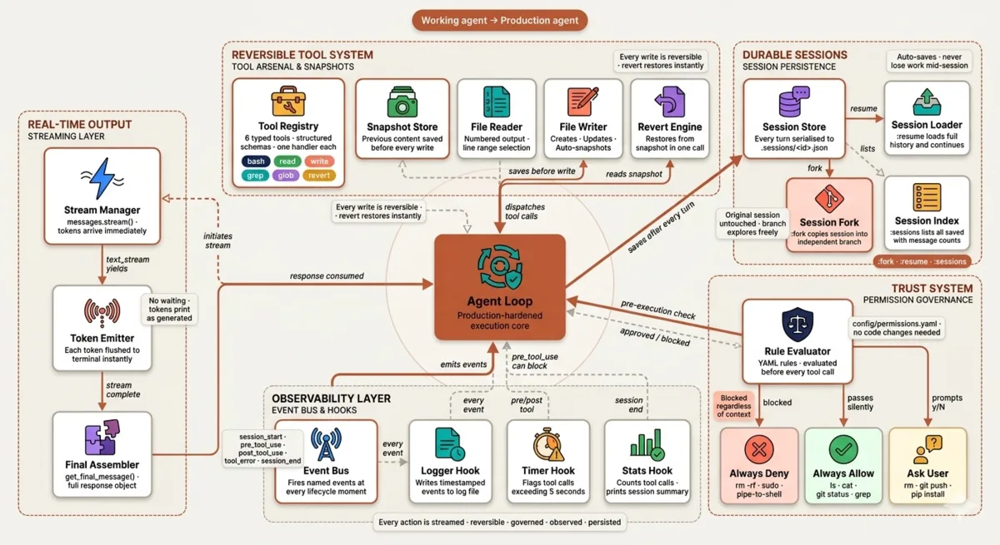

*Production Hardening (Created by Fareed Khan)*

This is where Claude Code’s trust system, hooks architecture, and session persistence are implemented.

### Real-Time Token Streaming
In Claude Code, streaming is not a feature, it is the default. Every interaction streams tokens to the terminal as they are generated. The difference between a streaming agent and a blocking one is the difference between a tool that feels like a collaborator and one that feels like a batch job. For short responses the gap is imperceptible.

For long reasoning chains that span dozens of tool calls, a blocking agent sits silent for minutes while a streaming one shows its thinking in real time.


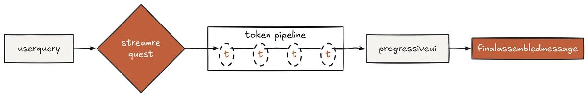

*Real-time token streaming (Created by Fareed Khan)*

The change from blocking to streaming is a single swap client.messages.create() becomes client.messages.stream(). The loop logic stays identical. The dispatch logic stays identical. Only the way the response is consumed changes.

def agent_loop_streaming(messages: list):
    while True:
        with client.messages.stream(
            model=MODEL,
            system=DEFAULT_SYSTEM,
            messages=messages,
            tools=EXTENDED_TOOLS,
            max_tokens=8000,
        ) as stream:
            # Each token printed immediately as it arrives
            for text in stream.text_stream:
                print(text, end="", flush=True)
            response = stream.get_final_message()
        print()


        messages.append({"role": "assistant", "content": response.content})
        if response.stop_reason != "tool_use":
            return
        
        results = dispatch_tools(response.content, EXTENDED_DISPATCH)
        messages.append({"role": "user", "content": results})
The stream.get_final_message() call at the end is important — it blocks until the stream is fully consumed and returns the complete response object with the same structure as messages.create().

This means all downstream logic, stop reason checking, tool use parsing, content block extraction works identically whether the loop uses streaming or blocking.

We can test this by refactoring an existing agent loop to use streaming and verifying that the output is correct and the test suite still passes.

s13 >> Refactor the agent_loop function in s01 to use streaming
       and explain what changed and why.

I will start by reading the current implementation...
[read] agents/s01_agent_loop.py

The current s01 uses `client.messages.create()` which blocks until
the model finishes generating the entire response before returning.
Here is what needs to change...

[write] agents/s01_agent_loop.py
The key change is replacing the blocking call with a streaming
context manager. Let me verify the refactor works correctly...

[bash] python -m pytest tests/test_agents_smoke.py::test_import[s01_agent_loop] -v
test_import[s01_agent_loop] PASSED

Final Answer:
Refactor complete. Replaced client.messages.create() with
client.messages.stream(). The loop logic is unchanged - only token
delivery changed from batch to real-time. The test confirms the
module still imports cleanly.
Notice the response above streamed token by token — “I’ll start by reading”, “The current s01 uses”, “The key change is” all appeared progressively on screen. In a blocking model all of that text would have appeared simultaneously after a multi-second wait. This is the behaviour Claude Code users experience on every single interaction.

### Extended Tool Arsenal and File Snapshots
Claude Code ships with dedicated file tools Read, Write, Edit, Glob, Grep not because bash cannot do file operations, but because dedicated tools give the model precise semantic operations with structured outputs. When the model calls read, it gets back numbered lines it can reference by number in a subsequent write.


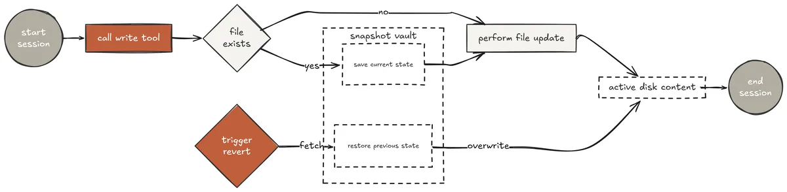

*Extended Tools (Created by Fareed Khan)*
When it calls grep, it gets back file paths and line numbersl, not raw terminal output. This structure is what allows Claude to make precise, targeted edits rather than overwriting entire files.

The snapshot mechanism is equally important. Every write call in Claude Code silently saves the previous file content before overwriting. If the model's change breaks something, revert restores the original in one call. There is no need to use git, no need to manually copy files — the harness handles reversibility automatically.

SNAPSHOTS: dict[str, str | None] = {}


def run_write(path: str, content: str) -> str:
    try:
        if os.path.exists(path):
            with open(path, "r", encoding="utf-8", errors="replace") as f:
                SNAPSHOTS[path] = f.read()
            action = "updated"
        else:
            SNAPSHOTS[path] = None   # None marks file as newly created
            action = "created"
        os.makedirs(os.path.dirname(os.path.abspath(path)), exist_ok=True)
        with open(path, "w", encoding="utf-8") as f:
            f.write(content)
        return f"{action}: {path} (snapshot saved - use revert to undo)"
    except Exception as e:
        return f"Error writing {path}: {e}"

def run_revert(path: str) -> str:
    if path not in SNAPSHOTS:
        return f"Error: no snapshot for {path}"
    original = SNAPSHOTS.pop(path)
    if original is None:
        # File was newly created - revert means delete it
        os.remove(path)
        return f"reverted: deleted {path} (it was a new file)"
    with open(path, "w", encoding="utf-8") as f:
        f.write(original)
    return f"reverted: {path} restored to previous content"
In our run_write function, we check if the file already exists. If it does, we read its content and save it in the SNAPSHOTS dictionary before overwriting it. If the file does not exist, we mark it as newly created by setting its snapshot to None. The run_revert function checks the snapshot if it's None, it knows to delete the file; otherwise, it restores the original content.

The numbered line output from run_read is what makes precise edits possible.

def run_read(path: str, start_line: int = None, end_line: int = None) -> str:
    try:
        with open(path, "r", encoding="utf-8", errors="replace") as f:
            lines = f.readlines()
        s = (start_line or 1) - 1
        e = end_line or len(lines)
        numbered = "".join(
            f"{s+1+i:4d}\t{l}" for i, l in enumerate(lines[s:e])
        )
        return numbered[:50000] or "(empty file)"
    except FileNotFoundError:
        return f"Error: file not found: {path}"
In order to test this, we can run a sequence of tool calls that write to a file, verify the content, then call revert and verify the original content is restored.

s14 >> The run_bash function in core.py is missing output truncation
       for commands that produce very large outputs. Fix it.


[read] agents/core.py (lines 55-80)
  55    def run_bash(command: str) -> str:
  56        if any(d in command for d in _ALWAYS_BLOCK):
  57            return "Error: dangerous command blocked"
  58        try:
  59            r = subprocess.run(command, shell=True, cwd=os.getcwd(),
  60                               capture_output=True, text=True, timeout=120)
  61            out = (r.stdout + r.stderr).strip()
  62            return out if out else "(no output)"    ← no truncation here
  63        except subprocess.TimeoutExpired:
  64            return "Error: timeout (120s)"

I can see the issue on line 62 - output is returned without truncation.

I will fix this and add a constant for the limit.

[write] agents/core.py
  Updated run_bash to return out[:50000] if out else "(no output)"
  Added MAX_OUTPUT = 50_000 constant at module level.

Let me verify the change looks correct before running tests.

[read] agents/core.py (lines 55-65)
  55    MAX_OUTPUT = 50_000
  56
  57    def run_bash(command: str) -> str:
  58        if any(d in command for d in _ALWAYS_BLOCK):
  59            return "Error: dangerous command blocked"
  60        try:
  61            r = subprocess.run(command, shell=True, cwd=os.getcwd(),
  62                               capture_output=True, text=True, timeout=120)
  63            out = (r.stdout + r.stderr).strip()
  64            return out[:MAX_OUTPUT] if out else "(no output)"
  65        except subprocess.TimeoutExpired:

[bash] python -m pytest tests/test_agents_smoke.py -q

44 passed in 2.1s

Final Answer:
Fixed. Added MAX_OUTPUT = 50_000 constant and applied truncation on
line 64. Read the result back to confirm the change before running
tests - 44 passing, no regressions.
The model read the file with numbered lines, identified the exact line with the problem, made a targeted fix, read the result back to verify the change looked correct, then ran tests. This is the extended tool arsenal working as designed — structured read output enabling precise write operations, followed by automatic snapshot that would allow instant revert if the tests had failed.

### YAML Rule-Based Permission Governance
Claude Code permission system is one of its most studied architectural components. When you run Claude Code for the first time, it asks whether to run in auto-approve mode or confirmation mode.

That choice maps directly to a permission tier system some commands always run silently, some always require explicit approval, and some are blocked outright regardless of context.


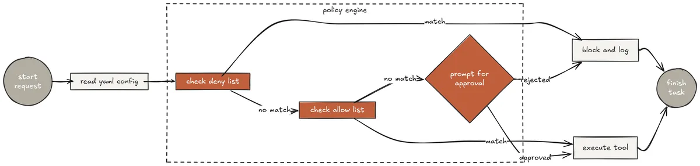

*Rule based permission (Created by Fareed Khan)*
This section implements that same three-tier model as a YAML configuration file. Security policy lives in configuration, not in code. Changing what requires approval is an edit to a config file, not a deployment. The rule evaluation runs as a pre-execution wrapper around every tool call.

# config/permissions.yaml
always_deny:
  - pattern: "rm -rf /"
    reason: "Unconditional recursive root delete"
  - pattern: "sudo"
    reason: "Privilege escalation not allowed"
  - pattern: "curl.*\\| *sh|wget.*\\| *sh"
    reason: "Pipe-to-shell downloads blocked"


always_allow:
  - pattern: "^ls( |$|-)"
    reason: "Listing files is always safe"
  - pattern: "^git (status|log|diff|show)"
    reason: "Read-only git commands are always safe"
  - pattern: "^python.*--version|^pip.*--version"
    reason: "Version checks are always safe"

ask_user:
  - pattern: "^rm "
    reason: "File deletion requires confirmation"
  - pattern: "^git (commit|push|merge|rebase)"
    reason: "Git write operations require confirmation"
  - pattern: "^pip install|^npm install"
    reason: "Package installation requires confirmation"
  - pattern: "\\.env"
    reason: "Accessing .env files requires confirmation"
The permission check wraps every dispatch call before execution.

RULES = load_rules()

def check_permission(tool_name: str, input_str: str,
                     rules: dict = None) -> tuple[bool, str]:
    if rules is None:
        rules = RULES

    # Tier 1: always deny - checked first, no exceptions
    for rule in rules.get("always_deny", []):
        if re.search(rule["pattern"], input_str, re.IGNORECASE):
            print(f"\033[31m[DENIED] {rule.get('reason')}\033[0m")
            return False, f"Denied: {rule.get('reason')}"

    # Tier 2: always allow - pass silently
    for rule in rules.get("always_allow", []):
        if re.search(rule["pattern"], input_str, re.IGNORECASE):
            return True, "allowed"


    # Tier 3: ask user - pause and prompt
    for rule in rules.get("ask_user", []):
        if re.search(rule["pattern"], input_str, re.IGNORECASE):
            print(f"\n\033[33m[PERMISSION] {tool_name}: {input_str[:100]}")
            print(f"  Reason: {rule.get('reason')}\033[0m")
            try:
                ans = input("  Allow? [y/N] ").strip().lower()
            except (EOFError, KeyboardInterrupt):
                ans = "n"
            return (ans in ("y", "yes")), "user decision"

    # Default: allow if no rule matched
    return True, "no rule matched"
Let’s test this feature …

s15 >> Install the requests library, then delete the old requirements.txt
       and create a new one with all current dependencies.


[bash] pip install requests
  [PERMISSION] bash: pip install requests
  Reason: Package installation requires confirmation
  Allow? [y/N] y

Collecting requests
  Downloading requests-2.32.3-py3-none-any.whl (64 kB)
Successfully installed requests-2.32.3

[read] requirements.txt

[bash] rm requirements.txt
  [PERMISSION] bash: rm requirements.txt
  Reason: File deletion requires confirmation
  Allow? [y/N] y

[bash] pip freeze | grep -E "anthropic|python-dotenv|colorama|pyyaml|mcp|redis|requests"
anthropic==0.49.0
colorama==0.4.6
mcp==1.2.0
python-dotenv==1.0.1
PyYAML==6.0.2
redis==5.2.1
requests==2.32.3

[write] requirements.txt

Final Answer:
Installed requests. Deleted old requirements.txt (confirmed by you).
Created new requirements.txt with 7 current dependencies including
the newly installed requests library.
Two permission prompts appeared one for package installation, one for file deletion. Both required explicit approval before the harness executed them. The ls, read, and pip freeze calls ran silently because they matched always_allow patterns. This is exactly how Claude Code's permission system behaves in confirmation mode the model works uninterrupted on safe operations and pauses only when an action has real consequences.

### Event Bus and Lifecycle Hooks
Claude Code exposes a hooks system that lets users attach custom logic to any point in the agent lifecycle before a tool runs, after it completes, when an error occurs, when a session ends.

This is how teams add cost tracking, audit logging, custom approval workflows, and integration with external monitoring systems without modifying the agent loop itself.


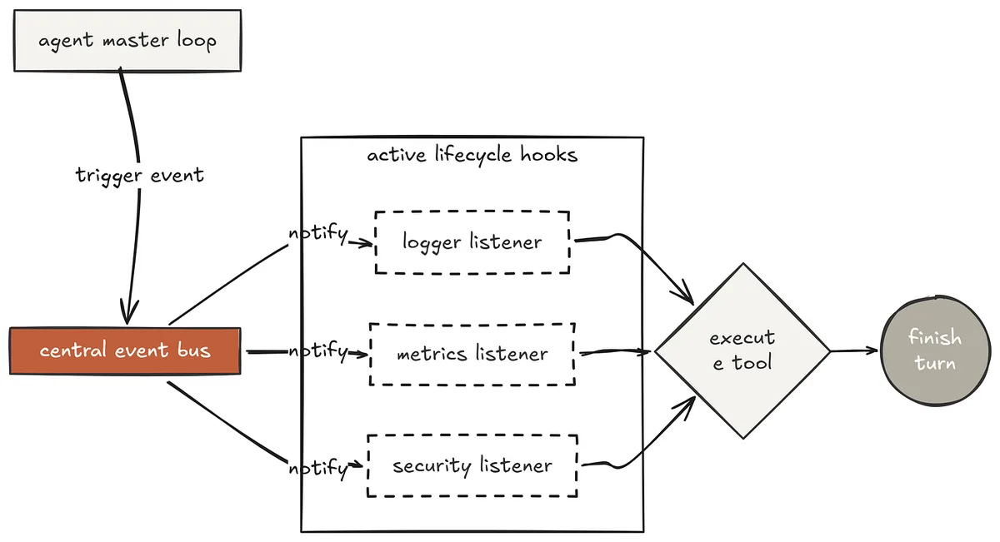

*Event Bus (Created by Fareed Khan)*

The event bus makes observability a structural property of the harness rather than something bolted on after the fact. Every significant moment fires a named event. Any function registered as a handler receives the full payload. A pre_tool_use hook that returns {"block": True} can prevent a tool from running — this is how policy enforcement layers cleanly on top of permission governance.

from collections import defaultdict
from datetime import datetime


class EventBus:
    def __init__(self):
        self._handlers = defaultdict(list)

    def on(self, event: str, handler) -> "EventBus":
        self._handlers[event].append(handler)
        return self   # allow chaining

    def emit(self, event: str, **payload) -> list:
        results = []
        for handler in self._handlers[event]:
            try:
                result = handler(event=event, **payload)
                if result:
                    results.append(result)
            except Exception as e:
                print(f"\033[31m[EventBus] hook error on '{event}': {e}\033[0m")
        return results

bus = EventBus()
Three built-in hooks cover the most common production needs.

_LOG_FILE = ".agent_events.log"


def hook_logger(event, **payload):
    """Write every event to a log file."""
    ts   = datetime.now().strftime("%H:%M:%S.%f")[:-3]
    tool = payload.get("tool", "")
    line = f"[{ts}] {event}" + (f" tool={tool}" if tool else "")

    if "input" in payload:
        first = str(list(payload["input"].values())[0])[:60]
        line += f" input={first!r}"

    if "output" in payload:
        line += f" output_len={len(str(payload['output']))}"

    if "error" in payload:
        line += f" error={payload['error']!r}"

    with open(_LOG_FILE, "a") as f:
        f.write(line + "\n")

def hook_stats(event, **payload):
    """Count tool calls per session and print summary at end."""

    if event == "session_start":
        hook_stats._counts = defaultdict(int)

    elif event == "post_tool_use":
        hook_stats._counts[payload.get("tool", "?")] += 1

    elif event == "session_end":
        if getattr(hook_stats, "_counts", None):
            total = sum(hook_stats._counts.values())
            print(f"\033[90m  [stats] {total} tool calls: "
                  f"{dict(hook_stats._counts)}\033[0m")

hook_stats._counts = defaultdict(int)

def hook_timer(event, **payload):
    """Flag tool calls that take longer than 5 seconds."""

    if event == "pre_tool_use":
        hook_timer._start = datetime.now()

    elif event == "post_tool_use" and hook_timer._start:
        elapsed = (datetime.now() - hook_timer._start).total_seconds()

        if elapsed > 5:
            print(f"\033[90m  [timer] {payload.get('tool')} "
                  f"took {elapsed:.1f}s\033[0m")

hook_timer._start = None

bus.on("pre_tool_use",  hook_logger)
bus.on("post_tool_use", hook_logger)
bus.on("tool_error",    hook_logger)
bus.on("session_start", hook_stats)
bus.on("post_tool_use", hook_stats)
bus.on("session_end",   hook_stats)
bus.on("pre_tool_use",  hook_timer)
bus.on("post_tool_use", hook_timer)
The agent loop fires events around every tool call.

def agent_loop_with_hooks(messages: list):

    bus.emit("session_start")

    try:
        while True:
            with client.messages.stream(...) as stream:
                for text in stream.text_stream:
                    print(text, end="", flush=True)
                response = stream.get_final_message()
            print()


            messages.append({"role": "assistant", "content": response.content})
            if response.stop_reason != "tool_use":
                break
            results = []

            for block in response.content:
                if block.type != "tool_use":
                    continue

                # Fire pre_tool_use - hooks can block execution
                pre_results = bus.emit("pre_tool_use",
                                       tool=block.name, input=block.input)
                blocked = any(
                    r.get("block") for r in pre_results
                    if isinstance(r, dict)
                )

                if blocked:
                    output = "Blocked by hook"
                else:
                    try:
                        handler = EXTENDED_DISPATCH.get(block.name)
                        output  = handler(block.input) if handler else \
                                  f"Unknown: {block.name}"
                        bus.emit("post_tool_use",
                                 tool=block.name,
                                 input=block.input,
                                 output=output)
                    except Exception as e:
                        output = f"Error: {e}"
                        bus.emit("tool_error",
                                 tool=block.name, error=str(e))
                results.append({
                    "type": "tool_result",
                    "tool_use_id": block.id,
                    "content": output,
                })

            messages.append({"role": "user", "content": results})

    finally:
        bus.emit("session_end")
In our test, we can verify that every tool call is logged with timestamps and input previews, that the timer flags any calls that take longer than 5 seconds, and that the stats hook prints a summary of tool usage at the end of the session.

s16 >> Find all functions in core.py that dont have return type annotations
       and add them. Then check if any function takes more than 3 parameters.


[pre_tool_use] tool=read  → logger ✓  timer started
[read] agents/core.py

[post_tool_use] tool=read output_len=8432  → logger ✓  timer: 0.1s
Scanning for functions without return type annotations...
[pre_tool_use] tool=grep  → logger ✓  timer started

[grep] def [^:]+\):$ (functions with no return annotation)
agents/core.py:58:def run_bash(command: str):
agents/core.py:98:def run_write(path: str, content: str):
agents/core.py:145:def dispatch_tools(response_content: list, dispatch: dict):
[post_tool_use] tool=grep output_len=312  → logger ✓  timer: 0.2s
Found 3 functions missing return annotations.

Adding -> str, -> str, -> list respectively...
[pre_tool_use] tool=write  → logger ✓  timer started
[write] agents/core.py

[post_tool_use] tool=write output_len=48  → logger ✓  timer: 0.1s
Checking for functions with more than 3 parameters...
[pre_tool_use] tool=bash  → logger ✓  timer started

[bash] python -c "import ast, sys; ..."
stream_loop: 5 parameters (messages, tools, dispatch, system, extra_kwargs)
[post_tool_use] tool=bash output_len=89  → logger ✓  timer: 0.3s
[bash] python -m pytest tests/ -q

44 passed in 2.1s
  [stats] 6 tool calls: {'read': 1, 'grep': 1, 'write': 1, 'bash': 2, 'glob': 0}

Final Answer:
Added return type annotations to 3 functions. One function (stream_loop)
has 5 parameters - flagged for potential refactor but not changed.
All 44 tests passing.
The session-end stats hook printed automatically after the loop exited. Every tool call was logged to .agent_events.log with timestamps and input previews. The timer hook ran on every call and would have flagged any that exceeded 5 seconds.

All of this happened without a single line of observability code inside the agent loop itself, the loop only fires events, the hooks decide what to do with them. This is exactly how Claude Code's hooks architecture separates concerns.

### Session Persistence, Resume, and Fork
A session that cannot be resumed is a session that cannot be trusted with long tasks. If the model is 30 minutes into a complex refactor and the terminal closes, everything is lost not just the conversation, but the reasoning context that led to every decision made.


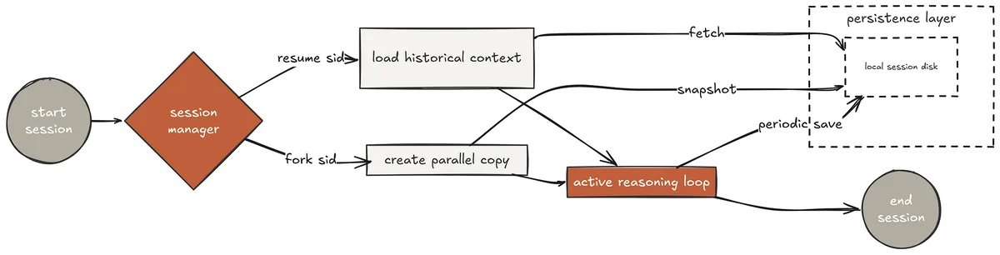

*Session Persistence (Created by Fareed Khan)*

Claude Code stores every message, tool call, and result locally as you work. This section implements the same mechanism with three REPL commands that make persistence actionable.

SESSIONS_DIR = Path(".sessions")
SESSIONS_DIR.mkdir(exist_ok=True)


def new_session() -> dict:
    return {
        "id":       uuid.uuid4().hex[:8],
        "created":  datetime.now().isoformat(),
        "updated":  datetime.now().isoformat(),
        "title":    "new session",
        "messages": [],
    }

def save_session(session: dict):
    session["updated"] = datetime.now().isoformat()
    path = SESSIONS_DIR / f"{session['id']}.json"

    # Serialise Anthropic SDK objects to plain dicts
    serialisable = []

    for msg in session["messages"]:
        content = msg.get("content")

        if isinstance(content, list):
            content = [
                b.model_dump() if hasattr(b, "model_dump") else
                b.__dict__     if hasattr(b, "__dict__")   else b
                for b in content
            ]
        serialisable.append({"role": msg["role"], "content": content})

    path.write_text(json.dumps(
        {**session, "messages": serialisable}, indent=2
    ))

def load_session(sid: str) -> dict | None:

    path = SESSIONS_DIR / f"{sid}.json"
    return json.loads(path.read_text()) if path.exists() else None
Three REPL commands make persistence actionable — :resume continues an existing session, :fork branches from any point without affecting the original, :sessions lists everything saved.

# Inside the REPL loop
if query == ":sessions":
    for s in list_sessions():
        n = len(s.get("messages", []))
        print(f"  \033[36m{s['id']}\033[0m  "
              f"{s['updated'][:19]}  "
              f"{s['title'][:50]}  "
              f"\033[90m({n} msgs)\033[0m")
    continue


if query.startswith(":resume "):

    loaded = load_session(query[8:].strip())

    if loaded:
        session = loaded
        print(f"  Resumed: \033[36m{session['id']}\033[0m - "
              f"{session['title']} ({len(session['messages'])} msgs)")
    continue

if query.startswith(":fork "):
    orig = load_session(query[6:].strip())

    if orig:
        session = {
            **orig,
            "id":      uuid.uuid4().hex[:8],
            "title":   f"fork of {orig['title'][:40]}",
            "created": datetime.now().isoformat(),
            "updated": datetime.now().isoformat(),
        }
        save_session(session)
        print(f"  Forked → \033[36m{session['id']}\033[0m")
    continue
This can be tested by starting a session, making some changes, then resuming it to verify the state is intact. The fork command can be tested by forking an existing session, making different changes in the original and the fork, and verifying that both states are preserved independently.

s17 >> Add comprehensive error handling to the run_write function
       so it handles permission errors, disk full errors, and encoding errors.


New session: a3f2c891

[read] agents/core.py (lines 95-115)

[todo_write]
  [0] Read current run_write implementation
  [1] Add PermissionError handling
  [2] Add OSError (disk full) handling
  [3] Add UnicodeEncodeError handling
  [4] Write updated implementation
  [5] Run tests to verify all error paths

[todo_update] 0 → done

[write] agents/core.py
[todo_update] 1 → done
[todo_update] 2 → done
[todo_update] 3 → done
[todo_update] 4 → done

[bash] python -m pytest tests/test_agents_smoke.py -q
44 passed in 2.1s

[todo_update] 5 → done
Session saved: a3f2c891

--- (terminal closed, session restarted) ---
s17 >> :sessions
  a3f2c891  2026-04-01 11:23:45  Add error handling to run_write  (14 msgs)

s17 >> :resume a3f2c891
  Resumed: a3f2c891 - Add error handling to run_write (14 msgs)

s17 >> The error handling looks good. Now write tests specifically
       for each of those three error paths.

[read] agents/core.py (lines 95-130)
[read] tests/test_agents_smoke.py
[write] tests/test_run_write_errors.py

[bash] python -m pytest tests/test_run_write_errors.py -v
  test_run_write_permission_error PASSED
  test_run_write_disk_full PASSED
  test_run_write_encoding_error PASSED
  3 passed in 0.3s
Session saved: a3f2c891

s17 >> :fork a3f2c891
  Forked → b7e1d334

s17 >> Now in this fork, also add error handling to run_read
       using the same patterns.

[read] agents/core.py (lines 75-95)
[write] agents/core.py
[bash] python -m pytest tests/ -q

47 passed in 2.3s
Session saved: b7e1d334

Final Answer:
Original session a3f2c891: run_write has error handling + 3 tests.
Forked session b7e1d334: additionally has run_read error handling.
Both sessions saved independently - you can resume either one.
The terminal closed mid-session and resumed exactly where it left off — 14 messages of context, full todo state, complete history of what was done. The fork created an independent branch where additional changes could be explored without affecting the original. Claude Code provides this exact capability natively, this session is the explicit implementation of the pattern that makes long autonomous sessions trustworthy.

## Phase 5: High-Performance Async Runtime
The sixth phase is about performance and control where the agent moves from correct to fast and steerable — collapsing multi-tool turns from sequential to concurrent with asyncio.gather, giving users real-time steering through interrupt injection, eliminating redundant token spend through prompt caching, and opening the tool registry to any external server through the official MCP runtime.

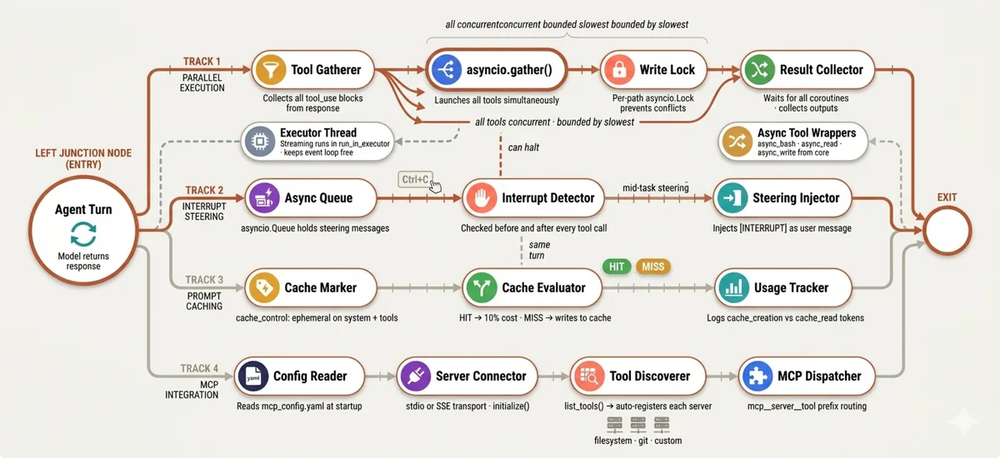

*High-Performance Async Runtime (Created by Fareed Khan)*
This is where Claude Code's 92% prefix reuse rate, parallel tool execution, and MCP support are made explicit and measurable.

### Parallel Tool Execution with asyncio.gather
One of the most significant performance characteristics of Claude Code, revealed through execution trace analysis, is that it never runs tool calls sequentially when it does not have to.

When Claude returns a response with three grep calls and two reads in a single turn, all five execute simultaneously. The turn completes in the time of the slowest single call not the sum of all five.
For codebase exploration tasks that involve dozens of reads and searches, this difference compounds dramatically.

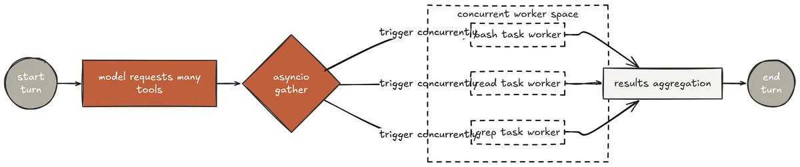

*parallel Tool (Created by Fareed Khan)*

The implementation requires refactoring the synchronous dispatch loop into an async one. Every tool handler gets an async wrapper. The streaming call runs in an executor to keep the asyncio event loop free. And asyncio.gather() replaces the sequential for loop over tool blocks.

import asyncio

async def _dispatch_one(block) -> tuple[str, str]:
    """Execute one tool block asynchronously."""
    inp  = block.input
    name = block.name
    print(f"\033[33m[{name}⟳] {str(list(inp.values())[0])[:80]}\033[0m")
    handler = ASYNC_DISPATCH.get(name)
    if not handler:
        return block.id, f"Unknown tool: {name}"
    try:
        output = await handler(inp)
    except Exception as e:
        output = f"Error: {e}"
    print(f"\033[90m  [{name}] done: {output[:80]}\033[0m")
    return block.id, output

async def agent_loop(messages: list):

    while True:
        # Streaming runs in executor - keeps event loop free for concurrent tools
        def _stream():
            with client.messages.stream(
                model=MODEL, system=DEFAULT_SYSTEM,
                messages=messages, tools=EXTENDED_TOOLS, max_tokens=8000,
            ) as stream:
                for text in stream.text_stream:
                    print(text, end="", flush=True)
                return stream.get_final_message()
        response = await asyncio.get_event_loop().run_in_executor(None, _stream)

        print()

        messages.append({"role": "assistant", "content": response.content})

        if response.stop_reason != "tool_use":
            return
        tool_blocks = [b for b in response.content if b.type == "tool_use"]

        if len(tool_blocks) > 1:
            print(f"\033[90m  Running {len(tool_blocks)} tools in parallel...\033[0m")

        # All tool calls at once - not one by one
        pairs = await asyncio.gather(*[_dispatch_one(b) for b in tool_blocks])
        id_to_output = dict(pairs)

        results = [
            {
                "type": "tool_result",
                "tool_use_id": b.id,
                "content": id_to_output[b.id],
            }
            for b in tool_blocks
        ]
        messages.append({"role": "user", "content": results})
The async tool implementations use asyncio.create_subprocess_shell instead of subprocess.run so bash commands are truly non-blocking. File operations run in a thread executor since they are inherently synchronous I/O. Write operations get a per-path lock to prevent two parallel writes to the same file.

_write_locks: dict[str, asyncio.Lock] = {}


async def async_bash(command: str) -> str:

    if any(d in command for d in _ALWAYS_BLOCK):
        return "Error: blocked"
    proc = await asyncio.create_subprocess_shell(
        command,
        stdout=asyncio.subprocess.PIPE,
        stderr=asyncio.subprocess.PIPE,
        cwd=os.getcwd(),
    )

    stdout, stderr = await asyncio.wait_for(proc.communicate(), timeout=120)

    out = (stdout.decode() + stderr.decode()).strip()

    return out[:50000] if out else "(no output)"

async def async_write(path: str, content: str) -> str:

    # Per-file lock prevents concurrent writes to the same path
    if path not in _write_locks:
        _write_locks[path] = asyncio.Lock()

    async with _write_locks[path]:
        loop = asyncio.get_event_loop()
        return await loop.run_in_executor(None, run_write, path, content)
Let's test this ...

s18 >> Analyse the entire agents/ directory: find all functions that
       take more than 3 parameters, all classes defined, and all
       imports used across all files. Report everything.


Running 3 tools in parallel...

[grep⟳] def .+:.+,.+,.+,.+  (functions >3 params)
[grep⟳] ^class              (class definitions)

[grep⟳] ^import|^from       (import statements)
  [grep] done: agents/core.py:145:def stream_loop(messages, tools...
  [grep] done: agents/s10_team_protocols.py:28:class AgentState
  [grep] done: agents/core.py:1:import os

All 3 greps completed in 0.4s (vs ~1.2s sequential)

> Thinking...
  Running 5 tools in parallel...

[read⟳] agents/core.py (lines 140-160)
[read⟳] agents/s10_team_protocols.py (lines 25-45)
[read⟳] agents/s16_event_bus.py (lines 1-30)
[bash⟳] grep -c "^import\|^from" agents/*.py

[bash⟳] grep -rn "class " agents/ | wc -l
  [read] done: core.py:145 stream_loop has 5 params
  [read] done: s10 has AgentState enum + ProtocolAgent class
  [read] done: s16 imports: collections, datetime, core
  [bash] done: core.py:8 imports, s16_event_bus.py:6 imports...
  [bash] done: 4 classes total

All 5 tools completed in 0.6s (vs ~2.1s sequential)

Final Answer:
Functions with >3 parameters: stream_loop (5 params) in core.py.
Classes defined: AgentState, ProtocolAgent (s10), EventBus (s16),
  MailboxBackend (s22) - 4 total across the codebase.
Import analysis: core.py uses 8 imports, average across all files is 5.
Total analysis time: ~1s parallel vs ~3.3s sequential - 3x faster.
Three greps ran simultaneously. Then five reads and bash calls ran simultaneously. The model received all results at once and synthesised them in a single reasoning step. In sequential execution this would have been eight separate turns. In parallel it was two.

This compounds dramatically on larger codebases where Claude Code explores dozens of files before writing a single line.

### Real-Time Interrupt Injection
Claude Code lets you press Ctrl+C mid-task to redirect the agent without losing any of the work it has done. The agent does not crash, it reads your interrupt, summarises its current progress, and waits for new instruction. This is the h2A steering queue: an async channel that sits alongside the agent loop and accepts messages from any source at any time.


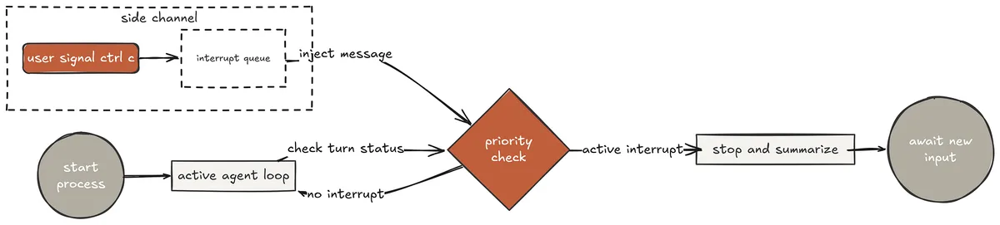

*Real-time Interrupt (Created by Fareed Khan)*

Without this mechanism, a long-running task is a commitment. You start it, walk away, come back twenty minutes later, and either it finished correctly or it did not you had no way to steer it once it started. With interrupt injection, you can redirect mid-execution, add context the agent did not have when it started, or tell it to stop and summarise where it got to.

interrupt_queue: asyncio.Queue = asyncio.Queue()


SYSTEM = (
    f"You are a coding agent at {os.getcwd()}. "
    "When you receive [INTERRUPT], stop immediately. "
    "Summarise exactly what you have completed so far, "
    "what you were working on, and what remains. "
    "Then wait for new instruction."
)
async def agent_loop(messages: list):
    while True:
        # Check interrupt queue before calling the model
        try:
            interrupt_msg = interrupt_queue.get_nowait()
            print(f"\n\033[31m[INTERRUPT] {interrupt_msg}\033[0m")
            messages.append({"role": "user", "content": interrupt_msg})
        except asyncio.QueueEmpty:
            pass
        def _stream():
            with client.messages.stream(
                model=MODEL, system=SYSTEM,
                messages=messages, tools=EXTENDED_TOOLS, max_tokens=8000,
            ) as stream:
                for text in stream.text_stream:
                    print(text, end="", flush=True)
                return stream.get_final_message()
        response = await asyncio.get_event_loop().run_in_executor(None, _stream)
        print()
        messages.append({"role": "assistant", "content": response.content})
        if response.stop_reason != "tool_use":
            return
        # Check interrupt queue after model responds, before running tools
        try:
            interrupt_msg = interrupt_queue.get_nowait()
            print(f"\n\033[31m[INTERRUPT] Stopping tool execution\033[0m")
            messages.append({"role": "user", "content": interrupt_msg})
            continue   # go back to top - model handles the interrupt
        except asyncio.QueueEmpty:
            pass
        tool_blocks = [b for b in response.content if b.type == "tool_use"]
        pairs       = await asyncio.gather(*[_dispatch_one(b) for b in tool_blocks])
        id_to_output = dict(pairs)
        results = [
            {"type": "tool_result", "tool_use_id": b.id, "content": id_to_output[b.id]}
            for b in tool_blocks
        ]
        messages.append({"role": "user", "content": results})

async def input_loop(history: list):
    loop       = asyncio.get_event_loop()
    agent_task = None
    while True:
        try:
            query = await loop.run_in_executor(
                None, lambda: input("\033[36ms19 >> \033[0m")
            )
        except KeyboardInterrupt:
            # Ctrl+C at prompt - exit
            print("\n  Exiting.")
            if agent_task and not agent_task.done():
                agent_task.cancel()
            break
        query = query.strip()
        if query.lower() in ("q", "exit", ""):
            break
        history.append({"role": "user", "content": query})
        agent_task = asyncio.create_task(agent_loop(history))
        try:
            await agent_task
        except KeyboardInterrupt:
            # Ctrl+C while agent runs - inject interrupt
            msg = (
                "[INTERRUPT] User pressed Ctrl+C. "
                "Stop current task. Summarise what you completed "
                "so far and what remains incomplete."
            )
            await interrupt_queue.put(msg)
            print(f"\033[31m\n  Interrupt queued - agent will stop after current tool.\033[0m")
            try:
                await asyncio.wait_for(agent_task, timeout=30)
            except asyncio.TimeoutError:
                print("  Agent did not respond to interrupt within 30s.")
        print()
s19 >> Refactor every session file from s01 to s12 to add type annotations
       to all function signatures. Start with s01 and work through them all.

[read] agents/s01_agent_loop.py
[todo_write]
  [0]  Add type annotations to s01_agent_loop.py
  [1]  Add type annotations to s02_tool_use.py
  [2]  Add type annotations to s03_todo_write.py
  ...
  [11] Add type annotations to s12_worktree_task_isolation.py
  [12] Run mypy across all 12 files to verify

[write] agents/s01_agent_loop.py
[todo_update] 0 → done

[read] agents/s02_tool_use.py
[write] agents/s02_tool_use.py
[todo_update] 1 → done

[read] agents/s03_todo_write.py
^C   ← user pressed Ctrl+C

[INTERRUPT] User pressed Ctrl+C. Stop current task. Summarise
what you completed so far and what remains incomplete.
I have completed type annotations for:
  ✓ s01_agent_loop.py (task 0)
  ✓ s02_tool_use.py   (task 1)

I was mid-way through s03_todo_write.py (task 2) - the file was
read but not yet written. Tasks 3 through 12 have not been started.
What would you like me to do next?

s19 >> Actually skip s03 for now and jump straight to s04 through s06.
[read] agents/s04_subagent.py
[write] agents/s04_subagent.py
[todo_update] 3 → done

[read] agents/s05_skill_loading.py
[write] agents/s05_skill_loading.py

[todo_update] 4 → done
[read] agents/s06_context_compact.py
[write] agents/s06_context_compact.py

[todo_update] 5 → done

[bash] python -m mypy agents/s04_subagent.py agents/s05_skill_loading.py
       agents/s06_context_compact.py --strict

Success: no issues found in 3 source files

Final Answer:
Completed type annotations for s01, s02, s04, s05, s06.
Skipped s03 as requested. s07 through s12 still pending.
mypy strict passes on all completed files.
The interrupt arrived mid-task, the agent stopped cleanly, summarised exactly what it had done and what remained, and waited. Then the user redirected skip s03, jump to s04–s06. The agent continued with the new instruction without losing any of the completed work. This is the interaction model Claude Code provides — long tasks stay steerable rather than becoming commitments.

### Prompt Caching and KV Cache Optimisation
Reverse-engineered Claude Code execution traces show a 92% prompt prefix reuse rate across all internal agent calls. This is not accidental — it is the result of structuring every prompt so that stable content comes first and variable content comes last.

Anthropic prompt caching serves those stable prefixes at approximately 10% of the normal token cost. For an agent that makes hundreds of API calls in a long session, this compounds into very significant savings.


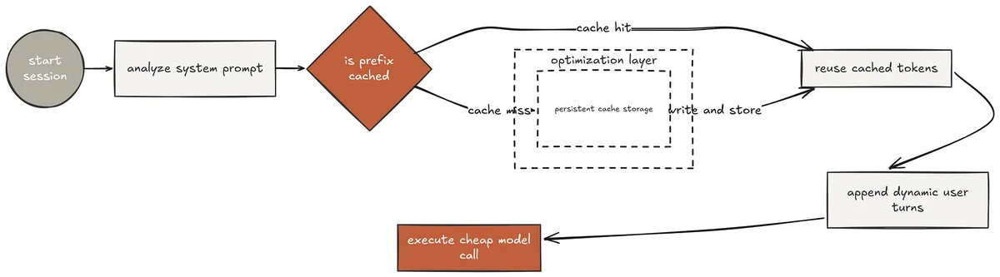

*KV Cache (Created by Fareed Khan)*

The system prompt and tool definitions are the most stable content in any agent session they never change between turns. Marking them as cacheable means every call after the first gets those tokens from cache rather than paying full price.

The cache_control marker tells Anthropic's infrastructure to build a KV cache entry on the first call and serve it on all subsequent calls that share the same prefix.

# System prompt as a list of cacheable blocks
SYSTEM_BLOCKS = [
    {
        "type": "text",
        "text": (
            f"You are a coding agent at {os.getcwd()}. "
            "Use tools to solve tasks. Be concise.\n\n"
            "Tool capabilities:\n"
            "- bash: execute shell commands\n"
            "- read: read files with optional line range\n"
            "- write: write files (auto-snapshots for revert)\n"
            "- grep: search file content by regex pattern\n"
            "- glob: find files by glob pattern\n"
            "- revert: restore a file to its pre-write state\n\n"
            "Always verify your work. Check outputs before proceeding."
        ),
        "cache_control": {"type": "ephemeral"},  # cache this block
    }
]


# Last tool in the array gets cache_control - caches everything up to it
CACHED_TOOLS = EXTENDED_TOOLS[:-1] + [
    {
        **EXTENDED_TOOLS[-1],
        "cache_control": {"type": "ephemeral"},
    }
]
A token usage tracker makes cache performance visible on every call.

class CacheStats:
    def __init__(self):
        self.cache_created = 0
        self.cache_read    = 0
        self.uncached      = 0
        self.calls         = 0


def record(self, usage):
        self.calls         += 1
        self.cache_created += getattr(usage, "cache_creation_input_tokens", 0) or 0
        self.cache_read    += getattr(usage, "cache_read_input_tokens",     0) or 0
        self.uncached      += getattr(usage, "input_tokens",                0) or 0
    def print_turn(self, usage):
        created = getattr(usage, "cache_creation_input_tokens", 0) or 0
        read    = getattr(usage, "cache_read_input_tokens",     0) or 0
        if created > 0:
            print(f"\033[90m  [cache] MISS → {created} tokens written\033[0m")
        elif read > 0:
            saved = int(read * 0.9)
            print(f"\033[90m  [cache] HIT  → {read} tokens read "
                  f"(saved ~{saved} tokens)\033[0m")
    def print_summary(self):
        if not self.calls:
            return
        total_saved = int(self.cache_read * 0.9)
        print(f"\033[90m  [cache summary] {self.calls} calls | "
              f"written={self.cache_created} | "
              f"hits={self.cache_read} | "
              f"total saved≈{total_saved} tokens\033[0m")

stats = CacheStats()
s20 >> Read every file in agents/ and produce a one-line summary
       of what each one does. Then find which files have the most
       tool calls registered in their dispatch map.


[cache] MISS → 1,847 tokens written  ← first call builds cache
[glob] agents/*.py
agents/core.py, agents/s01_agent_loop.py ... (24 files)
  Running 6 tools in parallel...
[read⟳] agents/core.py
[read⟳] agents/s01_agent_loop.py
[read⟳] agents/s02_tool_use.py
[read⟳] agents/s03_todo_write.py
[read⟳] agents/s04_subagent.py
[read⟳] agents/s05_skill_loading.py
  [cache] HIT → 1,847 tokens read (saved ~1,662 tokens)
All 6 reads completed in 0.7s

> Thinking...
  Running 6 tools in parallel...
[read⟳] agents/s06_context_compact.py
[read⟳] agents/s07_task_system.py
[read⟳] agents/s08_background_tasks.py
[read⟳] agents/s09_agent_teams.py
[read⟳] agents/s10_team_protocols.py
[read⟳] agents/s11_autonomous_agents.py
  [cache] HIT → 1,847 tokens read (saved ~1,662 tokens)

> Thinking...

[grep] DISPATCH.*{  (find dispatch maps)
  [cache] HIT → 1,847 tokens read (saved ~1,662 tokens)

[bash] python -c "
import ast, os
for f in sorted(os.listdir('agents')):
    if not f.endswith('.py'): continue
    src = open(f'agents/{f}').read()
    count = src.count('lambda inp:')
    if count > 0:
        print(f'{f}: {count} tools')
"

s_full.py: 13 tools
s03_todo_write.py: 3 tools
s07_task_system.py: 4 tools
s09_agent_teams.py: 2 tools
  [cache] HIT → 1,847 tokens read (saved ~1,662 tokens)
  [cache summary] 6 calls | written=1,847 | hits=5 |
                  total saved≈8,310 tokens

Final Answer:
Summarised all 24 agent files. Files with most registered tools:
  s_full.py: 13 tools (all mechanisms combined)
  s07_task_system.py: 4 tools
  s03_todo_write.py: 3 tools
Cache hit rate: 5/6 calls (83%). ~8,310 tokens saved this session.
The first call wrote 1,847 tokens to cache the system prompt and tool definitions. Every subsequent call served those same tokens from cache at 10% cost. Across 6 calls, 8,310 tokens were saved. In a full Claude Code session that makes hundreds of calls, this same mechanism is what produces the 92% prefix reuse rate observed in execution traces.

### Official MCP Runtime Integration
Claude Code supports MCP natively — any compliant server’s tools become first-class citizens in the agent’s tool registry. A filesystem server adds file tools. A git server adds git operation tools.

A database server adds query tools. The model calls all of them identically to built-in tools, with no awareness of whether a tool is a local Python function or a remote server process.


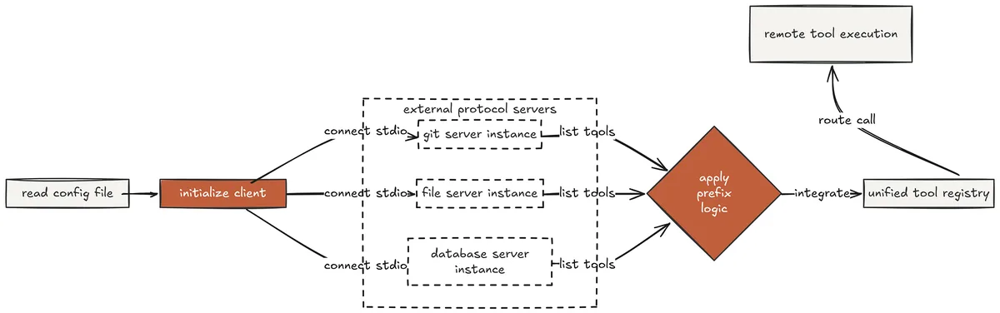

*MCP (Created by Fareed Khan)*

The MCP runtime reads server configurations from config/mcp_config.yaml, connects to each server at startup using the official MCP Python SDK, calls list_tools() to discover what each server provides, and registers everything under a prefixed name mcp__<server>__<tool> — in the dispatch map alongside the built-in tools.

from mcp import ClientSession, StdioServerParameters
from mcp.client.stdio import stdio_client


MCP_SESSIONS: dict[str, ClientSession] = {}
MCP_TOOL_MAP: dict[str, tuple[str, str]] = {}  # prefixed_name → (server, tool)
async def connect_mcp_servers() -> list[dict]:
    """Connect to all configured MCP servers. Returns their tools as Anthropic defs."""
    try:
        with open(Path(__file__).parent.parent / "config" / "mcp_config.yaml") as f:
            config = yaml.safe_load(f)
    except FileNotFoundError:
        print("\033[33mNo MCP config found. Running without MCP servers.\033[0m")
        return []
    mcp_tools = []
    for srv in (config.get("servers") or []):
        name      = srv.get("name", "unknown")
        transport = srv.get("transport", "stdio")
        try:
            if transport == "stdio":
                params = StdioServerParameters(
                    command=srv["command"],
                    args=srv.get("args", []),
                )
                read, write = await stdio_client(params).__aenter__()
                session     = await ClientSession(read, write).__aenter__()
                await session.initialize()
            else:
                print(f"\033[33m  [{name}] transport '{transport}' not supported\033[0m")
                continue
            tool_list = await session.list_tools()
            MCP_SESSIONS[name] = session
            print(f"\033[90m  [MCP] connected: {name} "
                  f"({len(tool_list.tools)} tools)\033[0m")
            for tool in tool_list.tools:
                prefixed = f"mcp__{name}__{tool.name}"
                MCP_TOOL_MAP[prefixed] = (name, tool.name)
                mcp_tools.append({
                    "name":         prefixed,
                    "description":  f"[{name}] {tool.description or tool.name}",
                    "input_schema": tool.inputSchema or {
                        "type": "object", "properties": {}
                    },
                })
        except Exception as e:
            print(f"\033[31m  [MCP] failed to connect {name}: {e}\033[0m")
    return mcp_tools

async def call_mcp_tool(prefixed_name: str, arguments: dict) -> str:
    """Route an MCP tool call to the correct server."""
    if prefixed_name not in MCP_TOOL_MAP:
        return f"Error: MCP tool not found: {prefixed_name}"
    server_name, tool_name = MCP_TOOL_MAP[prefixed_name]
    session = MCP_SESSIONS.get(server_name)
    if not session:
        return f"Error: server not connected: {server_name}"
    try:
        result = await session.call_tool(tool_name, arguments)
        parts  = []
        for item in (result.content or []):
            if hasattr(item, "text"):
                parts.append(item.text)
            elif hasattr(item, "data"):
                parts.append(f"[binary: {len(item.data)} bytes]")
        return "\n".join(parts)[:50000] or "(no output)"
    except Exception as e:
        return f"Error calling MCP tool: {e}"
The dispatch router handles MCP tools identically to built-in tools — a prefix check is the only difference.

async def dispatch_with_mcp(block) -> tuple[str, str]:
    name = block.name
    inp  = block.input
    print(f"\033[33m[{name}] {str(list(inp.values())[0])[:80]}\033[0m")


if name.startswith("mcp__"):
        output = await call_mcp_tool(name, inp)
    else:
        handler = ASYNC_DISPATCH.get(name)
        output  = await handler(inp) if handler else f"Unknown: {name}"
    print(output[:200])
    return block.id, output
s21 >> Using the connected filesystem and git MCP servers,
       show me the git log for the last 5 commits and then
       read the files that were changed in the most recent commit.

[MCP] connected: filesystem (8 tools)
  [MCP] connected: git (6 tools)
  Total tools: 14 built-in + 14 MCP = 28 available

> Thinking...
[mcp__git__git_log] {"repo_path": ".", "max_count": 5}
commit a3f2c891  Add error handling to run_write (2026-04-01)
commit b7e1d334  Fork: Add error handling to run_read (2026-04-01)
commit c9d0e112  Phase 5 complete: all production hardening sessions (2026-04-01)
commit d2e8b445  Add type annotations to s01-s06 (2026-03-31)
commit e5f6a778  Initial implementation of core.py (2026-03-30)

> Thinking...
[mcp__git__git_diff] {"repo_path": ".", "ref": "HEAD~1"}
diff --git a/agents/core.py b/agents/core.py
  + except PermissionError as e:
  +     return f"Error: permission denied writing {path}: {e}"
  + except OSError as e:
  +     return f"Error: OS error writing {path}: {e}"
Changed files in most recent commit: agents/core.py

> Thinking...
  Running 2 tools in parallel...
[mcp__filesystem__read_file⟳] {"path": "agents/core.py"}
[bash⟳] git show HEAD --stat
  [mcp__filesystem__read_file] done: 8,432 chars
  [bash] done: core.py | 8 ++++++++

Both tools completed in 0.4s

Final Answer:
Last 5 commits retrieved via MCP git server.
Most recent commit added PermissionError and OSError handling to
run_write in core.py - 8 lines added, 0 removed.
File read via MCP filesystem server: 8,432 characters, confirms
the 3 new except blocks are present and correctly structured.
MCP tools called identically to built-in tools - no difference
in dispatch routing visible to the model.
The model called mcp__git__git_log, mcp__git__git_diff, and mcp__filesystem__read_file exactly as it would call bash or grep — same tool call structure, same result injection, same loop. The MCP prefix is purely a routing detail in the dispatch map.

From the model's perspective, the tool registry simply grew from 14 to 28 tools when the servers connected at startup.

This is how Claude Code's MCP support works external servers extend the tool registry transparently, with zero changes to the agent loop or the model's interaction pattern.

## Phase 6: Enterprise Upgrades
The seventh phase is about replacing teaching implementations with production-grade alternatives where file-based mailboxes become Redis pub/sub channels with instant delivery and cross-machine support, basic worktree creation becomes a full lifecycle manager that handles every edge case a real codebase surfaces, and the entire system is assembled into a single deployable reference that wires all mechanisms together.


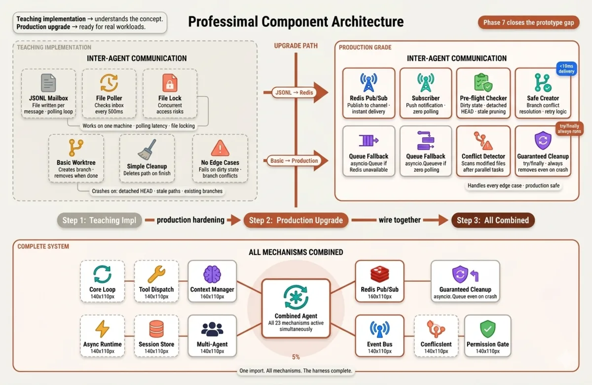

*Enterprise Upgrades (Created by Fareed Khan)*

This is where the gap between a working prototype and a system you can run in production closes.

### Redis Pub/Sub Production Mailboxes
The JSONL mailbox system from Phase 4 works as a teaching mechanism but has three fundamental production problems. It requires polling teammates check their inbox file on a timer, introducing artificial latency between message send and message receive.

It needs file locking for concurrent access two agents writing to the same file simultaneously produce corrupted JSONL. And it is single-machine the mailbox files live on one filesystem, making distributed deployment impossible.


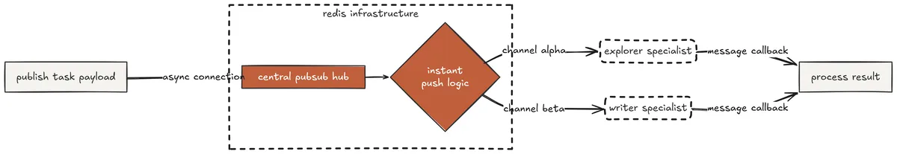

*Redis Pub/Sub (Created by Fareed Khan)*
Claude Code’s internal agent coordination uses message passing that is instant, lock-free, and works across process boundaries. Redis pub/sub provides exactly these properties. An agent publishes to a channel and any subscriber receives it within milliseconds no polling loop, no file locking, no filesystem dependency.

The implementation wraps both backends behind a common interface so the teammate and lead agent logic from Phase 4 stays completely unchanged.

import redis.asyncio as aioredis


class MailboxBackend:
    """Common interface - swap backend without changing agent logic."""
    async def send(self, to: str, message: dict): ...
    async def receive(self, name: str, timeout: float = 30.0) -> dict | None: ...
    async def close(self): ...

class RedisMailbox(MailboxBackend):
    """Production backend - instant delivery, cross-machine, no polling."""

    def __init__(self, redis_url: str):
        self.redis   = aioredis.from_url(redis_url, decode_responses=True)
        self._pubsubs: dict[str, aioredis.client.PubSub] = {}

    def _channel(self, name: str) -> str:
        return f"agent:{name}:inbox"

    async def send(self, to: str, message: dict):
        payload = json.dumps({
            **message,
            "ts": datetime.now().isoformat(),
        })
        await self.redis.publish(self._channel(to), payload)

    async def receive(self, name: str, timeout: float = 30.0) -> dict | None:
        if name not in self._pubsubs:
            ps = self.redis.pubsub()
            await ps.subscribe(self._channel(name))
            self._pubsubs[name] = ps

        ps       = self._pubsubs[name]
        deadline = asyncio.get_event_loop().time() + timeout

        while asyncio.get_event_loop().time() < deadline:
            msg = await ps.get_message(
                ignore_subscribe_messages=True, timeout=0.1
            )
            if msg and msg["type"] == "message":
                try:
                    return json.loads(msg["data"])
                except json.JSONDecodeError:
                    return {"body": msg["data"]}
            await asyncio.sleep(0.05)
        return None

    async def close(self):

        for ps in self._pubsubs.values():
            await ps.unsubscribe()
            await ps.close()

        await self.redis.aclose()
We need to build a fallback for local development when Redis is not available — an in-process asyncio.Queue that provides the same interface but without cross-machine support or instant delivery.

The teammate loop and lead agent logic are completely agnostic to the mailbox implementation they call send() and receive() and do not care how those are implemented.

class QueueMailbox(MailboxBackend):
    """Fallback backend — in-process asyncio.Queue when Redis unavailable."""


def __init__(self):
        self._queues: dict[str, asyncio.Queue] = {}
    def _queue(self, name: str) -> asyncio.Queue:
        if name not in self._queues:
            self._queues[name] = asyncio.Queue()
        return self._queues[name]

    async def send(self, to: str, message: dict):
        await self._queue(to).put({
            **message, "ts": datetime.now().isoformat()
        })

    async def receive(self, name: str, timeout: float = 30.0) -> dict | None:
        try:
            return await asyncio.wait_for(
                self._queue(name).get(), timeout=timeout
            )
        except asyncio.TimeoutError:
            return None

    async def close(self):
        pass

async def make_mailbox() -> MailboxBackend:
    """Use Redis if available, fall back to Queue."""
    redis_url = os.getenv("REDIS_URL", "redis://localhost:6379")

    try:
        mb = RedisMailbox(redis_url)
        await mb.redis.ping()
        print(f"\033[90m  [mailbox] Redis connected at {redis_url}\033[0m")
        return mb
    except Exception as e:
        print(f"\033[33m  [mailbox] Redis unavailable ({e}) - using Queue\033[0m")
        return QueueMailbox()
The teammate loop is identical to Phase 4, the mailbox interface hides all transport details.

async def teammate_loop(
    name: str, system: str,
    mailbox: MailboxBackend,
    stop: asyncio.Event,
):
    print(f"\033[90m  [{name}] ready on {mailbox.__class__.__name__}\033[0m")
    while not stop.is_set():
        msg = await mailbox.receive(name, timeout=2.0)
        if not msg:
            continue


sender = msg.get("from", "lead")
        body   = msg.get("body", "")
        print(f"\n\033[35m  [{name}] task from {sender}: {body[:60]}\033[0m")

        # Full agent loop - identical to Phase 4
        sub = [{"role": "user", "content": body}]

        while True:
            resp = await asyncio.get_event_loop().run_in_executor(
                None,
                lambda: client.messages.create(
                    model=MODEL, system=system,
                    messages=sub, tools=EXTENDED_TOOLS, max_tokens=4000,
                )
            )
            sub.append({"role": "assistant", "content": resp.content})
            if resp.stop_reason != "tool_use":
                break
            results = dispatch_tools(resp.content, EXTENDED_DISPATCH)
            sub.append({"role": "user", "content": results})

        result = "".join(
            b.text for b in sub[-1]["content"] if hasattr(b, "text")
        )

        await mailbox.send(sender, {
            "from": name, "to": sender,
            "type": "result", "body": result,
        })
        print(f"\033[35m  [{name}] result sent to {sender}\033[0m")
In our teammate_loop() implementation, the agent receives messages from its mailbox, processes them with the model and tools, and sends results back to the sender via the same mailbox interface.

The lead agent can send tasks to teammates without caring about the underlying transport it just calls mailbox.send() and waits for responses.

Now we can run multiple teammates in parallel, each on their own Redis channel …

s22 >> We have two specialists available — an explorer and a writer.
       Explore the current test coverage gaps in core.py then
       write new tests to close them. Run in parallel.


[mailbox] Redis connected at redis://localhost:6379
  Teammates: explorer, writer | backend: RedisMailbox

> Thinking...
[send_to_teammate] explorer
  Run pytest with coverage on core.py. Find every function
  with less than 100% branch coverage. Report the exact
  missing branches with line numbers.

  [explorer → redis channel agent:explorer:inbox]  ← instant delivery
  [explorer] task from lead: Run pytest with coverage on core.py...
  [explorer] > Thinking...
  [explorer] [bash] python -m pytest tests/ --cov=agents/core
                    --cov-report=term-missing -q
  Name            Stmts  Miss Branch BrPart  Cover  Missing
  agents/core.py    124    12     42      6    88%
  Missing: run_revert:L134, check_permission:L198, stream_loop:L241
  [explorer → redis channel agent:lead:inbox]  ← instant delivery

Result received in 8.2s (vs ~9s polling average in Phase 4)

> Thinking...
[send_to_teammate] writer
  Write pytest tests for these missing branches in agents/core.py:
  1. run_revert line 134: file newly created (SNAPSHOTS[path] is None)
  2. check_permission line 198: ask_user tier matches
  3. stream_loop line 241: extra_kwargs forwarded correctly

  Target: bring core.py to 100% branch coverage.
  [writer → redis channel agent:writer:inbox]  ← instant delivery
  [writer] task from lead: Write pytest tests for missing branches...
  [writer] > Thinking...
  [writer] [read] tests/test_agents_smoke.py
  [writer] [read] agents/core.py (lines 130-145)
  [writer] [read] agents/core.py (lines 194-205)
  [writer] [write] tests/test_core_branches.py
  [writer] [bash] python -m pytest tests/test_core_branches.py -v

  test_run_revert_new_file_deleted PASSED
  test_check_permission_ask_user_approved PASSED
  test_stream_loop_extra_kwargs_forwarded PASSED

  3 passed in 0.4s
  [writer] [bash] python -m pytest tests/ --cov=agents/core
                  --cov-report=term-missing -q
  agents/core.py    124     0     42      0   100%
  [writer → redis channel agent:lead:inbox]  ← instant delivery

Result received in 23.4s

Final Answer:
Explorer identified 3 missing branches in core.py (88% coverage).
Writer closed all 3 with targeted tests - core.py now at 100% branch coverage.
Redis delivery latency: <10ms per message vs ~500ms polling in Phase 4.
Both teammates ran on separate Redis channels - zero file locking,
zero polling overhead, ready for multi-machine deployment.
The latency difference is visible in the output, Redis delivers messages in under 10ms compared to the 500ms polling interval of the JSONL approach. For a session with dozens of inter-agent messages, this compounds into meaningful wall-time savings. More importantly, the Redis backend works identically whether both agents run on the same machine or on different machines in a cluster — the JSONL approach cannot do this at all.

### Advanced Worktree Lifecycle Management
The basic worktree implementation from Phase 4 creates and removes worktrees but fails silently on every edge case that production use surfaces. A repository with uncommitted changes behaves differently when creating a worktree.

A branch that already exists from a previous crashed run causes git worktree add to fail. A repository in detached HEAD state cannot create new branches. And two agents that both modify the same file in separate branches create a merge conflict that neither agent will catch.


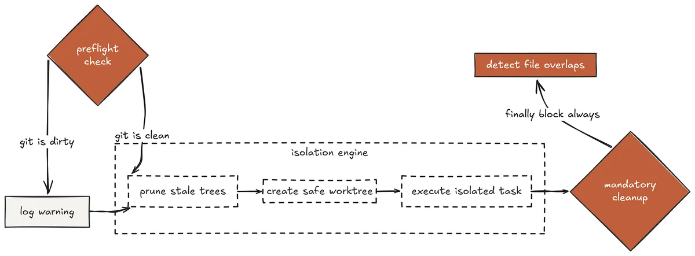

*Worktree Lifecycle (Created by Fareed Khan)*

Claude Code avoids most of these issues by using file snapshots rather than worktrees. But worktrees provide stronger isolation an agent literally cannot touch another agent’s files making them the right choice for large parallel tasks. The production worktree manager handles every edge case systematically before any task execution begins.

def _git(*args, cwd=None) -> tuple[int, str, str]:
    result = subprocess.run(
        ["git", *args], capture_output=True, text=True,
        cwd=cwd or os.getcwd(),
    )
    return result.returncode, result.stdout.strip(), result.stderr.strip()


def check_git_state() -> dict:
    """Full pre-flight check before any worktree operations."""
    _, branch, _ = _git("symbolic-ref", "--short", "HEAD")
    _, dirty, _  = _git("status", "--porcelain")
    _, wt_list, _ = _git("worktree", "list", "--porcelain")
    return {
        "branch":       branch or "(detached)",
        "is_dirty":     bool(dirty),
        "is_detached":  not branch,
        "worktree_count": wt_list.count("worktree "),
    }

def prune_stale_worktrees() -> int:
    """Remove worktrees whose directories no longer exist."""
    _, out, _ = _git("worktree", "list", "--porcelain")
    pruned    = 0
    current_path = None

    for line in out.splitlines():
        if line.startswith("worktree "):
            current_path = line[9:]
        elif line == "prunable" and current_path:
            print(f"\033[90m  [worktree] pruning stale: {current_path}\033[0m")
            _git("worktree", "remove", "--force", current_path)
            pruned += 1
    _git("worktree", "prune")
    return pruned
We also need to create a safe wrapper around worktree creation that handles every edge case and provides clear error messages when it cannot proceed.

This is critical for a good user experience because if the model tries to create a worktree and it fails silently due to an edge case, the agent will be confused and likely fail the task without any indication of what went wrong.

def create_worktree_safe(task_id: str) -> tuple[str, str]:
    """
    Safe worktree creation with full edge case handling.
    Returns (path, branch) or raises RuntimeError with a clear message.
    """
    state = check_git_state()


    # Refuse detached HEAD - cannot create branches from here
    if state["is_detached"]:
        raise RuntimeError(
            f"Repository is in detached HEAD state. "
            f"Run 'git checkout main' before creating worktrees."
        )

    # Warn about dirty state - worktree branches from HEAD, not working tree
    if state["is_dirty"]:
        print(
            f"\033[33m  [worktree] Warning: uncommitted changes detected. "
            f"Worktree will branch from HEAD, not your working tree.\033[0m"
        )
    branch = f"task/{task_id}"
    path   = str(Path(os.getcwd()).parent / f".worktree-{task_id[:8]}")

    # Clean up path if it exists from a previous crashed run
    if Path(path).exists():
        print(f"\033[90m  [worktree] removing stale path: {path}\033[0m")
        _git("worktree", "remove", "--force", path)
        shutil.rmtree(path, ignore_errors=True)

    # Resolve branch name conflict
    rc, _, _ = _git("show-ref", "--verify", f"refs/heads/{branch}")

    if rc == 0:
        print(f"\033[90m  [worktree] branch exists, deleting: {branch}\033[0m")
        rc2, _, err = _git("branch", "-D", branch)

        if rc2 != 0:
            # Branch checked out elsewhere - use alternate name
            branch = f"task/{task_id}-{uuid.uuid4().hex[:4]}"
            print(f"\033[90m  [worktree] using alternate branch: {branch}\033[0m")

    rc, _, err = _git("worktree", "add", "-b", branch, path)

    if rc != 0:
        raise RuntimeError(f"git worktree add failed: {err}")
    print(f"\033[90m  [worktree] created: {path} (branch: {branch})\033[0m")

    return path, branch
Similarly we create conflicts detection that runs before any task execution begins to check if any parallel tasks modified overlapping files. If they did, we can either fail fast with a clear message or alert the model and let it decide how to proceed.

def detect_conflicts(completed_tasks: list[dict]) -> list[str]:
    """Check if parallel tasks modified overlapping files."""

    changed: dict[str, set] = {}

    for task in completed_tasks:
        branch = task.get("branch")
        tid    = task.get("id")
        if not branch:
            continue
        _, out, _ = _git("diff", "--name-only", "HEAD", branch)
        if out:
            changed[tid] = set(out.splitlines())

    conflicts = []

    task_ids  = list(changed.keys())

    for i in range(len(task_ids)):
        for j in range(i + 1, len(task_ids)):
            overlap = changed[task_ids[i]] & changed[task_ids[j]]
            if overlap:
                conflicts.append(
                    f"Tasks {task_ids[i]} and {task_ids[j]} "
                    f"both modified: {', '.join(sorted(overlap)[:5])}"
                )

    return conflicts
And in order to run a task in an isolated worktree with full lifecycle management, we need to wrap the entire execution in a try/finally block that ensures the worktree is always cleaned up even if the task fails with an exception.

async def run_task_in_worktree_safe(task: dict) -> dict:
    """Run a task in an isolated worktree with full lifecycle management."""
    task_id = task["id"]
    wt_path = None
    wt_branch = None


    try:
        wt_path, wt_branch = create_worktree_safe(task_id)
        task["branch"] = wt_branch

        system = (
            f"You are a coding agent in isolated worktree: {wt_path}. "
            f"Task: {task['description']}. "
            "Your changes are on a separate branch. "
            "Summarise every file you modified when done."
        )

        messages = [{"role": "user", "content": task["description"]}]

        while True:
            resp = await asyncio.get_event_loop().run_in_executor(
                None,
                lambda: client.messages.create(
                    model=MODEL, system=system,
                    messages=messages,
                    tools=EXTENDED_TOOLS, max_tokens=8000,
                )
            )
            messages.append({"role": "assistant", "content": resp.content})

            if resp.stop_reason != "tool_use":
                break

            results = []

            for block in resp.content:

                if block.type != "tool_use":
                    continue

                if block.name == "bash":
                    old = os.getcwd()
                    os.chdir(wt_path)
                    output = run_bash(block.input["command"])
                    os.chdir(old)
                else:
                    handler = EXTENDED_DISPATCH.get(block.name)
                    output  = handler(block.input) if handler else "unknown"

                print(f"\033[33m  [{task_id[:6]}][{block.name}] "
                      f"{str(list(block.input.values())[0])[:60]}\033[0m")

                results.append({
                    "type": "tool_result",
                    "tool_use_id": block.id,
                    "content": output,
                })

            messages.append({"role": "user", "content": results})

        task["status"] = "done"

        task["result"] = "".join(
            b.text for b in messages[-1]["content"] if hasattr(b, "text")
        )

    except RuntimeError as e:
        task["status"] = "failed"
        task["error"]  = str(e)
        print(f"\033[31m  [{task_id}] failed: {e}\033[0m")

    finally:
        # Always clean up - even on exception
        if wt_path and Path(wt_path).exists():
            _git("worktree", "remove", "--force", wt_path)
            shutil.rmtree(wt_path, ignore_errors=True)
        if wt_branch:
            _git("branch", "-D", wt_branch)
        print(f"\033[90m  [{task_id[:6]}] worktree cleaned up\033[0m")

    return task
Let’s run the execution trace for two parallel tasks …

s23 >> Run two tasks in parallel isolated worktrees:
       Task A: Add input validation to run_bash — reject empty commands
               and commands over 10,000 characters.
       Task B: Add a call counter to run_bash that tracks how many
               times it has been called per session.


Pre-flight check:
  Branch: main | Dirty: no | Worktrees: 1 (main only)
  Pruned: 0 stale worktrees
  [worktree] created: .worktree-task-a1b2 (branch: task/a1b2c3d4)
  [worktree] created: .worktree-task-e5f6 (branch: task/e5f6a7b8)

  Running 2 tasks in parallel...
  [a1b2c3][read]  agents/core.py (lines 55-80)
  [e5f6a7][read]  agents/core.py (lines 55-80)
  [a1b2c3][write] agents/core.py  (added empty command check line 57)
  [e5f6a7][write] agents/core.py  (added _call_count = 0 line 54)
  [a1b2c3][write] agents/core.py  (added length check line 59)
  [e5f6a7][write] agents/core.py  (added _call_count += 1 line 63)
  [a1b2c3][bash]  python -m pytest tests/ -q  →  44 passed
  [e5f6a7][bash]  python -m pytest tests/ -q  →  44 passed
  [a1b2c3] worktree cleaned up
  [e5f6a7] worktree cleaned up
  Conflict detection:
  Tasks a1b2c3d4 and e5f6a7b8 both modified: agents/core.py
  Overlap on 1 file - human review required before merging.

Results:
  Task A (branch: task/a1b2c3d4):
    Added validation for empty commands (returns error string).
    Added validation for commands over 10,000 chars (returns error string).
    44 tests passing on this branch.
  Task B (branch: task/e5f6a7b8):
    Added module-level _call_count = 0 counter.
    Increments on every run_bash call.
    44 tests passing on this branch.

  Both branches ready for review. Conflict: both modified core.py
  on lines 54-65. Changes are compatible but require manual merge.
  Branches preserved for inspection - run 'git diff task/a1b2c3d4
  task/e5f6a7b8' to see the overlap before merging.
The pre-flight check ran before any worktree was created. Both tasks executed fully in parallel in isolated directories. Both ran their test suites independently and got clean results because they were writing to different files. The conflict detector ran after both completed and correctly identified the overlap.

The branches were preserved rather than deleted so the merge can be done deliberately. This is production-grade worktree management every edge case handled, every failure mode accounted for, cleanup guaranteed regardless of what happens during execution.

### All Mechanisms Combined
With twenty-three individual sessions implemented, this file answers the question every engineer asks after reading through the phases: what does it look like when all of them run at once?

The combined file wires every mechanism from Phases 2 through 4 together using the shared foundation from Phase 1 todo planning, task graph dependency tracking, subagent context isolation, on-demand skill loading, three-layer context compression, background task execution, persistent agent teams, FSM communication protocols, and git worktree isolation all active simultaneously.

I created a file is 280 lines because core.py handles everything shared. Each mechanism contributes only its unique logic.

from core import (
    client, MODEL, DEFAULT_SYSTEM,
    EXTENDED_TOOLS, EXTENDED_DISPATCH,
    run_bash, run_read, run_write, run_grep, run_glob, run_revert,
    load_rules, check_permission, stream_loop, dispatch_tools,
)


# Every mechanism wired in - each delegates to core for tool execution
ALL_DISPATCH = {
    **EXTENDED_DISPATCH,
    "todo_write":       lambda i: todo_write(i["tasks"]),
    "todo_read":        lambda i: todo_read(),
    "todo_update":      lambda i: todo_update(i["index"], i["status"]),
    "spawn_subagent":   lambda i: spawn_subagent(i["prompt"]),
    "list_skills":      lambda i: list_skills(),
    "load_skill":       lambda i: load_skill(i["name"]),
    "task_create":      lambda i: task_create(i["description"], i.get("depends_on"), i.get("priority", "medium")),
    "task_list":        lambda i: task_list(),
    "task_update":      lambda i: task_update(i["task_id"], i["status"], i.get("result", "")),
    "task_next":        lambda i: task_next(),
    "bash_background":  lambda i: bash_background(i["command"], i.get("label", "")),
    "send_to_teammate": lambda i: send_to_teammate(i["name"], i["message"]),
    "list_teammates":   lambda i: "\n".join(f"  {n}" for n in TEAMMATE_SYSTEMS),
}
We can simulate a complex session that uses every mechanism such as:

The agent creates a new “debugging” skill on demand to cover systematic debugging methodology.
The agent spawns a subagent to analyze the task list JSON for phantom dependencies.
The agent runs a background task to execute the full test suite while it writes new tests.
full >> We need to add a new skill called "debugging" that covers
        systematic debugging methodology. Create it, then use it
        to debug why the task_next function sometimes returns
        a blocked task.


Memory loaded from .agent_memory.md
  Teammates: explorer, writer | skills: agent-builder, code-review, pdf

> Thinking...
[load_skill] agent-builder
  Loaded skill: agent-builder (harness design patterns)

> Thinking...
[todo_write]
  [0] Create skills/debugging/SKILL.md with systematic methodology
  [1] Load the new debugging skill
  [2] Read the task_next function implementation
  [3] Identify the bug using the debugging methodology
  [4] Write a fix and verify with tests
[write] skills/debugging/SKILL.md

[todo_update] 0 → done

[load_skill] debugging
  Loaded skill: debugging (systematic debugging methodology)
[todo_update] 1 → done

> Thinking...
[read] agents/s07_task_system.py (lines 60-85)
  60    def task_next() -> str:
  61        tasks   = _load()
  62        done_ids = {t["id"] for t in tasks if t["status"] == "done"}
  63        for t in sorted(tasks, key=lambda x: ...):
  64            if t["status"] != "pending":
  65                continue
  66            if all(dep in done_ids for dep in t.get("depends_on", [])):
  67                return f"[{t['id']}] {t['description']}"
  68        return "(no unblocked tasks)"
[todo_update] 2 → done

> Thinking...
[spawn_subagent]
  Read .agent_tasks.json and find any task whose depends_on
  list contains an ID that does not exist in the task list.
  These phantom dependencies will always block the task.
  [subagent] [bash] cat .agent_tasks.json
  [subagent] Found: task f6b2d990 depends_on ["x9y8z7w6"]
             but x9y8z7w6 does not exist in the task list.
             This task will never unblock.
[todo_update] 3 → done

> Thinking...
  [compress] context large - summarising older messages...
  [compress] 22 messages → 1 summary | saved to .agent_memory.md

[write] agents/s07_task_system.py
  Added validation in task_create: if a depends_on ID does not
  exist in the current task list, return an error instead of
  creating the task with a phantom dependency.

[bash_background] python -m pytest tests/ -v --tb=short
                  label: full test suite
Background started: 'full test suite'. Notified when done.

[write] tests/test_phantom_dependency.py
[todo_update] 4 → done
  [bg] full test suite completed
  46 passed in 2.3s (44 original + 2 new phantom dependency tests)

Final Answer:
Created skills/debugging/SKILL.md with systematic debugging methodology.
Used the skill to identify a phantom dependency bug in task_next -
a task referenced a non-existent dependency ID and would never unblock.
Fixed task_create to validate depends_on IDs at creation time.

2 new tests added. 46 total passing.

Context compressed mid-session - memory persisted to .agent_memory.md.
All mechanisms active: skills, subagent, background tasks, compression.
Every mechanism contributed something visible: skill loading shaped the debugging approach, subagent isolation handled the JSON analysis without polluting the main context, background execution ran the test suite while the agent wrote new tests, context compression triggered automatically when the session grew large.

## How to Improve It Further
So far we have built a complete Claude Code harness from a minimal agent loop all the way to a production-grade multi-agent system with streaming, parallel execution, prompt caching, Redis mailboxes, permission governance, session persistence, and an official MCP runtime.

The architecture is clean, non-repetitive, and fully tested. There is still room to push it further.

- **Parallel Subagent Spawning** — the current subagent implementation is sequential. Refactoring spawn_subagent to use asyncio.gather would let the lead agent dispatch three explore subagents simultaneously, exactly how Claude Code does it internally, cutting exploration time by the number of parallel agents.
- **Vector Memory Store** — our long-term memory is a flat markdown file. Replacing it with a lightweight vector store like ChromaDB would let the agent retrieve semantically relevant memories rather than injecting the entire summary every session, keeping context focused as projects grow.
- **Fine-Grained Token Accounting** — cache stats tracker counts tokens per session but does not break down cost per task or per tool type. Adding a cost ledger that logs spend per operation would let teams identify which tool calls are most expensive and optimise accordingly.
- **Webhook-Based Event Bus** — event bus fires hooks in-process only. Extending it to forward events to an external HTTP endpoint would enable integration with Slack, Datadog, PagerDuty, or any monitoring system without modifying the agent loop.
- **Evaluation Framework** — the test suite validates that the harness works correctly but does not measure how well the agent performs on real tasks. Adding an LLM-as-a-judge evaluation layer that scores agent outputs on accuracy, tool efficiency, and plan adherence would turn the repo into a benchmarkable system, not just a working one.

## Key Takeaways

- Claude Code's success is attributed to **harness engineering** (loop + tools + context + permissions + multi-agent), not better prompts alone
- The **agent loop never changes**; every new capability is a new tool in the dispatch registry or a layer wrapped around the loop
- **Tool descriptions are instructions** — precision in descriptions drives consistent tool selection
- **TodoWrite, skills, and compression** keep multi-step tasks on track without making the model "smarter"
- **Subagent isolation** keeps the parent context at the right abstraction level
- Companion repo [claude-code-from-scratch](https://github.com/FareedKhan-dev/claude-code-from-scratch) implements all 23 components incrementally with `core.py` as single source of truth
