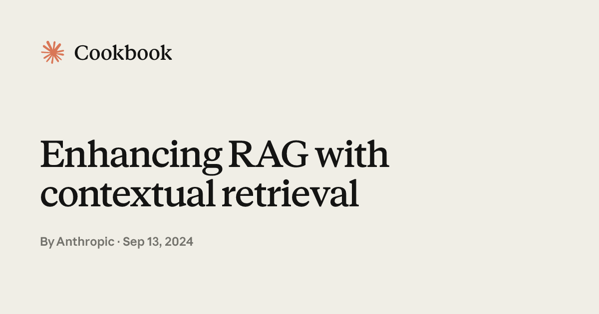

# Enhancing RAG with Contextual Retrieval

## Source

- Type: webpage
- Origin: https://platform.claude.com/cookbook/capabilities-contextual-embeddings-guide
- Imported: 2025-08-30
- Related: [Contextual Retrieval blog post](https://www.anthropic.com/news/contextual-retrieval)
- GitHub: [anthropics/claude-cookbooks — capabilities/contextual-embeddings](https://github.com/anthropics/claude-cookbooks/tree/main/capabilities/contextual-embeddings)
- Images: 1 preview image saved under `./assets/platform-claude-contextual-embeddings-guide/`



Interactive Python cookbook demonstrating how to improve RAG retrieval with contextual embeddings, hybrid BM25 search, and reranking. Uses a dataset of 9 codebases (248 evaluation queries) and measures performance with Pass@k.

## Content

### What problem does this solve?

In traditional RAG, documents are split into chunks for efficient retrieval. Individual chunks often lack sufficient context when embedded in isolation — a function definition without its module context, for example.

**Contextual Embeddings** add relevant document-level context to each chunk before embedding. Anthropic reports this reduced top-20-chunk retrieval failure rate by **35%** averaged across tested data sources. The same chunk-specific context can also power **Contextual BM25** hybrid search.

### Evaluation setup

| Item | Detail |
| --- | --- |
| Dataset | 9 pre-chunked codebases (basic character splitting) |
| Queries | 248, each with a "golden chunk" |
| Metric | **Pass@k** — whether the golden chunk appears in the top k retrieved results |
| Embedding model | Voyage AI (`voyage-2`) |
| Context generation | Claude Haiku 4.5 |

### Prerequisites

**Skills:** Intermediate Python, basic RAG concepts, familiarity with vector databases and embeddings.

**System:** Python 3.8+, Docker (optional, for BM25/Elasticsearch), 4GB+ RAM, ~5–10 GB disk.

**API keys:** `ANTHROPIC_API_KEY`, `VOYAGE_API_KEY`, `COHERE_API_KEY` (for reranking).

**Time/cost:** ~30–45 minutes to run; ~$5–10 API cost for the full dataset.

**Libraries:** `anthropic`, `voyageai`, `cohere`, `elasticsearch`, `pandas`, `numpy`, `matplotlib`, `scikit-learn`.

### Pipeline overview

1. **Basic RAG** — embed raw chunks with Voyage AI, store in an in-memory vector DB (pickle-serialized), establish baseline Pass@k.
2. **Contextual Embeddings** — use Claude to generate a short "situating" context for each chunk, prepend it before embedding.
3. **Contextual BM25** — index both raw chunk content and contextual descriptions in Elasticsearch; fuse with semantic search via Reciprocal Rank Fusion.
4. **Reranking** — use Cohere `rerank-english-v3.0` on top of hybrid results for final relevance scoring.

### Basic RAG baseline

The `VectorDB` class handles embedding generation (Voyage AI, batch size 128), disk caching (avoids re-embedding), and cosine similarity search. For production, swap in a hosted vector database while keeping the same interface.

**Baseline results:**

| Metric | Pass Rate |
| --- | --- |
| Pass@5 | 80.92% |
| Pass@10 | 87.15% |
| Pass@20 | 90.06% |

### Contextual Embeddings

For each chunk, pass the full source document and the chunk to Claude. Claude generates a concise explanation of what the chunk contains and where it fits in the document. This context is prepended before embedding.

**Core prompt pattern:**

```python
DOCUMENT_CONTEXT_PROMPT = """
<document>
{doc_content}
</document>
"""

CHUNK_CONTEXT_PROMPT = """
Here is the chunk we want to situate within the whole document
<chunk>
{chunk_content}
</chunk>
Please give a short succinct context to situate this chunk within the overall document
for the purposes of improving search retrieval of the chunk.
Answer only with the succinct context and nothing else.
"""
```

Use `cache_control: {"type": "ephemeral"}` on the document portion so prompt caching applies when processing chunks from the same document sequentially.

**Cost and latency:**

- Contextualization is a **one-time ingestion cost**, not per-query (unlike HyDE).
- Prompt caching: first chunk writes the full document to cache; subsequent chunks read from cache (~90% discount). Cache lasts 5 minutes.
- Example cost: ~$1.02 per million document tokens (800-token chunks, 8k-token documents, 100 tokens of generated context).
- On the 737-chunk dataset, caching reduced a ~$15 ingestion job to ~$3.
- Watch for embedding model token limits — truncated contextualized chunks can hurt performance.

**Contextual Embeddings results:**

| Metric | Pass Rate |
| --- | --- |
| Pass@5 | 88.12% |
| Pass@10 | 92.34% |
| Pass@20 | 94.29% |

Improvement is most pronounced at Pass@5, suggesting contextualized chunks rank higher when relevant.

### Contextual BM25: Hybrid Search

Combines semantic search (conceptual similarity) with BM25 (exact keyword/terminology matching) using **Reciprocal Rank Fusion**:

1. Retrieve top 150 candidates from both semantic search and BM25.
2. Fuse rankings with weighted RRF (default: 80% semantic, 20% BM25 — tunable).
3. Return top-k results.

BM25 indexes both `content` (original chunk) and `contextualized_content` (generated context).

**Elasticsearch setup (Docker):**

```bash
docker run -d --name elasticsearch -p 9200:9200 -p 9300:9300 \
  -e "discovery.type=single-node" \
  -e "xpack.security.enabled=false" \
  elasticsearch:9.2.0
```

**Hybrid search results:**

| Metric | Pass Rate |
| --- | --- |
| Pass@5 | 86.43% |
| Pass@10 | 93.21% |
| Pass@20 | 94.99% |

### Reranking

Retrieve top `k * 10` semantic results, then rerank with Cohere `rerank-english-v3.0`. Documents are passed as `original_content + contextualized_content`.

**Reranking results:**

| Metric | Pass Rate |
| --- | --- |
| Pass@5 | 92.15% |
| Pass@10 | 95.26% |
| Pass@20 | 97.45% |

### Cumulative performance comparison

| Approach | Pass@5 | Pass@10 | Pass@20 |
| --- | --- | --- | --- |
| Baseline RAG | 80.92% | 87.15% | 90.06% |
| + Contextual Embeddings | 88.12% | 92.34% | 94.29% |
| + Hybrid Search (BM25) | 86.43% | 93.21% | 94.99% |
| + Reranking | 92.15% | 95.26% | 97.45% |

Starting from 87% Pass@10 baseline, the full pipeline reaches **95.26%** — a 47% reduction in retrieval failures (12.85% → 4.74%).

### Trade-offs and recommendations

| Technique | Cost profile | When to use |
| --- | --- | --- |
| Contextual embeddings | One-time ingestion (~$3 for this dataset with caching) | Best performance-to-cost ratio; 92% Pass@10 with no per-query cost |
| Hybrid search (BM25) | Elasticsearch infrastructure + maintenance | Strong performance without per-query API costs (93% Pass@10) |
| Reranking | +100–200ms latency, ~$0.002/query | Maximum accuracy when latency and cost are acceptable (95% Pass@10) |

**Platform notes:**

- Prompt caching is available on Anthropic's first-party API; coming to AWS Bedrock and GCP Vertex.
- AWS Bedrock users can deploy a Lambda from `contextual-rag-lambda-function/lambda_function.py` as a custom chunking option on a Knowledge Base.
- GCP users can follow a similar pattern with Cloud Run.

### Key code classes

| Class | Role |
| --- | --- |
| `VectorDB` | Basic embedding storage and cosine similarity search |
| `ContextualVectorDB` | Adds Claude contextualization at ingestion; parallel processing via ThreadPoolExecutor |
| `ElasticsearchBM25` | Indexes chunks + contextual descriptions for keyword search |
| `retrieve_advanced` | Hybrid retrieval with weighted Reciprocal Rank Fusion |
| `evaluate_db_rerank` | Full pipeline evaluation with Cohere reranking |

Data files referenced in the cookbook: `data/codebase_chunks.json`, `data/evaluation_set.jsonl`.

## Key Takeaways

- Contextual embeddings solve the "isolated chunk" problem by situating each chunk within its source document before embedding — the largest single improvement (+5–7 percentage points at Pass@10).
- Prompt caching makes contextualization practical at scale: process chunks document-by-document to maximize cache hits and cut ingestion cost by ~80%.
- Hybrid search (semantic + Contextual BM25) catches keyword-specific queries that pure embeddings miss.
- Reranking pushes Pass@10 to 95%+, but adds per-query latency and API cost.
- For most production RAG systems, contextual embeddings alone offer the best performance-to-cost ratio.
- These techniques apply beyond codebases — internal knowledge bases, financial/legal content, educational material, and more.
