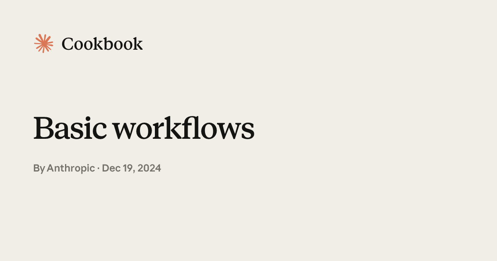

# Basic Multi-LLM Workflows

## Source

- Type: webpage
- Origin: https://platform.claude.com/cookbook/patterns-agents-basic-workflows
- Imported: 2025-08-28
- GitHub: [anthropics/claude-cookbooks — patterns/agents](https://github.com/anthropics/claude-cookbooks/tree/main/patterns/agents)
- Images: 1 preview image saved under `./assets/platform-claude-patterns-agents-basic-workflows/`



Three simple multi-LLM workflow patterns that trade cost or latency for potentially improved task performance. Sample implementations meant to demonstrate core concepts — not production code.

Published by Anthropic, December 19, 2024.

## Content

### Overview

| Pattern | Description | Trade-off |
| --- | --- | --- |
| **Prompt chaining** | Decomposes a task into sequential subtasks; each step builds on previous results | Higher latency; better accuracy per step |
| **Parallelization** | Distributes independent subtasks across multiple LLM calls concurrently | Higher cost; faster wall-clock time |
| **Routing** | Dynamically selects a specialized LLM path based on input characteristics | Extra classification call; specialized handling |

### Core implementations

```python
from concurrent.futures import ThreadPoolExecutor

from util import extract_xml, llm_call


def chain(input: str, prompts: list[str]) -> str:
    """Chain multiple LLM calls sequentially, passing results between steps."""
    result = input
    for i, prompt in enumerate(prompts, 1):
        print(f"\nStep {i}:")
        result = llm_call(f"{prompt}\nInput: {result}")
        print(result)
    return result


def parallel(prompt: str, inputs: list[str], n_workers: int = 3) -> list[str]:
    """Process multiple inputs concurrently with the same prompt."""
    with ThreadPoolExecutor(max_workers=n_workers) as executor:
        futures = [executor.submit(llm_call, f"{prompt}\nInput: {x}") for x in inputs]
        return [f.result() for f in futures]


def route(input: str, routes: dict[str, str]) -> str:
    """Route input to specialized prompt using content classification."""
    print(f"\nAvailable routes: {list(routes.keys())}")

    selector_prompt = f"""
Analyze the input and select the most appropriate support team from these options: {list(routes.keys())}

First explain your reasoning, then provide your selection in this XML format:

<reasoning>
Brief explanation of why this ticket should be routed to a specific team.
Consider key terms, user intent, and urgency level.
</reasoning>

<selection>
The chosen team name
</selection>

Input: {input}""".strip()

    route_response = llm_call(selector_prompt)
    reasoning = extract_xml(route_response, "reasoning")
    route_key = extract_xml(route_response, "selection").strip().lower()

    print("Routing Analysis:")
    print(reasoning)
    print(f"\nSelected route: {route_key}")

    selected_prompt = routes[route_key]
    return llm_call(f"{selected_prompt}\nInput: {input}")
```

### Example 1: Chain — structured data extraction and formatting

Each step progressively transforms raw text into a formatted markdown table.

```python
data_processing_steps = [
    """Extract only the numerical values and their associated metrics from the text.
Format each as 'value: metric' on a new line.""",
    """Convert all numerical values to percentages where possible.
If not a percentage or points, convert to decimal (e.g., 92 points -> 92%).""",
    """Sort all lines in descending order by numerical value.
Keep the format 'value: metric' on each line.""",
    """Format the sorted data as a markdown table with columns:
| Metric | Value |
|:--|--:|
| Customer Satisfaction | 92% |""",
]

report = """
Q3 Performance Summary:
Our customer satisfaction score rose to 92 points this quarter.
Revenue grew by 45% compared to last year.
Market share is now at 23% in our primary market.
Customer churn decreased to 5% from 8%.
New user acquisition cost is $43 per user.
Product adoption rate increased to 78%.
Employee satisfaction is at 87 points.
Operating margin improved to 34%.
"""

formatted_result = chain(report, data_processing_steps)
```

**Final output (Step 4):**

| Metric | Value |
| --- | --: |
| Customer Satisfaction | 92% |
| Employee Satisfaction | 87% |
| Product Adoption Rate | 78% |
| Revenue Growth | 45% |
| User Acquisition Cost | 43.0 |
| Operating Margin | 34% |
| Market Share | 23% |
| Previous Customer Churn | 8% |
| Customer Churn | 5% |

### Example 2: Parallelization — stakeholder impact analysis

Process impact analysis for multiple stakeholder groups concurrently with the same prompt.

```python
stakeholders = [
    """Customers:\n - Price sensitive\n - Want better tech\n - Environmental concerns""",
    """Employees:\n - Job security worries\n - Need new skills\n - Want clear direction""",
    """Investors:\n - Expect growth\n - Want cost control\n - Risk concerns""",
    """Suppliers:\n - Capacity constraints\n - Price pressures\n - Tech transitions""",
]

impact_results = parallel(
    """Analyze how market changes will impact this stakeholder group.
Provide specific impacts and recommended actions.
Format with clear sections and priorities.""",
    stakeholders,
)
```

Each stakeholder group receives a structured analysis with prioritized impacts, recommended actions, timelines, and success metrics. The notebook runs all four analyses in parallel via `ThreadPoolExecutor`.

### Example 3: Route — customer support ticket handling

Route support tickets to specialized teams (billing, technical, account, product) based on content analysis with chain-of-thought classification.

```python
support_routes = {
    "billing": """You are a billing support specialist...""",
    "technical": """You are a technical support engineer...""",
    "account": """You are an account security specialist...""",
    "product": """You are a product specialist...""",
}

tickets = [
    "Subject: Can't access my account\nMessage: ... invalid password ...",
    "Subject: Unexpected charge on my card\nMessage: ... $49.99 vs $29.99 ...",
    "Subject: How to export data?\nMessage: ... bulk export to Excel ...",
]

for ticket in tickets:
    response = route(ticket, support_routes)
```

**Routing results from the cookbook:**

| Ticket | Selected route | Rationale |
| --- | --- | --- |
| Password/login error (urgent) | `account` | Account access and authentication issue |
| Unexpected $49.99 charge | `billing` | Pricing plan discrepancy and payment question |
| Bulk export to Excel how-to | `technical` | Product functionality / step-by-step instructions |

The routing step uses XML-tagged `<reasoning>` and `<selection>` output, parsed via `extract_xml`, before invoking the matched specialist prompt.

## Key Takeaways

- Three foundational workflow patterns — **chain**, **parallel**, and **route** — cover most multi-LLM orchestration needs with minimal code.
- **Prompt chaining** works when a task decomposes cleanly into fixed sequential steps (e.g., extract → normalize → sort → format).
- **Parallelization** suits independent subtasks that share a prompt but differ in input (e.g., per-stakeholder analysis); use `ThreadPoolExecutor` for concurrent LLM calls.
- **Routing** adds a classification step with explicit reasoning before dispatching to specialized prompts — useful for support triage and domain-specific handlers.
- These are cookbook demos, not production patterns; pair with the broader guidance in [Building Effective Agents](./anthropic-building-effective-agents.md) for when to use workflows vs autonomous agents.
