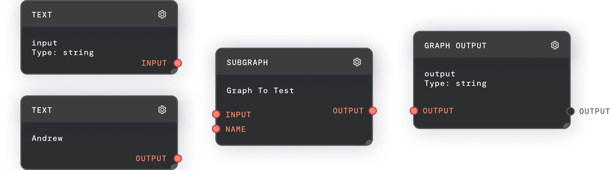
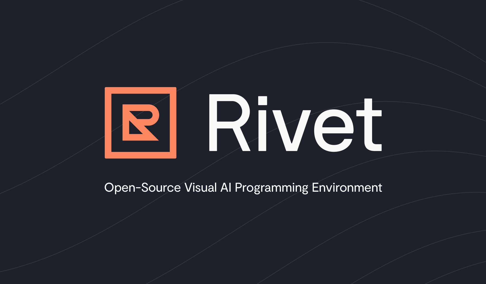

# Rivet — Open-Source Visual AI Programming Environment

## Source
- Type: webpage
- Origin: https://rivet.ironcladapp.com/
- Imported: 2026-08-28
- Images: 5 saved under `./assets/rivet-ironcladapp-com/` (graph, logos, social card)

## Content

**The Open-Source Visual AI Programming Environment**

- [Download latest release](https://github.com/Ironclad/rivet/releases/latest)
- [Documentation](https://rivet.ironcladapp.com/docs)
- [GitHub](https://github.com/Ironclad/rivet) · [Discord](https://discord.gg/qT8B2gv9Mg) · [YouTube](https://www.youtube.com/@rivet_ts)

Built and used by:

### What is Rivet?

Rivet is a visual programming environment for building AI agents with LLMs. Iterate on your prompt graphs in Rivet, then run them directly in your application. With Rivet, teams can effectively design, debug, and collaborate on complex LLM prompt graphs, and deploy them in their own environment.

At Ironclad, we struggled to build AI agents programmatically. Rivet's visual environment, easy debugger, and remote executor unlocked our team's ability to collaborate on increasingly complex and powerful LLM prompt graphs.

 is the leading digital contracting platform. [Ironclad AI](https://ironcladapp.com/product/ai-based-contract-management/) helps legal teams with everything from reviewing contracts faster to answering questions about their obligations. Learn more at [ironcladapp.com](https://www.ironcladapp.com/).

Rivet is built and used by Ironclad Research.

### Why Rivet?

#### Visualize and Build

Visualize and build complex chains to create applications for production — not just prototyping.

#### Debug Remotely

See what's under the hood and observe the execution of prompt chains in your application, in real-time.

#### Collaborate

Rivet graphs are just YAML files, so you can version them in your team's repository, and review them using your favorite code review tools.

### See it in Action

Demo video: [Rivet Demo on YouTube](https://www.youtube.com/watch?v=HhgM9MiShwA)

### What the Community is Saying

> Rivet's visual programming environment is a game-changer. The visual nature of the tool, paired with how collaborative it is, allows us to create complex chains for AI agents in drastically less time than it would take in other environments. It's the best tool out there.
>
> — **Todd Berman**, CTO, [Attentive](https://www.attentive.com/)

> Rivet really addressed some limitations that we were hitting up against... and some we didn't know we had. The visualization makes a big difference when working through agentic logic and really makes it easy to see what the AI is doing. But the ability to debug and collaborate across the team made a huge difference as well — we've used it to launch our virtual mortgage servicing agent and are excited to see how the tool continues to evolve.
>
> — **Teddy Coleman**, CTO, [Willow Servicing](https://www.willowservicing.com/)

> In order to build great product experiences we have to be able to iterate quickly. Leveraging tools like Rivet allows us to more accurately understand the tradeoffs between things like speed and quality as we build AI-powered experiences in Bento.
>
> — **Emily Wang**, CEO, [Bento](https://www.trybento.co/products/bentoai)

> Rivet is an amazing tool for rapidly prototyping and visually understanding complex AI workflows. It's been wonderful collaborating with Ironclad to integrate AssemblyAI's audio transcription and understanding models into the Rivet ecosystem. We're excited to see what developers create equipped with such a powerful and capable toolkit!
>
> — **Domenic Donato**, VP of Technology, [AssemblyAI](https://www.assemblyai.com/)

> Rivet is a super slick and compelling tool for prompt construction and LLM composition, particularly when you're trying to combine AI with many existing tools and APIs. I can see this becoming a popular tool for those working on robust and reliable AI applications.
>
> — **Beyang Liu**, CTO, [Sourcegraph](https://www.sourcegraph.com/)

### Ironclad Contract AI

Ironclad Contract AI (CAI) is a virtual contract assistant, powered by AI agents, and developed with Rivet. CAI is capable of answering diverse questions about every stage of the contract lifecycle, directly using Ironclad's existing capabilities, like contract search, workflow process, and data visualization.

[Learn more about CAI](https://ironcladapp.com/product/ironclad-contract-ai/)

### Get Started

Start building AI agents with Rivet in just a few simple steps:

1. Follow the [Getting Started](https://rivet.ironcladapp.com/docs/getting-started/installation) guide to learn how to build AI agent graphs in Rivet.
2. [Integrate Rivet](https://rivet.ironcladapp.com/docs/api-reference/getting-started-integration) into your Node or TypeScript application.
3. Experiment with the [Rivet example application](https://github.com/Ironclad/rivet-example) to get a sense for what developing and debugging a chat application looks like in Rivet.

### Figures

## Key Takeaways

- Rivet is an open-source, node-based visual environment for designing, debugging, and deploying LLM prompt graphs in production apps.
- Graphs serialize to YAML for version control and code review; a remote executor supports real-time debugging in running applications.
- Ironclad uses Rivet internally for Contract AI (CAI) and maintains the project alongside docs, Discord, and a TypeScript/Node integration path.
