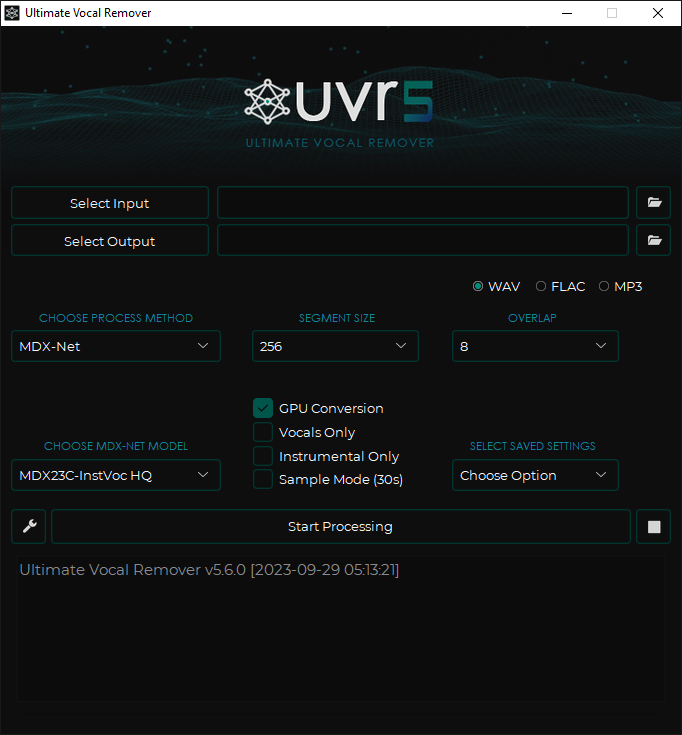
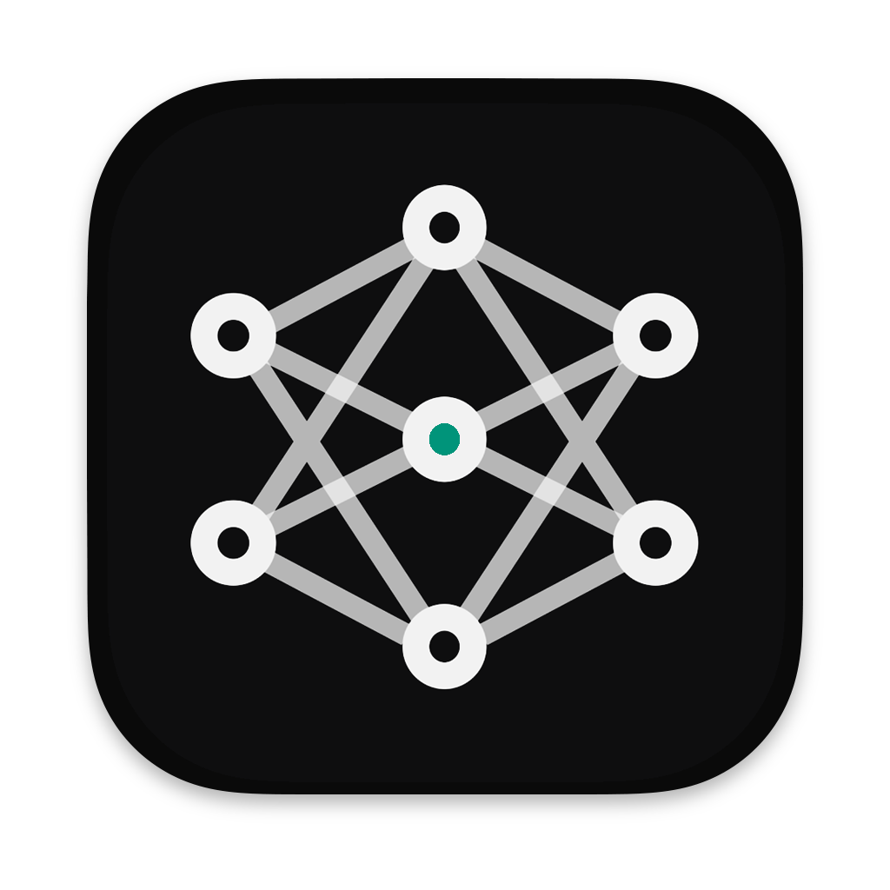

# Ultimate Vocal Remover GUI v5.6

## Source
- Type: webpage
- Origin: https://github.com/anjok07/ultimatevocalremovergui
- Author / core developers: [Anjok07](https://github.com/anjok07), [aufr33](https://github.com/aufr33)
- License: MIT
- Stats (as of import): ~25.4k stars, ~1.9k forks, Python, topics include audio / vocal-remover / pytorch / separation
- Latest release tag: [v5.6](https://github.com/Anjok07/ultimatevocalremovergui/releases/tag/v5.6) (2023-09-26; later beta assets also published under that tag)
- Imported: 2026-07-12
- Images: 3 downloaded under `assets/github-anjok07-ultimatevocalremovergui/`

## Content






GUI for a vocal remover that uses deep neural networks. UVR’s core developers trained the models shipped in the package (except Demucs v3 and v4 4-stem models).

- **Support:** [Donate](https://www.buymeacoffee.com/uvr5)

### About

The app uses state-of-the-art source separation models to remove vocals (and related stems) from audio files. Bundled installers include the UVR interface, Python, PyTorch, and other dependencies — no separate prerequisites for the official Windows/macOS packages.

### Windows installation

- Intended for Windows 10+. Win 7 or lower and Intel Pentium/Celeron systems are not guaranteed.
- Must install to the main `C:\` drive; secondary-drive installs cause instability.
- Downloads:
  - [Main installer (v5.6.0)](https://github.com/Anjok07/ultimatevocalremovergui/releases/download/v5.6/UVR_v5.6.0_setup.exe)
  - [MediaFire mirror](https://www.mediafire.com/file_premium/jiatpgp0ljou52p/UVR_v5.6.0_setup.exe/file)
  - AMD Radeon / Intel Arc: try [DirectML beta full installer](https://github.com/Anjok07/ultimatevocalremovergui/releases/download/v5.6/UVR_1_15_25_22_30_BETA_full.exe)
  - Existing installs: install over current copy, update from the app, or use the [patch](https://github.com/Anjok07/ultimatevocalremovergui/releases/download/v5.6/UVR_Patch_10_6_23_4_27.exe)

#### Manual Windows install (summary)

1. Download/extract the [repo zip](https://github.com/Anjok07/ultimatevocalremovergui/archive/refs/heads/master.zip)
2. Install [Python 3.9.8](https://www.python.org/ftp/python/3.9.8/python-3.9.8-amd64.exe) (check “Add python.exe to PATH”)
3. From the extracted repo:

```bash
python.exe -m pip install -r requirements.txt
```

Optional NVIDIA CUDA torch:

```bash
python.exe -m pip install --upgrade torch --extra-index-url https://download.pytorch.org/whl/cu117
```

- **FFmpeg:** extract `ffmpeg.exe` from [ffmpeg-release-essentials](https://www.gyan.dev/ffmpeg/builds/ffmpeg-release-essentials.zip) into the UVR app directory
- **Rubber Band** (time stretch / pitch): extract `rubberband.exe` + `sndfile.dll` from the [Windows Rubber Band build](https://breakfastquay.com/files/releases/rubberband-3.1.2-gpl-executable-windows.zip) into the UVR directory

### macOS installation

- Sonoma left-click Tkinter bug is fixed in current builds
- MPS (GPU) acceleration on Mac M1 expanded to Demucs v4 and all MDX-Net models
- Intended for macOS Big Sur+; Catalina or lower / older or budget Macs not guaranteed
- First launch may take 5–10 minutes

Downloads:

- **Apple Silicon (arm64):** [DMG](https://github.com/Anjok07/ultimatevocalremovergui/releases/download/v5.6/Ultimate_Vocal_Remover_v5_6_MacOS_arm64.dmg) · [MediaFire mirror](https://www.mediafire.com/file_premium/u3rk54wsqadpy93/Ultimate_Vocal_Remover_v5_6_MacOS_arm64.dmg/file)
- **Intel (x86_64):** [DMG](https://github.com/Anjok07/ultimatevocalremovergui/releases/download/v5.6/Ultimate_Vocal_Remover_v5_6_MacOS_x86_64.dmg) · [MediaFire mirror](https://www.mediafire.com/file_premium/2gf1werx5ly5ylz/Ultimate_Vocal_Remover_v5_6_MacOS_x86_64.dmg/file)

If macOS blocks opening:

```bash
sudo spctl --master-disable
sudo xattr -rd com.apple.quarantine /Applications/Ultimate\ Vocal\ Remover.app
```

(Re-enable Gatekeeper after UVR opens if you disabled it.)

#### Manual macOS install (summary)

1. Download [repo zip](https://github.com/Anjok07/ultimatevocalremovergui/archive/refs/heads/master.zip)
2. Install [Python 3.10.9](https://www.python.org/ftp/python/3.10.9/python-3.10.9-macos11.pkg)
3. `pip3 install -r requirements.txt`
4. On M1, copy `libsndfile_arm64.dylib` → `libsndfile.dylib` under the Python 3.10 `_soundfile_data` site-packages path (see upstream README for exact paths)
5. Place a matching [FFmpeg binary](http://www.osxexperts.net) in the app directory; Rubber Band macOS binary into `UVR/lib_v5`

### Linux installation (Debian & Arch)

Official guidance: use a **venv** — do **not** delete `/usr/lib/python3.x/EXTERNALLY-MANAGED`.

```bash
# Debian/Ubuntu/Mint
sudo apt update && sudo apt upgrade
sudo apt-get install -y ffmpeg python3-pip python3-tk

# Arch / EndeavourOS
sudo pacman -Syu
sudo pacman -S ffmpeg python-pip tk
```

```bash
cd /path/to/ultimatevocalremovergui
python3 -m venv venv
source venv/bin/activate
pip install -r requirements.txt
python UVR.py
```

Related discussion: [issue #1578](https://github.com/Anjok07/ultimatevocalremovergui/issues/1578), [PR #1068](https://github.com/Anjok07/ultimatevocalremovergui/pull/1068).

### Hardware and runtime notes

- Minimum GPU guidance: Nvidia GTX 1060 6GB; 8GB+ VRAM recommended
- AMD Radeon support limited; working branch: [v5.6-amd-gpu](https://github.com/Anjok07/ultimatevocalremovergui/tree/v5.6-amd-gpu)
- 64-bit only
- Depends on Rubber Band (time-stretch / pitch-shift) and FFmpeg (non-WAV)
- Settings remembered on close; conversion time is hardware-bound; models are computationally intensive
- v5.6 notes faster model load and import/export

### Troubleshooting

- Missing FFmpeg → errors on non-WAV conversion
- Memory allocation errors → lower Segment or Window sizes
- MacOS Sonoma click bug → use latest v5.6 builds ([tracked in #840](https://github.com/Anjok07/ultimatevocalremovergui/issues/840))
- For bug reports: Settings → Error Log next to Start Processing

### License and credits

- App code: [MIT](https://github.com/Anjok07/ultimatevocalremovergui/blob/master/LICENSE). Third-party apps using UVR models should credit UVR and its developers.
- Notable credits (upstream README): ZFTurbo (MDX23C weights), DilanBoskan, Bas Curtiz (logo/banner/splash), tsurumeso (VR Architecture), Kuielab / Woosung Choi (MDX-Net), Facebook Research Demucs, KimberleyJSN, Hv, and others

### Reference

- Takahashi et al., “Multi-scale Multi-band DenseNets for Audio Source Separation”, https://arxiv.org/pdf/1706.09588.pdf

## Key Takeaways
- UVR is a popular MIT-licensed desktop GUI (~25k★) for DNN-based vocal/stem separation, with official Windows/macOS bundles and manual Linux/venv install paths.
- Core models are trained by UVR developers except Demucs v3/v4 4-stem; architectures include MDX-Net, Demucs, VR, and related community models.
- Practical constraints: install Windows builds on `C:\`, prefer Nvidia GPU with ≥6–8GB VRAM, need FFmpeg + Rubber Band for full format/tool support.
- Prefer venv on Linux; avoid deleting Python `EXTERNALLY-MANAGED`; AMD users should look at the `v5.6-amd-gpu` branch / DirectML Windows builds.
