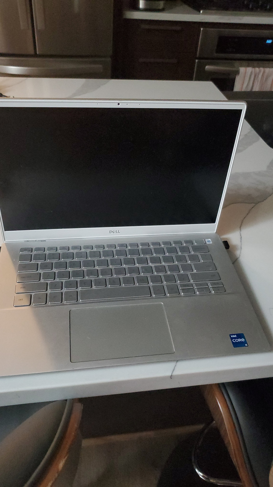
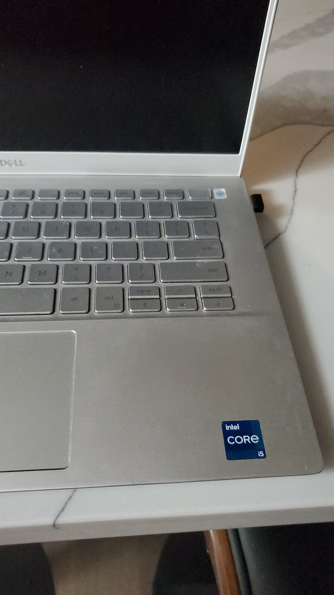
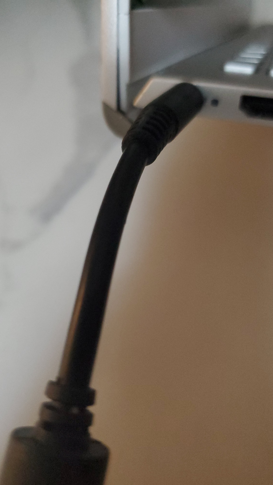
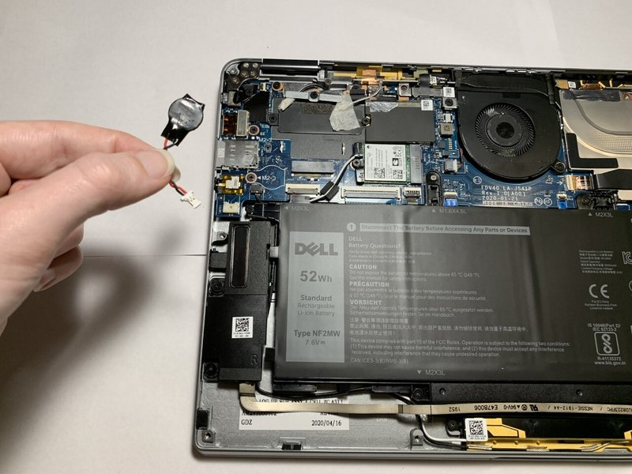

# Dell laptop won't turn on — power drain / CMOS reset (r/Dell)

## Source

- Type: webpage
- Origin: https://www.reddit.com/r/Dell/comments/16bab9h/help_my_dell_laptop_wont_turn_on_ive_done/
- Imported: 2026-07-27
- Note: Reddit blocked direct fetch (403); content recovered via PullPush archive API. Gallery photos downloaded into `assets/`.

## Content

### Original post (u/Rough-Tea-3454, 2023-09-06)

> Help my Dell laptop won't turn on I've done everything said from the internet. Any tips? I got important stuff I forgot to download

Gallery from the OP (silver Dell / Intel Core i5, screen black, DC barrel charger plugged in with **charging LED dark**):

**Symptom called out in-thread:** charging-port LED off while plugged in → no power reaching the machine (adapter seating, outlet, brick cable, or board-side power path).

### Primary fix — disconnect main + CMOS, hold power 60s (u/InfectedIntent)

Widely confirmed across Inspiron / Latitude / Precision / G-series replies. Claimed root cause: Dell power-regulation logic stuck; draining residual power clears it.

1. Remove the bottom cover.
2. Unplug the **main battery** and the **CMOS (coin-cell) battery**.
3. For the CMOS connector: use a plastic pry tool / spudger / old card. Rock the sides, push the connector out from the center. **Do not pull by the wires.**
4. Hold the power button for **60 seconds** (both batteries still disconnected).
5. Reconnect both batteries, plug in the charger, power on. Fan may spin briefly before boot.
6. Reassemble.

Reference photo of a disconnected Dell CMOS pack (linked from that comment; iFixit guide image):

**Why (same author):** charging-circuit logic can stick powered; removing both batteries and holding power forces a true unpowered state. A dying CMOS usually shows other symptoms (boot errors, clock drift) — not required to replace just because this reset worked.

**If it recurs often:** under warranty → Dell board RMA; otherwise update BIOS via [Dell Command Update](https://www.dell.com/support/kbdoc/en-us/000177325/dell-command-update).

**Models people reported success on (non-exhaustive):** Inspiron 14 5000, 15 3525, 15 5000, 5502, 5515, 5570, 7391, 13 7000; Latitude 5431, 5510, E5570, E7450, 5290 2-in-1; Precision 7730 / battery reseat on 5680; G5.

Some newer models (e.g. Inspiron 3520) reportedly have **no discrete CMOS** — main-battery disconnect + 60s hold alone revived at least one unit.

### Other useful checks from the thread

- **Adapter / outlet first** (u/St0nywall): confirm brick AC cable fully seated, try a known-good outlet; dark charge LED is the tell.
- **LCD built-in test** (u/BitByte111): hold **D**, press power once, keep holding D ~30–40s until the display test appears (RGB/white). Hold power ~10s to exit if stuck. Also mentioned: **Ctrl+Esc** then power once and check LED blink.
- **Replace a dead motherboard/CMOS button battery** if drain reset fails (u/Decent-Lavishness938) — ML-1220 packs may have two connector styles (u/Saxphile).
- **Battery reseat only** (no CMOS) fixed a Precision 5680 for one user.
- Video walkthroughs cited by others: [YouTube C0FVH4Ux1Ec](https://www.youtube.com/watch?v=C0FVH4Ux1Ec), [YouTube qDgeTLzzByQ](https://www.youtube.com/watch?v=qDgeTLzzByQ).
- External guide linked in-thread: [salvagedata.com — Dell laptop won't turn on](https://www.salvagedata.com/dell-laptop-wont-turn-on/).

### Caveats

- Opening the case can void warranty; ESD and connector care matter.
- Not every “no power” case is the stuck charge-logic bug (bad adapter, DC jack, board failure, Security Manager lockouts, etc.).
- PullPush returned many “thanks it worked” replies; scores are flattened in the archive dump, so treat community confirmation as qualitative.

## Key Takeaways

- Dark charge LED with adapter plugged in usually means no power path — verify adapter/outlet before opening the chassis.
- Highest-signal community fix: disconnect **main + CMOS**, hold power **60 seconds**, reconnect, then boot.
- Never yank the CMOS pack by its wires; pry the white connector.
- Recurrent failures → BIOS update or Dell board warranty; occasional recurrence after the drain reset is reported as normal.
- Built-in **D + power** LCD test helps separate “dead board” from “display/boot path” issues.
