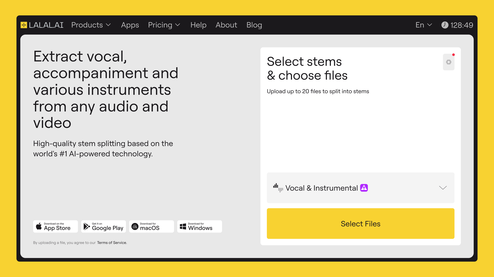

# Best Vocal Removers for Professional Music & Video Production: 2026 Selection

## Source
- Type: webpage
- Origin: https://vocal.media/01/best-vocal-removers-for-professional-music-and-video-production-2026-selection
- Author: LALAL.AI
- Imported: 2026-07-12
- Images: 2 downloaded under `assets/vocal-media-best-vocal-removers-2026/`

## Content

*Photo by [Erwi](https://unsplash.com/@erwimadethis) on [Unsplash](https://unsplash.com/)*

For years, vocal remover tools were treated as niche utilities, useful for karaoke tracks or quick DJ edits. That reputation no longer holds. In 2026, stem separation sits at the center of modern audio workflows, used not just by producers and engineers, but by post-production teams, broadcasters, automotive UX designers, and localization studios.

The term itself has become outdated. Today’s tools do far more than isolate vocals from instrumentals. They split mixes into drums, bass, guitars, keyboards, strings, backing vocals, and dialogue layers, often with a level of clarity that would have required original multitrack sessions just a few years ago.

This article reviews the best vocal removers and stem separation tools available in 2026, with a focus on professional use cases rather than casual experimentation.

### Why Vocal Removal Still Matters in 2026

Audio production has grown more modular. According to the Data Insights Market’s report, the broader vocal remover market is valued at $390 million in 2025, projecting an 8.2% CAGR through 2033, which likely reflects growth from AI advancements and rising use in podcasting, video editing, and industries beyond music production.

Songs are remixed across platforms like YouTube and TikTok; Spotify has launched in-app remix features; dialogue is repurposed for different languages; and sound assets move between music, video, and product design. At the same time, access to original stems remains limited. Labels, agencies, and studios rarely share full multitrack sessions outside tightly controlled environments.

Stem separation, and vocal removers particularly, fill that gap:

- Producers extract clean vocals for remixes and edits
- Film and TV teams adjust dialogue without production audio
- Advertising agencies separate music beds for format adaptation
- Automotive and product designers isolate voice layers for interactive systems testing

In all these cases, the question is no longer whether AI-based separation works, but whether it works well enough to fit into professional pipelines without introducing problems downstream.

### How the Tools Were Evaluated

Tools were tested on real-world material rather than lab-clean demos: commercially released tracks across pop, hip-hop, electronic, rock, and acoustic genres, plus spoken-word from podcasts and social video.

Evaluation factors:

1. **Separation quality** — vocal clarity, backing-vocal handling, artifacts in quiet passages or sustained notes; attention to reverb tails, sibilance, and instrument cross-bleed
2. **Stem depth** — vocal/instrumental only vs multi-stem outputs
3. **Workflow integration** — web, desktop, mobile, plugins, APIs
4. **Licensing and pricing** — especially for commercial/team use

### LALAL.AI: Best Overall for Professional Vocal Isolation

*Credit: LALAL.AI*

LALAL.AI balances separation accuracy and workflow flexibility. What began as a vocal/instrumental splitter has expanded into multi-stem separation and voice modification, extracting drums, bass, piano, guitars, synths, strings, and several vocal layers (lead and backing).

In testing, vocal isolation powered by the Andromeda algorithm stayed consistent in dense, heavily mastered mixes. Lead vocals retained presence without excessive smearing; backing vocals separated cleanly enough for independent treatment. Reverb tails were preserved without the metallic artifacts common in earlier systems.

Availability: web app, desktop, iOS/Android, API for automated workflows, and a VST3 plugin for DAW-native isolation. Suitable for individual producers and teams processing large audio libraries.

Professional use beyond music includes automotive UX sound design (interactive music/soundscapes), post-production dialogue stems for dubbing/localization, and batch archive restoration.

**Limitation:** stem separation remains a preprocessing step; results depend on source quality and usually need further editing/cleanup before delivery.

**Pricing (as published):** Starter (free, limited); Lite ($9.99/mo or $90/yr); Pro ($19.99/mo or $180/yr); top-ups and Enterprise available.

### iZotope RX Music Rebalance: Best for Post-Production Control

Music Rebalance (in iZotope RX) adjusts relative levels of vocals, bass, percussion, and other elements within a mix rather than exporting clean stems. That suits broadcast and film where subtle changes beat full extraction (e.g. lift dialogue above music without rebuilding sound design).

Performs best on moderately complex material. On modern pop/electronic with aggressive limiting and layered effects, separation can feel restrained vs dedicated stem tools. Strength is precision and predictability in post-production.

**Availability / pricing (as published):** RX 11 Standard and higher; Standard typically ~$399 perpetual. Music Production Suite Pro (includes RX with Music Rebalance) ~$24.99/mo or ~$250/yr. Lower-tier Producers Club from ~$19.99/mo. Standalone upgrades/bundles often $100–$400 on sale; full suites can exceed $500; academic pricing available.

### Spleeter-Based Tools: Best Open-Source Ecosystem

Spleeter (originally Deezer) still influences stem separation via community tools. Original project pace has slowed, but models and derivatives remain widely used.

Appeal is flexibility: adapt models, custom pipelines, research/prototyping. Quality varies by implementation; setup needs technical knowledge; results less consistent than commercial platforms on broader datasets. Best for teams that value control over convenience.

**Pricing:** free; available as online solutions / community implementations.

### Ultimate Vocal Remover (UVR): Best for High-Quality Open-Source Vocal Isolation

UVR is a well-known open-source stem separation desktop app (Windows, macOS, Linux; some web-hosted versions) using neural models including MDX-Net, Demucs, and community models for vocals, drums, bass, and other instruments.

Users often report quality matching or exceeding paid tools on certain material, especially basic vocal/instrument splits. Can be slow on CPU-only machines and may need tuning to avoid artifacts or phase issues.

**Availability:** GitHub download and community contributions.

### VocalRemover: Best for Ease of Use

[VocalRemover.org](https://vocalremover.org) is a free browser-based AI vocal isolation / stem tool: upload MP3/WAV/FLAC, download isolated vocals and instrumentals. Extra utilities include basic editing, tempo/pitch, and simple drums/bass splits — generally simpler than full DAW tools. Aimed at hobbyists and quick experiments.

**Pricing:** base service free.

### Common Mistakes When Using Stem Separation Tools

- Expecting clean results from aggressively limited masters (heavy compression reduces separation information → more artifacts)
- Poor gain staging or phase alignment when reintegrating stems
- Treating AI stems as final assets instead of intermediate material

### The State of Vocal Removal in 2026

Vocal removal has matured into dependable professional tooling: finer stem granularity, better live-recording handling, tighter production-software integration. Best results come from matching tools to workflow realities, not chasing the newest feature. Stem separation’s value is how quietly and reliably it does its job.

## Key Takeaways
- In 2026, “vocal removers” are professional multi-stem tools used in music, post, broadcast, localization, and product/automotive UX — not just karaoke utilities.
- Evaluation criteria that matter for pros: separation quality (including reverb/sibilance), stem depth, workflow integration (API/plugin/DAW), and commercial licensing.
- LALAL.AI is presented as best overall (Andromeda algorithm, multi-stem, web/desktop/mobile/API/VST3); iZotope RX Music Rebalance for subtle post-production level control; Spleeter ecosystem and UVR for open-source; VocalRemover.org for quick free web use.
- Treat AI stems as intermediate assets; source quality and careful reintegration still determine usable results.
