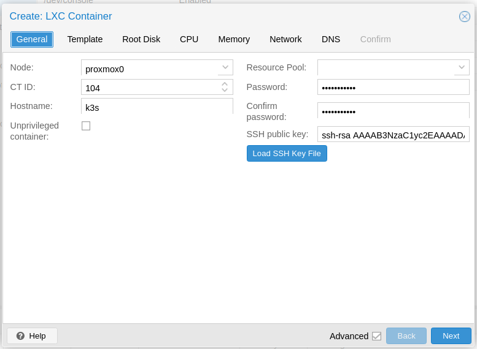
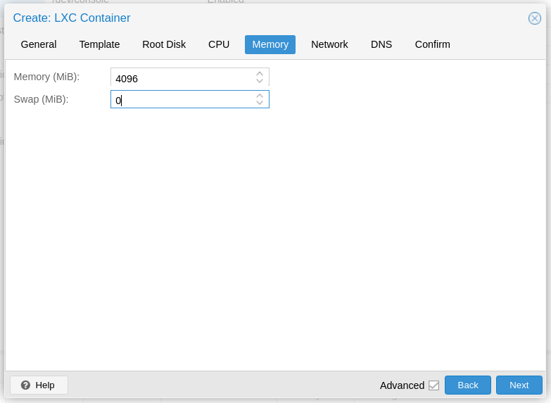

# Provision LXC Containers



### On the host

#### Ensure these modules are loaded

```
cat /proc/sys/net/bridge/bridge-nf-call-iptables
```

#### Disable swap

```
sysctl vm.swappiness=0
swapoff -a
```

#### Enable IP Forwarding

The first time I tried to get this working, once the cluster was up, the traefik pods were in CrashloopBackoff due to ip\_forwarding being disabled. Since LXC containers share the host's kernel, we need to enable this on the host.

```
echo 'net.ipv4.ip_forward=1' >> /etc/sysctl.conf
sysctl --system
```



### Create the k3s container

#### Uncheck unprivileged container



#### Set swap to 0



#### Enable DHCP


#### Results





### Back on the Host

Edit the config file for the container (`/etc/pve/lxc/$ID.conf`) and add the following:

```
lxc.apparmor.profile: unconfined
lxc.cgroup.devices.allow: a
lxc.cap.drop:
lxc.mount.auto: "proc:rw sys:rw"
```



### In the container

#### /etc/rc.local

/etc/rc.local doesn't exist in the default 20.04 LXC template provided by Proxmox. Create it with these contents:

```
#!/bin/sh -e

# Kubeadm 1.15 needs /dev/kmsg to be there, but it's not in lxc, but we can just use /dev/console instead
# see: https://github.com/kubernetes-sigs/kind/issues/662
if [ ! -e /dev/kmsg ]; then
    ln -s /dev/console /dev/kmsg
fi

# https://medium.com/@kvaps/run-kubernetes-in-lxc-container-f04aa94b6c9c
mount --make-rshared /
```

Then run this:

```
chmod +x /etc/rc.local
reboot
```



### Installing k8s

#### k3sup Installation

Assuming $HOME/bin is in your PATH:

```
curl -sLS https://get.k3sup.dev | sh
mv k3sup ~/bin/k3sup && chmod +x ~/bin/k3sup
```

#### k8s Installation

```
k3sup install --ip $CONTAINER_IP --user root
```

#### Test

```
KUBECONFIG=kubeconfig kubectl get pods --all-namespaces
NAMESPACE     NAME                                     READY   STATUS      RESTARTS   AGE
kube-system   metrics-server-7566d596c8-zm7tj          1/1     Running     0          69m
kube-system   local-path-provisioner-6d59f47c7-ldbcl   1/1     Running     0          69m
kube-system   helm-install-traefik-glt48               0/1     Completed   0          69m
kube-system   coredns-7944c66d8d-67lxp                 1/1     Running     0          69m
kube-system   traefik-758cd5fc85-wzcst                 1/1     Running     0          68m
kube-system   svclb-traefik-cwd9h                      2/2     Running     0          42m
```



### References

* https://github.com/MarijnKoesen/kubernetes-in-proxmox-with-kubeadm-lxc-and-wireshark
* https://github.com/kubernetes-sigs/kind/issues/662
* https://medium.com/@kvaps/run-kubernetes-in-lxc-container-f04aa94b6c9c
