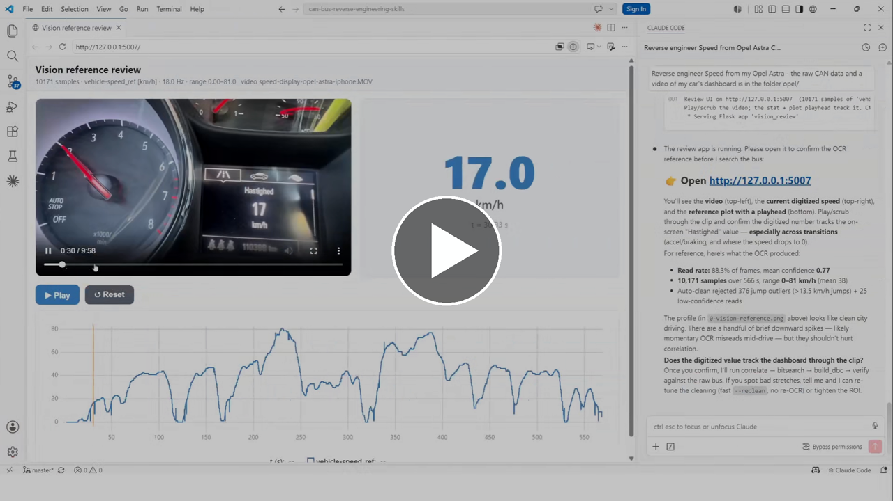
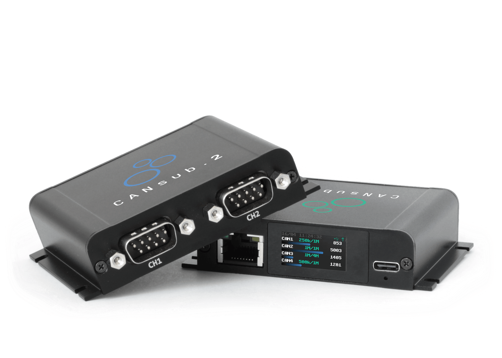
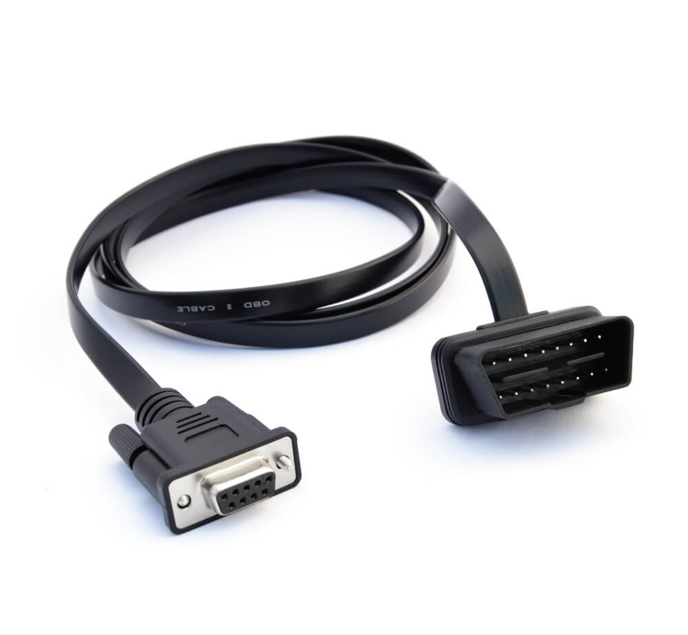

# CAN Bus Reverse Engineering Skills (CSS Electronics)

## Source

- Type: webpage
- Origin: https://github.com/CSS-Electronics/can-bus-reverse-engineering-skills
- Imported: 2026-06-29
- Images: 3 saved under `./assets/github-css-electronics-can-bus-reverse-engineering-skills/`

## Content

[CSS Electronics](https://www.csselectronics.com) publishes an open-source repo of [Claude Code](https://www.claude.com/claude-code) skills that help reverse engineer raw CAN bus data into decoding rules stored as DBC files. The workflow uses AI/LLM tools together with [python-can](https://www.csselectronics.com/pages/python-can-usb-serial-api-stream) scripts to identify which CAN ID and data bits encode a real-world value (speed, RPM, state of charge, and so on), derive start bit, length, endianness, scale, and offset, and verify the result.

The skills assume a [CANsub](https://www.csselectronics.com/products/can-fd-usb-interface-ethernet-cansub-2) CAN bus interface from CSS Electronics — either recording CSV log files via [webCAN](https://www.csselectronics.com/pages/webcan-can-bus-streaming-software-browser) or streaming data in real time over USB/Ethernet.

> **Note:** This is an illustration of how CANsub + Python + AI can be used for CAN sniffing, not a polished production tool. See also the related article [CAN bus reverse engineering with AI](https://www.csselectronics.com/pages/can-bus-reverse-engineering-ai-llm-claude).

[](https://cdn.shopify.com/videos/c/o/v/e384c5a75b7943e681dcbad2d10e230a.mp4)

### Bundled skills

Three skills auto-discover when you open the repo folder in Claude Code (under `.claude/skills/`):

| Skill | Purpose |
| --- | --- |
| **cansub-reverse-engineering** | End-to-end workflow: survey → correlate → bitsearch → build DBC → verify |
| **combine-dbc** | Merge per-signal DBCs into one application-level DBC |
| **cansub-knowledge** | CANsub specs and API reference (hardware, REST/WebSocket API, protocols, tools) |

#### cansub-reverse-engineering

Deterministic Python script chain replaces manual "watch the screen for correlations." Supports three modes:

1. **Offline** — decode from an existing log (CAN + OBD2 CSV, MF4/CANedge, webCAN CSV) using a separately decodable reference (OBD2 PID, CANmod.gps, CANedge GPS/IMU on CAN9). No hardware required.
2. **Live** — capture from a CANsub with a human-supplied reference value.
3. **Vision** — user provides a CAN log plus a video of a dashboard/gauge display; local OCR digitizes the on-screen value as reference.

Targets plain, non-multiplexed CAN signals. Scripts never transmit data frames; `capture.py` connects in normal mode by default so the CANsub ACKs received frames (required for single-node sensor-to-CAN modules).

#### combine-dbc

Combines individual single-signal DBC files under `decoding-output/<application>/<signal>/<signal>.dbc` into `decoding-output/<application>/<application>.dbc`. Safe to re-run as new signals are confirmed.

#### cansub-knowledge

Authoritative reference for CANsub.2 and CANsub.4: hardware specs, REST/WebSocket API, bit timing, filters, connectors, firmware, higher-layer protocols (OBD2, UDS, J1939, NMEA 2000, CANopen, CCP/XCP), and software tools (webCAN, SavvyCAN, PlotJuggler).

### Recommended hardware





- [CANsub.2](https://www.csselectronics.com/products/can-fd-usb-interface-ethernet-cansub-2) CAN FD interface with USB/Ethernet
- [OBD2-DB9 adapter cable](https://www.csselectronics.com/products/obd2-db9-adapter-cable) (optionally a [contactless adapter](https://www.csselectronics.com/products/contactless-can-bus-reader-adapter))

### Setup

1. **Clone the repo** (or download the ZIP).
2. **Install Python 3.10+** — on Windows, tick "Add python.exe to PATH".
3. **Install dependencies** into a local `.venv`:
   - Windows: run `install.bat`
   - macOS / Linux: `python3 -m venv .venv && .venv/bin/pip install -r requirements.txt`
4. **Claude Code** — Claude Pro/Max subscription, VS Code, Claude Code extension, open the cloned folder so skills load automatically.
5. **Connect hardware** — CANsub via USB, OBD2-DB9 cable to vehicle OBD2 port, engine or ignition on for live traffic. Verify streaming in webCAN first.

### Example prompts

- "I've connected my CANsub to my car via the OBD2-DB9 cable. Help me check if there is live proprietary CAN data available — and then help me reverse engineer my door locks."
- "Reverse engineer Speed and RPM from the proprietary CAN data found in Mercedes-E350-2010-obd2-can.csv (contains OBD2 reference data)."
- "I have a CANedge log with proprietary vehicle CAN data plus the CANedge's internal GPS/IMU on CAN9. Use the GPS speed as the reference to reverse engineer the proprietary vehicle speed."
- "Help me reverse engineer Speed from my Opel Astra. I have put the raw CAN data in opel/ along with a video of the speed from my car's dashboard."
- "I have a gauge-to-CAN module with 8 gauges connected to my CANsub — help me reverse engineer the 1st gauge position signal."

Sample data: [CANsub CAN+OBD2 sample data pack](https://www.csselectronics.com/pages/ai-can-bus-sniffer-data-pack).

### Output structure

Each confirmed signal is saved under `decoding-output/`, grouped by application and signal:

```
decoding-output/
  <application>/                         e.g. mercedes-e350/
    <signal>/<signal>.dbc                e.g. engine-rpm/engine-rpm.dbc
    <signal>/<signal>.png                verify plot (decoded vs reference)
    <signal>/analysis-plots/             survey / correlate / bit-search / fit plots
    <application>.dbc                     combined DBC across all signals
```

Ask Claude to merge decoded signals:

> Combine the decoded DBCs for mercedes-e350 into a single DBC.

Load the combined DBC in webCAN and stream live from CANsub for real-time confirmation.

### License

MIT License — free to use, modify, and distribute. Attribution appreciated: [CAN bus reverse engineering with AI](https://www.csselectronics.com/pages/can-bus-reverse-engineering-ai-llm-claude).

## Key Takeaways

- Three Claude Code skills cover the full CAN reverse-engineering workflow: decode (`cansub-reverse-engineering`), merge (`combine-dbc`), and hardware reference (`cansub-knowledge`).
- Works offline from existing logs (OBD2/GPS reference), live with CANsub, or via dashboard video + OCR for vision-based reference.
- Output is per-signal DBC files under `decoding-output/`, combinable into an application-level DBC for live decoding in webCAN.
- Requires CANsub hardware for live capture; sample CSV data is available for testing without a vehicle.
