# Create Your Own CAN Network With MCP2515 Modules and Arduino

## Source

- Type: webpage
- Origin: https://lastminuteengineers.com/mcp2515-can-module-arduino-tutorial/
- Imported: 2026-09-10
- Author: Shreepad Prabhu (Last Minute Engineers, last updated 2026-01-20)
- Figures: 19 saved under `./assets/lastminuteengineers-mcp2515-can-module-arduino/` (local copies). Related-article thumbs and author photo omitted.

## Content

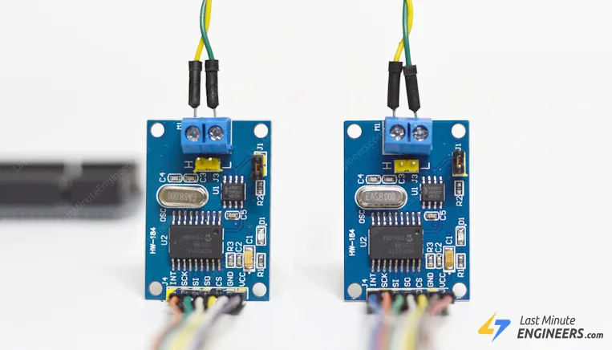

Older cars used thousands of metres of point-to-point wiring. Bosch introduced CAN bus in 1986 as a cheaper, shared two-wire network. It is now the industry standard in cars, trucks, buses, tractors, aircraft, and ships.

Reading and parsing CAN frames on Arduino is the usual path to coolant temperature, throttle, vehicle speed, RPM, and similar in-dash data. The cheap SPI **MCP2515** breakout (Microchip controller + Philips/NXP **TJA1050** transceiver) is the tutorial’s recommended way to add CAN to an Arduino.

### Basics of CAN bus

A Controller Area Network lets in-vehicle devices talk to each other without a host computer. The tutorial analogizes CAN to a car’s nervous system.

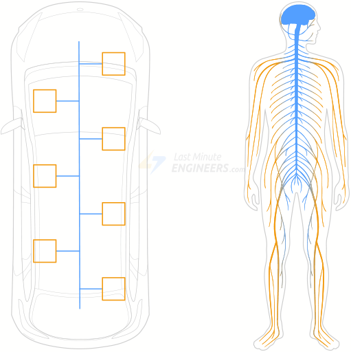

Nodes are Electronic Control Units (ECUs). A modern car may have 70+ ECUs. They share data even when each ECU owns one task: the engine module broadcasts engine speed to the cluster; a door controller tells the opposite door to move a window.

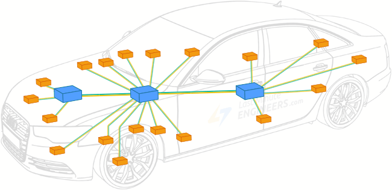

ECUs are **multi-master**: any node can take the bus and broadcast. Every other node sees the frame and decides whether to use it.

#### Topology

Physical media is a twisted pair: **CAN High** and **CAN Low**. Twisting makes EMI hit both wires similarly so differential signalling stays intact.

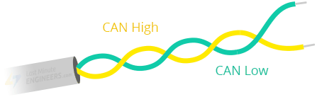

Both far ends of the bus are terminated with **120 Ω**. Without termination, reflections corrupt the next bit and can take the bus down.

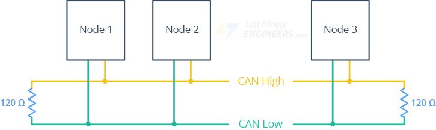

#### Signalling

Voltage levels on the pair map to logic:

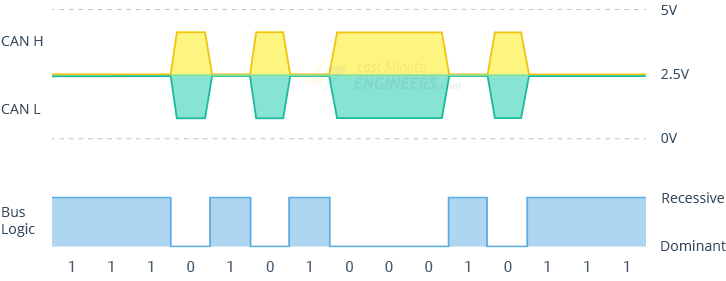

| State | Meaning | Typical voltages |
| --- | --- | --- |
| Recessive (logic 1) | Bus idle / available | Both lines ~2.5 V (no differential) |
| Dominant (logic 0) | A node is transmitting | CANH ~3.5 V, CANL ~1.5 V (~2 V differential) |

#### CAN node

Each node is transceiver + CAN controller + microcontroller.

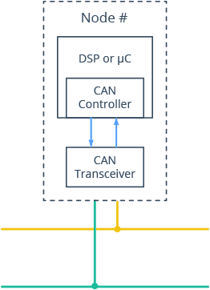

- **Transceiver** — bus voltages ↔ controller logic levels (both directions).
- **Controller** — serializes frames onto a free bus; on RX, assembles a full frame then interrupts the MCU.
- **Microcontroller** — interprets payloads and decides what to send. Sensors and actuators hang off it.

#### Standard CAN frame (11-bit ID)

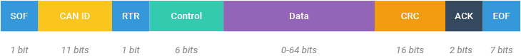

| Field | Role |
| --- | --- |
| SOF | Dominant 0: a node intends to talk |
| ID | Message identity and meaning. Lower ID = higher priority |
| RTR | Data frame vs remote request |
| Control | IDE (dominant 0 for 11-bit) plus 4-bit DLC (payload length) |
| Data | Up to 8 bytes |
| CRC | Error detection |
| ACK | Receiver acknowledged the frame |
| EOF | End of frame |

CAN is **message-based**, not address-based. Nodes do not have IDs; **messages** do. Every node hears every frame and filters locally.

### MCP2515 module hardware

Complete SPI CAN solution: **MCP2515** CAN 2.0B controller + **TJA1050** high-speed transceiver. Useful in noisy environments or over longer runs.

#### MCP2515 controller

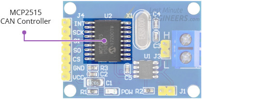

Stand-alone CAN 2.0B controller. TX/RX of standard and extended data and remote frames. Masks and filters drop unwanted IDs so the MCU is not flooded. **INT** fires when a valid frame lands in a receive buffer.

Datasheet: [MCP2515 Stand-Alone CAN Controller with SPI](https://ww1.microchip.com/downloads/en/DeviceDoc/MCP2515-Stand-Alone-CAN-Controller-with-SPI-20001801J.pdf)

#### TJA1050 transceiver

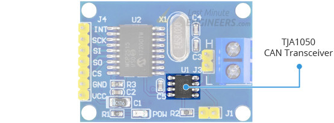

Physical two-wire interface: up to **1 Mb/s**, low quiescent current, automotive EMC/ESD. Up to **110 nodes** on the bus.

Datasheet: [TJA1050](https://www.nxp.com/docs/en/data-sheet/TJA1050.pdf)

#### Bus connector and length vs bitrate

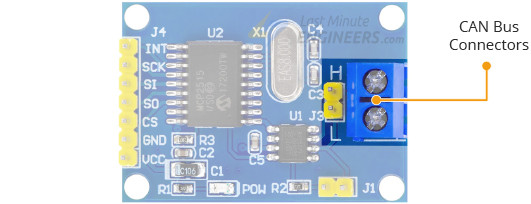

2-pole screw terminal labelled **H** and **L** for twisted pair. Module claims up to 1 Mb/s; usable speed falls with length. Tutorial numbers: **40 m at 1 Mb/s**, **500 m at 125 kb/s**.

#### Node termination

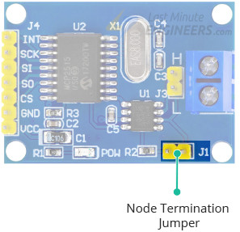

On-board **120 Ω** plus a jumper. **Leave the jumper on** for first/last nodes. **Remove it** on middle nodes.

#### Technical specifications (tutorial table)

| Item | Value |
| --- | --- |
| Operating voltage | 4.75–5.25 V (TJA1050 requirement) |
| CAN specification | 2.0B at 1 Mb/s |
| Crystal | 8 MHz |
| Transmit buffers | Three, with prioritization and abort |
| Receive buffers | Two, prioritized storage |
| Filters | Six 29-bit filters |
| Masks | Two 29-bit masks |
| Interrupts | One INT, selectable enables |
| Host interface | SPI up to 10 MHz |

### Pinout

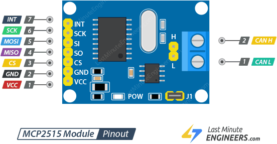

#### MCU / SPI side

| Pin | Function |
| --- | --- |
| INT | Interrupt when a valid frame is in a RX buffer |
| SCK | SPI clock |
| SI | MOSI (Arduino → module) |
| SO | MISO (module → Arduino) |
| CS | Chip select, hold low to start an SPI transaction |
| GND | Common ground |
| VCC | **5 V only** |

#### CAN side

2-pin screw terminal plus 2-pin header:

| Pin | Function |
| --- | --- |
| L | CAN Low |
| H | CAN High |

### Hardware hookup

#### Example 1: two-node network

One transmitter, one receiver. Wire **two identical** Arduino + MCP2515 circuits.

UNO / Nano V3 SPI baseline: **13 SCK**, **12 MISO**, **11 MOSI**, **10 CS**. Other boards: check that board’s SPI pins first. Module **INT** → Arduino **D2**. **VCC → 5 V**, **GND → GND**.

CAN L to CAN L, CAN H to CAN H. Twisted pair is preferred; short breadboard runs can skip it. Longer / noisier runs want twist and shielding.

Both modules keep the **termination jumper on**.

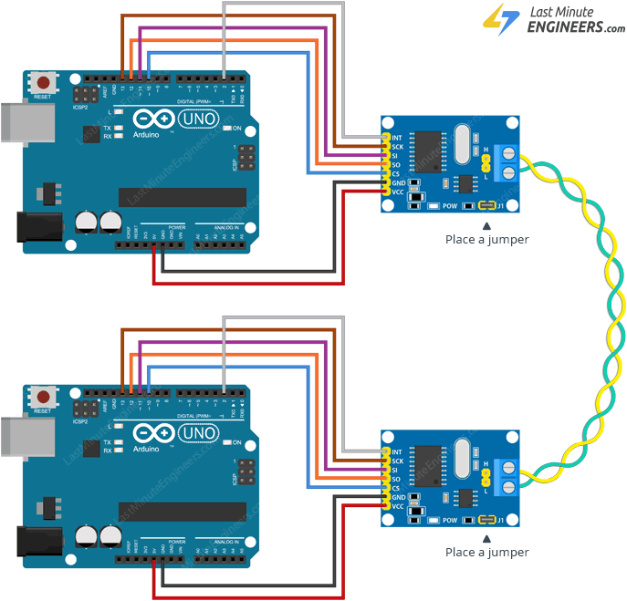

#### Example 2: multi-node network

Several transmitters, one node that dumps frames to a PC over serial. Extra nodes splice in-line or hang on a stub **under 12 inches**. Jumpers **on the two ends only**; remove them in the middle.

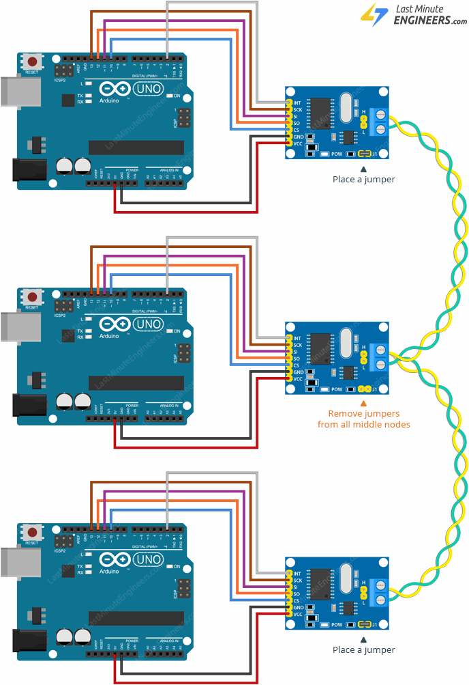

### Library installation

Arduino Library Manager: **Sketch → Include Library → Manage Libraries…**, search `mcp2515`, install **CAN by Sandeep Mistry** ([sandeepmistry/arduino-CAN](https://github.com/sandeepmistry/arduino-CAN)).

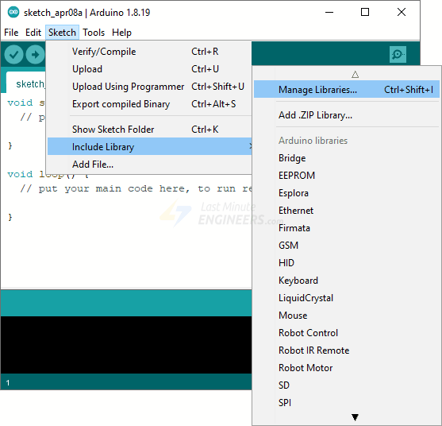

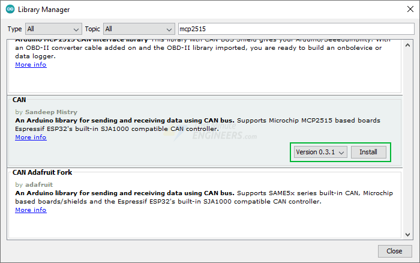

Both example sketches start the bus at **500 kb/s**.

### Transmitter sketch

Upload to each transmitter. On a multi-node bus, give each node a **unique message ID**.

```cpp
#include <CAN.h>

void setup() {
  Serial.begin(9600);
  while (!Serial);

  Serial.println("CAN Sender");

  // start the CAN bus at 500 kbps
  if (!CAN.begin(500E3)) {
    Serial.println("Starting CAN failed!");
    while (1);
  }
}

void loop() {
  // send packet: id is 11 bits, packet can contain up to 8 bytes of data
  Serial.print("Sending packet ... ");

  CAN.beginPacket(0x12);
  CAN.write('h');
  CAN.write('e');
  CAN.write('l');
  CAN.write('l');
  CAN.write('o');
  CAN.endPacket();

  Serial.println("done");

  delay(1000);

  // send extended packet: id is 29 bits, packet can contain up to 8 bytes of data
  Serial.print("Sending extended packet ... ");

  CAN.beginExtendedPacket(0xabcdef);
  CAN.write('w');
  CAN.write('o');
  CAN.write('r');
  CAN.write('l');
  CAN.write('d');
  CAN.endPacket();

  Serial.println("done");

  delay(1000);
}
```

### Receiver sketch

`loop()` is empty: `CAN.onReceive` is driven from the MCP2515 interrupt path.

```cpp
#include <CAN.h>

void setup() {
  Serial.begin(9600);
  while (!Serial);

  Serial.println("CAN Receiver Callback");

  // start the CAN bus at 500 kbps
  if (!CAN.begin(500E3)) {
    Serial.println("Starting CAN failed!");
    while (1);
  }

  // register the receive callback
  CAN.onReceive(onReceive);
}

void loop() {
  // do nothing
}

void onReceive(int packetSize) {
  // received a packet
  Serial.print("Received ");

  if (CAN.packetExtended()) {
    Serial.print("extended ");
  }

  if (CAN.packetRtr()) {
    // Remote transmission request, packet contains no data
    Serial.print("RTR ");
  }

  Serial.print("packet with id 0x");
  Serial.print(CAN.packetId(), HEX);

  if (CAN.packetRtr()) {
    Serial.print(" and requested length ");
    Serial.println(CAN.packetDlc());
  } else {
    Serial.print(" and length ");
    Serial.println(packetSize);

    // only print packet data for non-RTR packets
    while (CAN.available()) {
      Serial.print((char)CAN.read());
    }
    Serial.println();
  }

  Serial.println();
}
```

### Demonstration

Serial Monitor at **9600**. Transmitter sends a standard frame (`0x12` / `hello`) and an extended frame (`0xabcdef` / `world`) once a second.

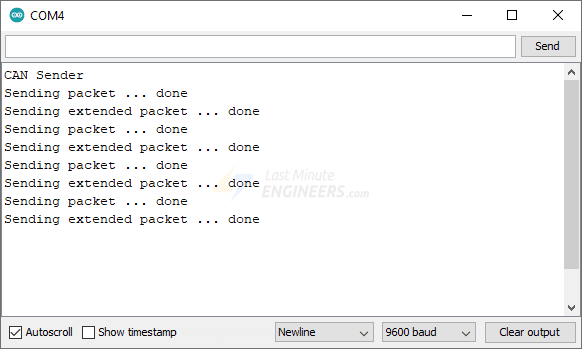

Receiver prints ID, length, and ASCII payload.

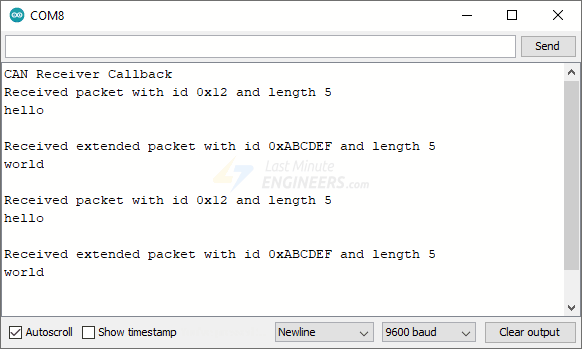

## Key Takeaways

- MCP2515 SPI breakouts pair a CAN 2.0B controller with a TJA1050 transceiver; **VCC is 5 V only** (4.75–5.25 V).
- CAN is multi-master and **message-ID addressed**: lower ID wins arbitration; every node filters locally.
- Terminate **both ends at 120 Ω** (jumper on end modules, off on stubs/middles); keep extra stubs under ~12 inches.
- UNO/Nano baseline: SPI 13/12/11/10, INT on D2, CANH–CANH and CANL–CANL; bus example rate is **500 kb/s**.
- Library used here is **CAN by Sandeep Mistry**; sketches send 11-bit `0x12` (`hello`) and extended `0xabcdef` (`world`).
