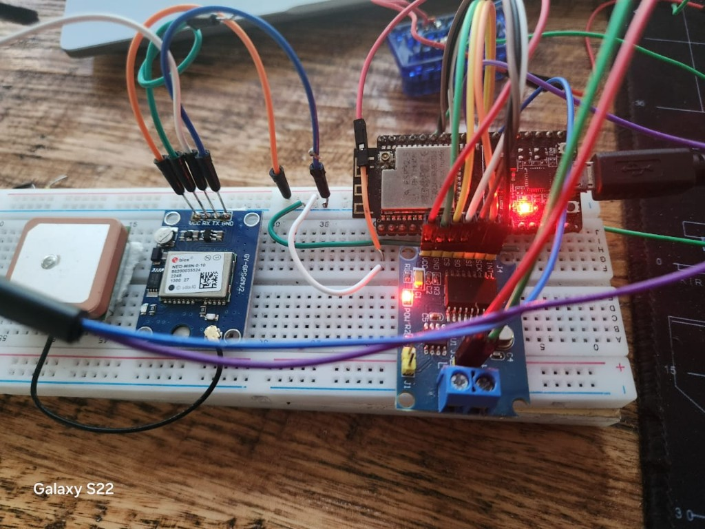
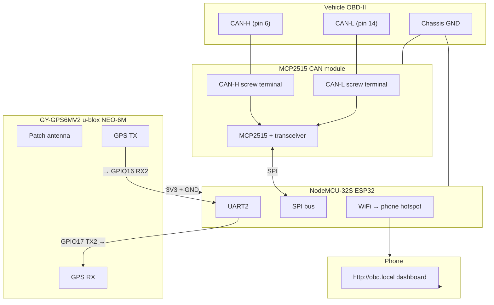
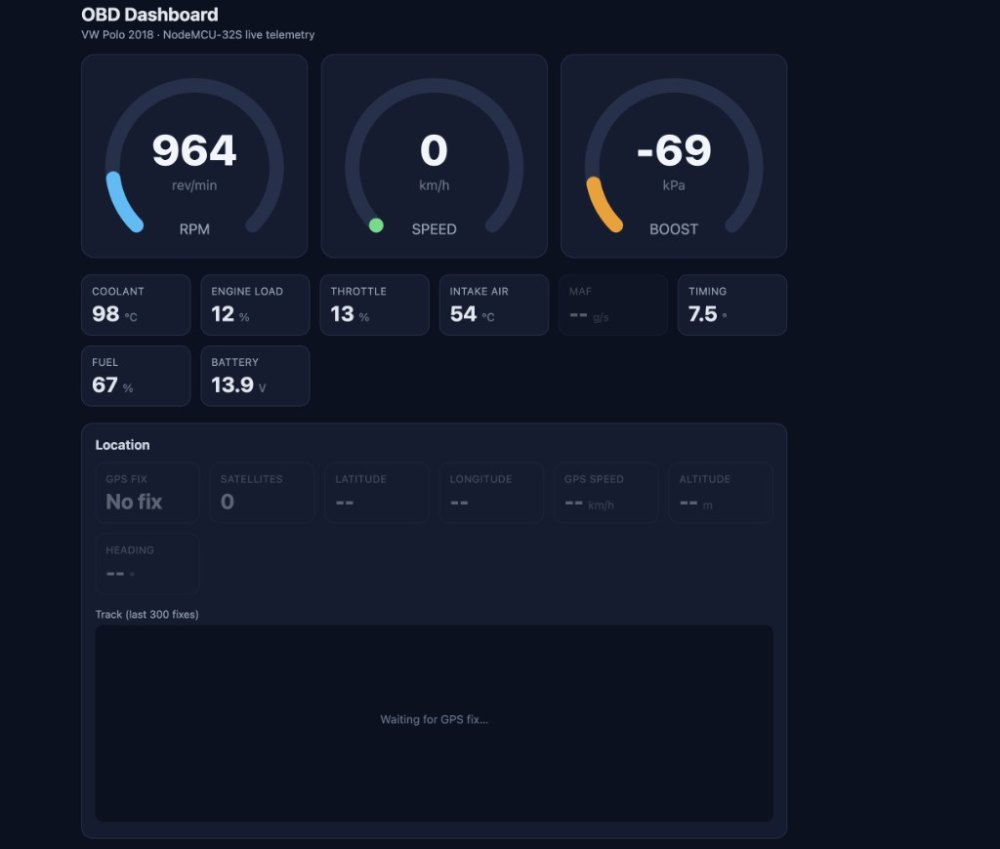

# ESP32 OBD Live Web Dashboard (ArduinoCANShield)

## Source

- Type: text
- Origin: Cursor agent transcript blog post (Obsidian `BLOG-POSTS/arduinocanshield-2026-07-09.md`) + user-provided photos/video
- Imported: 2026-07-09
- Images: 2 saved under `./assets/esp32-obd-live-web-dashboard/`
- Video: [YouTube Shorts demo](https://youtube.com/shorts/r2-XjV_Vlvc?feature=share)
- Firmware: ArduinoCANShield (private repo)

## Content

I wanted something simple and a little ridiculous: plug into the car's OBD port, read real engine data over CAN, and pull it up on a phone browser while I'm driving. No laptop. No proprietary dongle app. Just an ESP32, an MCP2515, and a dashboard I could actually stare at from the passenger seat.

A couple of days of tinkering later, that's exactly what I had — RPM, coolant, throttle, boost, battery voltage, all streaming over WebSockets to a dark-themed dashboard on my phone hotspot.

### The setup

The hardware stack:

```
Vehicle OBD-II port → MCP2515 CAN dongle → ESP32 (SPI) → phone hotspot → browser
```

On the bench it's three boards on a breadboard — NodeMCU-32S on top, GY-GPS6MV2 on the left, MCP2515 CAN module on the right:



#### Wiring diagram

Three separate interfaces, one shared ground. CAN and GPS don't share pins.



**Pin cheat sheet** (NodeMCU silkscreen labels → module pins):

| Signal | ESP32 GPIO | Connects to |
|--------|-----------|-------------|
| CAN CS | D5 (GPIO5) | MCP2515 CS |
| CAN INT | D4 (GPIO4) | MCP2515 INT |
| CAN SCK | D18 (GPIO18) | MCP2515 SCK |
| CAN MISO | D19 (GPIO19) | MCP2515 SO |
| CAN MOSI | D23 (GPIO23) | MCP2515 SI |
| GPS RX | GPIO16 | GPS module **TX** |
| GPS TX | GPIO17 | GPS module **RX** |
| Power | 3V3 + GND | Both modules |

> **Ground matters.** Tie ESP32 GND to vehicle chassis ground at the OBD connector. CAN is differential, but the transceivers still need a common reference — floating ground looks like a dead bus.

NodeMCU-32S (ESP32-D0WD) with a cheap MCP2515 OBD module. CAN side: ISO 15765-4 at 500 kbps, 11-bit IDs, request `0x7DF`, response `0x7E8`.

```cpp
#define CAN_CS_PIN 5   // D5
#define CAN_INT_PIN 4  // D4
#define CAN_SPI_SCK 18   // D18
#define CAN_SPI_MISO 19  // D19
#define CAN_SPI_MOSI 23  // D23

#define GPS_RX_PIN 16  // wire to GPS TX
#define GPS_TX_PIN 17  // wire to GPS RX
```

The ESP32 joins a phone hotspot (`WIFI_SSID` / `WIFI_PASSWORD` in `config.h`), then `http://obd.local` via mDNS.

### The dongle I wasn't supposed to use

Early question: would tapping pins on an ELM327 OBD adapter cause interference? Wrong question.

The ELM327 chip wasn't the goal — just the OBD connector shell with pins broken out. After stripping the PCB and wiring CAN-H/CAN-L straight to the MCP2515, the real question was shared ground. **Yes** — without chassis GND tied to ESP32 GND, framing errors look like a dead bus.

Never share SPI with an ELM327's internal MCP2515 (two masters fight). Final wiring: vehicle CAN-H/CAN-L → dongle → ESP32 SPI, ESP32 GND → vehicle ground.

### Getting live PIDs — and the race condition

Mode-01 PID polling loop (RPM, speed, coolant, MAP, fuel, etc.) with per-PID intervals. Serial output looked great:

```
rpm=850
speed_kmh=0
coolant_c=88
engine_load_pct=22.4
```

After adding the WebSocket dashboard, half the gauges went stale. Root cause: response matching during rapid multi-PID polling — scan and poll share CAN IDs, and strict PID-byte matching mis-associates back-to-back frames. Poll timeout bumped from 150ms to 220ms (scans use 250ms).

Key fix — clear poll backoff after a successful PID scan proves the bus is awake:

```cpp
void performPidScan() {
  // ... scan supported PID bitmasks from the ECU ...

  gObdState.pidScanStatus = SCAN_DONE;

  for (size_t i = 0; i < kPidCount; i++) {
    consecutiveTimeouts[i] = 0;
    pidRetryAtMs[i] = 0;
  }

  broadcastObdState();
}
```

### Flashing on macOS

CP210x + macOS + esptool 5.x: first upload fine, second attempt `termios EINVAL` on `/dev/cu.usbserial-0001` while `/dev/cu.SLAB_USBtoUART` still worked. Pinned upload port, 115200 baud, bootloader reset script.

### GPS and raw NMEA

u-blox NEO-6M (GY-GPS6MV2) on UART2 (GPIO16/17, 9600 baud). TinyGPS++ for fixes; stale after 5s without lock. Raw NMEA reassembled and pushed over WebSocket:

```cpp
broadcastNmea(nmeaLine);  // {"nmea":"$GPGGA,..."}
```

Collapsible NMEA panel on the dashboard, closed by default.

### Bench debugging without a car

Record raw CAN from a real drive, replay on a second ESP32 + MCP2515:

```
(0.104000) rx 7E8#0341112000000000
(0.124000) tx 7DF#02010C0000000000
(0.133000) rx 7E8#04410C0F00000000
```

Log → `scripts/log_to_header.py` → `recorded_responses.h` → `esp32-ecu-sim` PlatformIO env replays frames. Wire CANH↔CANH, CANL↔CANL between two boards for desk development.

### ABS, airbag, and UDS modules

Generic OBD mode 03/04 doesn't reach VAG ABS/ESP or SRS modules. Table-driven UDS config:

```cpp
const UdsModuleConfig kUdsModules[UDS_MODULE_COUNT] = {
    {"abs", ABS_UDS_REQUEST_ID, ABS_UDS_RESPONSE_ID},
    {"airbag", AIRBAG_UDS_REQUEST_ID, AIRBAG_UDS_RESPONSE_ID},
};
```

VAG defaults: ABS `0x713`/`0x77D`, airbag `0x715`/`0x77F`.

### What shipped

Live dashboard in a VW Polo 2018 (NodeMCU-32S telemetry):



RPM 964, speed 0 (parked), coolant 98°C, throttle 13%, battery 13.9V. GPS wired but still hunting for fix in this shot.

**Demo video:**

<iframe width="315" height="560" src="https://www.youtube.com/embed/r2-XjV_Vlvc" title="OBD dashboard live demo" frameborder="0" allow="accelerometer; autoplay; clipboard-write; encrypted-media; gyroscope; picture-in-picture" allowfullscreen></iframe>

[Watch on YouTube](https://youtube.com/shorts/r2-XjV_Vlvc?feature=share)

**Architecture:**

| File | Role |
|------|------|
| `src/main.cpp` | OBD polling, PID scan, DTC read/clear, UDS dispatch |
| `src/web_dashboard.cpp` | AsyncWebServer + WebSocket broadcast |
| `src/gps.cpp` | TinyGPS++ + NMEA relay |
| `src/can_recorder.cpp` | Raw frame capture for replay |
| `src/ecu_sim/` | Standalone replay firmware for bench |
| `src/uds_modules.cpp` | ABS + airbag module table |

Flash usage ~85%.

## Key Takeaways

- Tie ESP32 GND to vehicle chassis ground before debugging firmware — floating CAN wastes hours.
- PID backoff after boot timeouts is not the same as "unsupported"; reset backoff after a successful scan.
- Recording CAN traffic and replaying via a second MCP2515 pays off immediately for dashboard dev off the car.
- Phone hotspot + mDNS (`obd.local`) is enough for in-car access — no home WiFi needed.
- VAG traction control and airbag codes need manufacturer UDS sessions, not generic OBD mode 03/04.

## Related

- [Creating A Wireless OBDII Scanner](./creating-a-wireless-obdii-scanner.md)
- [CAN Bus Reverse Engineering Skills](../can-bus/github-css-electronics-can-bus-reverse-engineering-skills.md)
- [OBD2 Guides](./README.md)
- [ESP32 pinout](../../microcontrollers-and-socs/esp32/pinout.md)
