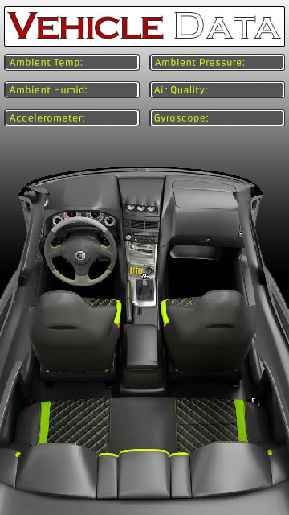

# VEHICLE DATA



<figure><figcaption></figcaption></figure>

##

## Vehicle Metrics


Gather in-vehicle sensor data (temperature, force, etc. ) to help compare with data sent by vehicle sensors.

[Intermediate](https://www.hackster.io/projects?difficulty=intermediate)Work in progress10 hours970

### Things used in this project

| <h4>Software apps and online services</h4>                                                                                                            |                                  |   |   |
| ----------------------------------------------------------------------------------------------------------------------------------------------------- | -------------------------------- | - | - |
|                                                                                                                                                       | 6c9e5be88b7448179360cda17cdbf012 |   |   |
| Atmosphereiot.com                                                                                                                                     |                                  |   |   |
| As the main programming IDE                                                                                                                           |                                  |   |   |
|                    | f1784141eb0a4e6bab93aa92c0f23cb7 |   |   |
| [Microsoft Windows 10](https://www.hackster.io/microsoft/products/windows-10?ref=project-9c9ae5)                                                      |                                  |   |   |
| Base PC operating system                                                                                                                              |                                  |   |   |
| <h4>Hand tools and fabrication machines</h4>                                                                                                          |                                  |   |   |
|         | 9515b99826cc4bdcb73dd58af9ff8c7c |   |   |
| 3D Printer (generic)                                                                                                                                  |                                  |   |   |
| To make dashboard holder for the NXP Rapid IOT                                                                                                        |                                  |   |   |
|  | f3a31600248b40159b5b806463cd030f |   |   |
| Soldering iron (generic)                                                                                                                              |                                  |   |   |
|                                                                                                                                                       |                                  |   |   |

### Story

#### The Goal <a href="#toc-the-goal-0" id="toc-the-goal-0"></a>

My goal was to collect the sensor data from the NXP device and compare it with data sent from the OBDII connector using a Bluetooth OBDII reader.

#### My Hopes and Dreams...sort of <a href="#toc-my-hopes-and-dreams---sort-of-1" id="toc-my-hopes-and-dreams---sort-of-1"></a>

Initially I had high hopes for this project where I would be able to quickly connect to my vehicles(2005 GMC Yukon XL) Entertainment and Serial (E\&C) bus.

With a proper connection I would have been able to tap into the radio, CD changer, remote cassette player, OnStar module, and HVAC system associated with my vehicle. My main goal was to read the interior sensor data from the HVAC system.

#### Crushed Hopes <a href="#toc-crushed-hopes-2" id="toc-crushed-hopes-2"></a>

I was able to find a treasure trove of valuable information on [Stuart Schmitt's website](http://stuartschmitt.com/e_and_c_bus/). With most of the hard work already completed by Stuart I set out to emulate his work and get an Arduino pulling "comfort" data from the E\&C bus.

Try as I might I was never able to reliably gather "comfort" data from the E\&C bus. My initial thoughts on why I was having so much trouble were that the GMC microcontroller in charge of the E\&C bus was dying and sending intermittent data.However it could just as well be "User Error" that I was never able to identify and fix.

#### Plan B <a href="#toc-plan-b-3" id="toc-plan-b-3"></a>

After the right cross and upper cut I received from my hubris I decided to pull what information I could from the CAN bus and use that as my basis for comparison.With the limited data I was receiving from the CAN bus I set to work on the NXP IOT device.

I have to admit I was a bit hesitant and afraid to learn a new IDE and potentially new programming language. Thankfully my fears were unfounded as the Atmosphere IoT platform was amazing and fairly easy to learn.

In just a couple of hours I was able to create a tolerable looking app which I used on my Samsung S5 phone.

#### Breakdown <a href="#toc-breakdown-4" id="toc-breakdown-4"></a>

With Plan B my only option, for now, here is what I finally came up with for data collection.

* Using Torque app and a cheap knockoff ELM327 OBDII bluetooth reader I was able to log, through the Torque app, the vehicle interior sensor data.
* Using the Atmosphere IoT IDE I was able to quickly create code that would poll the Rapid IoT sensors, in 5 second intervals, and save that data to the cloud.
* When I finished driving for the day I could take the logs created by Torque and the logs from the Rapid IoT device, which was saved to the cloud, and compare the data side by side.

#### Conclusion <a href="#toc-conclusion-5" id="toc-conclusion-5"></a>

I learned three things during the development of this project.

1\. The Mikrobus connector on the back of the Rapid IoT device is pain to work with when you don't have money for The Hexiwear Docking Station.

2\. Using the Atmosphere IoT IDE was a life, and time, saver. Being able to drag and drop components and functions made software development so much easier and enjoyable.

3\. Filtering and sorting data must be an art form because it took me quite a few attempts to do it successfully. Note: proper time stamps and time settings are crucial when comparing from two separate devices.

### Schematics

#### Background used for Vehicle Data app

Add the image as a background in your app.

### Code

#### Sensor Data for Vehicle Interior

C/C++Using the Temp., Humidity, Air Quality, Acceleration, Gyroscope and Pressure sensors, poll and log the data via Cloud storage/database.

```
#include "callbacks.h"

//HEADER START

//HEADER END

void ATMO_Setup() {

}


ATMO_Status_t Interval_trigger(ATMO_Value_t *in, ATMO_Value_t *out) {
	return ATMO_Status_Success;
}


ATMO_Status_t Interval_setup(ATMO_Value_t *in, ATMO_Value_t *out) {

	ATMO_INTERVAL_Handle_t intervalHandle;
    ATMO_INTERVAL_AddAbilityInterval(
		ATMO_PROPERTY(Interval, instance), 
		ATMO_ABILITY(Interval, interval), 
		ATMO_PROPERTY(Interval, time), 
		&intervalHandle
	);
	
	return ATMO_Status_Success;
	
}


ATMO_Status_t Interval_interval(ATMO_Value_t *in, ATMO_Value_t *out) {
	return ATMO_Status_Success;
}


ATMO_Status_t ENS210TemperatureHumidity_trigger(ATMO_Value_t *in, ATMO_Value_t *out) {
	return ATMO_Status_Success;
}


ATMO_Status_t ENS210TemperatureHumidity_setup(ATMO_Value_t *in, ATMO_Value_t *out) {
	ATMO_ENS210_Config_t config;
	config.address = ATMO_PROPERTY(ENS210TemperatureHumidity, i2cAddress);
	config.i2cDriverInstance = ATMO_PROPERTY(ENS210TemperatureHumidity, i2cInstance);
	config.tempCalibrationOffset = ATMO_PROPERTY(ENS210TemperatureHumidity, tempCalibrationOffset);

	return ( ATMO_ENS210_Init(&config) == ATMO_ENS210_Status_Success ) ? ATMO_Status_Success : ATMO_Status_Fail;

}


ATMO_Status_t ENS210TemperatureHumidity_setEnabled(ATMO_Value_t *in, ATMO_Value_t *out) {
ATMO_ENS210_SetEnabled(true);
return ATMO_Status_Success;
}


ATMO_Status_t ENS210TemperatureHumidity_setDisabled(ATMO_Value_t *in, ATMO_Value_t *out) {
ATMO_ENS210_SetEnabled(false);
return ATMO_Status_Success;
}


ATMO_Status_t ENS210TemperatureHumidity_setEnabledDisabled(ATMO_Value_t *in, ATMO_Value_t *out) {
bool enabled = false;
ATMO_GetBool(in, &enabled);
ATMO_ENS210_SetEnabled(enabled);
return ATMO_Status_Success;
}


ATMO_Status_t ENS210TemperatureHumidity_readTemperature(ATMO_Value_t *in, ATMO_Value_t *out) {
    float tempC;
    
    if(ATMO_ENS210_GetTemperatureFloat(&tempC) == ATMO_ENS210_Status_Success)
    {
        ATMO_CreateValueFloat(out, tempC);
    }
    else
    {
        ATMO_CreateValueVoid(out);
    }
    
    return ATMO_Status_Success;
}


ATMO_Status_t ENS210TemperatureHumidity_readHumidity(ATMO_Value_t *in, ATMO_Value_t *out) {
    float humidityPct;

    if(ATMO_ENS210_GetHumidityFloat(&humidityPct) == ATMO_ENS210_Status_Success)
    {
        ATMO_CreateValueFloat(out, humidityPct);
    }
    else
    {
        ATMO_CreateValueVoid(out);
    }
    
    return ATMO_Status_Success;
}


ATMO_Status_t CCS811AirQuality_trigger(ATMO_Value_t *in, ATMO_Value_t *out) {
	return ATMO_Status_Success;
}


ATMO_Status_t CCS811AirQuality_setup(ATMO_Value_t *in, ATMO_Value_t *out) {
	ATMO_CCS811_Config_t config;
	config.operatingMode = ATMO_PROPERTY(CCS811AirQuality, operatingMode);
	config.address = ATMO_PROPERTY(CCS811AirQuality, i2cAddress);
	config.i2cDriverInstance = ATMO_PROPERTY(CCS811AirQuality, i2cInstance);

	return ( ATMO_CCS811_Init(&config) == ATMO_CCS811_Status_Success ) ? ATMO_Status_Success : ATMO_Status_Fail;

}


ATMO_Status_t CCS811AirQuality_setEnabled(ATMO_Value_t *in, ATMO_Value_t *out) {
ATMO_CCS811_SetEnabled(true);
return ATMO_Status_Success;
}


ATMO_Status_t CCS811AirQuality_setDisabled(ATMO_Value_t *in, ATMO_Value_t *out) {
ATMO_CCS811_SetEnabled(false);
return ATMO_Status_Success;
}


ATMO_Status_t CCS811AirQuality_setEnabledDisabled(ATMO_Value_t *in, ATMO_Value_t *out) {
bool enabled = false;
ATMO_GetBool(in, &enabled);
ATMO_CCS811_SetEnabled(enabled);
return ATMO_Status_Success;
}


ATMO_Status_t CCS811AirQuality_readTVOC(ATMO_Value_t *in, ATMO_Value_t *out) {
    uint16_t tvoc;

    if(ATMO_CCS811_GetTVOC(&tvoc) == ATMO_CCS811_Status_Success)
    {
        ATMO_CreateValueUnsignedInt(out, (unsigned int)tvoc);
    }
    else
    {
        ATMO_CreateValueVoid(out);
    }
    
    return ATMO_Status_Success;
}


ATMO_Status_t CCS811AirQuality_readCO2(ATMO_Value_t *in, ATMO_Value_t *out) {
    uint16_t co2;
    
    if(ATMO_CCS811_GetCO2(&co2) == ATMO_CCS811_Status_Success)
    {
        ATMO_CreateValueInt(out, (int)co2);
    }
    else
    {
        ATMO_CreateValueVoid(out);
    }
  
    return ATMO_Status_Success;
}


ATMO_Status_t FXOS8700AccelerometerMagnetometer_trigger(ATMO_Value_t *in, ATMO_Value_t *out) {
	return ATMO_Status_Success;
}


ATMO_Status_t FXOS8700AccelerometerMagnetometer_setup(ATMO_Value_t *in, ATMO_Value_t *out) {
	ATMO_FXOS8700_Config_t config;
	config.address = ATMO_PROPERTY(FXOS8700AccelerometerMagnetometer, i2cAddress);
	config.i2cDriverInstance = ATMO_PROPERTY(FXOS8700AccelerometerMagnetometer, i2cInstance);
	config.gpioDriverInstance = ATMO_PROPERTY(FXOS8700AccelerometerMagnetometer, gpioInstance);
	config.int1En = ATMO_PROPERTY(FXOS8700AccelerometerMagnetometer, interrupt1Enabled);
    config.int2En = ATMO_PROPERTY(FXOS8700AccelerometerMagnetometer, interrupt2Enabled);
    config.int1Pin = ATMO_PROPERTY(FXOS8700AccelerometerMagnetometer, interrupt1Gpio);
    config.int2Pin = ATMO_PROPERTY(FXOS8700AccelerometerMagnetometer, interrupt2Gpio);

    switch(ATMO_PROPERTY(FXOS8700AccelerometerMagnetometer, motionDetectType))
    {
        case FXOS8700_NoDetect:
        {
            config.freefallEnabled = false;
            config.motionEnabled = false;
            config.tapDetectionEnabled = false;
            break;
        }
        case FXOS8700_FreefallDetect:
        {
            config.freefallEnabled = true;
            config.motionEnabled = false;
            config.tapDetectionEnabled = false;
            break;
        }
        case FXOS8700_MotionDetect:
        {
            config.freefallEnabled = false;
            config.motionEnabled = true;
            config.tapDetectionEnabled = false;
            break;
        }
        case FXOS8700_TapDetect:
        {
            config.freefallEnabled = false;
            config.motionEnabled = false;
            config.tapDetectionEnabled = true;
            break; 
        }
        default:
        {
            config.freefallEnabled = false;
            config.motionEnabled = false;  
            config.tapDetectionEnabled = false;
            break;
        }
    }

    ATMO_FXOS8700_SetMotionDetectedAbilityHandle(ATMO_ABILITY(FXOS8700AccelerometerMagnetometer, detectMotion));
    ATMO_FXOS8700_SetFreefallDetectedAbilityHandle(ATMO_ABILITY(FXOS8700AccelerometerMagnetometer, detectFreefall));
    ATMO_FXOS8700_SetTapDetectedAbilityHandle(ATMO_ABILITY(FXOS8700AccelerometerMagnetometer, detectTap));
	ATMO_FXOS8700_Init(&config);

    return ATMO_Status_Success;
	
}


ATMO_Status_t FXOS8700AccelerometerMagnetometer_setEnabled(ATMO_Value_t *in, ATMO_Value_t *out) {
ATMO_FXOS8700_SetEnabled(true);
return ATMO_Status_Success;
}


ATMO_Status_t FXOS8700AccelerometerMagnetometer_setDisabled(ATMO_Value_t *in, ATMO_Value_t *out) {
ATMO_FXOS8700_SetEnabled(false);
return ATMO_Status_Success;
}


ATMO_Status_t FXOS8700AccelerometerMagnetometer_setEnabledDisabled(ATMO_Value_t *in, ATMO_Value_t *out) {
bool enabled = false;
ATMO_GetBool(in, &enabled);
ATMO_FXOS8700_SetEnabled(enabled);
return ATMO_Status_Success;
}


ATMO_Status_t FXOS8700AccelerometerMagnetometer_getAccelData(ATMO_Value_t *in, ATMO_Value_t *out) {
    ATMO_3dFloatVector_t data;

    if( ATMO_FXOS8700_GetAccelData(&data) != ATMO_FXOS8700_Status_Success )
    {
        ATMO_CreateValueVoid(out);
        return ATMO_Status_Fail;
    }

    ATMO_CreateValue3dVectorFloat(out, &data);

    return ATMO_Status_Success;
}


ATMO_Status_t FXOS8700AccelerometerMagnetometer_getAccelX(ATMO_Value_t *in, ATMO_Value_t *out) {
	ATMO_3dFloatVector_t data;

	if(ATMO_FXOS8700_GetAccelData(&data) != ATMO_FXOS8700_Status_Success)
	{
		ATMO_CreateValueVoid(out);
		return ATMO_Status_Fail;
	}

	ATMO_CreateValueFloat(out, data.x);
	return ATMO_Status_Success;

}


ATMO_Status_t FXOS8700AccelerometerMagnetometer_getAccelY(ATMO_Value_t *in, ATMO_Value_t *out) {
	ATMO_3dFloatVector_t data;

	if(ATMO_FXOS8700_GetAccelData(&data) != ATMO_FXOS8700_Status_Success)
	{
		ATMO_CreateValueVoid(out);
		return ATMO_Status_Fail;
	}

	ATMO_CreateValueFloat(out, data.y);
	return ATMO_Status_Success;

}


ATMO_Status_t FXOS8700AccelerometerMagnetometer_getAccelZ(ATMO_Value_t *in, ATMO_Value_t *out) {
	ATMO_3dFloatVector_t data;

	if(ATMO_FXOS8700_GetAccelData(&data) != ATMO_FXOS8700_Status_Success)
	{
		ATMO_CreateValueVoid(out);
		return ATMO_Status_Fail;
	}

	ATMO_CreateValueFloat(out, data.z);
	return ATMO_Status_Success;

}


ATMO_Status_t FXOS8700AccelerometerMagnetometer_getMagData(ATMO_Value_t *in, ATMO_Value_t *out) {
    ATMO_3dFloatVector_t data;

    if( ATMO_FXOS8700_GetMagData(&data) != ATMO_FXOS8700_Status_Success )
    {
        ATMO_CreateValueVoid(out);
        return ATMO_Status_Fail;
    }

    ATMO_CreateValue3dVectorFloat(out, &data);

    return ATMO_Status_Success;
}


ATMO_Status_t FXOS8700AccelerometerMagnetometer_getMagX(ATMO_Value_t *in, ATMO_Value_t *out) {
	ATMO_3dFloatVector_t data;

	if(ATMO_FXOS8700_GetMagData(&data) != ATMO_FXOS8700_Status_Success)
	{
		ATMO_CreateValueVoid(out);
		return ATMO_Status_Fail;
	}

	ATMO_CreateValueFloat(out, data.x);
	return ATMO_Status_Success;

}


ATMO_Status_t FXOS8700AccelerometerMagnetometer_getMagY(ATMO_Value_t *in, ATMO_Value_t *out) {
	ATMO_3dFloatVector_t data;

	if(ATMO_FXOS8700_GetMagData(&data) != ATMO_FXOS8700_Status_Success)
	{
		ATMO_CreateValueVoid(out);
		return ATMO_Status_Fail;
	}

	ATMO_CreateValueFloat(out, data.y);
	return ATMO_Status_Success;

}


ATMO_Status_t FXOS8700AccelerometerMagnetometer_getMagZ(ATMO_Value_t *in, ATMO_Value_t *out) {
	ATMO_3dFloatVector_t data;

	if(ATMO_FXOS8700_GetMagData(&data) != ATMO_FXOS8700_Status_Success)
	{
		ATMO_CreateValueVoid(out);
		return ATMO_Status_Fail;
	}

	ATMO_CreateValueFloat(out, data.z);
	return ATMO_Status_Success;

}


ATMO_Status_t FXOS8700AccelerometerMagnetometer_detectTap(ATMO_Value_t *in, ATMO_Value_t *out) {
	return ATMO_Status_Success;

}


ATMO_Status_t FXOS8700AccelerometerMagnetometer_detectMotion(ATMO_Value_t *in, ATMO_Value_t *out) {
	return ATMO_Status_Success;

}


ATMO_Status_t FXOS8700AccelerometerMagnetometer_detectFreefall(ATMO_Value_t *in, ATMO_Value_t *out) {
	return ATMO_Status_Success;

}


ATMO_Status_t FXOS8700AccelerometerMagnetometer_enableFreefallDetection(ATMO_Value_t *in, ATMO_Value_t *out) {
if(ATMO_FXOS8700_EnableFreefallDetection() == ATMO_FXOS8700_Status_Success)
{
    return ATMO_Status_Success;
}

return ATMO_Status_Fail;
}


ATMO_Status_t FXOS8700AccelerometerMagnetometer_enableMotionDetection(ATMO_Value_t *in, ATMO_Value_t *out) {
if(ATMO_FXOS8700_EnableMotionDetection() == ATMO_FXOS8700_Status_Success)
{
    return ATMO_Status_Success;
}

return ATMO_Status_Fail;
}


ATMO_Status_t FXOS8700AccelerometerMagnetometer_enableTapDetection(ATMO_Value_t *in, ATMO_Value_t *out) {
if(ATMO_FXOS8700_EnableTapDetection() == ATMO_FXOS8700_Status_Success)
{
    return ATMO_Status_Success;
}

return ATMO_Status_Fail;
}


ATMO_Status_t FXOS8700AccelerometerMagnetometer_disableDetection(ATMO_Value_t *in, ATMO_Value_t *out) {
if(ATMO_FXOS8700_DisableAllDetection() == ATMO_FXOS8700_Status_Success)
{
    return ATMO_Status_Success;
}

return ATMO_Status_Fail;
}


ATMO_Status_t FXAS21002Gyroscope_trigger(ATMO_Value_t *in, ATMO_Value_t *out) {
	return ATMO_Status_Success;
}


ATMO_Status_t FXAS21002Gyroscope_setup(ATMO_Value_t *in, ATMO_Value_t *out) {
	ATMO_FXAS21002_Config_t config;
	config.address = ATMO_PROPERTY(FXAS21002Gyroscope, i2cAddress);
	config.i2cDriverInstance = ATMO_PROPERTY(FXAS21002Gyroscope, i2cInstance);
	config.samplingRate = ATMO_PROPERTY(FXAS21002Gyroscope, samplingRate);
	ATMO_FXAS21002_Init(&config);
	return ATMO_Status_Success;
}


ATMO_Status_t FXAS21002Gyroscope_setEnabled(ATMO_Value_t *in, ATMO_Value_t *out) {
ATMO_FXAS21002_SetEnabled(true);
return ATMO_Status_Success;
}


ATMO_Status_t FXAS21002Gyroscope_setDisabled(ATMO_Value_t *in, ATMO_Value_t *out) {
ATMO_FXAS21002_SetEnabled(false);
return ATMO_Status_Success;
}


ATMO_Status_t FXAS21002Gyroscope_setEnabledDisabled(ATMO_Value_t *in, ATMO_Value_t *out) {
bool enabled = false;
ATMO_GetBool(in, &enabled);
ATMO_FXAS21002_SetEnabled(enabled);
return ATMO_Status_Success;
}


ATMO_Status_t FXAS21002Gyroscope_getSensorData(ATMO_Value_t *in, ATMO_Value_t *out) {
	ATMO_FXAS21002_SensorData_t data;
	ATMO_3dFloatVector_t atmoVec;

	if(ATMO_FXAS21002_GetSensorData(&data) != ATMO_FXAS21002_Status_Success)
	{
		ATMO_CreateValueVoid(out);
		return ATMO_Status_Fail;
	}

	atmoVec.x = data.X;
	atmoVec.y = data.Y;
	atmoVec.z = data.Z;

	ATMO_CreateValue3dVectorFloat(out, &atmoVec);
	return ATMO_Status_Success;

}


ATMO_Status_t FXAS21002Gyroscope_getDpsX(ATMO_Value_t *in, ATMO_Value_t *out) {
	ATMO_FXAS21002_SensorData_t data;

	if(ATMO_FXAS21002_GetSensorData(&data) != ATMO_FXAS21002_Status_Success)
	{
		ATMO_CreateValueVoid(out);
		return ATMO_Status_Fail;
	}

	ATMO_CreateValueFloat(out, data.X);
	return ATMO_Status_Success;

}


ATMO_Status_t FXAS21002Gyroscope_getDpsY(ATMO_Value_t *in, ATMO_Value_t *out) {
	ATMO_FXAS21002_SensorData_t data;

	if(ATMO_FXAS21002_GetSensorData(&data) != ATMO_FXAS21002_Status_Success)
	{
		ATMO_CreateValueVoid(out);
		return ATMO_Status_Fail;
	}

	ATMO_CreateValueFloat(out, data.Y);
	return ATMO_Status_Success;

}


ATMO_Status_t FXAS21002Gyroscope_getDpsZ(ATMO_Value_t *in, ATMO_Value_t *out) {
	ATMO_FXAS21002_SensorData_t data;

	if(ATMO_FXAS21002_GetSensorData(&data) != ATMO_FXAS21002_Status_Success)
	{
		ATMO_CreateValueVoid(out);
		return ATMO_Status_Fail;
	}

	ATMO_CreateValueFloat(out, data.Z);
	return ATMO_Status_Success;

}


ATMO_Status_t MPL3115Pressure_trigger(ATMO_Value_t *in, ATMO_Value_t *out) {
	return ATMO_Status_Success;
}


ATMO_Status_t MPL3115Pressure_setup(ATMO_Value_t *in, ATMO_Value_t *out) {
	ATMO_MPL3115_Config_t config;
	config.address = ATMO_PROPERTY(MPL3115Pressure, i2cAddress);
	config.i2cDriverInstance = ATMO_PROPERTY(MPL3115Pressure, i2cInstance);
	config.MPLsettings.mode = MPL_MODE_PRESSURE;
	config.MPLsettings.oversample = MPL_OS_0;			// oversampling = 1
	config.MPLsettings.autoAcquisitionTime = MPL_ST_0;	// Auto acquisition time = 1s
	config.MPLsettings.pressureOffset = ATMO_PROPERTY(MPL3115Pressure, pressureOffset);	// Offset pressure correction = 4*-128 = -512Pa (8 bits signed integer)
	config.MPLsettings.altitudeOffset = ATMO_PROPERTY(MPL3115Pressure, altitudeOffset);	// Offset altitude correction = 128m (signed 8 bits integer)
	config.MPLsettings.tempOffset = ATMO_PROPERTY(MPL3115Pressure, tempOffset);			// Offset temperature correction -8°C (0.0625°C/LSB)
	config.MPLsettings.fifoMode = FIFO_DISABLED;		// FIFO mode disabled
	config.MPLsettings.fifoWatermark = 5;				// 6 bits to set the number of FIFO samples required to trigger a watermark interrupt.
	config.MPLsettings.fifoINTpin = FIFO_INT1;			// set pin INT1 as output for FIFO interrupt

	return ( ATMO_MPL3115_Init(&config) == ATMO_MPL3115_Status_Success ) ? ATMO_Status_Success : ATMO_Status_Fail;

}


ATMO_Status_t MPL3115Pressure_setEnabled(ATMO_Value_t *in, ATMO_Value_t *out) {
ATMO_MPL3115_SetEnabled(true);
return ATMO_Status_Success;
}


ATMO_Status_t MPL3115Pressure_setDisabled(ATMO_Value_t *in, ATMO_Value_t *out) {
ATMO_MPL3115_SetEnabled(false);
return ATMO_Status_Success;
}


ATMO_Status_t MPL3115Pressure_setEnabledDisabled(ATMO_Value_t *in, ATMO_Value_t *out) {
bool enabled = false;
ATMO_GetBool(in, &enabled);
ATMO_MPL3115_SetEnabled(enabled);
return ATMO_Status_Success;
}


ATMO_Status_t MPL3115Pressure_readAltitude(ATMO_Value_t *in, ATMO_Value_t *out) {
    uint32_t altitudeMeters;
    if(ATMO_MPL3115_GetAltitude(&altitudeMeters) != ATMO_MPL3115_Status_Success)
    {
        ATMO_CreateValueVoid(out);
        return ATMO_Status_Fail;
    }
    ATMO_CreateValueInt(out, (int)altitudeMeters);
    return ATMO_Status_Success;
}


ATMO_Status_t MPL3115Pressure_readPressure(ATMO_Value_t *in, ATMO_Value_t *out) {
    uint32_t pressurePa;
    if(ATMO_MPL3115_GetPressure(&pressurePa) != ATMO_MPL3115_Status_Success)
    {
        ATMO_CreateValueVoid(out);
        return ATMO_Status_Fail;
    }
    ATMO_CreateValueInt(out, (int)pressurePa);
    return ATMO_Status_Success;
}


ATMO_Status_t MPL3115Pressure_readPressureKpa(ATMO_Value_t *in, ATMO_Value_t *out) {
    uint32_t pressurePa;
    if(ATMO_MPL3115_GetPressure(&pressurePa) != ATMO_MPL3115_Status_Success)
    {
        ATMO_CreateValueVoid(out);
        return ATMO_Status_Fail;
    }
    ATMO_CreateValueInt(out, (int)(pressurePa/1000));
    return ATMO_Status_Success;
}


ATMO_Status_t TempCharacteristic_trigger(ATMO_Value_t *in, ATMO_Value_t *out) {
	return ATMO_Status_Success;
}


ATMO_Status_t TempCharacteristic_setup(ATMO_Value_t *in, ATMO_Value_t *out) {

	ATMO_BLE_GATTSAddService(
		ATMO_PROPERTY(TempCharacteristic, instance),
		&ATMO_VARIABLE(TempCharacteristic, bleServiceHandle), 
		ATMO_PROPERTY(TempCharacteristic, bleServiceUuid));
	
	uint8_t property = 0;
	uint8_t permission = 0;
	
	property |= ATMO_PROPERTY(TempCharacteristic, read) ? ATMO_BLE_Property_Read : 0;
	property |= ATMO_PROPERTY(TempCharacteristic, write) ? ATMO_BLE_Property_Write : 0;
	property |= ATMO_PROPERTY(TempCharacteristic, notify) ? ATMO_BLE_Property_Notify : 0;

	permission |= ATMO_PROPERTY(TempCharacteristic, read) ? ATMO_BLE_Permission_Read : 0;
	permission |= ATMO_PROPERTY(TempCharacteristic, write) ? ATMO_BLE_Permission_Write : 0;

	ATMO_DATATYPE types[3] = {ATMO_PROPERTY(TempCharacteristic, writeDataType), ATMO_PROPERTY(TempCharacteristic, readDataType), ATMO_PROPERTY(TempCharacteristic, notifyDataType)};
	
	ATMO_BLE_GATTSAddCharacteristic(
		ATMO_PROPERTY(TempCharacteristic, instance),
		&ATMO_VARIABLE(TempCharacteristic, bleCharacteristicHandle), 
		ATMO_VARIABLE(TempCharacteristic, bleServiceHandle), 
		ATMO_PROPERTY(TempCharacteristic, bleCharacteristicUuid), 
		property, permission, ATMO_GetMaxValueSize(3, 64, types));
	
	ATMO_BLE_GATTSRegisterCharacteristicAbilityHandle(
		ATMO_PROPERTY(TempCharacteristic, instance),
		ATMO_VARIABLE(TempCharacteristic, bleCharacteristicHandle), 
		ATMO_BLE_Characteristic_Written, 
		ATMO_ABILITY(TempCharacteristic, written));
	
	return ATMO_Status_Success;
	
}


ATMO_Status_t TempCharacteristic_setValue(ATMO_Value_t *in, ATMO_Value_t *out) {

	
	// Convert to the desired write data type
	ATMO_Value_t convertedValue;
	ATMO_InitValue(&convertedValue);
	ATMO_CreateValueConverted(&convertedValue, ATMO_PROPERTY(TempCharacteristic, readDataType), in);

	ATMO_BLE_GATTSSetCharacteristic(
		ATMO_PROPERTY(TempCharacteristic, instance),
		ATMO_VARIABLE(TempCharacteristic, bleCharacteristicHandle),
		convertedValue.size, 
		(uint8_t *)convertedValue.data,
		NULL);
	
	ATMO_FreeValue(&convertedValue);
		
	return ATMO_Status_Success;
	
}


ATMO_Status_t TempCharacteristic_written(ATMO_Value_t *in, ATMO_Value_t *out) {

	ATMO_CreateValueConverted(out, ATMO_PROPERTY(TempCharacteristic, writeDataType), in);
	return ATMO_Status_Success;
	
}


ATMO_Status_t TempCharacteristic_subscibed(ATMO_Value_t *in, ATMO_Value_t *out) {
	return ATMO_Status_Success;
}


ATMO_Status_t TempCharacteristic_unsubscribed(ATMO_Value_t *in, ATMO_Value_t *out) {
	return ATMO_Status_Success;
}


ATMO_Status_t AirCharacteristic_trigger(ATMO_Value_t *in, ATMO_Value_t *out) {
	return ATMO_Status_Success;
}


ATMO_Status_t AirCharacteristic_setup(ATMO_Value_t *in, ATMO_Value_t *out) {

	ATMO_BLE_GATTSAddService(
		ATMO_PROPERTY(AirCharacteristic, instance),
		&ATMO_VARIABLE(AirCharacteristic, bleServiceHandle), 
		ATMO_PROPERTY(AirCharacteristic, bleServiceUuid));
	
	uint8_t property = 0;
	uint8_t permission = 0;
	
	property |= ATMO_PROPERTY(AirCharacteristic, read) ? ATMO_BLE_Property_Read : 0;
	property |= ATMO_PROPERTY(AirCharacteristic, write) ? ATMO_BLE_Property_Write : 0;
	property |= ATMO_PROPERTY(AirCharacteristic, notify) ? ATMO_BLE_Property_Notify : 0;

	permission |= ATMO_PROPERTY(AirCharacteristic, read) ? ATMO_BLE_Permission_Read : 0;
	permission |= ATMO_PROPERTY(AirCharacteristic, write) ? ATMO_BLE_Permission_Write : 0;

	ATMO_DATATYPE types[3] = {ATMO_PROPERTY(AirCharacteristic, writeDataType), ATMO_PROPERTY(AirCharacteristic, readDataType), ATMO_PROPERTY(AirCharacteristic, notifyDataType)};
	
	ATMO_BLE_GATTSAddCharacteristic(
		ATMO_PROPERTY(AirCharacteristic, instance),
		&ATMO_VARIABLE(AirCharacteristic, bleCharacteristicHandle), 
		ATMO_VARIABLE(AirCharacteristic, bleServiceHandle), 
		ATMO_PROPERTY(AirCharacteristic, bleCharacteristicUuid), 
		property, permission, ATMO_GetMaxValueSize(3, 64, types));
	
	ATMO_BLE_GATTSRegisterCharacteristicAbilityHandle(
		ATMO_PROPERTY(AirCharacteristic, instance),
		ATMO_VARIABLE(AirCharacteristic, bleCharacteristicHandle), 
		ATMO_BLE_Characteristic_Written, 
		ATMO_ABILITY(AirCharacteristic, written));
	
	return ATMO_Status_Success;
	
}


ATMO_Status_t AirCharacteristic_setValue(ATMO_Value_t *in, ATMO_Value_t *out) {

	
	// Convert to the desired write data type
	ATMO_Value_t convertedValue;
	ATMO_InitValue(&convertedValue);
	ATMO_CreateValueConverted(&convertedValue, ATMO_PROPERTY(AirCharacteristic, readDataType), in);

	ATMO_BLE_GATTSSetCharacteristic(
		ATMO_PROPERTY(AirCharacteristic, instance),
		ATMO_VARIABLE(AirCharacteristic, bleCharacteristicHandle),
		convertedValue.size, 
		(uint8_t *)convertedValue.data,
		NULL);
	
	ATMO_FreeValue(&convertedValue);
		
	return ATMO_Status_Success;
	
}


ATMO_Status_t AirCharacteristic_written(ATMO_Value_t *in, ATMO_Value_t *out) {

	ATMO_CreateValueConverted(out, ATMO_PROPERTY(AirCharacteristic, writeDataType), in);
	return ATMO_Status_Success;
	
}


ATMO_Status_t AirCharacteristic_subscibed(ATMO_Value_t *in, ATMO_Value_t *out) {
	return ATMO_Status_Success;
}


ATMO_Status_t AirCharacteristic_unsubscribed(ATMO_Value_t *in, ATMO_Value_t *out) {
	return ATMO_Status_Success;
}


ATMO_Status_t AccelCharacteristic_trigger(ATMO_Value_t *in, ATMO_Value_t *out) {
	return ATMO_Status_Success;
}


ATMO_Status_t AccelCharacteristic_setup(ATMO_Value_t *in, ATMO_Value_t *out) {

	ATMO_BLE_GATTSAddService(
		ATMO_PROPERTY(AccelCharacteristic, instance),
		&ATMO_VARIABLE(AccelCharacteristic, bleServiceHandle), 
		ATMO_PROPERTY(AccelCharacteristic, bleServiceUuid));
	
	uint8_t property = 0;
	uint8_t permission = 0;
	
	property |= ATMO_PROPERTY(AccelCharacteristic, read) ? ATMO_BLE_Property_Read : 0;
	property |= ATMO_PROPERTY(AccelCharacteristic, write) ? ATMO_BLE_Property_Write : 0;
	property |= ATMO_PROPERTY(AccelCharacteristic, notify) ? ATMO_BLE_Property_Notify : 0;

	permission |= ATMO_PROPERTY(AccelCharacteristic, read) ? ATMO_BLE_Permission_Read : 0;
	permission |= ATMO_PROPERTY(AccelCharacteristic, write) ? ATMO_BLE_Permission_Write : 0;

	ATMO_DATATYPE types[3] = {ATMO_PROPERTY(AccelCharacteristic, writeDataType), ATMO_PROPERTY(AccelCharacteristic, readDataType), ATMO_PROPERTY(AccelCharacteristic, notifyDataType)};
	
	ATMO_BLE_GATTSAddCharacteristic(
		ATMO_PROPERTY(AccelCharacteristic, instance),
		&ATMO_VARIABLE(AccelCharacteristic, bleCharacteristicHandle), 
		ATMO_VARIABLE(AccelCharacteristic, bleServiceHandle), 
		ATMO_PROPERTY(AccelCharacteristic, bleCharacteristicUuid), 
		property, permission, ATMO_GetMaxValueSize(3, 64, types));
	
	ATMO_BLE_GATTSRegisterCharacteristicAbilityHandle(
		ATMO_PROPERTY(AccelCharacteristic, instance),
		ATMO_VARIABLE(AccelCharacteristic, bleCharacteristicHandle), 
		ATMO_BLE_Characteristic_Written, 
		ATMO_ABILITY(AccelCharacteristic, written));
	
	return ATMO_Status_Success;
	
}


ATMO_Status_t AccelCharacteristic_setValue(ATMO_Value_t *in, ATMO_Value_t *out) {

	
	// Convert to the desired write data type
	ATMO_Value_t convertedValue;
	ATMO_InitValue(&convertedValue);
	ATMO_CreateValueConverted(&convertedValue, ATMO_PROPERTY(AccelCharacteristic, readDataType), in);

	ATMO_BLE_GATTSSetCharacteristic(
		ATMO_PROPERTY(AccelCharacteristic, instance),
		ATMO_VARIABLE(AccelCharacteristic, bleCharacteristicHandle),
		convertedValue.size, 
		(uint8_t *)convertedValue.data,
		NULL);
	
	ATMO_FreeValue(&convertedValue);
		
	return ATMO_Status_Success;
	
}


ATMO_Status_t AccelCharacteristic_written(ATMO_Value_t *in, ATMO_Value_t *out) {

	ATMO_CreateValueConverted(out, ATMO_PROPERTY(AccelCharacteristic, writeDataType), in);
	return ATMO_Status_Success;
	
}


ATMO_Status_t AccelCharacteristic_subscibed(ATMO_Value_t *in, ATMO_Value_t *out) {
	return ATMO_Status_Success;
}


ATMO_Status_t AccelCharacteristic_unsubscribed(ATMO_Value_t *in, ATMO_Value_t *out) {
	return ATMO_Status_Success;
}


ATMO_Status_t GyroCharacteristic_trigger(ATMO_Value_t *in, ATMO_Value_t *out) {
	return ATMO_Status_Success;
}


ATMO_Status_t GyroCharacteristic_setup(ATMO_Value_t *in, ATMO_Value_t *out) {

	ATMO_BLE_GATTSAddService(
		ATMO_PROPERTY(GyroCharacteristic, instance),
		&ATMO_VARIABLE(GyroCharacteristic, bleServiceHandle), 
		ATMO_PROPERTY(GyroCharacteristic, bleServiceUuid));
	
	uint8_t property = 0;
	uint8_t permission = 0;
	
	property |= ATMO_PROPERTY(GyroCharacteristic, read) ? ATMO_BLE_Property_Read : 0;
	property |= ATMO_PROPERTY(GyroCharacteristic, write) ? ATMO_BLE_Property_Write : 0;
	property |= ATMO_PROPERTY(GyroCharacteristic, notify) ? ATMO_BLE_Property_Notify : 0;

	permission |= ATMO_PROPERTY(GyroCharacteristic, read) ? ATMO_BLE_Permission_Read : 0;
	permission |= ATMO_PROPERTY(GyroCharacteristic, write) ? ATMO_BLE_Permission_Write : 0;

	ATMO_DATATYPE types[3] = {ATMO_PROPERTY(GyroCharacteristic, writeDataType), ATMO_PROPERTY(GyroCharacteristic, readDataType), ATMO_PROPERTY(GyroCharacteristic, notifyDataType)};
	
	ATMO_BLE_GATTSAddCharacteristic(
		ATMO_PROPERTY(GyroCharacteristic, instance),
		&ATMO_VARIABLE(GyroCharacteristic, bleCharacteristicHandle), 
		ATMO_VARIABLE(GyroCharacteristic, bleServiceHandle), 
		ATMO_PROPERTY(GyroCharacteristic, bleCharacteristicUuid), 
		property, permission, ATMO_GetMaxValueSize(3, 64, types));
	
	ATMO_BLE_GATTSRegisterCharacteristicAbilityHandle(
		ATMO_PROPERTY(GyroCharacteristic, instance),
		ATMO_VARIABLE(GyroCharacteristic, bleCharacteristicHandle), 
		ATMO_BLE_Characteristic_Written, 
		ATMO_ABILITY(GyroCharacteristic, written));
	
	return ATMO_Status_Success;
	
}


ATMO_Status_t GyroCharacteristic_setValue(ATMO_Value_t *in, ATMO_Value_t *out) {

	
	// Convert to the desired write data type
	ATMO_Value_t convertedValue;
	ATMO_InitValue(&convertedValue);
	ATMO_CreateValueConverted(&convertedValue, ATMO_PROPERTY(GyroCharacteristic, readDataType), in);

	ATMO_BLE_GATTSSetCharacteristic(
		ATMO_PROPERTY(GyroCharacteristic, instance),
		ATMO_VARIABLE(GyroCharacteristic, bleCharacteristicHandle),
		convertedValue.size, 
		(uint8_t *)convertedValue.data,
		NULL);
	
	ATMO_FreeValue(&convertedValue);
		
	return ATMO_Status_Success;
	
}


ATMO_Status_t GyroCharacteristic_written(ATMO_Value_t *in, ATMO_Value_t *out) {

	ATMO_CreateValueConverted(out, ATMO_PROPERTY(GyroCharacteristic, writeDataType), in);
	return ATMO_Status_Success;
	
}


ATMO_Status_t GyroCharacteristic_subscibed(ATMO_Value_t *in, ATMO_Value_t *out) {
	return ATMO_Status_Success;
}


ATMO_Status_t GyroCharacteristic_unsubscribed(ATMO_Value_t *in, ATMO_Value_t *out) {
	return ATMO_Status_Success;
}


ATMO_Status_t PressureCharacteristic_trigger(ATMO_Value_t *in, ATMO_Value_t *out) {
	return ATMO_Status_Success;
}


ATMO_Status_t PressureCharacteristic_setup(ATMO_Value_t *in, ATMO_Value_t *out) {

	ATMO_BLE_GATTSAddService(
		ATMO_PROPERTY(PressureCharacteristic, instance),
		&ATMO_VARIABLE(PressureCharacteristic, bleServiceHandle), 
		ATMO_PROPERTY(PressureCharacteristic, bleServiceUuid));
	
	uint8_t property = 0;
	uint8_t permission = 0;
	
	property |= ATMO_PROPERTY(PressureCharacteristic, read) ? ATMO_BLE_Property_Read : 0;
	property |= ATMO_PROPERTY(PressureCharacteristic, write) ? ATMO_BLE_Property_Write : 0;
	property |= ATMO_PROPERTY(PressureCharacteristic, notify) ? ATMO_BLE_Property_Notify : 0;

	permission |= ATMO_PROPERTY(PressureCharacteristic, read) ? ATMO_BLE_Permission_Read : 0;
	permission |= ATMO_PROPERTY(PressureCharacteristic, write) ? ATMO_BLE_Permission_Write : 0;

	ATMO_DATATYPE types[3] = {ATMO_PROPERTY(PressureCharacteristic, writeDataType), ATMO_PROPERTY(PressureCharacteristic, readDataType), ATMO_PROPERTY(PressureCharacteristic, notifyDataType)};
	
	ATMO_BLE_GATTSAddCharacteristic(
		ATMO_PROPERTY(PressureCharacteristic, instance),
		&ATMO_VARIABLE(PressureCharacteristic, bleCharacteristicHandle), 
		ATMO_VARIABLE(PressureCharacteristic, bleServiceHandle), 
		ATMO_PROPERTY(PressureCharacteristic, bleCharacteristicUuid), 
		property, permission, ATMO_GetMaxValueSize(3, 64, types));
	
	ATMO_BLE_GATTSRegisterCharacteristicAbilityHandle(
		ATMO_PROPERTY(PressureCharacteristic, instance),
		ATMO_VARIABLE(PressureCharacteristic, bleCharacteristicHandle), 
		ATMO_BLE_Characteristic_Written, 
		ATMO_ABILITY(PressureCharacteristic, written));
	
	return ATMO_Status_Success;
	
}


ATMO_Status_t PressureCharacteristic_setValue(ATMO_Value_t *in, ATMO_Value_t *out) {

	
	// Convert to the desired write data type
	ATMO_Value_t convertedValue;
	ATMO_InitValue(&convertedValue);
	ATMO_CreateValueConverted(&convertedValue, ATMO_PROPERTY(PressureCharacteristic, readDataType), in);

	ATMO_BLE_GATTSSetCharacteristic(
		ATMO_PROPERTY(PressureCharacteristic, instance),
		ATMO_VARIABLE(PressureCharacteristic, bleCharacteristicHandle),
		convertedValue.size, 
		(uint8_t *)convertedValue.data,
		NULL);
	
	ATMO_FreeValue(&convertedValue);
...

This file has been truncated, please download it to see its full contents.
```

\

