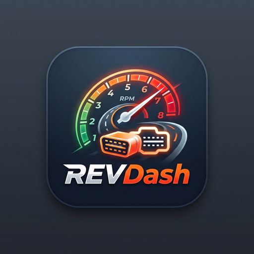
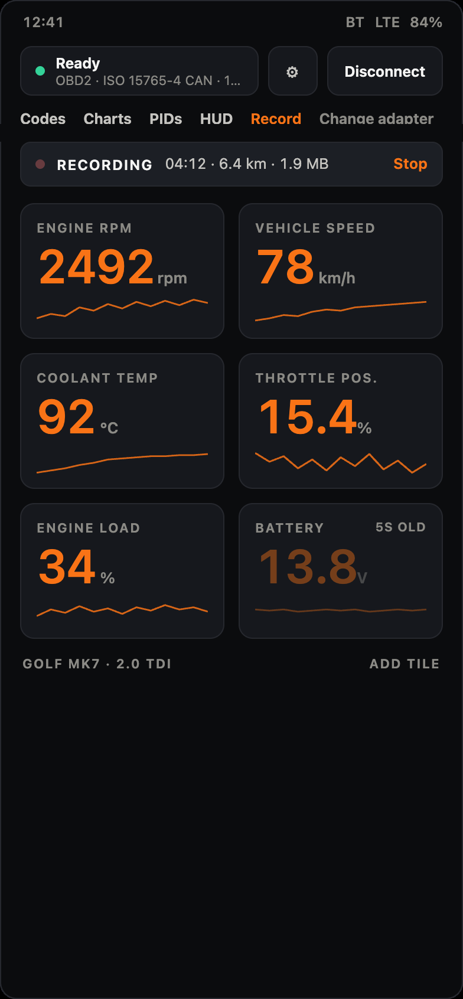
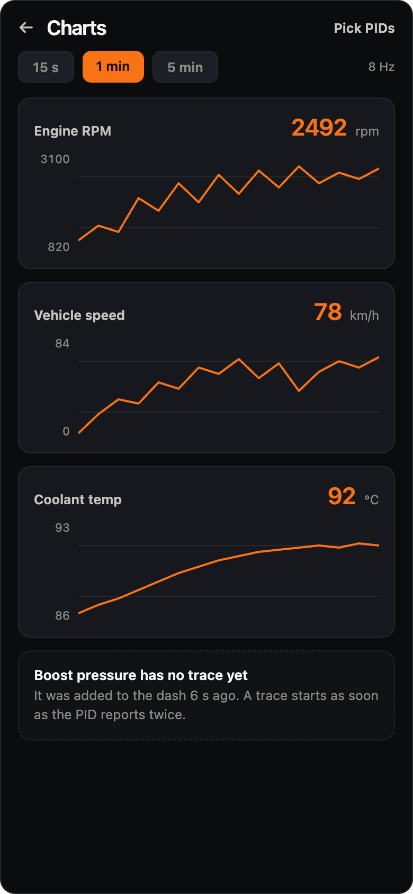

# RevDash

## Source

- Type: webpage
- Origin: https://revdash.me/
- Docs: https://revdash.me/docs
- Privacy: https://revdash.me/privacy
- Imported: 2026-09-17

## Content

**Every sensor your car already has, on your phone.**

Plug a cheap ELM327 into the OBD port, watch RPM, coolant, load and boost as you drive, and record the trip to the phone. Nothing leaves the phone until you upload a drive yourself; then you can replay the route in a browser, coloured by any parameter you logged.

| Highlight | Detail |
| --- | --- |
| PIDs | 108 known, plus your own CSV |
| Free cloud | 20 trips a month, no card |
| Adapter | ~£12 typical ELM327 (not sold by RevDash) |

### An adapter, a phone, and a browser

There is no box to fit, no subscription hardware, and no tracker wired into the loom. Parts are an adapter you can buy anywhere and a phone you already own.

1. **Plug in the adapter** — Any ELM327 over Bluetooth Classic, BLE, or Wi-Fi. RevDash tells you which protocol the car answered on.
2. **Build your dash** — Drag the gauges you care about. Mode 01, VAG Mode 22 extras, or a community CSV you imported.
3. **Record the drive** — Written to the phone as you go, with GPS if you allow it. Nothing leaves the device on its own.
4. **Replay in a browser** — Upload when you want to, then scrub the route coloured by coolant, boost, speed, or whatever you logged.

### A dashboard that explains itself

Most OBD apps fail in the car park with a spinner and no reason. RevDash tells “couldn’t reach the adapter” apart from “adapter fine, no ECU answering”, and says which one it hit.

- **Live gauges** — RPM, speed, coolant, throttle, load, battery voltage, and whatever else in Mode 01 your ECU actually answers.
- **VAG extras over Mode 22** — Oil temperature, charge pressure actual and specified, torque, lambda, timing, rail pressure and wastegate, when a VW, Audi, SEAT or Škoda answers.
- **A dash you arrange** — Add, remove, drag and resize tiles. Each vehicle profile keeps its own layout and its own adapter.
- **Check-engine, done carefully** — Stored, pending and permanent codes with freeze frame and generic SAE titles, and a clear that asks before it does anything.
- **Estimated gear** — Derived from RPM and speed, so it works on a manual as well as an automatic.

### The drive, not a summary of it

A trip log is a wall of numbers. The replay puts those numbers back where they happened, so a reading you noticed becomes a corner you remember.

Example replay chrome from the marketing page: trip date, map overlay coloured by speed, play at 4×, distance / duration / max speed / peak coolant, plus CSV download.

- **The route on a real map** — Photorealistic 3D globe, or a greyscale 2D map from the RevDash server. Switch at any time.
- **Colour it by anything** — Speed, coolant, boost, load; legend uses the real range of that parameter.
- **Charts locked to the map** — Scrub the trip and the marker follows. Brush a range on a chart and every chart zooms together.
- **Play it back** — 1×, 4×, 16× or 60×.
- **Every value, downloadable** — Full-resolution CSV of the whole trip.
- **Works without a basemap** — No map installed, or a drive with no GPS fix? The trip still opens; the charts still draw.

### Privacy-first

Trips stay on the phone until you upload one, and a drive is only visible to anyone else if you make a link. Delete an account and the drives go with it.

- Generic OBD-II is powertrain only: no ABS, no airbags, no manufacturer body modules.
- Nothing is written to the ECU except a code clear you confirm.
- Cheap clones lie about their firmware; RevDash shows what yours actually reported.

### Free vs Pro

The app itself is free and works with no account. An account only matters when you want trips off the phone.

- **Free** — Whole app without an account. Cloud: 20 trips a month, 30 days of history, CSV download and share links.
- **Pro** — Unlimited trips, kept indefinitely (pricing announced at launch).

### What RevDash does not do

- Does not read ABS, airbag or body modules.
- Does not write to the ECU or run actuator tests (except confirmed code clear).
- Not a shop scan tool; not affiliated with any vehicle manufacturer.
- Not Torque; uses no Torque branding or plugins.
- No iPhone app (Android only). USB adapters are not supported.

### FAQ (from the site)

**Which adapter?** Any ELM327-compatible: Bluetooth Classic, BLE, or Wi-Fi. No approved-hardware list. Wi-Fi dongles are their own AP — join in Android settings, then add in the app. USB not supported.

**Will it work on my car?** Generic OBD-II powertrain: broadly petrol from 2001 and diesel from 2004 in the EU, and 1996 onward in the US. VW/Audi/SEAT/Škoda additionally answer Mode 22 (oil temp, charge pressure, etc.). RevDash only shows PIDs the ECU actually answered.

**Account?** Not for gauges, codes, charts, layouts, or CSV export. Account is only so trips can leave the phone for browser replay.

**What gets uploaded?** OBD readings you recorded and, if granted, GPS — only when you sign in and tap Upload. Not in the background.

**Free limit?** Uploads stop at 20 trips/month; recording on the phone continues. Trips older than 30 days age out of free cloud history.

**Maps?** 3D uses Google Maps tiles for the area you view. 2D comes from the RevDash server.

**Manual?** https://revdash.me/docs — adapters, dashboard, recording, custom PIDs, cloud replay, pointing Torque Pro at an upload URL.

### Docs overview (revdash.me/docs)

The Android app is a live OBD-II dashboard. Recording is optional and stays on the phone until upload. Browser replay lives under `/app`.

Two “Torque-adjacent” features (unrelated to Torque branding):

- **Custom PIDs** — community `extendedpids` CSV imported in the app.
- **Torque Pro upload** — point Torque’s “upload to webserver” at a RevDash-minted URL so those drives appear in the same trip list.

Requirements: Android 8.0+, ELM327 Classic/BLE/Wi-Fi, generic powertrain OBD-II. No Android Auto build yet.

## Key Takeaways

- Privacy-first Android OBD-II dash: local recording by default; cloud upload is explicit.
- Works with commodity ELM327 (Classic / BLE / Wi-Fi); shows real adapter/ECU failure modes instead of a silent spinner.
- Browser trip replay colours the route by any logged parameter, with locked charts and full CSV export.
- Honest limits: powertrain Mode 01 (+ VAG Mode 22 extras), no ABS/SRS, Android only, not a shop scan tool.
