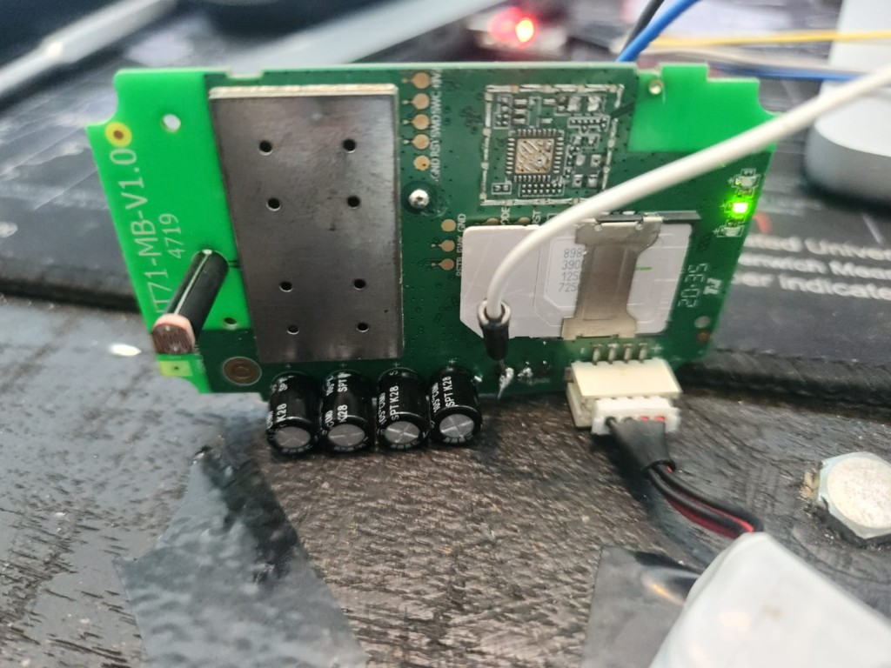
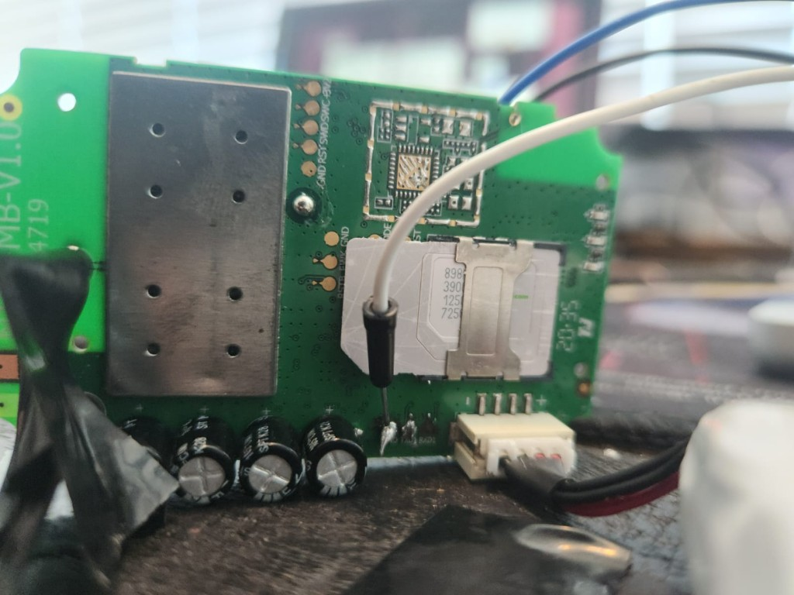
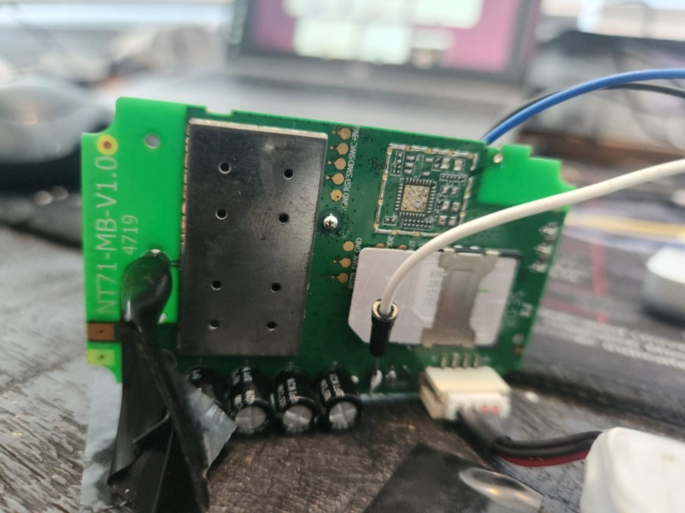
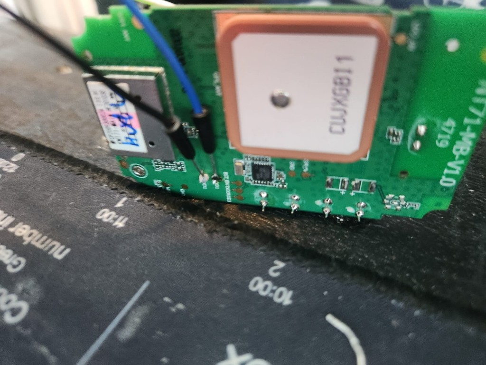
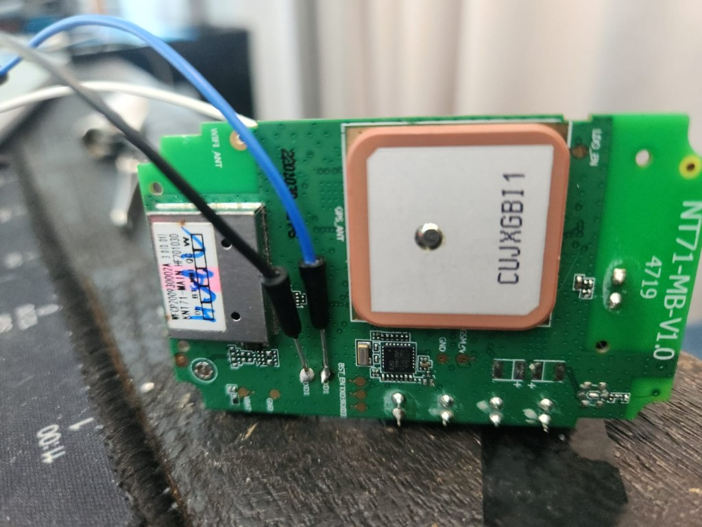

# Extracting Data from a Concox GT710 GPS Tracker (Without Windows)

## Source

- Type: text
- Origin: user-provided notes (Cursor session + `esp32-lilypi-door-relay/docs/concox-gt710-firmware-extraction.md`)
- Imported: 2026-06-23
- Images: 5 PCB photos saved under `assets/concox-gt710-firmware-extraction/`

## Content

*How I went from garbled serial output to a full hardware map — and what it actually takes to back up one of these trackers on macOS.*

---

### What I was trying to do

I had a small cellular GPS tracker connected to my Mac through a CP2102 USB‑UART adapter (`/dev/cu.SLAB_USBtoUART`). The goal was simple on paper: **read the firmware** — or at least understand exactly what was running on the device.

What I had was **not** an ESP32 dev board. It was a **Concox / Jimi IoT GT710** asset tracker: a waterproof GPS unit with a GSM modem, a test SIM, and almost no public documentation on how to pull its flash over the wire.

This is the story of how I figured out what I was looking at, extracted everything the UART would give me, mapped the PCB, and planned a full clone — all on **macOS**, without the Windows-only tools the forums usually assume you have.

---

### Act 1: Garbled serial and the wrong mental model

I started with PlatformIO's device monitor at **115200 8-N-1**. The output looked broken:

```
F1: 0000 0000
G0: 0002 0000 [0000]
BL
er on
ect:GT710
o SIM
T+CMGL=0
OK
+CREG: 0,3
```

My first question was whether the baud rate was wrong.

**It wasn't.** 115200 is correct for this interface. The garble came from two things mixed on one line:

1. **Boot / binary noise** at power-on (`F1:`, `G0:`, `BL`)
2. **AT command traffic** from the device talking to its own internal modem (`AT+CMGL`, `+CREG`, fragments of `No SIM`)

The giveaway was readable cellular protocol debris: `T+CMGL=0` is almost certainly `AT+CMGL=0` (list SMS messages), and `ect:GT710` is part of a connect string for a **GT710** module.

So: wrong device class in my head, right baud rate on the wire.

---

### Act 2: Talking to the modem

Once I closed the serial monitor so nothing else held the port, I probed the device with Python and `pyserial`.

At **115200** on `/dev/cu.SLAB_USBtoUART`, sending `AT` eventually returned clean responses. The device is a **MediaTek modem** running the MAUI stack:

| Command | Response |
|---------|----------|
| `ATI` | `MTK2` / `MAUI.11C.W14.18.IOT.MP.SP.V1.` |
| `AT+CGMI` | `MTK1` |
| `AT+CGMM` | `MTK2` |
| `AT+CGMR` | `MAUI.11C.W14.18.IOT.MP.SP.V1.F6, 2020/09/17 16:13` |
| `AT+CGSN` | `351777095470561` (IMEI) |
| `AT+ICCID` | `89882390001250872505` |
| `AT+CPIN?` | `READY` |
| `AT+CREG?` | `0,3` (searching, not registered) |
| `AT+CSQ` | `16, 99` (~−81 dBm) |

The IMSI (`90128…`) pointed at a **test SIM** — which explained why the modem never registered on a real network.

#### What this is (and isn't)

This is **firmware identification**: build strings, IMEI, SIM details, signal state. It is **not** a binary image of the flash. Standard AT commands don't offer "dump entire chip to file."

I confirmed that the hard way:

| Command | Result |
|---------|--------|
| `AT+EDUMP` | `ERROR` |
| `AT+EMEMDUMP?` | `ERROR` |
| `AT+GTPKGVER?` | `ERROR` |
| Concox `VERSION#` over serial | No response (SMS-only on this unit) |

One probe (`AT+EPON?`) even tripped a modem shutdown: `Delay time out! Shutdown...` — a reminder that engineering commands on production firmware are hit-or-miss.

---

### Act 3: Automating what works

The useful part — querying identification over UART — deserved a script, not ad-hoc Python in a shell.

Probe script (`scripts/gt710_probe.py` in the working repo):

- Opens the serial port at 115200
- Sends standard AT commands with gaps (the GT710 polls its own modem; rushing commands causes collisions)
- Parses modem firmware, IMEI, ICCID, SIM status, registration, signal
- Writes JSON to `gt710/device-info.json`

```bash
python3 scripts/gt710_probe.py
python3 scripts/gt710_probe.py --port /dev/cu.SLAB_USBtoUART --out gt710/device-info.json
```

**Lesson:** intermittent responses aren't always "wrong baud." This device runs its own AT loop. Leave the port free, power-cycle if the modem shut down, and space commands ~1.5 seconds apart.

---

### Act 4: Opening the case — two boards, three firmware stores

Photos of the PCB changed the picture again. The GT710 isn't one chip; it's a **two-board stack**:

#### Main board — `GT71-MB-V1.0.0`



*Main board (`GT71-MB-V1.0.0`): MediaTek modem under the large shield, SIM slot, and the SWD header (`GND · RST · SWD · SWC · +3V`) along the top edge.*

- Large metal shield → **MediaTek cellular modem / baseband** (where `MAUI.11C…` lives)
- SIM slot, power connector, electrolytic caps
- **SWD header:** `GND · RST · SWD · SWC · +3V`
- **Near SIM:** `RST · TX · FWK · GND`
- **Bottom UART:** `TXD · RXD · GND` ← CP2102 wires (modem AT console)



*SWD header (top) and debug pads near the SIM — target for a Black Magic Probe dump of the application MCU.*



*`RSTB`, `FWK`, and `GND` pads beside the SIM — short **FWK → GND** during power-on to enter MTK BROM/download mode for mtkclient.*



*Modem AT console wiring: white and black wires on the bottom `TXD` / `RXD` pads — connection that returned `AT+CGMR` at 115200.*

#### GPS daughter board — `NT71-MB-V1.0`



*GPS daughter board (`NT71-MB-V1.0`): shielded **NT71-MAIN** module, ceramic GPS antenna (`CUJXGB11`), and UART pads along the bottom edge.*

- Shielded module labelled **NT71-MAIN** (`WFCP200930002A`, `HF201030`)
- Ceramic GPS antenna (`CUJXGB11`)
- **UART pads:** `VBAT · GND · RXD1 · TXD1 · BST_EN · TXD3 · RXD3 · …`

A **complete backup** means three targets:

| Target | Location | Likely tool |
|--------|----------|-------------|
| MTK modem + integrated flash | Under shield on `GT71-MB` | **mtkclient** over UART + boot strap |
| Application MCU | `GT71-MB` SWD pads | **Black Magic Probe** (e.g. WeAct Black Pill F411) |
| NT71 GPS / app module | `NT71-MB` UART + `BST_EN` | UART bootloader or mtkclient |

No single cable gets everything.

---

### Act 5: You don't need Windows

Forum threads for MediaTek often assume **Modem META** or **SP Flash Tool** on Windows. The good news on macOS:

| Tool | Platform | Role |
|------|----------|------|
| [mtkclient](https://github.com/bkerler/mtkclient) | macOS, Linux, Windows | Full flash read on **MT6261-class IoT** chips: `python mtk.py rf flash.bin --iot` |
| Black Magic Probe | macOS via `blackmagic` / OpenOCD | SWD dump of application MCU |
| `gt710_probe.py` | macOS | Metadata over AT (completed step) |

#### mtkclient on macOS (modem / main flash)

```bash
brew install macfuse openssl
git clone https://github.com/bkerler/mtkclient && cd mtkclient
python3 -m venv venv && source venv/bin/activate
pip install -r requirements.txt

# Enter download mode first (see below), then:
python mtk.py printgpt --iot --serialport /dev/cu.SLAB_USBtoUART --debugmode
python mtk.py rf gt710-mtk-full.bin --iot --serialport /dev/cu.SLAB_USBtoUART --debugmode
```

**Entering BROM / download mode** — try in order:

1. Power off → short **FWK → GND** → apply power → run mtkclient → release when connected
2. Power off → hold **RST** low during power-on
3. Under the large shield: classic MTK test point (**KCOL0 / COLO**) shorted to **GND** during power-on

#### SWD with a WeAct Black Pill F411 (V2.0)

Flashed as **Black Magic Probe** (`blackpill-f411ce`):

| BMP (target side) | GT71-MB pad |
|-------------------|-------------|
| GND | GND |
| PB9 (SWDIO) | SWD |
| PB8 (SWCLK) | SWC |
| PA5 (nRST) | RST (optional) |

Leave **+3V** disconnected if the tracker is already powered from its own connector.

#### Bench hardware verdict

| Board | Verdict |
|-------|---------|
| **WeAct Black Pill F411** | Primary SWD probe after BMP flash |
| **ESP-Prog** | Useful as spare UART for mtkclient; SWD possible but fiddly |
| **Arduino Nano (ATmega328)** | No — no SWD, can't run BMP |

---

### Recommended order of operations

```
1. gt710_probe.py          → metadata JSON (done)
2. mtkclient + FWK strap   → gt710-mtk-full.bin
3. BMP on Black Pill       → gt71-app.bin via SWD
4. BST_EN + RXD1/TXD1      → NT71 module bootloader hunt
```

---

### Wiring reference (modem UART — what worked)

```
USB-serial RX  →  board TXD
USB-serial TX  →  board RXD
GND            →  GND
```

Do **not** feed 5 V from the adapter if the board has its own supply.

---

### Status

| Extraction | State |
|------------|-------|
| Modem firmware **version** + IMEI/ICCID/SIM | ✅ Via AT / `gt710_probe.py` |
| Modem **binary** flash | ⏳ mtkclient + FWK/BROM strap |
| App MCU **binary** | ⏳ BMP + SWD on `GT71-MB` |
| NT71 GPS module | ⏳ UART + `BST_EN` bootloader |
| Concox app version string | ⏳ SMS `VERSION#` with working SIM |

---

## Key Takeaways

- **115200 is correct** for the GT71 modem AT UART; garbled output was boot noise plus the device polling its own modem.
- **AT commands yield metadata only** (`AT+CGMR`, IMEI, ICCID) — not a flash binary; dump commands return `ERROR`.
- The GT710 is **two PCBs** (`GT71-MB` + `NT71-MB`) with **three firmware stores**; a full clone needs mtkclient, SWD, and possibly the GPS-board UART bootloader.
- **macOS works** — mtkclient (`--iot`) and Black Magic Probe on a WeAct F411 replace Windows META/SP Flash for most of the job.
- **Five PCB photos** document SWD, FWK, UART, and GPS-board pads for repeatability.
