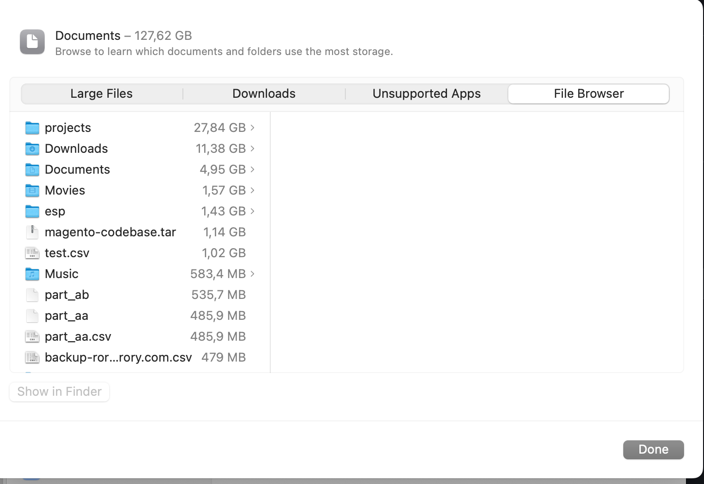
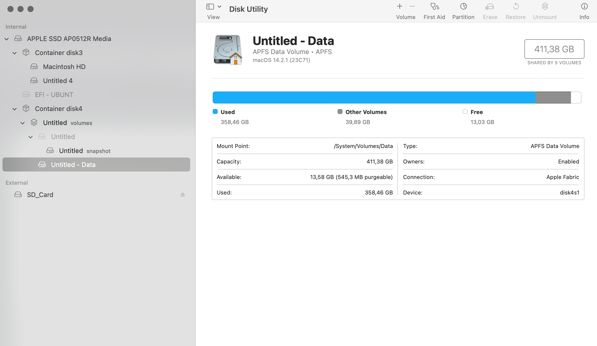
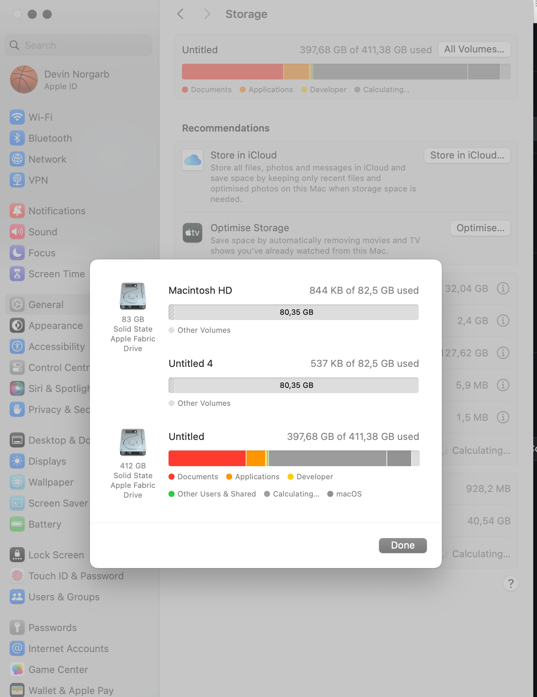
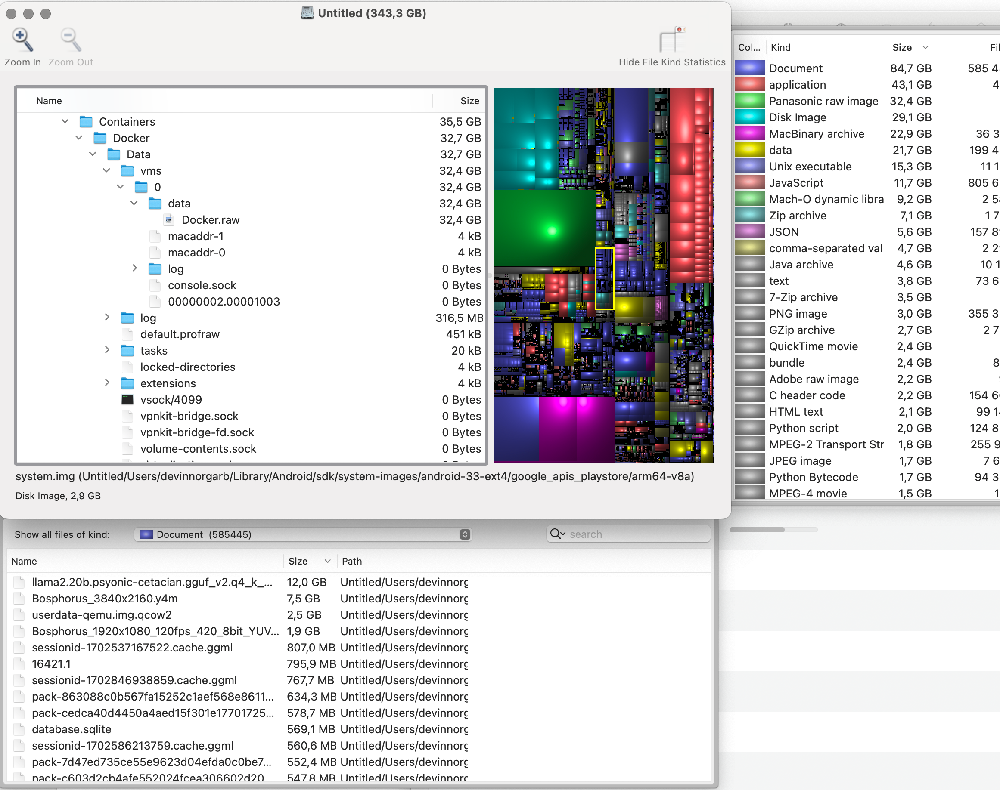

# macOS Disk Usage Analysis

I always seem to be running out of storage space on my MacBook.

I found the default storage analysis tools provided by Apple to be rather underwhelming and basic in comparison to my experience using Ubuntu Linux.

I felt that Baobab and GParted were much more powerful tools.

Unfortunately, GParted is not available for macOS.

<figure><figcaption>
underwhelming OSX default disk usage analysis tool 
</figcaption></figure>

<figure><figcaption></figcaption></figure>

<figure><figcaption></figcaption></figure>

The solution with a GUI that I found to be useful is a program called Disk Inventory X.

It is open source, as described here:

_<mark style="color:yellow;">It is absolutely free and released under the</mark>_ [_<mark style="color:yellow;">GPL</mark>_](https://www.gnu.org/copyleft/gpl.html)_<mark style="color:yellow;">. The layout algorithm is based on</mark>_ [_<mark style="color:yellow;">KDirStat</mark>_](https://kdirstat.sourceforge.net/)_<mark style="color:yellow;">. The idea to develop this program came to me when a fellow of mine showed me his creation</mark>_ [_<mark style="color:yellow;">WinDirStat</mark>_](https://windirstat.sourceforge.net/)_<mark style="color:yellow;">.</mark>_\

It can be downloaded here:



And code viewed here:



<figure><figcaption></figcaption></figure>

Thank you for this software, Tjark Derlien.
