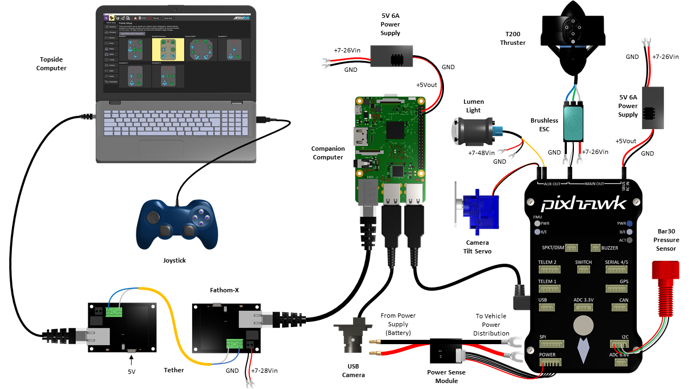

# Connection Diagrams

<figure><figcaption></figcaption></figure>

The following connection diagrams show how to connect devices to the ArduSub control system.

Power distribution is not shown other than the power requirements for each device so as to illustrate clean connections. Where a voltage is not known, a "+Vin" is shown. The maximum voltage should be in accordance with the manufacturers specifications.

For more details on connections, the manufacturer's product pages and documentation should be referenced.

### Minimum Required and Recommended Hardware 

* Components are not shown to scale, some are enlarged to show connection locations.
* For clarity reasons, power distribution connections are not shown but the input voltage ranges are.

#### Required Hardware Overview 

* [Autopilot](http://www.ardusub.com/introduction/hardware-options/required-hardware/autopilot.html): The autopilot board/flight controller board processes the pilot input and sensor data, and controls the motors, lights, servos, and relays on the vehicle. It runs the [ArduSub firmware](http://www.ardusub.com/introduction/required-software/ardusub-autopilot-firmware.html).
* [Companion Computer](http://www.ardusub.com/introduction/hardware-options/required-hardware/companion-computer.html): The Companion Computer streams video to the [Topside Computer](http://www.ardusub.com/introduction/hardware-options/required-hardware/topside-computer.html), and relays [MAVLink](https://ardupilot.org/dev/docs/mavlink-basics.html) communications between the autopilot and the Topside Computer via Ethernet.
* [Topside Computer](http://www.ardusub.com/introduction/hardware-options/required-hardware/topside-computer.html): The topside computer is where the live video feed and telemetry information are received and displayed. It accepts operator input from a joystick to allow controlling the connected vehicle.
* [Joystick](http://www.ardusub.com/introduction/hardware-options/required-hardware/joystick.html): A joystick allows the operator to control the vehicle, using stick control movements and button presses.
* [Camera](http://www.ardusub.com/introduction/hardware-options/required-hardware/camera.html): The camera allows the pilot to see and record from the vehicle's point of view. If paired with a [Camera Tilt Mount](http://www.ardusub.com/introduction/hardware-options/recommended-extras/camera-gimbal.html) or other gimbal it can be moved during operation.
* [Electronic Speed Controls (ESCs)](http://www.ardusub.com/introduction/hardware-options/required-hardware/escs.html): ESCs are used to control the speed/thrust of motors and [thrusters](http://www.ardusub.com/introduction/hardware-options/required-hardware/thrusters.html).
* [Thrusters](http://www.ardusub.com/introduction/hardware-options/required-hardware/thrusters.html): Thrusters are necessary to maneuver an underwater vehicle around. The number and orientation of thrusters on a vehicle determines the number of degrees of freedom (DoF) it may maneuver in.
* [Power Sensing Module](http://www.ardusub.com/introduction/hardware-options/required-hardware/power-sensing-module.html): A power sensing module provides analog current and voltage sensing to an autopilot onboard the vehicle. It's used to measure battery level, and how much power the vehicle is using.
* [Power Supply](http://www.ardusub.com/introduction/hardware-options/required-hardware/power-supply.html): The power supply and distribution system powers all the onboard electronics, including the high current draw of the thrusters. A regulator converts the main supplied power (from a battery or otherwise) into appropriate voltages for the more sensitive electronics - it must ensure a steady supply to avoid the computers restarting and losing control of the vehicle.
* [Tether](http://www.ardusub.com/introduction/hardware-options/required-hardware/tether.html): A tether is a length of cable which connects the Companion Computer to the Topside Computer. It allows low latency high-bandwidth communication to a vehicle in water, which other technologies are poorly suited to.

#### Recommended Extras Overview 

* [Pressure Sensor](http://www.ardusub.com/introduction/hardware-options/recommended-extras/pressure-sensor.html): An external pressure sensor is required for estimating the vehicle's depth. They often come with a simple temperature sensor included.
* [Camera Tilt Mount](http://www.ardusub.com/introduction/hardware-options/recommended-extras/camera-gimbal.html): A camera tilt mount or other gimbal is used for moving and/or stabilising the camera, for smoother video feeds and looking around without needing to rotate or move the whole vehicle.
* [Lights](http://www.ardusub.com/introduction/hardware-options/recommended-extras/lights.html): Lights are important for visual inspections and navigation, especially at night time, under cover, or at depths where sunlight doesn't reach.

#### Additional Peripheral Devices Overview 

* [Leak Sensors](http://www.ardusub.com/introduction/hardware-options/additional-peripheral-devices/leak-sensor.html): Leak sensors help to detect and warn about if a leak occurs, before it gets to and damages the electronics in an enclosure.
* [Temperature Sensor](http://www.ardusub.com/introduction/hardware-options/additional-peripheral-devices/temperature-sensor.html): An auxiliary temperature sensor can be connected to obtain faster and more accurate readings than from an integrated pressure sensor. This can be helpful in research, or where accurate temperature is important for estimating some other related phenomenon.
* [Servos](http://www.ardusub.com/introduction/hardware-options/additional-peripheral-devices/servos.html): Servos are useful when a component needs to be actuated or rotated. They can be inside an enclosure to rotate things such as cameras, or depth-rated and used outside of enclosures.
* [Relays](http://www.ardusub.com/introduction/hardware-options/additional-peripheral-devices/relays.html): Relays are useful for turning higher voltage (>5V DC) auxiliary equipment on and off.
* [Grippers and Manipulators](http://www.ardusub.com/introduction/hardware-options/additional-peripheral-devices/grippers-and-manipulators.html): A gripper is a useful tool for picking up small objects, attaching recovery lines, or freeing a snagged tether. Other manipulators may be useful in cleaning, inspection, or repair tasks.
* [Underwater Positioning and GPS (SBL and USBL)](http://www.ardusub.com/introduction/hardware-options/additional-peripheral-devices/underwater-positioning.html): A positioning system is useful for navigation (going to a location, displaying the current position on a map), as well as location-tagging collected data.
* [Sonars](http://www.ardusub.com/introduction/hardware-options/additional-peripheral-devices/sonars.html): Sonars are useful where visibility is low, for getting range measurements to surfaces or acoustically imaging targets. They can be helpful for navigation, especially in structured environments with no alternative positioning system.
