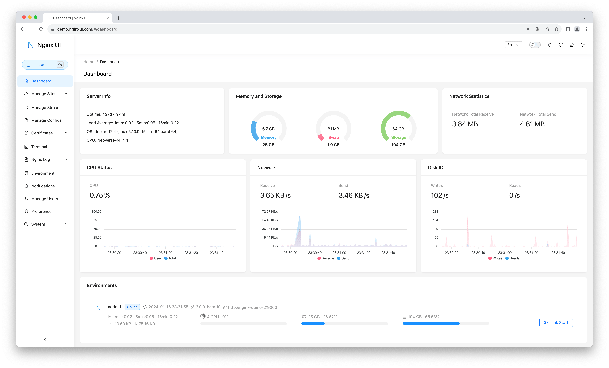

# What is Nginx UI?

## Source

- Type: webpage
- Origin: https://nginxui.com/guide/about.html
- Imported: 2026-07-13
- Images: 6 saved under `./assets/nginxui-com-guide-about/`

## Content

[Nginx UI](https://nginxui.com/guide/about.html) is a comprehensive web-based interface for managing and configuring Nginx on single nodes and clusters. It provides real-time server statistics, Nginx performance monitoring, AI-powered ChatGPT assistance, an editor with LLM code completion, one-click deployment, automatic Let's Encrypt certificate renewal, and user-friendly tools for editing website configurations. Additional capabilities include online Nginx log access, automatic config test-and-reload, a web terminal, dark mode, and responsive design. Built with Go and Vue; distributed as a single executable binary.

Just want to try it? See the [Quickstart](https://nginxui.com/guide/getting-started.html) on the official site.

### Our Team

| | Role |
| --- | --- |
|  [0xJacky](https://github.com/0xJacky) | Creator |
|  [Hintay](https://github.com/Hintay) | Developer |
|  [Akino](https://github.com/akinoccc) | Developer |
|  Cursor | Developer |

### Features

- Online statistics for server indicators: CPU usage, memory usage, load average, and disk usage.
- Configurations are automatically backed up after modifications; compare or restore any previous version.
- Mirror operations to multiple cluster nodes for multi-server environments.
- Export encrypted Nginx / Nginx UI configurations for quick deployment and recovery.
- Enhanced online ChatGPT assistant with multiple models, including Deepseek-R1 chain-of-thought display for understanding and optimizing configs.
- One-click deployment and automatic renewal of Let's Encrypt certificates.
- Online editing of website configs via NgxConfigEditor (block editor) or Ace Code Editor (LLM completion + Nginx syntax highlighting).
- Online view of Nginx logs.
- Written in Go and Vue; distribution is a single executable binary.
- Automatically test the configuration file and reload Nginx after saving.
- Web terminal.
- Dark mode.
- Responsive web design.

### Available Platforms

- macOS 11 Big Sur and later (amd64 / arm64)
- Linux 2.6.23 and later (x86 / amd64 / arm64 / armv5 / armv6 / armv7)
  - Including but not limited to Debian 7 / 8, Ubuntu 12.04 / 14.04 and later, CentOS 6 / 7, Arch Linux
- FreeBSD
- OpenBSD
- Dragonfly BSD
- OpenWrt

### Internationalization

Official support for:

- English
- Simplified Chinese
- Traditional Chinese

Community translations are available via [Weblate](https://weblate.org/) (see project docs for the Nginx UI Weblate project link).

## Key Takeaways

- Nginx UI is a Go + Vue single-binary web UI for Nginx single-node and cluster management.
- Strong ops focus: live stats, config versioning/backup, cluster mirroring, encrypted config export, auto LE certs, and test-then-reload.
- Editor choices: NgxConfigEditor (blocks) or Ace with LLM completion; plus ChatGPT assistant and web terminal.
- Runs on macOS, Linux (broad arch), BSDs, and OpenWrt; official locales EN / zh-CN / zh-TW with community i18n on Weblate.
