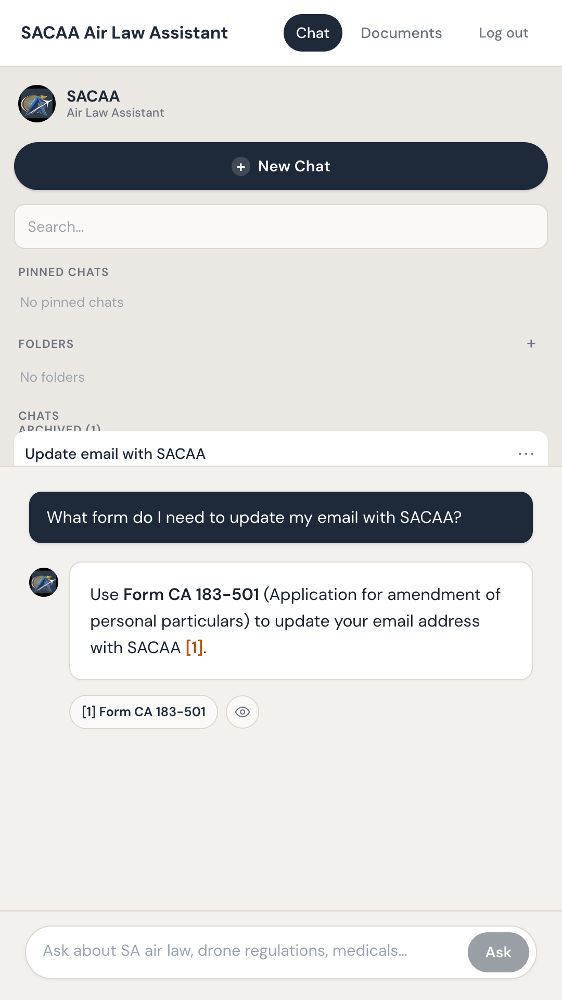
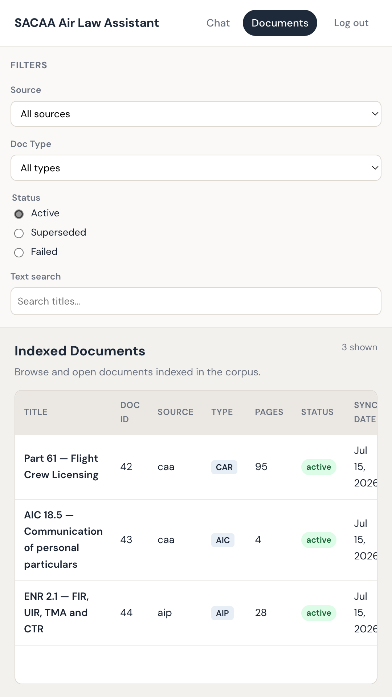

# SACAA Air Law Assistant (CAA2.0)

## Source

- Type: text + project store listing
- Origin: user provided (project `caa2.0`); store kit at `caa2.0/store/play/LISTING.md`
- Web: [https://sacaa.app](https://sacaa.app) · Package: `com.devsdev.easyaip`
- Imported: 2026-07-31

## Content

**Codename:** CAA2.0 · **Public name:** SACAA Air Law Assistant · **Category:** Education · **Package:** `com.devsdev.easyaip`

Ask SACAA air-law questions with cited regs, AIP, AICs & forms.

SACAA Air Law Assistant helps South African student pilots, licensed pilots, and aviation professionals find answers in civil aviation regulations — with citations you can open and verify.

> This app is an unofficial study and reference assistant. It is not affiliated with, endorsed by, or operated by the South African Civil Aviation Authority (SACAA). Always verify answers against the official SACAA / LexisNexis publications before making flight, licensing, or operational decisions.

### What you can ask

- Private pilot licence requirements, medicals, and renewals
- Forms and personal particulars updates (contact details with SACAA)
- Airspace questions (CTR, TMA) grounded in published definitions
- AIP, AIC, and CATS references for day-to-day operations
- Instructor ratings and related Part 61 topics

### How it works

1. Sign in and ask in plain language
2. The assistant retrieves relevant SACAA documents from a curated corpus
3. Answers stream with source citations — tap a source to open the PDF at the cited page

### Features

- Conversational Q&A with saved chat history
- Document browser for the indexed corpus
- In-app PDF viewer with page highlighting
- Progressive Web App support — also available on the web
- Works offline for previously loaded UI assets (answers require connectivity)

### Distribution status

- **Web / PWA:** [https://sacaa.app](https://sacaa.app) (privacy policy at `/privacy`)
- **Google Play:** packaging kit ready (`com.devsdev.easyaip`); listing not live on Play at import time (404 for package ID)

### Privacy (summary)

Account credentials secure conversations. Chat queries are used for app functionality. See the in-app / hosted privacy policy for details.

### Figures

## Key Takeaways

- **CAA2.0** ships as **SACAA Air Law Assistant** — RAG Q&A over SACAA regs/AIP/forms with openable PDF citations.
- Public surface: [sacaa.app](https://sacaa.app); Android package `com.devsdev.easyaip` prepared for Play.
- Unofficial study aid — not affiliated with SACAA; always verify against official publications.
