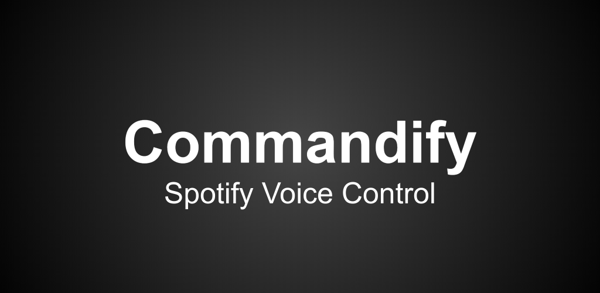
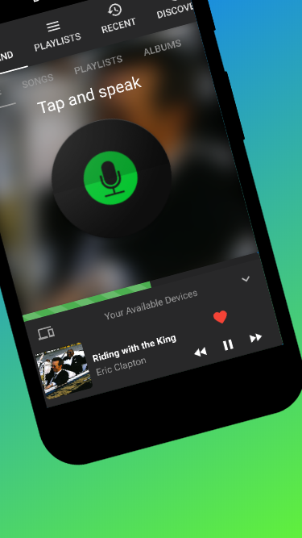
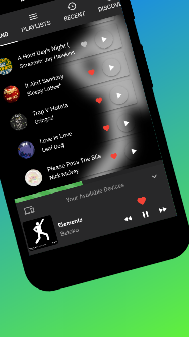
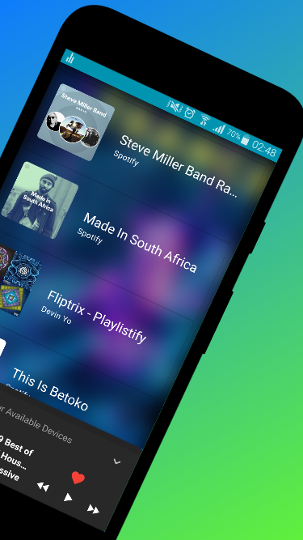

# Commandify — Spotify Voice Control

## Source

- Type: webpage + user notes
- Origin: [Aptoide archive listing](https://spotify-voice-control.en.aptoide.com/app) (formerly on Google Play); developer notes from Devin Norgarb
- Imported: 2026-07-31

## Content

**Developer:** Devin Norgarb · **Category:** Music & Audio / Multimedia · **Last known version:** 6.4.0 (Oct 2021) · **Reach:** 5000+ users

> **No longer available.** Commandify was pulled / stopped working after Spotify removed the ability for third-party developers to use the Spotify API in the way this app required. It is not offered on Google Play anymore and cannot be revived without Spotify restoring equivalent developer API access. At its peak it had **over 5000+ users**.

### What it was

By using voice prompts, Commandify let you control Spotify playback and library management hands-free — play songs and playlists, add tracks, find albums and artists, pull “Recently Recommended” tracks, and toggle media between Spotify-enabled devices.

The goal was full speech control of your Spotify account, devices, and library, with a UI for hands-on selection when you preferred tapping.

### Voice / UI features

- Play / pause
- Skip and rewind tracks
- Play playlists; open a playlist
- Control volume
- Search genres, artists, and albums
- Toggle playback between signed-in Spotify devices
- Song suggestions and recommendations
- Add songs to playlists; create playlists
- Voice tab switching — Open Playlists, Open Recent Tracks, Open Recommended

Example: *“Play Rock 'n Roll”*, *“Play Led Zeppelin”*, or *“Play Dark Side of the Moon Pink Floyd”* (no need for filler words like “artist” / “album”).

Active device showed green under **Devices**; playback routed to the selected Spotify Connect target (phone, Smart TV, etc.).

### Requirements (when it worked)

- Android 4.4+
- Spotify Premium for most features (Spotify Web API / Connect constraints of the era)

### Figures

## Key Takeaways

- Commandify was a voice-first Spotify controller for Android with 5000+ users.
- It is **discontinued**: Spotify removed the third-party API access the app depended on.
- Historical listing/archive: [Aptoide — Commandify](https://spotify-voice-control.en.aptoide.com/app).
