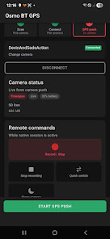
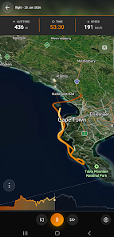

# GPS Remote for Osmo Action

## Source

- Type: webpage
- Origin: [Google Play — GPS Remote for Osmo Action](https://play.google.com/store/apps/details?id=com.devsdev.gpsremote)
- Imported: 2025-06-19

## Content

**Developer:** Devin Norgarb · **Category:** Photography · **Updated:** Jun 8, 2026

> This app is made by an independent developer and is not affiliated with, endorsed by, or sponsored by DJI. Osmo, DJI, and related names are trademarks of their respective owners. The app is not licensed by DJI. It communicates with cameras you own using protocol interoperability for GPS push and basic remote controls.

### GPS remote for your Osmo Action & 360

Use your phone as a GPS source and lightweight Bluetooth remote for supported Osmo cameras — no extra hardware required. Connect directly over BLE, push your phone's location to the camera for geotagged footage, and control recording from your pocket.

### Features

- Direct Bluetooth connection to your Osmo camera
- GPS push from your phone's location to the camera
- Basic remote controls while connected: start/stop recording, quick switch, sleep
- Live camera status updates on the home screen
- Background GPS push with a persistent notification while connected (Android)
- Simple step-by-step flow: scan, connect, send location

### Supported cameras

Works with **Osmo Action 4**, **Osmo Action 5 Pro**, **Osmo Action 6**, and **Osmo 360**. Other models are not supported unless listed in a future update.

### Getting started

1. Install on a physical Android phone (Bluetooth requires a native install).
2. Grant Nearby devices and Location when prompted.
3. Tap **Scan for Osmo Action & 360** and select your camera.
4. On first pairing, confirm the verify code on the camera screen.
5. Tap **Send location to camera** to start GPS push.
6. Use remote controls while connected; tap **Disconnect** when finished.

For reliable GPS push while the app is in the background, allow notifications and optionally disable battery optimization for this app when prompted.

### Requirements

- Android phone with Bluetooth Low Energy
- A supported Osmo camera you own
- Location and Bluetooth permissions while using the app

### Privacy

Location data is used only to send GPS to your connected camera. It is not sold or used for advertising.

### Limitations

This is a third-party utility, not an official DJI or Mimo app. Features depend on your camera model and firmware. GPS push and remote commands are best-effort; behavior may vary by device and Android version.

### Figures

---

## Related app — SoFly

**Play Store:** [SoFly — flight tracking & logging](https://play.google.com/store/apps/details?id=flight.track) · **Category:** Maps & Navigation · **Updated:** Jun 18, 2026

Discover SoFly — flight tracking and logging for pilots, aviation enthusiasts, and adventurers. Record flights with GPS tracking, aircraft details, timestamps, and custom notes. Sync across Android and desktop via OAuth (Google, GitHub). Export paths as CSV or database-friendly structures. End-to-end encryption in sync; privacy-focused design.

## Key Takeaways

- **GPS Remote** pushes phone GPS to Osmo Action 4/5 Pro/6 and Osmo 360 over BLE, with basic recording controls.
- **SoFly** is a separate published app for flight logging, cross-device sync, and track export.
- Both apps are by the same developer; neither is affiliated with DJI (GPS Remote) or third-party aviation vendors (SoFly).
- Store links: [GPS Remote](https://play.google.com/store/apps/details?id=com.devsdev.gpsremote) · [SoFly](https://play.google.com/store/apps/details?id=flight.track)
