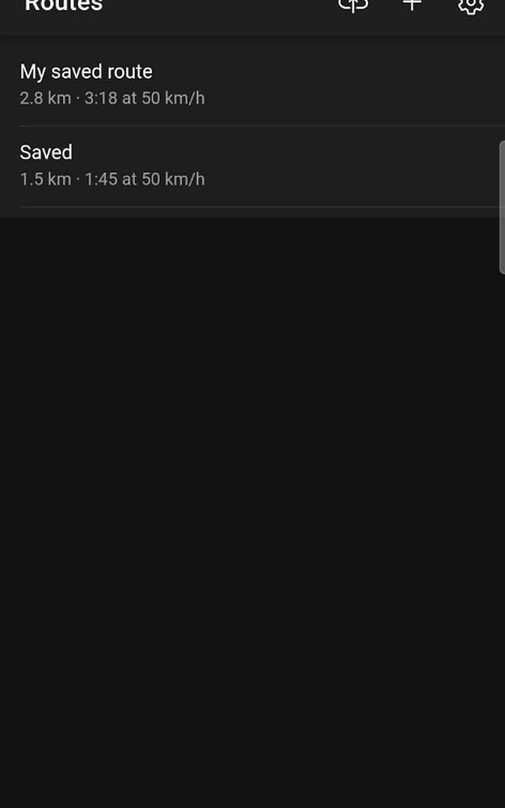
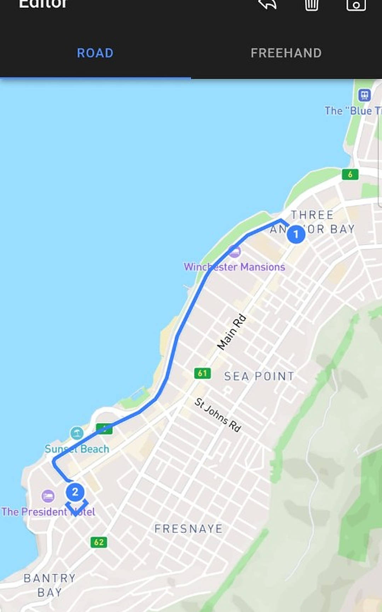
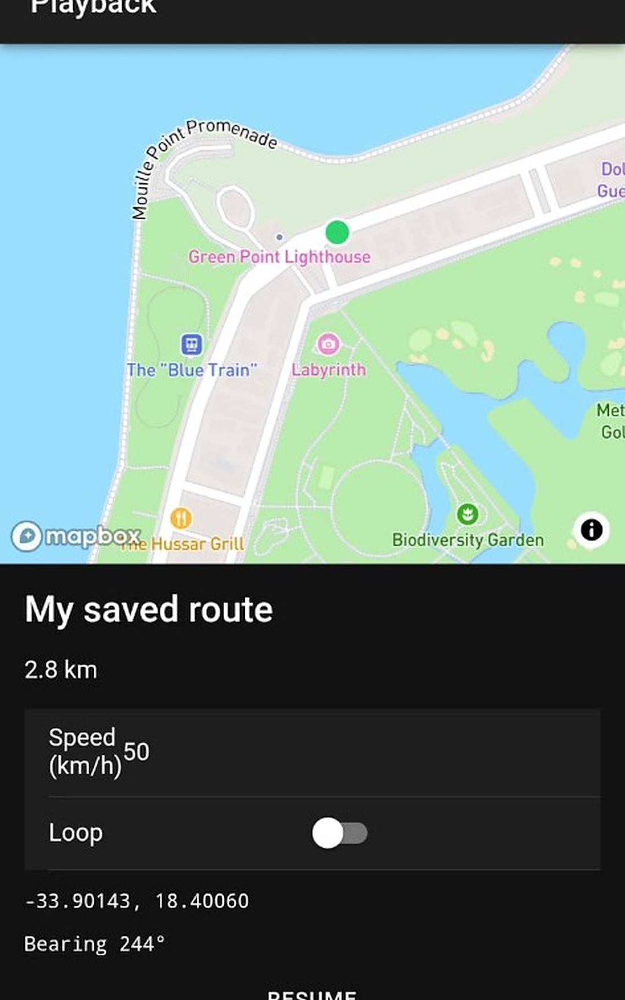

# MockLoc

## Source

- Type: webpage
- Origin: [Google Play — MockLoc](https://play.google.com/store/apps/details?id=com.mockloc)
- Imported: 2026-07-31

## Content

**Developer:** Devin Carl Norgarb · **Package:** `com.mockloc` · **Category:** Tools · **Updated:** Jul 12, 2026

MockLoc is a developer tool for testing location-based Android apps. Define GPS routes, save them locally, and replay them at a fixed speed through Android’s built-in mock location provider — no root required.

Built for Android developers, QA engineers, and anyone shipping apps that depend on GPS, geofencing, navigation, fitness tracking, or real-time location updates.

### Why MockLoc?

Testing location features on a real device usually means walking, driving, or faking coordinates one point at a time. MockLoc lets you script realistic movement along a full route so you can reproduce bugs, demo features, and validate edge cases from your desk.

### Create routes

- Draw waypoints on an interactive map
- Snap routes to roads with turn-by-turn geometry (Mapbox Directions)
- Import GPX files from fitness trackers, mapping tools, or test fixtures
- Save routes to a local library with distance and duration estimates

### Realistic GPS playback

- Replay routes at a fixed speed in km/h or mph
- Configurable GPS accuracy radius (3–50 m)
- Start, pause, resume, stop, and loop playback
- Background replay via a foreground service — keeps running when you switch apps
- Native interpolation delivers smooth lat/lng, bearing, and speed updates

### Developer workflow

- Uses **Android Developer Options → Select mock location app** (standard test provider)
- On-device route library — no account, no cloud sync required
- Step-by-step setup guide for enabling mock location
- Works with any app that reads the device GPS location

### Typical use cases

- Test ride-share, delivery, or fleet apps along realistic paths
- Validate geofence entry and exit without leaving the office
- QA navigation, maps, and turn-by-turn features
- Demo location-aware features to stakeholders
- Replay recorded GPX tracks for regression testing

### How it works

1. Enable Developer Options on your Android device
2. Select MockLoc as your mock location app
3. Create or import a route in the Editor
4. Open Playback, set speed, and tap Start
5. Switch to the app you’re testing — its location follows your route

### Requirements

- Android device with Developer Options enabled
- Internet connection for road-following route creation (saved routes replay offline)
- Location permission (used to center the map)

### Intended use

MockLoc is designed exclusively for legitimate development and quality-assurance testing of apps you own or are authorized to test. It is not intended for cheating in games, bypassing restrictions, or any deceptive use.

### Privacy

Routes and settings are stored locally on the device. MockLoc does not require an account. Play Data safety: no data shared with third parties; no data collected.

### Figures

## Key Takeaways

- **MockLoc** (`com.mockloc`) replays drawn, road-snapped, or GPX routes through Android’s mock-location provider — no root.
- Stack: Ionic Vue + Capacitor, Mapbox maps/directions, local SQLite route library.
- Store link: [MockLoc on Google Play](https://play.google.com/store/apps/details?id=com.mockloc)
