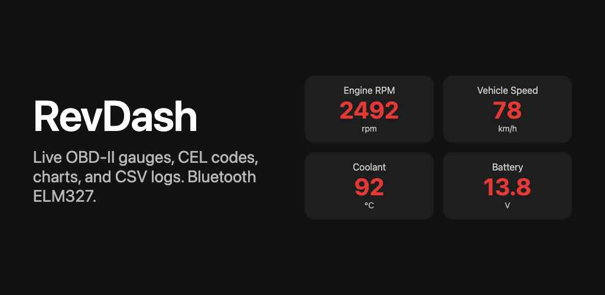
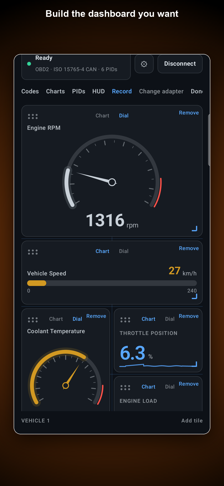
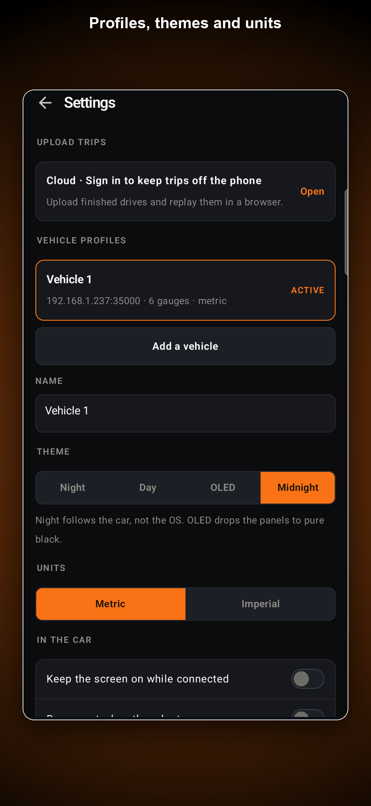
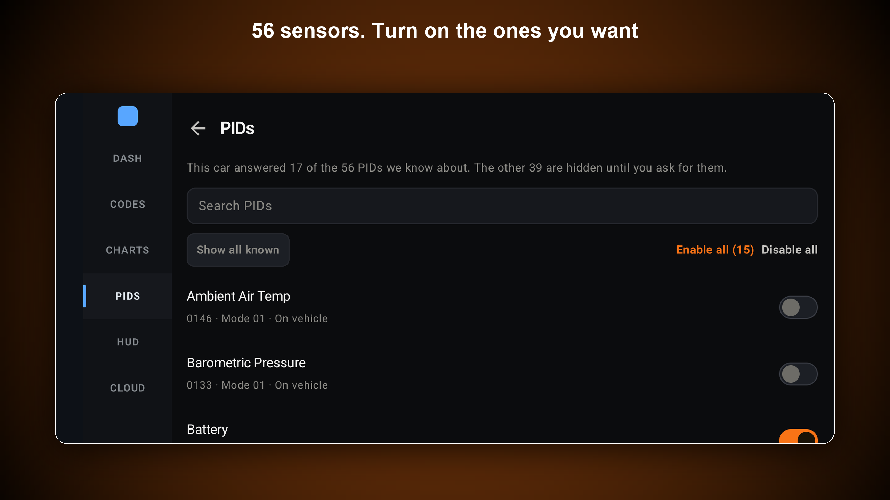
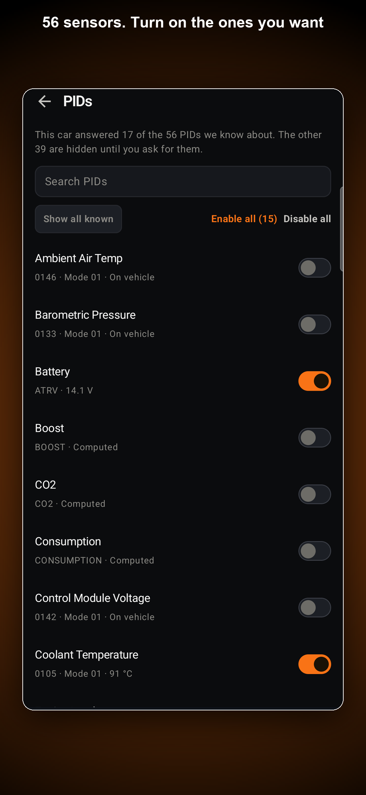
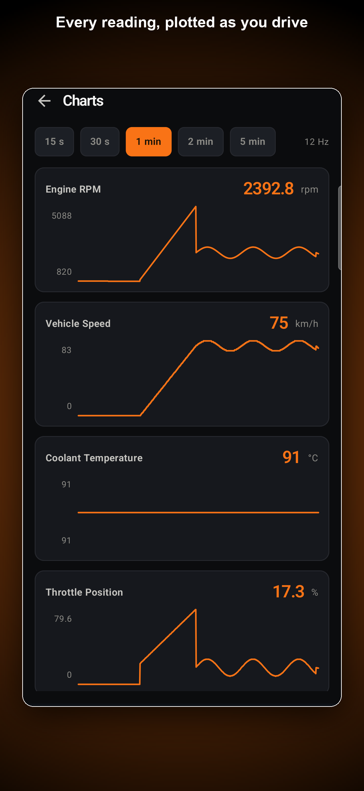
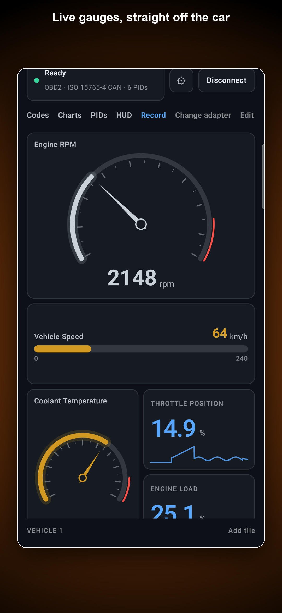
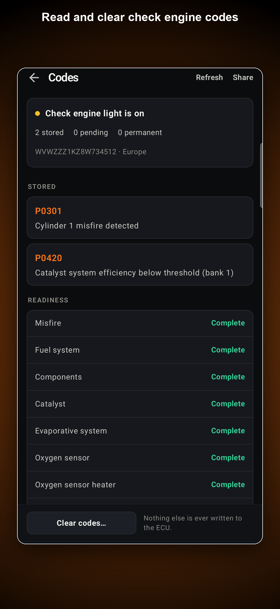
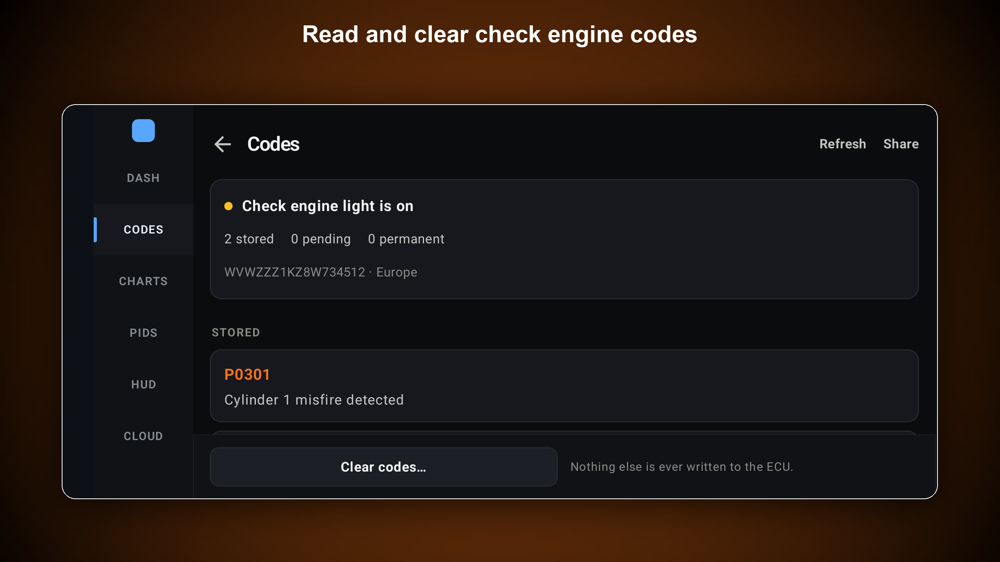
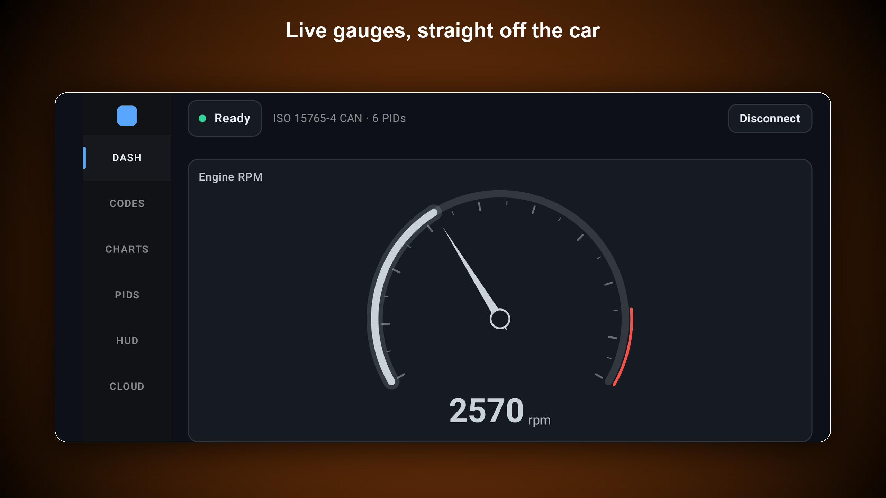

# RevDash (Google Play)

## Source

- Type: webpage
- Origin: [Google Play — RevDash](https://play.google.com/store/apps/details?id=app.revdash.obd)
- Site: [revdash.me](https://revdash.me/) (see also [RevDash marketing/docs ingest](../../obd2/related-projects/revdash-me.md))
- Imported: 2026-09-17

## Content

**Developer:** APPSOLUTE SOLUTIONS (PTY) LTD · **Package:** `app.revdash.obd` · **Category:** Auto & Vehicles · **Rating:** Everyone · **Updated:** Sep 16, 2026

**Tagline:** Live OBD2 dashboard & code reader. Custom gauges, trip logs, and zero ads.

RevDash is a live OBD-II dashboard for Android. Plug in a Bluetooth ELM327 adapter, connect once, and read engine data on a dark gauge grid that keeps polling in the background.

### What you need

- An ELM327-compatible Bluetooth Classic or BLE adapter
- A vehicle that speaks generic OBD-II (powertrain)
- Android 8.0 or later

### Features

- **Live gauges:** RPM, speed, coolant, throttle, load, battery voltage, and other Mode 01 PIDs your ECU reports
- **VAG extras:** oil temp, charge pressure (actual/spec), torque, lambda, timing, rail pressure, wastegate when your VW/Audi/SEAT/Skoda answers Mode 22
- **Estimated gear:** derived from RPM and speed (same idea as TrackAddict); works on manuals too
- **Custom dash:** add, remove, drag, and resize tiles; each vehicle profile keeps its own layout
- **Connection that explains itself:** one-tap reconnect, adapter bound to the vehicle profile, protocol hint, and a diagnostics screen that separates “Couldn’t reach adapter” from “Adapter OK, no ECU”
- **Check-engine workflow:** stored, pending, and permanent codes, freeze frame, generic SAE titles, clear only after you confirm
- **Charts:** live traces with 15s to 5m windows
- **Trip CSV:** GPS + OBD rows you save to a file you can open
- **Backup:** export and import vehicles and layouts as a zip
- **Themes:** Night, Day, OLED, Midnight; metric or imperial; keep-screen-on

### What RevDash does not do

- Does not read ABS, airbags, or body modules on generic OBD-II
- Does not write to the ECU or run actuator tests
- Is not a shop scan tool and not affiliated with any vehicle maker

### Data safety (Play declaration)

- No data shared with third parties
- No data collected

### App support

- Support email: dnorgarb@gmail.com
- Developer contact: APPSOLUTE SOLUTIONS (PTY) LTD · devin@appsolutedev.com · Cape Town, South Africa

### Figures

Store screenshots from the listing (portrait and landscape variants):

## Key Takeaways

- **RevDash** (`app.revdash.obd`) is a free, ad-free Android OBD-II dash for ELM327 Classic/BLE — live gauges, custom layouts, charts, DTC workflow, trip CSV.
- Honest scope: generic powertrain Mode 01 (+ VAG Mode 22 extras); no ABS/SRS/body modules; no ECU writes except confirmed code clear.
- Play Data safety: no collection, no third-party sharing.
- Store link: [RevDash on Google Play](https://play.google.com/store/apps/details?id=app.revdash.obd)
