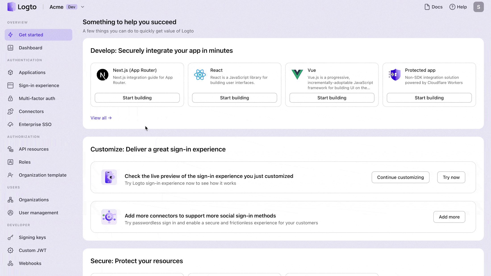
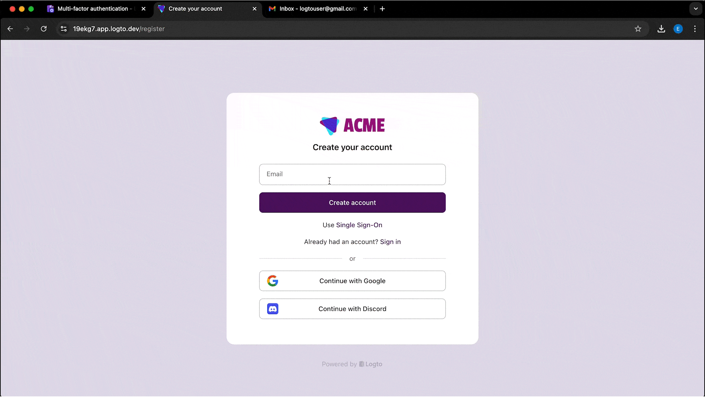
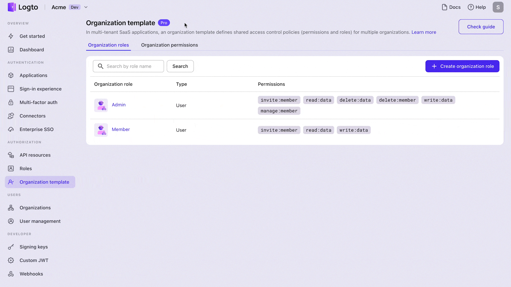

# Logto (logto-io/logto)


## Source

- Type: webpage
- Origin: https://github.com/logto-io/logto
- Imported: 2026-07-27
- Images: 5 (logo PNG, features PNG, and 3 showcase GIFs saved under `./assets/github-logto-io-logto/`)

## Content

[Logto](https://github.com/logto-io/logto) is modern, open-source auth infrastructure for SaaS and AI apps. It builds on OIDC and OAuth 2.1 and aims to make production-ready auth straightforward, with multi-tenancy, enterprise SSO, and RBAC.

Useful links:

- [Website](https://logto.io/)
- [Cloud](https://cloud.logto.io/)
- [Docs](https://docs.logto.io)
- [OpenAPI](https://openapi.logto.io/)
- [Blog](https://blog.logto.io/)
- [Auth wiki](https://auth-wiki.logto.io/)
- [Newsletter](https://logto.io/subscribe)
- [Discord](https://discord.gg/vRvwuwgpVX)


### Why Logto?

Built for teams scaling SaaS, AI, and agent-based platforms without the usual auth headaches.

- **Multi-tenancy, enterprise SSO, and RBAC** — ready to use, no workarounds.
- **Pre-built sign-in flows**, customizable UIs, and SDKs for 30+ frameworks.
- **Full support for OIDC, OAuth 2.1, and SAML** without the protocol pain.
- **Works out-of-the-box for Model Context Protocol and agent-based AI architectures**.

See [all features](https://docs.logto.io/?ref=readme).

### Get started

Pick a path:

- **[Logto Cloud](https://cloud.logto.io/?sign_up=true&ref=readme)** — fastest way to try Logto; fully managed, zero setup.
- **[Launch Logto in GitPod](https://gitpod.io/#https://github.com/logto-io/demo)** — start Logto OSS in seconds. Wait for `App is running at https://3002-...gitpod.io`, then open the URL starting with `https://3002-`.
- **Local development:**

```bash
# Using Docker Compose (requires Docker Desktop)
curl -fsSL https://raw.githubusercontent.com/logto-io/logto/HEAD/docker-compose.yml | \
docker compose -p logto -f - up

# Using Node.js (requires PostgreSQL)
npm init @logto
```

Full OSS install guide: [Get started with OSS](https://docs.logto.io/logto-oss/get-started-with-oss?ref=readme).

### Integrate anywhere

Logto supports apps, APIs, and services with industry-standard protocols.

- **SDKs for 30+ frameworks**: React, Next.js, Angular, Vue, Flutter, Go, Python, and more.
- **Connect to any IdP**: Google, Facebook, Azure AD, Okta, and more.
- **Flexible integration**: SPAs, web apps, mobile apps, APIs, M2M, CLI tools.
- **Ready for Model Context Protocol and agent-based architectures**.

- [Explore quick starts](https://docs.logto.io/quick-starts?ref=readme)
- [See all connectors](https://docs.logto.io/integrations?ref=readme)

### Showcase

**Developer-first SDKs** — install in minutes with clear guides.



**User-friendly auth flows** — sign-up, sign-in, social login, Google One Tap, MFA, SSO.



**Multi-tenancy & organizations** — organization RBAC, member invites, just-in-time provisioning, and more.



### Licensing

[MPL-2.0](https://github.com/logto-io/logto/blob/master/LICENSE).

## Key Takeaways

- Open-source CIAM / auth stack (OIDC, OAuth 2.1, SAML) aimed at SaaS and AI apps, including MCP/agent use cases.
- Ships multi-tenancy, enterprise SSO, RBAC, and 30+ framework SDKs out of the box.
- Run via Logto Cloud, GitPod demo, Docker Compose, or `npm init @logto` with PostgreSQL.
- License is MPL-2.0; docs and connectors live at docs.logto.io.
