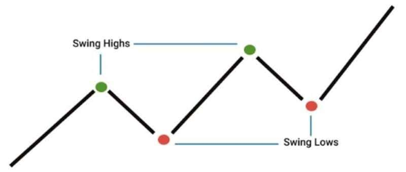
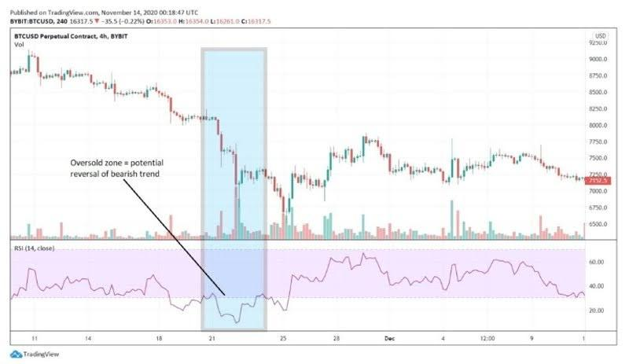
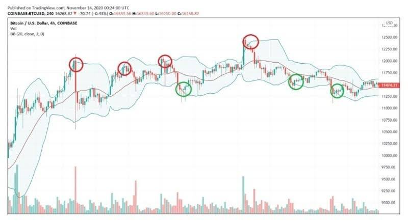
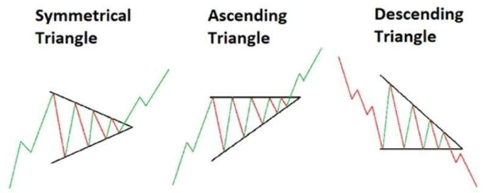
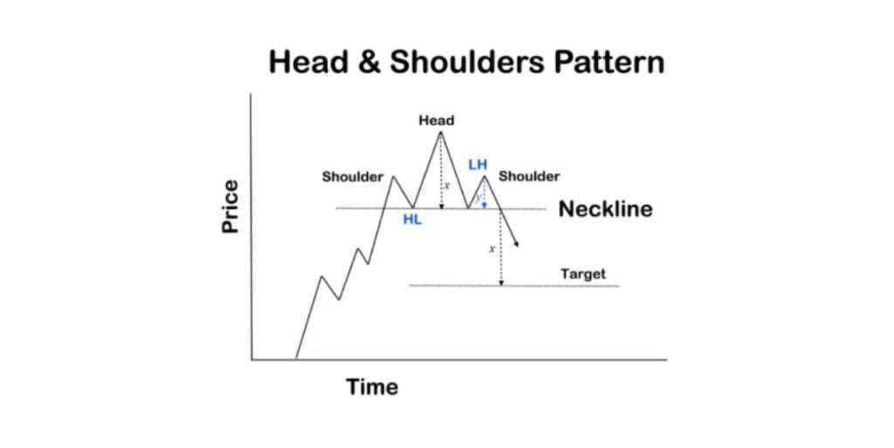
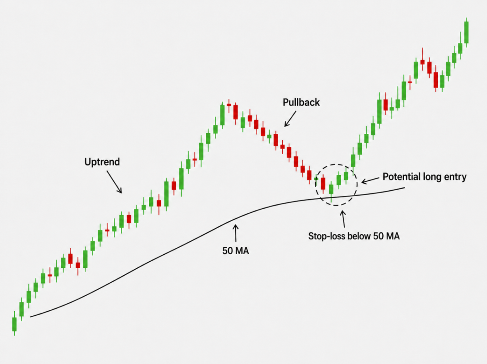
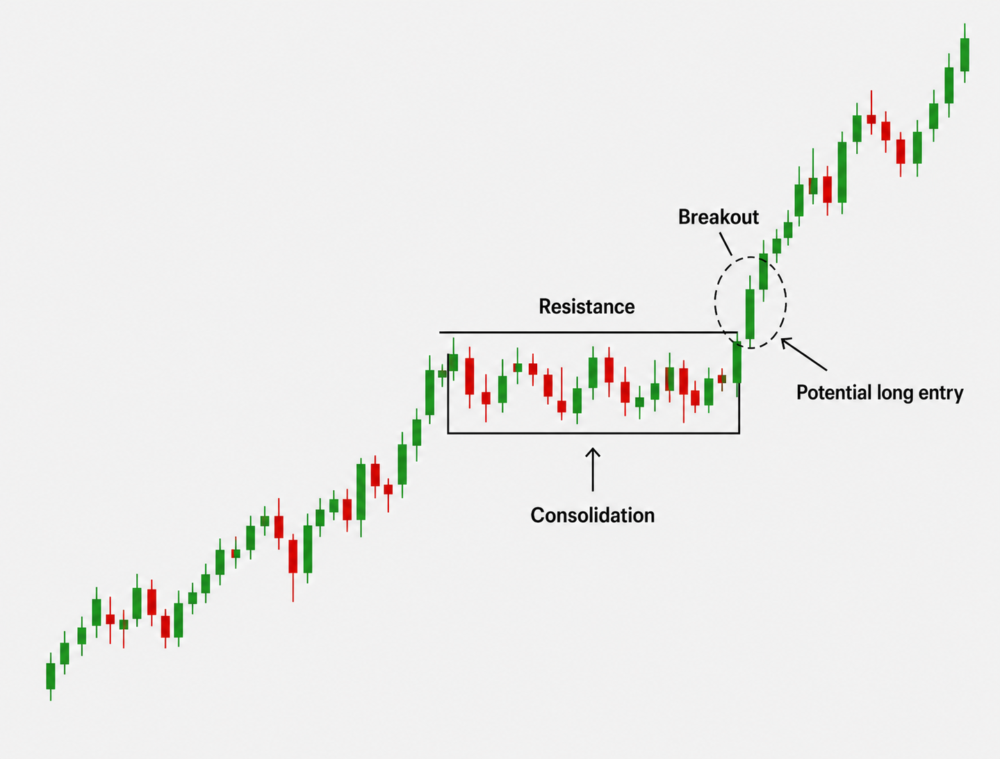
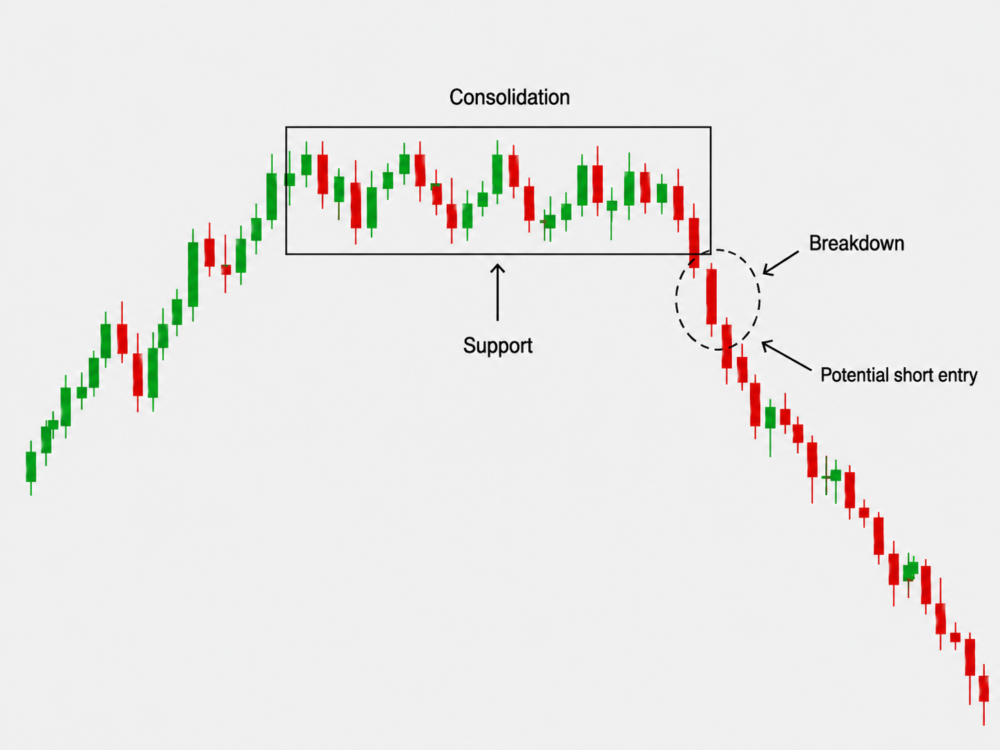
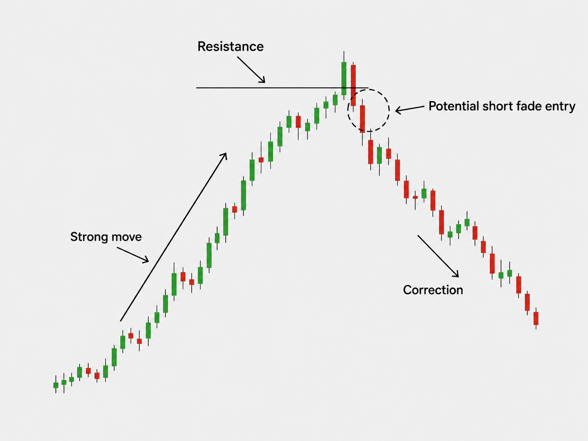

# 4 Best Swing Trading Strategies That Work

## Source

- Type: webpage
- Origin: [https://www.bybit.com/en/learn/strategies/best-swing-trading-strategies](https://www.bybit.com/en/learn/strategies/best-swing-trading-strategies)
- Imported: 2026-08-16
- Published/updated (source): 2026-08-13
- Author (source): Learn / Bybit

> Educational reference only. Not financial advice. Trading involves substantial risk of loss.

## Content

Swing traders use strategies to identify potential entry and exit points across price moves that may unfold over several days or weeks. They may combine fundamental and technical analysis when evaluating these opportunities.

### Key takeaways (from source)

- Swing trading is based on profiting from price movements that occur during bear and bull markets.
- Swing trading positions last more than a day, but usually less than a couple of weeks.
- Swing trading strategies aim to capture short- to medium-term price moves, but outcomes vary and every strategy carries risk.

### What is swing trading?

Swing trading is based on the principle that price movements are rarely linear, as the balance between bears and bulls is continuously shifting. Swing traders spot these shifts as opportunities to profit from them when indicators and setups are used carefully.

Unlike scalping or day trading, swing trading positions last more than a day but usually less than a couple of weeks. These time limits aren’t strict — some positions may last a month if the trade remains advantageous.

Because positions are held across multiple sessions, traders should account for trading fees, spreads, market volatility, and overnight price movements.

### The daily routine of a swing trader

On a typical day, a swing trader performs market and sector sentiment analysis (news and social media analytics) before entering a trade. Market sentiment gives a holistic view of investors’ overall attitude toward a specific cryptocurrency.

They may also research upcoming news or events that the broader public may not be aware of — for example via governance forums or social channels — to strengthen fundamental conviction.

Next, they create a watchlist and monitor requirements such as trading volume, trends, market movement, rallies, and support/resistance. When conditions align, they decide whether to enter or exit based on indicators.

#### Is swing trading better than day trading?

It depends on purpose and preference. Day traders typically don’t hold overnight; swing trading may carry higher overnight risk because positions are held longer. Swing trading generally requires less frequent monitoring than day trading, but still involves market risk and disciplined risk management.

### What is a swing trading strategy?

Swing trading aims to capture price moves that develop over several days or weeks. Depending on the strategy, traders may follow an existing trend, trade a breakout or breakdown, or look for a countertrend correction. Market conditions affect how well different setups perform, so traders may adapt based on trend direction, volatility, and price structure.

Strategies typically combine fundamental and technical analysis. Major upcoming news or events can increase volatility and disrupt an existing technical setup.

### Fundamentals of swing trading strategies

Swing traders may combine fundamental analysis with technical analysis. Technical indicators and price charts help assess trends, momentum, and potential entry, exit, and risk-management levels.

#### Technical indicators

Indicators are mathematically based tools that give a more structured view of price and/or volume. Common swing-trading indicators include:

##### Relative Strength Index (RSI)

RSI measures trend strength and the potential for change. By relating price and demand, traders can judge whether an asset looks overbought or oversold.

Traditionally, RSI above 70 is considered overbought and below 30 oversold. These are not standalone buy/sell signals — RSI can stay elevated or depressed in a strong trend. Traders often use RSI with price action and other indicators.

##### Moving Average (MA)

Moving averages help determine support and resistance during short-term fluctuations by averaging price over a set period (SMA or EMA). Common periods include 10, 20, 50, 100, and 200, depending on strategy and timeframe.

##### Bollinger Bands (BB)

Bollinger Bands® assess price relative to recent volatility: a moving-average middle band plus upper/lower bands based on standard deviations. Touching an outer band shows price is relatively high or low versus its recent range, but a band touch alone does not confirm a reversal.

#### Daily chart analysis

A daily chart shows an asset’s price movements over a specified period. Common patterns used in swing analysis:

##### Triangle trading patterns

Triangles form as price consolidates in a narrowing range (symmetrical, ascending, descending). Traders may watch for a break beyond the pattern’s boundaries as a potential directional signal. These patterns appear across timeframes.

##### Flags and pennants

Continuation patterns: after a move, price pulls back with small ups and downs before potentially continuing in the original direction.

##### Head and shoulders

A reversal pattern formed by three tops, with the highest (head) in the middle, often used to recognize a possible trend reversal.

### Swing trading strategies

Four common approaches from the source article:

#### 1. Trend-catching strategy

Trend traders may hold until a trend changes; swing traders often exit when a profit target is reached. Swing traders can still use trend direction for short- to medium-term trades.

Typical flow: identify an established trend → wait for a pullback → look for signs the trend may resume. RSI and moving averages (e.g. reaction around the 50 MA when it has acted as support) can add context. Use trend, support/resistance, and other signals for entry, risk, and exit levels.

**Pros**

- Flexibility to trade short-term moves without long-term commitment
- More entry/exit opportunities in volatile crypto markets

**Limitations**

- Higher transaction costs from more frequent trading (fees, spreads, slippage)
- Still requires monitoring and can be time-consuming/stressful

#### 2. Breakout swing strategy

A bullish breakout occurs when price moves above defined resistance or a trading range. Traders watch for breakouts as a potential sign of upward momentum.

Confirmation that price can hold above the breakout level is often sought before entry. Breakouts can fail and reverse back into the prior range.

**Pros**

- Can capture strong directional moves when a breakout holds
- Applicable across consolidation patterns and conditions

**Limitations**

- False breakouts can reverse quickly
- Support/resistance levels are subjective
- Still requires risk management and confirmation

#### 3. Breakdown swing strategy

The bearish counterpart to breakouts: price moves below defined support, which may signal further downward momentum. Moving averages, oscillators, or other signals may be used for confirmation. Pros/cons are similar to breakouts.

#### 4. Fading trading strategy

Countertrend: buy when the market is selling, sell when the market is buying — anticipating a short-term reversal or correction after an extended move (e.g. shorting after a strong rally when momentum weakens).

Volatile markets can create countertrend opportunities, but fading is high risk because the original trend may continue. Supporting technical signals and disciplined risk management are important. Generally better suited to experienced traders.

**Pros**

- Can capture short-term corrections/reversals
- Provides a countertrend approach when momentum looks overextended

**Limitations**

- High risk of loss if the prevailing trend continues
- Hard to time; requires disciplined risk management

### What are the best swing trading strategies for beginners?

There is no perfect beginner strategy. The source suggests starting with approaches that don’t require deep TA knowledge — e.g. trend trading — and learning common indicators.

### How to know if a swing trading strategy is working

Evaluate with consistent rules over enough trades, reviewing both gains and losses. Short-term profitability alone does not prove a strategy will work in different market conditions. Demo/paper trading can test entries, exits, and rules without risking real funds.

### Final thoughts

Swing strategies apply across crypto, stocks, and forex. Different approaches perform differently by market condition; no single strategy works everywhere. Demo environments (including Bybit Demo Trading on the source site) can be used to practice before live capital.

## Key Takeaways

- Swing trades typically last days to a few weeks and aim to capture non-linear price swings using TA ± fundamentals.
- Core toolkit: RSI, MAs, Bollinger Bands, plus patterns (triangles, flags/pennants, head & shoulders).
- Four named strategies: trend-catching, breakout, breakdown, and fading (countertrend).
- Breakouts/breakdowns need confirmation and risk controls; fading is higher risk and advanced.
- Validate strategies with rules-based review and demo trading before risking capital.
